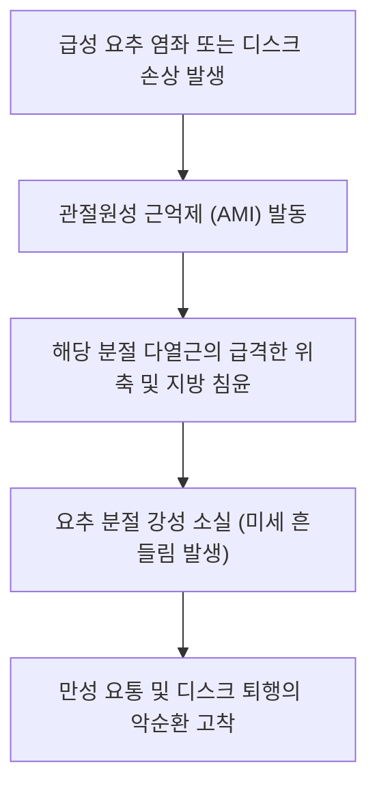

# [[다열근(요부)]](Lumbar Multifidus)

> **핵심 요약 (Key Summary)**:
> [[천골]] 후면, PSIS, [[요추]] L1~L5 유두돌기에서 기시하여 2~4개 위 분절 [[극돌기]]에 정지하는 최심층 척추 빗장 안정화근.
> 요추 분절 안정화, 전방 전단력(Shear force) 상쇄 및 대측 회전 미세 조절을 주동하며 [[척수신경 후지]](Dorsal rami) 내측지의 단독 지배를 받음.
> 만성 요통 환자의 분절성 지방 침윤(Fatty infiltration), 요추 불안정증, 척추전방전위증을 초래하며 화타협척혈 심부 자침 및 코어 활성화의 핵심 타깃임.

---
## 📌 목차
1. [해부학적 정밀 구조 및 지배 신경/혈관](#1-해부학적-정밀-구조-및-지배-신경혈관)
2. [생체역학·토크 분석 & 근막 사슬 (Biomechanical Synergy)](#2-생체역학토크-분석--근막-사슬-biomechanical-synergy)
3. [근막통증증후군(TP) & 연관통 패턴 (Travell & Simons)](#3-근막통증증후군tp--연관통-패턴-travell--simons)
4. [초음파 해부학(Sonoanatomy) 및 중재 시술 랜드마크](#4-초음파-해부학sonoanatomy-및-중재-시술-랜드마크)
5. [⭐ 원장님 심층 임상 고찰 및 원본 필기 (Clinical Pearls)](#5-원장님-심층-임상-고찰-및-원본-필기-clinical-pearls)
6. [관련 임상 질환 및 운동손상 증후군 총괄](#6-관련-임상-질환-및-운동손상-증후군-총괄)
7. [추나·도수치료(MET/PIR) & 침구·약침·재활 프로토콜](#7-추나도수치료metpir--침구약침재활-프로토콜)
8. [출처 및 학술 참고 문헌 (References)](#8-출처-및-학술-참고-문헌-references)

---
## 1. 해부학적 정밀 구조 및 지배 신경/혈관

| 항목 | 상세 내용 |
| :--- | :--- |
| **기시 (Origin)** | [[천골]](Sacrum) 후면, PSIS, [[천결절인대]], [[요추]] L1~L5 유두돌기(Mammillary processes) |
| **정지 (Insertion)** | 기시부보다 2~4개 위에 위치한 요추 [[극돌기]](Spinous processes) 측면 및 하연 |
| **신경 지배** | [[척수신경 후지]](Dorsal rami of lumbar spinal nerves) 내측지 (L1-L5 각 분절별 단독 지배) |
| **혈관 공급** | 요동맥(Lumbar aa.)의 배측 분지 |

### 🔬 해부학 도해 및 단면도
![[Multifidus_anatomy.png|450]]
> [해부학 도해]: 척추 극돌기와 횡돌기/유두돌기 사이를 촘촘한 대각선 빗장 모양으로 연결하는 다열근의 심부 구조.

![[Pasted image 20240120154202.png|450]]
> [구조적 특징]: 요추 분절의 전방 미끄러짐을 방지하고 후관절 캡슐을 보호하는 최심층 로컬 코어 근육.

---
## 2. 생체역학·토크 분석 & 근막 사슬 (Biomechanical Synergy)

* **전방 전단력(Shear Force) 차단 빗장**:
  * 척추체가 전방으로 미끄러지려는 힘에 대항하여 극돌기 기저부를 후하방으로 잡아당겨 척추를 단단히 잠금.
* **대요근과의 시상면 역학적 균형 (Counterbalance)**:
  * [[대요근]]이 척추체 전면에서 전방 전단력을 가할 때, 다열근은 후방에서 이를 정확히 상쇄하여 중립 척추 유지.
* **후관절 관절낭 보호**: 수축 시 후관절낭(Facet joint capsule)을 팽팽하게 당겨 척추 신전 시 관절낭이 끼여 찝히는 현상(Impingement) 방지.

---
## 3. 근막통증증후군(TP) & 연관통 패턴 (Travell & Simons)

* **극돌기 바로 옆 심부 압통**:
  * 척추 극돌기 바로 옆 1~1.5cm 지점을 깊게 누를 때 뼈를 때리는 듯한 날카롭고 묵직한 국소 통증.
* **미골 및 둔부 방사통**:
  * L4-S1 다열근 TrP는 천골, 미골, 둔부 하부 및 좌골결절 부위로 깊은 쑤심 방사.
* **임상 징후**: 아침에 세수하려고 허리를 살짝 숙일 때 갑자기 허리가 삐끗하며 굳어버림.

---
## 4. 초음파 해부학(Sonoanatomy) 및 중재 시술 랜드마크

* **초음파 단축 뷰 (Short-axis View)**:
  * 요추 극돌기(고에코 삼각 랜드마크)와 추궁판(Lamina) 사이에 안장처럼 얹혀 있는 다열근 관찰.
  * 정상 다열근은 균일한 저에코를 띠지만, 만성 요통 환자는 고에코의 백색 지방 침윤선(Fatty streak)이 현저함.
* **자침 안전 마진**: 침 끝이 추궁판(Lamina) 또는 횡돌기 기저부 뼈면에 닿을 때까지 안전하게 진입하여 경막외 공간(Epidural space) 침범 절대 차단.

---
## 5. ⭐ 원장님 심층 임상 고찰 및 원본 필기 (Clinical Pearls)

* **척추 전방 전단력과 다열근 메커니즘 (원장님 필기 100% 보존)**:
  * 척추 심층 근육은 안정성을 도모하고, 표층 근육은 폭발적 운동을 유도함.
  * 척추 심부 근육은 요추 상방에서 후상방으로 붙기 때문에 요추 전만을 발생시킴.
  * **요추 하부(L5-S1)에는 척추 심부 근육이 거의 붙지 않고 인대 위주로 구성되어 불안정성에 극히 취약함을 명심할 것 (원장님 핵심 강조)**.
  * 허리가 끊어질 듯한 통증은 바로 이 L5-S1 분절의 다열근 부전과 인대 과부하에서 기인함.
* **다열근의 분절성 위축(Segmental Atrophy)과 비가역성 방지**:
  * 요통이 발생하면 단 24시간 만에도 해당 분절의 다열근에 지방 침윤이 시작됨.
  * 표층 기립근 운동으로는 다열근이 재활성화되지 않으므로, 초음파를 보며 미세 골반 틸팅이나 화타협척혈 자침으로 분절 신경을 직접 깨워야 함.
* **화타협척혈(華佗夾脊穴) 심부 직자 테크닉**:
  * 극돌기 외측 0.5~1촌에서 추궁판을 향해 수직 직자(0.30×50mm). 침 첨이 추궁판 뼈에 '툭' 닿는 감각을 확인하고 살짝 후퇴하여 전침 2Hz 저주파 통전.

---
## 6. 관련 임상 질환 및 운동손상 증후군 총괄

| 임상 질환 / 증후군 | 병리적 연관 기전 | 주요 증상 및 이학적 검사 | 핵심 교정 타깃 |
| :--- | :--- | :--- | :--- |
| 요추 분절 불안정증 | 다열근 위축 및 관절 고정 실패 | 자세 변경 시 덜컹거림, 허리 젖힘 시 통증 | 화타협척혈 전침, 다열근 코어 재활 |
| [[척추전방전위증]] | 후방 빗장 결손으로 추체 전방 전위 | 계단식 단차(Step-off), 보행 시 하지 파행 | 다열근 등척성 강화, 장요근 이완 |
| 후관절 증후군 | 다열근의 관절낭 견인 부전 | 신전+회전 시 국소 요통(Kemp test 양성) | 후관절낭 부착부 약침, 분절 추나 |
| 수술 후 요통 증후군(FBSS) | 후방 척추 수술 시 다열근 탈신경 | 수술 후에도 지속되는 허리 무력감 | 분절 신경 재생 약침, 저강도 재활 |

---
## 7. 추나·도수치료(MET/PIR) & 침구·약침·재활 프로토콜

* **한의학 경혈 매핑 및 침구 프로토콜**:
  * 요부 화타협척혈(EX-B2, L1~L5 분절별 좌우).
  * 방광경 신수(BL23), 기해수(BL24), 대장수(BL25), 관원수(BL26).
  * 0.30×50mm 호침으로 추궁판을 향해 직자 후 전침(2Hz, 20분).
  * 척수신경 후지 내측지 신경 포착 부위에 신바로약침 또는 자하거약침 0.5cc 주입.
* **도수 치료 및 분절 가동 추나**:
  * 복와위에서 시술자의 모지구로 요추 극돌기를 접촉하고 호기 시 전방으로 부드럽게 요추 분절 가압(PA Mobilization).
* **재활 훈련 (Bird-Dog & Multifidus Isometric Contraction)**:
  * 엎드린 상태에서 배꼽 아래에 수건을 깔고, 척추 움직임 없이 골반저근을 조이며 다열근의 미세 수축을 유도하는 재교육.

---
## 8. 출처 및 학술 참고 문헌 (References)

1. **Hides, J. A., Richardson, C. A., & Jull, G. A.** (1996). Multifidus muscle recovery is not automatic after resolution of acute, first-episode low back pain. *Spine*, 21(23), 2763-2769.
   - `[연구 요약]`: 급성 요통 후 다열근 위축의 비자연회복성과 특이적 재활 훈련의 필수성 입증.
2. **Barker, P. J., et al.** (2004). The middle layer of lumbar fascia: anatomical relationships and biomechanics. *Spine*, 29(21), E477-E481.
   - `[연구 요약]`: 다열근과 흉요근막의 역학적 상호작용 및 척추 안정화 기전 규명.
3. **Bogduk, N.** (2005). *Clinical Anatomy of the Lumbar Spine and Sacrum*. Churchill Livingstone.
   - `[연구 요약]`: 다열근의 분절별 신경 지배(척수신경 후지 내측지 단독 지배)와 전방 전단력 차단 역학 연구.
