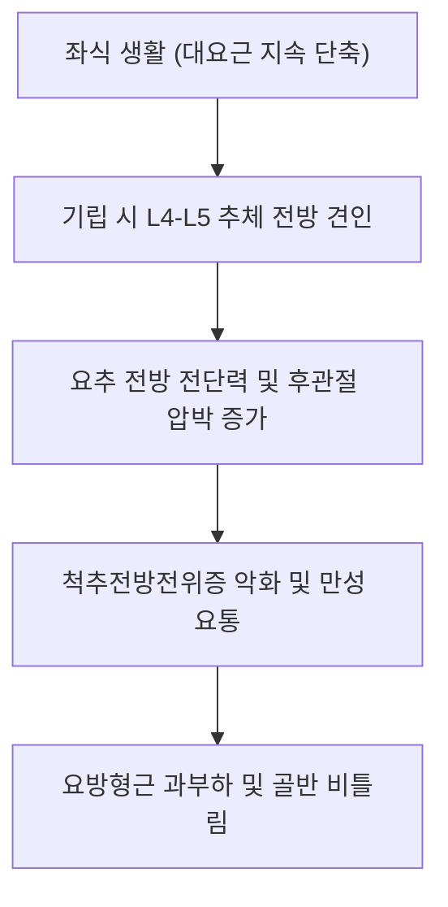

# [[대요근]](Psoas Major)

> **핵심 요약 (Key Summary)**:
> 흉추 T12 및 [[요추]] L1~L5 척추체 외측면, 추간판, 횡돌기에서 기시하여 [[대퇴골]] 소전자에 정지하는 심부 척추-고관절 연결근.
> 고관절 굴곡 및 요추-골반 수직 안정화를 담당하며 [[요추신경총]](L1-L3 전지)의 직접 분지 신경 지배를 받음.
> 장시간 좌식으로 인한 굴곡구축, 요추 전방 전단력 증가, [[장요근 증후군]]을 초래하며 후방 장침 심부 자입 및 고관절 신전 PIR의 핵심 타깃임.

---
## 📌 목차
1. [해부학적 정밀 구조 및 지배 신경/혈관](#1-해부학적-정밀-구조-및-지배-신경혈관)
2. [생체역학·토크 분석 & 근막 사슬 (Biomechanical Synergy)](#2-생체역학토크-분석--근막-사슬-biomechanical-synergy)
3. [근막통증증후군(TP) & 연관통 패턴 (Travell & Simons)](#3-근막통증증후군tp--연관통-패턴-travell--simons)
4. [초음파 해부학(Sonoanatomy) 및 중재 시술 랜드마크](#4-초음파-해부학sonoanatomy-및-중재-시술-랜드마크)
5. [⭐ 원장님 심층 임상 고찰 및 원본 필기 (Clinical Pearls)](#5-원장님-심층-임상-고찰-및-원본-필기-clinical-pearls)
6. [관련 임상 질환 및 운동손상 증후군 총괄](#6-관련-임상-질환-및-운동손상-증후군-총괄)
7. [추나·도수치료(MET/PIR) & 침구·약침·재활 프로토콜](#7-추나도수치료metpir--침구약침재활-프로토콜)
8. [출처 및 학술 참고 문헌 (References)](#8-출처-및-학술-참고-문헌-references)

---
## 1. 해부학적 정밀 구조 및 지배 신경/혈관

| 항목 | 상세 내용 |
| :--- | :--- |
| **기시 (Origin)** | 제12[[흉추]](T12)~제5[[요추]](L5) 척추체 외측면 및 추간판, L1~L5 [[횡돌기]] 기저부 |
| **정지 (Insertion)** | [[대퇴골]](Femur) 소전자(Lesser trochanter) - 장요근건 공통 부착 |
| **신경 지배** | [[요추신경총]](Lumbar plexus) L1, L2, L3 전지 분지 (주로 L2-L3) |
| **혈관 공급** | 요동맥(Lumbar aa.), 장요동맥(Iliolumbar a.)의 요지 |

### 🔬 해부학 도해 및 단면도
![[Psoas_major_anatomy.png|450]]
> [해부학 도해]: 요추체 전외측에서 기시하여 골반 분계선을 넘어 소전자로 향하는 대요근의 장대한 3차원 주행.

![[Pasted image 20240116151916.png|450]]
> [임상 도해]: 대요근의 요추 부착부 및 인접 요신경총 신경근들의 주행 관계.

---
## 2. 생체역학·토크 분석 & 근막 사슬 (Biomechanical Synergy)

* **체간-하지 역학 축**: 보행 시 하지를 들어 올리는 굴곡 모멘트를 발생시키며, 지지기에서는 골반 전방경사 토크를 형성.
* **요추 안정화와 압축력**: 요추 전만을 유지하면서 축성 압축력을 가해 척추 분절의 전단 미끄러짐을 방어(수직 안정화 기둥).
* **근막 사슬 연계 (Myers Anatomy Trains)**: 심부전방선(Deep Front Line)의 정점으로 횡격막의 내측 및 외측 요륵인대(Arcuate ligaments)와 근막적으로 융합되어 호흡-체간 안정성 커플링 형성.

---
## 3. 근막통증증후군(TP) & 연관통 패턴 (Travell & Simons)

* **발통점 (TrP)**:
  * TrP 1 (요추부 심근복): 요추체 외측 깊은 곳에 위치하여 동측 요추 척추 기립선을 따라 수직으로 통증 방사.
  * TrP 2 (서혜부/대퇴부 건이행부): 서혜인대 심부 및 소전자 부착부에서 대퇴 전면 상부로 연관통 방사.
* **특징적 임상 양상**:
  * 환자가 기립할 때 허리를 곧게 펴지 못하고 구부정한 자세를 취함.
  * 누웠을 때 다리를 쭉 펴면 허리가 바닥에서 뜨며 통증이 심해지고, 무릎을 세우면 편안해짐.

---

![[Iliopsoas_TriggerPoints.jpg|450]]
> [대요근 발통점]: 동측 요추부 수직 방사통 및 서혜부 깊은 곳의 뻐근한 둔통을 유발하는 Travell & Simons 연관통 패턴.

---
## 4. 초음파 해부학(Sonoanatomy) 및 중재 시술 랜드마크

* **초음파 스캔 랜드마크**:
  * 전방 횡단 스캔: 복부 초음파 프로브를 복직근 외측에 대고 후복막으로 음파를 입사시켜 복부대동맥/하대정맥 외측의 대요근 단면 식별.
  * 후방 시상 스캔 (Shamrock View): 요추 횡돌기, 추체, 요방형근, 기립근이 이루는 삼각 구획(클로버 모양) 심부에서 대요근 관찰.
* **자침 안전 마진**: 신장(Kidney, L1-L2 레벨 후방 외측), 상행/하행 결장 천공 방지를 위해 자침 전 초음파 깊이 측정 및 횡돌기 뼈 접촉 확인 필수.

---
## 5. ⭐ 원장님 심층 임상 고찰 및 원본 필기 (Clinical Pearls)

* **원장님 정밀 후방 심부 자침 프로토콜 (100% 보존)**:
  * **자입 위치**: 요추 L3 또는 L4 극돌기 하연 외측 8cm(약 4촌) 지점.
  * **자침 각도 및 깊이**: 피부면에 대해 전내측 45~60도 사선 방향으로 75~90mm 장침(0.35×90mm 이상) 자입.
  * **진입 감각**: 흉요근막을 뚫고 들어가 요추 횡돌기 외측연을 살짝 스치듯 지나가면 대요근 근복에 도달하며 뻐근하고 묵직한 득기감(De-qi) 유발.
  * **주의사항**: 직자하지 않고 척추체를 향해 전내측으로 기울여 복강 내 장기 손상을 원천 차단.

![[Pasted image 20240116152551.png|450]]
> [자입 방법]: 척추체
* **대요근 vs 대퇴근막장근(TFL) 약화 감별점 (100% 보존)**:
  * 앙와위에서 환자에게 무릎을 편 채 다리를 들어 올리게 할 때, 대퇴가 외전 및 외회전되면서 ASIS 외측 TFL 부위가 볼록하게 솟아오르면 순수 대요근 약화 및 TFL 보상 작용으로 확진.
  * 이 경우 TFL을 먼저 억제/자침하고 대요근 활성화 추나를 병행해야 함.
* **척추전방전위증 환자 치료 원칙**:
  * 대요근이 단축되면 L4-L5 전방 전단력이 커지므로, 전방전위증 환자의 요통 치료 시 앙와위 장요근 스트레칭(PIR)과 심부 이완이 필수 선행 과제임.

---
## 6. 관련 임상 질환 및 운동손상 증후군 총괄

| 임상 질환 / 증후군 | 병리적 연관 기전 | 주요 증상 및 이학적 검사 | 핵심 교정 타깃 |
| :--- | :--- | :--- | :--- |
| [[장요근 증후군]] | 대요근 구축 및 점액낭 마찰 | 서혜부 통증, 보행 시 신전통, [[토마스 검사]] 양성 | 대요근 건이행부 약침, 관절가동추나 |
| [[요추 추간판 탈출증]] | 요추 압축력 과다 및 전만 변형 | 좌골신경통 유사 방사통, 하지 거상 제한 | 대요근 후방 심부 침도, 요추 감압 |
| [[척추전방전위증]] | 대요근 전방 견인 토크 | 신전 시 요통 악화, 척추 계단식 단차(Step-off) | 대요근 긴장 완화, 골반 후방경사 운동 |
| 하부 교차 증후군 | 복근/둔근 약화 + 대요근/기립근 단축 | 오리엉덩이 자세, 만성 요통, 고관절 신전 결손 | 대요근 PIR 및 대둔근 협력 수축 |

---
## 7. 추나·도수치료(MET/PIR) & 침구·약침·재활 프로토콜

* **한의학 경혈 매핑 및 침구 프로토콜**:
  * 복부: 비경 충문(SP12), 부사(SP13), 위경 기충(ST30).
  * 요배부: 지실(BL52), 요안(EX-B7), 대장수(BL25) 외측 3.5~4촌 후방 심부 자침.
  * 약침 치료: 신경근 포착 부위에 중성어혈약침 또는 황련해독탕 약침 1.0~2.0cc 심부 주입.
* **추나 및 MET 프로토콜**:
  * 환자를 베드 끝에 눕히고 비치료 측 무릎을 가슴에 안게 한 상태(Thomas 포지션)에서 치료 측 다리를 신전.
  * 검사자가 대퇴 전면을 받치고 가벼운 굴곡 저항(등척성 수축) 7초 후, 호기와 함께 중력 방향으로 점진적 하향 가압.
* **재활 운동 (Deadbug & Bird-Dog)**:
  * 요추의 과도한 전만 없이 복횡근을 조인 상태에서 고관절을 분리하여 움직이는 협응 훈련.

---
## 8. 출처 및 학술 참고 문헌 (References)

1. **Bogduk, N.** (2005). *Clinical Anatomy of the Lumbar Spine and Sacrum* (4th ed.). Churchill Livingstone.
   - `[연구 요약]`: 대요근의 해부학적 부착부와 요추 척추체에 가해지는 수직 압축력 및 모멘트 암의 정밀 측정.
2. **Travell, J. G., & Simons, D. G.** (1999). *Myofascial Pain and Dysfunction: The Trigger Point Manual* (Vol. 2). Williams & Wilkins.
   - `[연구 요약]`: 대요근 발통점으로 인한 요추 수직 방사통 및 서혜부 통증 패턴 분석.
3. **Sahrmann, S.** (2002). *Diagnosis and Treatment of Movement Impairment Syndromes*. Mosby.
   - `[연구 요약]`: 대요근 약화 시 발생하는 TFL 대퇴골 전방 활주 증후군과 고관절 신전 결손 바이오메카닉스 분석.
