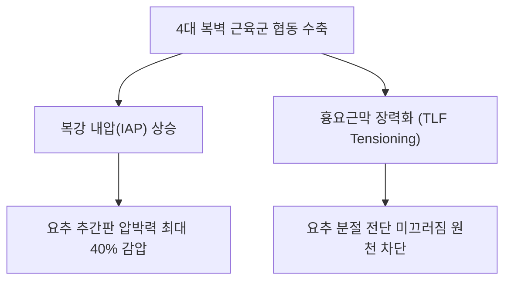

# [[복근]](Abdominal Muscles)

> **핵심 요약 (Key Summary)**:
> [[복직근]], [[외복사근]], [[내복사근]], [[복횡근]]의 4대 층판으로 구성되어 흉곽과 골반강 전외측을 감싸는 복벽 근육 복합체.
> 체간 굴곡·회전·측굴 제어, 복강 내압(IAP) 형성 및 요추 전방 전단력 방어를 주동하며 [[갈비사이신경]](T7-T12)과 요추신경 분지의 지배를 받음.
> 코어 붕괴, 요추 불안정성, [[복직근 이개]], 만성 요통을 유발하며 복모혈 침구 치료와 호흡 기반 코어 재활의 총괄 타깃임.

---
## 📌 목차
1. [해부학적 정밀 구조 및 지배 신경/혈관](#1-해부학적-정밀-구조-및-지배-신경혈관)
2. [생체역학·토크 분석 & 근막 사슬 (Biomechanical Synergy)](#2-생체역학토크-분석--근막-사슬-biomechanical-synergy)
3. [근막통증증후군(TP) & 연관통 패턴 (Travell & Simons)](#3-근막통증증후군tp--연관통-패턴-travell--simons)
4. [초음파 해부학(Sonoanatomy) 및 중재 시술 랜드마크](#4-초음파-해부학sonoanatomy-및-중재-시술-랜드마크)
5. [⭐ 원장님 심층 임상 고찰 및 원본 필기 (Clinical Pearls)](#5-원장님-심층-임상-고찰-및-원본-필기-clinical-pearls)
6. [관련 임상 질환 및 운동손상 증후군 총괄](#6-관련-임상-질환-및-운동손상-증후군-총괄)
7. [추나·도수치료(MET/PIR) & 침구·약침·재활 프로토콜](#7-추나도수치료metpir--침구약침재활-프로토콜)
8. [출처 및 학술 참고 문헌 (References)](#8-출처-및-학술-참고-문헌-references)

---
## 1. 해부학적 정밀 구조 및 지배 신경/혈관

| 층판 (Layer) | 근육명 | 주요 기시 및 정지 | 주된 주행 방향 |
| :--- | :--- | :--- | :--- |
| **제1층 (표층 전면)** | [[복직근]] (Rectus abdominis) | 치골결합 → 검상돌기 및 제5~7늑연골 | 수직 주행 (Vertical) |
| **제2층 (표층 외측)** | [[외복사근]] (External oblique) | 하부 제5~12늑골 외측 → 장골능, 백선, 치골 | 전하방 사선 (Hands in pockets) |
| **제3층 (중간층)** | [[내복사근]] (Internal oblique) | 서혜인대, 장골능, 흉요근막 → 늑골, 백선, 치골 | 전상방 사선 (Orthogonal to EO) |
| **제4층 (심층)** | [[복횡근]] (Transversus abdominis) | 늑연골 내면, 흉요근막, 장골능 → 백선, 치골 | 수평 주행 (Horizontal corset) |

### 🔬 해부학 도해 및 단면도
![[Rectus_abdominis_anatomy.png|450]]
> [전면 복벽 도해]: 정중면의 복직근과 백선, 외측 사선 근육들이 복합체를 이루는 전면 구조.

![[Transversus_abdominis_anatomy.png|450]]
> [심부 복벽 단면]: 내장기를 단단히 감싸며 흉요근막과 연결되는 최심층 복횡근의 코르셋 구조.

---
## 2. 생체역학·토크 분석 & 근막 사슬 (Biomechanical Synergy)

* **복강 내압(IAP)의 유압 피스톤 메커니즘**:
  * 횡격막(천장), 골반저근(바닥), 복횡근/복사근(벽)이 협동하여 복압을 상승시키면 요추 전면에서 척추를 받치는 공기/유체 완충 기둥 형성.
* **골반 경사도 밸런싱 (Force-Couple)**:
  * 복직근 및 외복사근(골반 후방경사 유도) vs 장요근 및 대퇴직근(골반 전방경사 유도)이 시상면 짝힘을 이루어 중립 골반 유지.
* **근막 사슬 연계 (Anatomy Trains)**: 표재전방선(복직근), 외측선(복사근), 심부전방선(복횡근)이 복벽에서 교차 융합.

---
## 3. 근막통증증후군(TP) & 연관통 패턴 (Travell & Simons)

* **복벽 근막통의 특성**: 체간의 움직임이나 기침, 배변뿐 아니라 호흡 패턴과 내장기 기능에 복합적인 영향.
* **가성 내장기 질환 유발 (Pseudo-visceral Pain)**:
  * 상복부 TrP: 속쓰림, 소화불량, 담낭통 모사.
  * 측복부 TrP: 신장 결석, 게실염, 맹장염 모사.
  * 하복부 TrP: 방광통, 생리통, 만성 골반통 모사.

---

![[Rectus_abdominis_TriggerPoints.jpg|450]]
> [복벽 근육군 발통점]: 전복벽 발통점이 유발하는 체성-내장 반사 및 가성 복부 산통 패턴.

---
## 4. 초음파 해부학(Sonoanatomy) 및 중재 시술 랜드마크

* **전·측복벽 종합 랜드마크**:
  * 복직근초(Rectus sheath)와 백선(Linea alba)의 무결성 평가.
  * 복직근 외측 가장자리(반월선 Linea semilunaris)에서 외복사근-내복사근-복횡근 건막으로 전환되는 부위 확인.
* **자침 안전 가이드라인**:
  * 복벽 침치료 시 항상 복벽의 두께를 고려하여 침 길이를 선택하고, 비만도에 상관없이 15~30도 사자 원칙 준수.

---
## 5. ⭐ 원장님 심층 임상 고찰 및 원본 필기 (Clinical Pearls)

* **고관절 굴곡근과의 밸런스 (원장님 필기 100% 보존)**:
  * 복직근이 과도하게 경직되면 관골 후방 경사 및 흉추 후만을 초래함.
  * 반대로 복근이 약화되면 장요근과 대퇴근막장근이 우세해져 골반 전방경사와 요추 과전만이 발생함.
  * 따라서 복근은 단순 강화가 아니라 "복횡근 중심의 안정화 수축 + 고관절 굴곡근 이완"의 정교한 밸런스가 필수적임.
* **윗몸일으키기(Sit-up) 역학적 위험성 총괄 (원장님 팁)**:
  * 윗몸일으키기 운동에서 복근이 먼저 수축하고 이어서 고관절 굴곡근이 수축함.
  * 발을 고정하고 하는 윗몸일으키기는 장요근의 개입을 극대화하여 요추 4-5번 디스크 압박을 폭증시킴.
  * 디스크 환자에게 윗몸일으키기는 독약이며, 반드시 컬업(Curl-up)이나 플랭크(Plank)로 대체해야 함.
* **복모혈(腹募穴) 자침의 자율신경 조절**:
  * 복벽의 경혈들은 흉수·요수 신경근의 전피지가 분포하는 자리로, 침 자극 시 내장-체성 반사(Viscero-somatic reflex)를 역으로 조절하여 위장관 운동성과 혈류를 개선함.

---
## 6. 관련 임상 질환 및 운동손상 증후군 총괄

| 임상 질환 / 증후군 | 병리적 연관 기전 | 주요 증상 및 이학적 검사 | 핵심 교정 타깃 |
| :--- | :--- | :--- | :--- |
| [[요추 불안정증]] | 복벽 심부 코어 약화로 요추 흔들림 | 기립 시 요통, 덜컹거림, 허리 젖힘 통증 | 복횡근/복사근 브레이싱 재활 |
| [[복직근 이개]](Diastasis Recti) | 백선 신장 및 복벽 중심선 벌어짐 | 앙와위 복부 거상 시 중앙 돌출, 코어 무력 | 복벽 코르셋 도수, 복횡근 수축 |
| 가성 내장통 증후군 | 복벽 4대 근육 발통점의 장기 통증 모사 | 내과 검사 정상이나 지속적 복통 호소 | 복모혈 심부 약침, 복벽 근막 이완 |
| 하부 교차 증후군 | 복근 약화 + 대둔근 약화 + 장요근 단축 | 오리엉덩이, 요추 과전만, 만성 피로성 요통 | 복근 강화 및 장요근 이완 짝힘 재교육 |

---
## 7. 추나·도수치료(MET/PIR) & 침구·약침·재활 프로토콜

* **한의학 경혈 매핑 및 침구 프로토콜**:
  * 임맥: 거궐(CV14), 중완(CV12), 수분(CV9), 기해(CV6), 관원(CV4), 중극(CV3).
  * 위경: 양문(ST21), 천추(ST25), 수도(ST28).
  * 비경: 대횡(SP15), 복결(SP14).
  * 간경/담경: 장문(LR13), 일월(GB24), 경문(GB25).
* **도수 치료 및 근막 이완 (Visceral & Abdominal Manipulation)**:
  * 앙와위에서 무릎을 세운 상태로 복벽을 4분면으로 나누어 부드럽게 글라이딩하며 복벽 유착 박리.
* **코어 재활 프로토콜 (McGill Big 3)**:
  * Curl-up, Side Plank, Bird-Dog을 통해 척추 압박 부하 없이 복벽 4대 근육군의 전방위 강성 구축.

---
## 8. 출처 및 학술 참고 문헌 (References)

1. **McGill, S. M.** (2015). *Low Back Disorders: Evidence-Based Prevention and Rehabilitation* (3rd ed.). Human Kinetics.
   - `[연구 요약]`: 복벽 근육군의 동시 수축(Bracing)에 의한 요추 3차원 안정성 확보 및 척추 부하 최소화 재활 연구.
2. **Hodges, P. W.** (1999). Is there a role for transversus abdominis in lumbo-pelvic stability? *Manual Therapy*, 4(2), 74-86.
   - `[연구 요약]`: 복벽 심부 근육의 선행 수축과 골반-요추 안정성 기전 규명.
3. **Travell, J. G., & Simons, D. G.** (1999). *Myofascial Pain and Dysfunction*. Williams & Wilkins.
   - `[연구 요약]`: 복벽 전반의 발통점이 유발하는 가성 내장기 질환 연관통 총괄.
