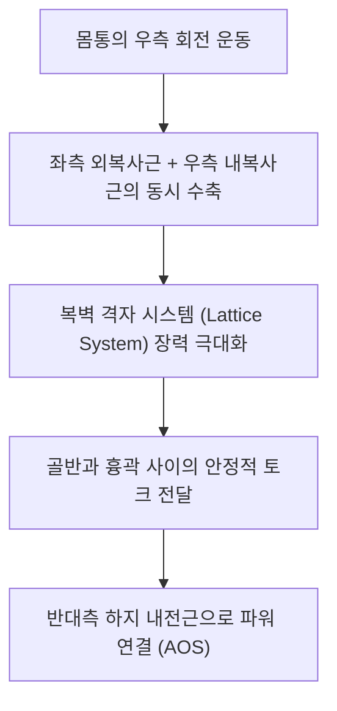

# [[복사근]](Abdominal Obliques)

> **핵심 요약 (Key Summary)**:
> [[외복사근]]과 [[내복사근]]으로 구성되어 흉곽과 골반 사이를 90도 직교 격자 구조로 연결하는 복벽 사선 근육 복합체.
> 체간 3차원 회전, 측굴, 복강 내압 유지 및 골반 전방경사 억제를 주동하며 하부 [[갈비사이신경]](T7-T12)과 [[장골하복신경]](L1)의 지배를 받음.
> 회전 스포츠 손상, 전방 사선 사슬(AOS) 기능부전, 골반 비틀림을 초래하며 대각선 슬링 재활 및 복벽 격자 이완의 핵심 타깃임.

---
## 📌 목차
1. [해부학적 정밀 구조 및 지배 신경/혈관](#1-해부학적-정밀-구조-및-지배-신경혈관)
2. [생체역학·토크 분석 & 근막 사슬 (Biomechanical Synergy)](#2-생체역학토크-분석--근막-사슬-biomechanical-synergy)
3. [근막통증증후군(TP) & 연관통 패턴 (Travell & Simons)](#3-근막통증증후군tp--연관통-패턴-travell--simons)
4. [초음파 해부학(Sonoanatomy) 및 중재 시술 랜드마크](#4-초음파-해부학sonoanatomy-및-중재-시술-랜드마크)
5. [⭐ 원장님 심층 임상 고찰 및 원본 필기 (Clinical Pearls)](#5-원장님-심층-임상-고찰-및-원본-필기-clinical-pearls)
6. [관련 임상 질환 및 운동손상 증후군 총괄](#6-관련-임상-질환-및-운동손상-증후군-총괄)
7. [추나·도수치료(MET/PIR) & 침구·약침·재활 프로토콜](#7-추나도수치료metpir--침구약침재활-프로토콜)
8. [출처 및 학술 참고 문헌 (References)](#8-출처-및-학술-참고-문헌-references)

---
## 1. 해부학적 정밀 구조 및 지배 신경/혈관

| 항목 | [[외복사근]] (External Oblique) | [[내복사근]] (Internal Oblique) |
| :--- | :--- | :--- |
| **기시 (Origin)** | 제5~12 늑골 외측면 | 서혜인대 외측 2/3, 장골능 전방 2/3, 흉요근막 |
| **정지 (Insertion)** | 백선, 치골결절, 장골능 외순 | 제10~12 늑골 하연, 백선, 치골능 (결합건) |
| **섬유 주행** | 하내측 (주머니에 손 넣는 방향 ↘↙) | 상내측 (외복사근과 90도 직교 방향 ↗↖) |
| **신경 지배** | 하부 [[갈비사이신경]](T7-T12) | 하부 [[갈비사이신경]](T7-T12), [[장골하복신경]], [[장골서혜신경]](L1) |

### 🔬 해부학 도해 및 단면도
![[External_oblique_anatomy.png|450]]
> [외복사근 표층]: 늑골에서 장골능과 백선으로 비스듬히 하강하는 표재성 사선 섬유.

![[Internal_oblique_anatomy.png|450]]
> [내복사근 심층]: 골반에서 늑골과 백선으로 부채꼴 형태로 상승하는 중간층 사선 섬유.

---
## 2. 생체역학·토크 분석 & 근막 사슬 (Biomechanical Synergy)

* **90도 직교 격자 시스템 (Lattice Mechanism)**: 두 층의 근섬유가 서로 수직으로 교차하여 얇은 두께로도 복강 내압을 단단히 가두는 건축학적 트러스 구조 형성.
* **체간 회전 짝힘 (Rotational Force-Couple)**:
  * 우측 회전 시: 좌측 외복사근(대측 회전) + 우측 내복사근(동측 회전)의 협동 수축.
* **전방 사선 사슬 (Anterior Oblique Sling: AOS)**: 보행, 달리기, 골프/야구 스윙 시 지면 반발력을 상체 회전력으로 전환하는 인체 최대의 기능적 사선 파워 체인.

---
## 3. 근막통증증후군(TP) & 연관통 패턴 (Travell & Simons)

* **외복사근 발통점**: 늑골 하연, 전흉부(가성 협심통), 서혜부 및 음낭으로 묵직하게 방사.
* **내복사근 발통점**: 서혜관 심부, 치골결합 주변, 사타구니 안쪽으로 찌르는 듯한 방사통.
* **임상적 특징**: 복부 깊은 곳의 장기 이상(맹장염, 신장 결석, 난소 질환)을 완벽히 흉내 내는 가성 내장기 연관통 호발.

---

![[Abdominal_obliques_TriggerPoints.jpg|450]]
> [복사근 복합 발통점]: 측복벽 격자 시스템의 발통점과 가성 내장기 질환 방사통 패턴.

---
## 4. 초음파 해부학(Sonoanatomy) 및 중재 시술 랜드마크

* **초음파 스캔**:
  * 측복벽에서 외복사근, 내복사근, 복횡근이 샌드위치처럼 배열된 3층 구조 확인.
  * 외복사근과 내복사근 사이 근막면(Intermuscular plane)을 추적하여 유착 여부 감별.
* **자침 안전 마진**: 늑골 하단부에서는 기흉(Pneumothorax), 하복부에서는 복막강(Peritoneal cavity) 침범 방지를 위해 평행 사자 필수.

---
## 5. ⭐ 원장님 심층 임상 고찰 및 원본 필기 (Clinical Pearls)

* **복사근 격자 구조의 기능적 가치 (원장님 필기 100% 보존)**:
  * 외복사근과 내복사근이 직교하며 이루는 복벽 격자는 단순한 벽이 아니라, 흉곽과 골반이 서로 반대로 비틀릴 때 척추를 보호하는 안전띠 역할을 수행함.
  * 이 사선 밸런스가 무너지면 보행 시 골반이 한쪽으로 빠지거나 요추 4-5번 분절에 과도한 회전 전단력이 걸려 디스크가 찢어짐.
* **골프 스윙 손상(골프 요통)의 핵심 메커니즘**:
  * 백스윙 탑에서 다운스윙으로 전환할 때 복사근의 편심성-동심성 전환이 급격히 발생하여 늑골 기시부 염좌 호발.
  * 통증 부위 늑골 외측연의 복사근 압통점에 장침 사자 및 침도 박리 시 통증 즉각 감소.
* **복사근 경직과 소화불량의 상관관계**:
  * 좌측 복사근 과긴장은 위(Stomach)와 비장 영역을 압박하여 만성 식후 불쾌감과 조기 포만감을 초래하며, 우측 복사근 과긴장은 간-담낭 영역을 자극하여 우계륵부 결림을 유발함.

---
## 6. 관련 임상 질환 및 운동손상 증후군 총괄

| 임상 질환 / 증후군 | 병리적 연관 기전 | 주요 증상 및 이학적 검사 | 핵심 교정 타깃 |
| :--- | :--- | :--- | :--- |
| [[복사근 손상]](Oblique Strain) | 회전 동작 시 복사근 근복/건 파열 | 스윙 시 옆구리 격통, 기침 시 악화 | 손상 부위 소염 약침, 냉찜질 및 안정 |
| 전방 사선 사슬(AOS) 증후군 | 외복사근-반대측 내복사근 불균형 | 런닝 시 한쪽 골반 처짐, 서혜부 통증 | Chop & Lift 재활, 대각선 슬링 도수 |
| 가성 신장 결석통 | 복사근 측복부 TrP 활성화 | 옆구리부터 서혜부까지 뻗치는 산통 모사 | 측복부 발통점 심부 침치료 |
| 흉곽-골반 회전 비대칭 | 편측 복사근 단축 및 유착 | 서 있을 때 어깨와 골반의 회전 축 어긋남 | 흉곽 회전 가동 추나, 복사근 근막 이완 |

---
## 7. 추나·도수치료(MET/PIR) & 침구·약침·재활 프로토콜

* **한의학 경혈 매핑 및 침구 프로토콜**:
  * 장문(LR13), 일월(GB24), 경문(GB25), 대맥(GB26), 오추(GB27).
  * 0.25×40mm 호침으로 늑골을 따라 15도 사자.
* **근에너지기법 (MET/PIR)**:
  * 환자를 측와위로 눕혀 체간 회전 및 신전 상태에서 호기 수축 저항 후 이완.
* **재활 훈련 (Pallof Press & Chop/Lift)**:
  * 밴드나 케이블을 이용한 회전 저항 훈련으로 척추 회전 안정성 구축.

---
## 8. 출처 및 학술 참고 문헌 (References)

1. **Neumann, D. A.** (2016). *Kinesiology of the Musculoskeletal System*. Elsevier.
   - `[연구 요약]`: 복사근 복합체의 상호작용적 회전 짝힘 및 3차원 체간 모멘트 분석.
2. **Travell, J. G., & Simons, D. G.** (1999). *Myofascial Pain and Dysfunction*. Williams & Wilkins.
   - `[연구 요약]`: 복사근의 발통점과 가성 내장 질환 연관통의 감별 진단학.
3. **McGill, S. M.** (2007). *Low Back Disorders*. Human Kinetics.
   - `[연구 요약]`: 회전 운동 시 복사근의 강성과 요추 안정화 기전 규명.
