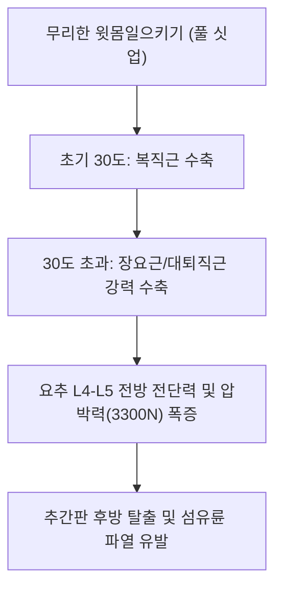

# [[복직근]](Rectus Abdominis)

> **핵심 요약 (Key Summary)**:
> [[치골결합]] 및 치골결절에서 기시하여 [[흉골]] 검상돌기와 제5~7[[늑연골]] 전면에 정지하는 복벽 전면의 수직 다복근.
> 체간 굴곡 및 골반 후방경사를 주동하며 복압(IAP)을 유지하고 하부 [[갈비사이신경]](T7-T12)의 지배를 받음.
> 윗몸일으키기 시 요추 압박력 증가, [[복직근 이개]], 가성 소화기 증상을 유발하며 복모혈 자침 및 컬업(Curl-up) 재활의 핵심 타깃임.

---
## 📌 목차
1. [해부학적 정밀 구조 및 지배 신경/혈관](#1-해부학적-정밀-구조-및-지배-신경혈관)
2. [생체역학·토크 분석 & 근막 사슬 (Biomechanical Synergy)](#2-생체역학토크-분석--근막-사슬-biomechanical-synergy)
3. [근막통증증후군(TP) & 연관통 패턴 (Travell & Simons)](#3-근막통증증후군tp--연관통-패턴-travell--simons)
4. [초음파 해부학(Sonoanatomy) 및 중재 시술 랜드마크](#4-초음파-해부학sonoanatomy-및-중재-시술-랜드마크)
5. [⭐ 원장님 심층 임상 고찰 및 원본 필기 (Clinical Pearls)](#5-원장님-심층-임상-고찰-및-원본-필기-clinical-pearls)
6. [관련 임상 질환 및 운동손상 증후군 총괄](#6-관련-임상-질환-및-운동손상-증후군-총괄)
7. [추나·도수치료(MET/PIR) & 침구·약침·재활 프로토콜](#7-추나도수치료metpir--침구약침재활-프로토콜)
8. [출처 및 학술 참고 문헌 (References)](#8-출처-및-학술-참고-문헌-references)

---
## 1. 해부학적 정밀 구조 및 지배 신경/혈관

| 항목 | 상세 내용 |
| :--- | :--- |
| **기시 (Origin)** | [[치골]](Pubis) 능선 및 [[치골결절]](Pubic tubercle), 치골결합 전면 |
| **정지 (Insertion)** | [[흉골]](Sternum) 검상돌기(Xiphoid process) 및 제5~7[[늑연골]](Costal cartilages) |
| **신경 지배** | 제7~12 [[갈비사이신경]](Intercostal nerves, T7-T12) 전피지 및 늑하신경 |
| **혈관 공급** | 상복벽동맥(Superior epigastric a.), 하복벽동맥(Inferior epigastric a.) |

### 🔬 해부학 도해 및 단면도
![[Rectus_abdominis_anatomy.png|450]]
> [해부학 도해]: 3~4개의 건획(Tendinous intersections)에 의해 분절화되며 백선(Linea alba)을 경계로 좌우 대칭을 이루는 복직근.

![[Pasted image 20240117004710.png|450]]
> [구조적 특징]: 활상선(Arcuate line) 상하부에 따른 복직근초(Rectus sheath) 전엽 및 후엽 층판의 변화.

---
## 2. 생체역학·토크 분석 & 근막 사슬 (Biomechanical Synergy)

* **체간 시상면 굴곡 모멘트**: 흉곽을 치골 쪽으로 당겨 척추를 굴곡시키며, 골반이 고정되지 않았을 때는 치골을 상방으로 견인하여 골반 후방경사(Posterior pelvic tilt) 유발.
* **복압(IAP) 형성 기여**: 기침, 배변, 강제 호기 시 복강 전면을 압박하여 흉복강 내압을 조절.
* **근막 사슬 연계 (Anatomy Trains)**: 표재전방선(Superficial Front Line)의 체간 파트로 흉골근, 흉골병, 흉쇄유돌근 및 대퇴직근, 슬개건과 일직선 긴장 장력을 형성.

---
## 3. 근막통증증후군(TP) & 연관통 패턴 (Travell & Simons)

* **상부 복직근 TrP (검상돌기 주변)**:
  * 등 뒤쪽 T6~T8 흉추 척추선 주변으로 수평 방사통(담결림 모사).
  * 소화불량, 속쓰림, 가슴 답답함, 구역감 등 가성 위장관 질환 증상 유발.
* **중하부 복직근 TrP (제대 주변)**:
  * 복부 팽만감, 가스 참, 신트림, 맹장염 유사 복통 모사.
* **하부 복직근 TrP (치골 부착부)**:
  * 방광 과민증, 요실금, 생리통, 배뇨통, 치골결합염 유사 서혜/치골 통증 유발.

---

![[Rectus_abdominis_TriggerPoints.jpg|450]]
> [복직근 발통점]: 상복부(위장관 증상 모사), 제대 주변, 하복부(방광통/생리통 모사)로 투사되는 Travell & Simons 연관통 패턴.

---
## 4. 초음파 해부학(Sonoanatomy) 및 중재 시술 랜드마크

* **초음파 단축 뷰**:
  * 복직근초 전엽(과에코 선)과 후엽 사이에 위치한 평평한 저에코 근복 관찰.
  * 백선(Linea alba)의 너비 측정(2cm 초과 시 복직근 이개 진단).
* **혈관 및 천공 주의**:
  * 근육 심부 외측 1/3 지점을 주행하는 하복벽동맥(Inferior epigastric a.) 초음파 도플러 확인 필수.
  * 활상선(Arcuate line) 하부에서는 후엽 건막이 결손되어 복막(Peritoneum)과 장관에 침이 직접 닿을 수 있으므로 깊이 주의.

---
## 5. ⭐ 원장님 심층 임상 고찰 및 원본 필기 (Clinical Pearls)

* **윗몸일으키기(Sit-up)의 역학적 위험성과 McGill Curl-up (원장님 필기 100% 보존)**:
  * 윗몸일으키기는 초기 30도까지만 복직근이 주로 사용되고, 그 이상 상체를 들면 장요근과 대퇴직근이 주동근으로 작동함.
  * 이때 단축된 장요근이 요추 추체를 전하방으로 강하게 잡아당겨 요추 압박력이 3300N을 초과, 디스크 질환 환자에게는 치명적인 손상 유발.
  * **해결책**: 허리 밑에 수건이나 한 손을 받쳐 요추 중립 전만을 유지한 채 견갑골만 살짝 띄우는 McGill Curl-up을 처방해야 함.
* **복직근 경직과 흉추 후만·골반 후방경사**:
  * 복직근이 만성적으로 단축된 환자는 명치(검상돌기)와 치골이 서로 가까워져 등이 굽는 흉추 후만(Round back)과 엉덩이가 납작해지는 골반 후방경사(Flat back) 체형을 보임.
* **복모혈(腹募穴) 침구 배혈 원리**:
  * 상완, 중완, 거궐은 상부 복직근 TP와 일치하며 상부 소화기 증상 해소.
  * 기해, 관원, 중극은 하부 복직근 TP와 일치하여 비뇨생식기 및 하초 냉증 치료에 필수적임.

---
## 6. 관련 임상 질환 및 운동손상 증후군 총괄

| 임상 질환 / 증후군 | 병리적 연관 기전 | 주요 증상 및 이학적 검사 | 핵심 교정 타깃 |
| :--- | :--- | :--- | :--- |
| [[복직근 이개]](Diastasis Recti) | 백선의 과도한 신장 및 복벽 분리 | 복부 중앙 돌출(Domes), 코어 지지력 상실 | 복횡근 수축을 동반한 복직근 도수 교정 |
| [[가성 소화기 증후군]] | 상부 복직근 발통점 연관통 | 위내시경 정상이나 만성 속쓰림, 트림 호소 | 중완·거궐혈 심부 약침, 복직근 이완 |
| 치골결합염 | 복직근 치골 부착부 견인 손상 | 치골 부위 압통, 보행 시 서혜부 통증 | 치골 부착부 침도 및 내전근 짝힘 밸런싱 |
| 편평등 증후군(Flat Back) | 복직근 과긴장으로 골반 후방경사 | 요추 정상 전만 소실, 보행 시 충격 흡수 저하 | 복직근 신전 스트레칭 및 척추기립근 강화 |

---
## 7. 추나·도수치료(MET/PIR) & 침구·약침·재활 프로토콜

* **한의학 경혈 매핑 및 침구 프로토콜**:
  * 거궐(CV14), 상완(CV13), 중완(CV12), 수분(CV9), 기해(CV6), 관원(CV4), 중극(CV3).
  * 위경의 불용(ST19), 승만(ST20), 양문(ST21), 천추(ST25), 수도(ST28).
  * 0.25×40mm 침을 사용하여 복벽에 15~30도 각도로 사자(斜刺)하거나 건획 부위 결절에 침도 박리.
* **근에너지기법 (MET/PIR)**:
  * 환자를 복와위로 엎드리게 하거나 짐볼 위에 누워 체간 신전을 유도한 상태에서 가벼운 호기 복부 수축 후 신장.
* **재활 훈련**: McGill Big 3 중 Curl-up(한쪽 무릎을 세우고 요추 밑에 손을 받쳐 전만 유지 후 견갑골 거상).

---
## 8. 출처 및 학술 참고 문헌 (References)

1. **McGill, S. M.** (1998). Low back exercises: evidence for improving exercise regimens. *Physical Therapy*, 78(7), 754-765.
   - `[연구 요약]`: 전통적 윗몸일으키기와 컬업 운동 시 복직근 근전도 및 요추 분절 압박 부하 비교 분석.
2. **Travell, J. G., & Simons, D. G.** (1999). *Myofascial Pain and Dysfunction: The Trigger Point Manual* (Vol. 1). Williams & Wilkins.
   - `[연구 요약]`: 복직근 발통점이 모사하는 가성 내장기 질환(소화불량, 방광 통증, 담낭염)의 방사통 패턴 규명.
3. **Akram, J., & Matzen, S. H.** (2014). Rectus abdominis diastasis. *Journal of Plastic Surgery and Hand Surgery*, 48(3), 163-169.
   - `[연구 요약]`: 복직근 이개의 병태생리 및 백선 복벽 안정성 재건 프로토콜 연구.
