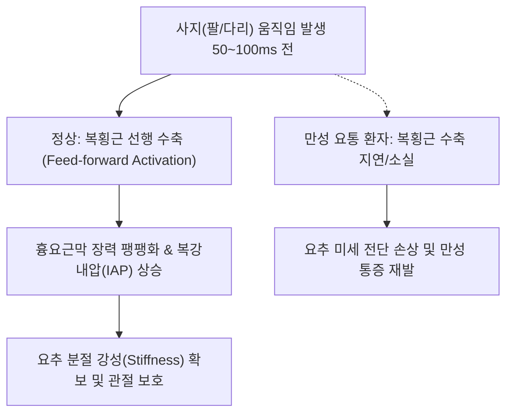

# [[복횡근]](Transversus Abdominis, TrA)

> **핵심 요약 (Key Summary)**:
> 하부 제7~12[[늑연골]] 내면, [[흉요근막]], [[장골능]], [[서혜인대]]에서 기시하여 수평으로 복부를 감싸 [[백선]]에 정지하는 최심층 복벽 코르셋근.
> 복강 내압(IAP) 상승 및 흉요근막 장력 조절을 통한 요추 분절 안정성을 주동하며 하부 [[갈비사이신경]](T7-T12)과 [[장골하복신경]](L1)의 지배를 받음.
> 만성 요통 환자의 선행 수축(Feed-forward) 실패, 복부 팽만, 골반 불안정성을 초래하며 드로잉 인(Drawing-in) 호흡 및 코어 재활의 최우선 타깃임.

---
## 📌 목차
1. [해부학적 정밀 구조 및 지배 신경/혈관](#1-해부학적-정밀-구조-및-지배-신경혈관)
2. [생체역학·토크 분석 & 근막 사슬 (Biomechanical Synergy)](#2-생체역학토크-분석--근막-사슬-biomechanical-synergy)
3. [근막통증증후군(TP) & 연관통 패턴 (Travell & Simons)](#3-근막통증증후군tp--연관통-패턴-travell--simons)
4. [초음파 해부학(Sonoanatomy) 및 중재 시술 랜드마크](#4-초음파-해부학sonoanatomy-및-중재-시술-랜드마크)
5. [⭐ 원장님 심층 임상 고찰 및 원본 필기 (Clinical Pearls)](#5-원장님-심층-임상-고찰-및-원본-필기-clinical-pearls)
6. [관련 임상 질환 및 운동손상 증후군 총괄](#6-관련-임상-질환-및-운동손상-증후군-총괄)
7. [추나·도수치료(MET/PIR) & 침구·약침·재활 프로토콜](#7-추나도수치료metpir--침구약침재활-프로토콜)
8. [출처 및 학술 참고 문헌 (References)](#8-출처-및-학술-참고-문헌-references)

---
## 1. 해부학적 정밀 구조 및 지배 신경/혈관

| 항목 | 상세 내용 |
| :--- | :--- |
| **기시 (Origin)** | 제7~12[[늑연골]](Costal cartilages) 내면, [[흉요근막]](TLF) 중간엽/전엽, [[장골능]] 내순 전방 2/3, [[서혜인대]] 외측 1/3 |
| **정지 (Insertion)** | [[백선]](Linea alba), [[치골결절]] 및 치골능 (내복사근과 함께 결합건 Conjoint tendon 형성) |
| **신경 지배** | 제7~12 [[갈비사이신경]](Intercostal nn., T7-T12), [[장골하복신경]](L1), [[장골서혜신경]](L1) |
| **혈관 공급** | 심재장골회선동맥(Deep circumflex iliac a.), 하복벽동맥(Inferior epigastric a.) |

### 🔬 해부학 도해 및 단면도
![[Transversus_abdominis_anatomy.png|450]]
> [해부학 도해]: 복부를 수평으로 완전히 감싸며 흉요근막과 백선을 연결하는 인체 천연의 코르셋 구조.

![[복횡근-20240914231039009.png|450]]
> [구조적 특징]: 횡격막, 골반저근, 다열근과 함께 4대 이너 코어 실린더(Inner Core Cylinder)를 구축하는 측복벽 최심층 층판.

---
## 2. 생체역학·토크 분석 & 근막 사슬 (Biomechanical Synergy)

* **수평 코르셋 메커니즘**: 근섬유가 가로(Horizontal)로 주행하여 수축 시 복부 둘레를 줄이고 내장기를 압박하여 복압을 극대화.
* **흉요근막 유압 증폭(Hydraulic Amplifier)**: 후방 흉요근막을 외측으로 팽팽하게 당겨 척추기립근과 다열근이 수축할 때 팽창을 제한하는 강한 외골격 지지대 역할.
* **근막 사슬 연계 (Anatomy Trains)**: 심부전방선(Deep Front Line)의 측벽 기둥으로 골반저근 및 횡격막과 상하 호흡 커플링 형성.

---
## 3. 근막통증증후군(TP) & 연관통 패턴 (Travell & Simons)

* **발통점 및 증상**:
  * 늑골 하연 및 서혜부 상방의 심부 근복에 위치.
  * 복부 전면 전체에 퍼지는 뻐근한 팽만감, 늑골궁 하연을 따라 결리는 통증.
* **특이 증상 (기침 및 호흡 연관통)**:
  * 기침이나 재채기를 할 때 복벽을 쥐어짜듯 결리는 통증.
  * 대변을 보려고 힘을 줄 때 복압 유지가 되지 않고 허리가 아픔.

---

![[Abdominal_obliques_TriggerPoints.jpg|450]]
> [복횡근 발통점]: 늑골궁 하연 및 복부 전반의 결림과 호흡 시 조임 통증을 나타내는 Travell & Simons 연관통 패턴.

---
## 4. 초음파 해부학(Sonoanatomy) 및 중재 시술 랜드마크

* **측복벽 3층 구조 스캔 (TAP View)**:
  * 장골능과 늑골궁 사이 중간선에 선형 프로브 위치.
  * 표층부터 외복사근(EO) → 내복사근(IO) → **복횡근(TrA)**의 3층 근막 구조 관찰.
  * 복횡근 심부의 고에코 복막외 지방(Preperitoneal fat) 및 복막(Peritoneum) 식별.
* **근두께 측정(M-mode/B-mode)**:
  * 호기 시 복횡근 두께가 정상적으로 50% 이상 증가하는지 평가(수축 불능 감별).

---
## 5. ⭐ 원장님 심층 임상 고찰 및 원본 필기 (Clinical Pearls)

* **인체 천연 코르셋과 선행 수축(Feed-forward)의 임상적 실체**:
  * 건강한 사람은 팔다리를 움직이기 50~100ms 전에 뇌에서 신호를 보내 복횡근을 먼저 조임(척추 보호 반사).
  * 그러나 만성 요통 환자는 이 선행 수축 타이밍이 깨져 있어, 물건을 잡거나 다리를 들 때 요추 분절이 무방비로 흔들리며 디스크와 후관절이 손상됨.
* **드로잉 인(Drawing-in) 테크닉 지도법**:
  * 단순히 배를 안으로 집어넣는 것이 아니라, "소변을 참듯이 골반저근을 가볍게 끌어올리면서 배꼽을 척추 쪽으로 부드럽게 당기세요"라고 티칭.
  * 이때 표층 외복사근이나 복직근이 불룩 튀어나오면(Bracing 과다 보상) 잘못된 동작이므로 촉진하며 교정.
* **대횡혈(SP15) 심부 자침 노하우**:
  * 배꼽 외측 4촌 대횡혈 부위에서 복횡근 건막을 타깃으로 침을 진입시킬 때, 2번째 저항감(내복사근-복횡근 사이 근막층)을 통과하는 손끝 감각을 인지해야 안전하고 정확한 치료 가능.

---
## 6. 관련 임상 질환 및 운동손상 증후군 총괄

| 임상 질환 / 증후군 | 병리적 연관 기전 | 주요 증상 및 이학적 검사 | 핵심 교정 타깃 |
| :--- | :--- | :--- | :--- |
| 만성 요추 불안정증 | 복횡근 선행 수축 부전 | 자세 변경 시 덜컹거림, 만성 요통, 코어 약화 | 복횡근 드로잉 인 재교육, 초음파 바이오피드백 |
| 복부 팽만 및 하복 처짐 | 복횡근 탄성 저하 및 복압 지지 상실 | 식후 하복부 불룩 돌출, 골반 전방경사 | 복횡근 강화 호흡 훈련, 복모혈 자침 |
| 스포츠 탈장 (Athletic Pubalgia) | 결합건(Conjoint tendon) 긴장 불균형 | 서혜부 내측 통증, 방향 전환 시 통증 | 복횡근-내전근 협응 재활, 골반 교정 |
| 산후 골반통증 증후군 | 출산 후 복벽 이완 및 골반환 불안정 | 보행 시 치골/천장관절 통증, 요실금 | 골반저근-복횡근 동시 수축 훈련 |

---
## 7. 추나·도수치료(MET/PIR) & 침구·약침·재활 프로토콜

* **한의학 경혈 매핑 및 침구 프로토콜**:
  * 비경 대횡(SP15), 복결(SP14), 담경 대맥(GB26), 오추(GB27).
  * 0.25×50mm 침을 사용하여 복벽에 30도 사자로 근막간 자입(TAP Plane에 약침 1.0cc 주입 시 복벽 신경 차단 및 이완 효과 극대화).
* **호흡 기반 도수치료**:
  * 앙와위에서 환자의 하부 늑골을 모아주며 날숨을 끝까지 유도, 복횡근의 최대 등척성 수축을 보조.
* **재활 운동 (Drawing-in Maneuver & Deadbug)**:
  * 복횡근을 활성화한 채로 요추 전만을 유지하며 사지를 번갈아 움직이는 단계별 코어 운동.

---
## 8. 출처 및 학술 참고 문헌 (References)

1. **Hodges, P. W., & Richardson, C. A.** (1996). Inefficient muscular stabilization of the lumbar spine associated with low back pain: a motor control evaluation of transversus abdominis. *Spine*, 21(22), 2640-2650.
   - `[연구 요약]`: 사지 운동 전 복횡근의 선행 수축(Feed-forward) 기전과 만성 요통 환자에서의 활성화 지연 입증.
2. **Barker, P. J., et al.** (2004). The middle layer of lumbar fascia and attachments to transversus abdominis. *Spine*, 29(21), E477-E481.
   - `[연구 요약]`: 복횡근과 흉요근막 중간층 부착부 해부학 및 요추 분절 안정성 기전 규명.
3. **Travell, J. G., & Simons, D. G.** (1999). *Myofascial Pain and Dysfunction: The Trigger Point Manual*. Williams & Wilkins.
   - `[연구 요약]`: 측복벽 심부 근육의 발통점과 호흡/기침 시 복벽 통증 상관관계 분석.
