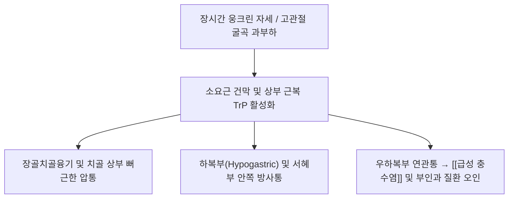

# [[소요근]](Psoas Minor)

> **핵심 요약 (Key Summary)**:
> [[대요근]]의 전내측 표층에 위치하는 작고 긴 건성 근육으로, T12~L1 척추체에서 기시하여 치골선 및 장치융기에 정지함.
> 제1요신경([[요신경총]]) 전지의 지배를 받으며, 요추의 경미한 굴곡 및 장요근근막을 긴장시켜 골반을 안정화함.
> 인구의 40~50%에서 선천적으로 결손되는 퇴화 근육이나, 과긴장 시 우하복부 통증을 일으켜 [[급성 충수염]]으로 오인되는 소요근 증후군을 유발함.

---

## 📌 목차
1. [해부학적 정밀 구조 및 지배 신경/혈관](#1-해부학적-정밀-구조-및-지배-신경혈관)
2. [생체역학·토크 분석 & 근막 사슬 (Biomechanical Synergy)](#2-생체역학토크-분석--근막-사슬-biomechanical-synergy)
3. [근막통증증후군(TP) & 연관통 패턴 (Travell & Simons)](#3-근막통증증후군tp--연관통-패턴-travell--simons)
4. [초음파 해부학(Sonoanatomy) 및 중재 시술 랜드마크](#4-초음파-해부학sonoanatomy-및-중재-시술-랜드마크)
5. [⭐ 원장님 심층 임상 고찰 및 원본 필기 (Clinical Pearls)](#5-원장님-심층-임상-고찰-및-원본-필기-clinical-pearls)
6. [관련 임상 질환 및 운동손상 증후군 총괄](#6-관련-임상-질환-및-운동손상-증후군-총괄)
7. [추나·도수치료(MET/PIR) & 침구·약침·재활 프로토콜](#7-추나도수치료metpir--침구약침재활-프로토콜)
8. [출처 및 학술 참고 문헌 (References)](#8-출처-및-학술-참고-문헌-references)

---

## 1. 해부학적 정밀 구조 및 지배 신경/혈관

![[Psoas_minor_anatomy.png|420]]
> [그림 1: ① 해부 도해 — 척추 전외측 및 대요근 표재면을 주행하여 치골선에 정지하는 소요근(Musculus psoas minor)의 해부학적 주행 — 출처: Wikimedia Commons (CC BY-SA 3.0)]

![[소요근_03_요신경총신경지배도.png|420]]
> [그림 2: ② 신경 지배 도해 — 복벽 후면 요신경총(Lumbar plexus) 및 제1요신경(L1)의 소요근 분지 주행도 — 출처: Wikimedia Commons (Gray's Anatomy Plate 823)]

* **기시(Origin)**:
  * 제12흉추(T12) 및 제1요추(L1) 척추체의 외측면.
  * T12와 L1 사이의 섬유연골성 추간판(Intervertebral disc) 측면.
* **정지(Insertion)**:
  * 치골 상지의 치골선(Pectineal line of pubis) 및 치골치절(Pecten pubis).
  * 장골과 치골의 경계부인 장치융기(Iliopectineal eminence).
  * 외측으로는 장골근막(Iliac fascia) 및 골반 근막으로 섬유성 방사.
* **신경 지배(Innervation)**:
  * 제1요신경(L1) 전지(Ventral ramus of L1, 때때로 T12 분지 포함).
* **혈관 공급(Vascular Supply)**:
  * 복부 대동맥 분지인 요동맥(Lumbar arteries) 및 장요동맥(Iliolumbar artery)의 요골지.
* **해부학적 변이 및 결손율**:
  * 인류 진화 과정에서 직립보행으로 전환되며 기능이 퇴화한 대표적 흔적 근육(Vestigial muscle).
  * 인구의 약 40~50%에서 편측 또는 양측성으로 결손(Agenesis)을 나타냄. 근복은 전체 길이의 약 1/3에 불과하며, 나머지 2/3는 길고 납작한 건(Tendon) 형태로 주행함.

---

## 2. 생체역학·토크 분석 & 근막 사슬 (Biomechanical Synergy)

![[소요근_02_후복벽근육군해부도.png|300]]
> [그림 3: ③ 후복벽 심층 근육군 도해 — 대요근, 장골근, 요방형근과 소요근의 위치 관계 및 건 주행도 — 출처: Wikimedia Commons (Gray's Anatomy Plate 430)]

* **모멘트암 및 관절 작용**:
  * **요추 굴곡(Lumbar Flexion)**: 대퇴골로 주행하지 않고 골반골에 정지하므로 고관절을 직접 굴곡시키지는 못하며, 척추 전외측에서 요추의 미약한 전방 굴곡을 보조함.
  * **골반 후방경사(Posterior Pelvic Tilt)**: 치골선을 상방으로 견인하여 골반의 후방 경사를 보조하고, 요추 전만(Lordosis)을 감소시키는 작용을 함.
  * **근막 지탱 및 활주 보조**: 하부의 장골근막(Iliac fascia)을 팽팽하게 긴장시켜 하부에 위치한 [[대요근]]과 [[장골근]]이 수축할 때 건이 전방으로 이탈하지 않도록 지지대(Pulley) 역할을 수행함.
* **협동근 및 길항근 짝힘(Synergist & Antagonist)**:
  * **협동근(Synergists)**: 요추 굴곡 시 [[복직근]], [[외복사근]], [[내복사근]], [[대요근]].
  * **길항근(Antagonists)**: 요추 신전 시 [[척추기립근]](최장근, 장늑근), [[다열근]], [[요방형근]].
* **근막경선(Anatomy Trains) 연계**:
  * **심부전방선(Deep Front Line, DFL)**: 족부 심부 후경골근에서 시작하여 대퇴 내전근군, 장요근막, 소요근, 횡격막 각(Crura)을 거쳐 경추 심부 경장근 및 후두골로 이어지는 신체 중심 안정화 축에 편입됨.

---

## 3. 근막통증증후군(TP) & 연관통 패턴 (Travell & Simons)

![[Iliopsoas_TriggerPoints.jpg|400]]
> [그림 4: ④ 근막 발통점 도해 — 장요근 복합체(대요근·장골근·소요근)의 발통점(Trigger Points) 및 요추·서혜부 방사통 패턴 — 출처: Travell & Simons / TriggerPoints.net]

* **발통점(Trigger Point) 위치**:
  * 소요근은 단독 근복이 매우 작아 대요근 상부 발통점과 중첩되어 발현함. 제1요추 높이의 배꼽 상외측 약 3~4cm 부위 심부 또는 치골선 부착부 건막 부위.
* **연관통 패턴(Referred Pain)**:
  * **국소 요통 및 서혜부 통증**: 요추 1~2번 외측 부위의 뻐근한 결림 및 장치융기 직상부 서혜인대 내측의 통증.
  * **하복부 위장관 유사 통증**: 특히 우측 소요근의 과긴장은 맹장(Cecum) 후방을 자극하여 맥버니점(McBurney's point) 주변의 둔통과 압통을 유발, 충수염 의심을 초래함.

---

## 4. 초음파 해부학(Sonoanatomy) 및 중재 시술 랜드마크

* **프로브 포지셔닝**:
  * 배꼽 높이에서 복직근 외측연(반월선, Linea semilunaris)에 고주파/저주파 컨벡스 프로브를 가로(Transverse)로 위치시킴.
* **층별 에코 구조**:
  * 표층부터 외복사근 $\rightarrow$ 내복사근 $\rightarrow$ 복횡근 근막.
  * 복막강 내 장관(결장) 후방의 후복막강(Retroperitoneal space)에서 척추체 전외측에 위치한 거대한 저에코의 [[대요근]] 확인.
  * 대요근의 전내측 표면을 덮고 있는 얇고 고에코(Hyperechoic)의 건성 섬유성 띠가 소요근 건임.
* **위험 혈관 및 신경 랜드마크 (Safety Margin)**:
  * 내측에는 복부 대동맥(Aorta, 좌측)과 하대정맥(IVC, 우측)이 위치하므로 절대 내측 편향 자침 금기.
  * 소요근 표층에는 외측대퇴피신경(Lateral femoral cutaneous nerve)과 생식대퇴신경(Genitofemoral nerve)이 관통하므로 신경 손상 주의.

---

## 5. ⭐ 원장님 심층 임상 고찰 및 원본 필기 (Clinical Pearls)

* **소요근 증후군(Psoas Minor Syndrome)의 감별 진단 노하우**:
  * 환자가 "우하복부가 당기고 콕콕 쑤셔 맹장염인 줄 알고 응급실에 갔는데 혈액검사(WBC)와 CT상 충수돌기가 정상이었다"고 호소하는 만성 우하복부통의 상당수가 우측 소요근 건의 단축성 건염(Tendonitis)이다.
  * **진료실 촉진 팁**: 환자를 눕히고 양 무릎을 굽힌(골반 이완) 상태에서 서혜인대 직상부 치골 빗살선(치골치절) 부위를 손가락 끝으로 튕겨보면(Snap), 팽팽한 바이올린 줄처럼 만져지는 압통성 띠(Taut band)가 확인된다.
* **진화적 결손에 따른 임상적 의미**:
  * 환자 2명 중 1명은 아예 소요근이 없으므로, 모든 요통 환자에서 억지로 소요근을 치료 타깃으로 삼을 필요는 없다. 대요근 치료 중에도 복벽 내측 및 치골선 통증이 잔여할 때 선별적으로 소요근을 고려한다.

---

## 6. 관련 임상 질환 및 운동손상 증후군 총괄

| 관련 질환명 | 주소증 및 병리 기전 | 감별 진단 포인트 | 추천 치료 타깃 |
| :--- | :--- | :--- | :--- |
| **[[소요근 증후군]] (Psoas Minor Syndrome)** | 소요근 건의 비후 및 긴장으로 치골선 부착부 견인통 및 하복부 결림 | McBurney 점 압통 있으나 발열·백혈구 증가 없음, 골반 신전 시 통증 악화 | 치골선 부착부 건막 자침 및 장골근막 이완 |
| **[[급성 충수염]] (Acute Appendicitis)** | 충수돌기 염증성 팽만 및 천공 위험 | 반발통(Rebound tenderness), 고열, 백혈구 증가, 점진적 악화 | 침습적 한의 치료 금기 (즉시 응급실 전원) |
| **[[장요근 점액낭염]] (Iliopsoas Bursitis)** | 장요근 건과 고관절낭 사이 마찰로 서혜부 심부 통증 | 고관절 수동 굴곡 시 서혜부 압통, 서혜부 마찰음 | 대퇴 삼각부 서혜인대 하부 점액낭 약침 |
| **[[요추 전만증]] (Lumbar Hyperlordosis)** | 소요근 결손 또는 장요근 단축에 따른 골반 전방경사 | 기립 시 요추 과신전 및 둔부 돌출, 척추기립근 긴장 | 대요근 및 장골근 스트레칭, 복근 강화 |

---

## 7. 추나·도수치료(MET/PIR) & 침구·약침·재활 프로토콜

* **침구 치료 (Acupuncture)**:
  * **취혈 경혈**: 천추(ST25), 대거(ST27), 수도(ST28), 기충(ST30).
  * **자침 기법**: 복부 대동맥 및 장관 천자를 피하기 위해 환자를 앙와위로 눕히고 무릎을 굽혀 복벽을 이완시킨 후, 복직근 외측연에서 척추체 외측 방향으로 완만하게 45도 사자(Oblique insertion)하며 심부 25~40mm 진침.
* **약침 치료 (Pharmacopuncture)**:
  * 치골선 부착부 건염에 [[중성어혈약침]] 또는 [[신바로약침]]을 0.3~0.5cc 국소 주입하여 무균성 건막 염증 해소.
* **추나 및 도수치료 (MET / Post-Isometric Relaxation)**:
  * **토마스 테스트(Thomas Test) 변형 신장**: 환자를 테이블 끝에 걸터앉힌 후 검사하지 않는 쪽 다리를 가슴으로 끌어안게 하고, 검사측 고관절을 테이블 아래로 자연 신전시킴.
  * 검사자는 환자의 장골능을 고정하고 대퇴부를 하방으로 부드럽게 누르면서 10초간 등척성 저항 수축(PIR) 유도 후 이완 신장.

---

## 8. 출처 및 학술 참고 문헌 (References)

1. **Standring, S**. (2020). *Gray's Anatomy: The Anatomical Basis of Clinical Practice* (42nd ed.). Elsevier. 후복벽 및 골반 근육 단원 (pp. 1045-1048).
2. **Guerra DR, et al**. (2012). Anatomical study on the psoas minor muscle. *Anat Sci Int*, 87(1):30-35. [PMID 21822998](https://pubmed.ncbi.nlm.nih.gov/21822998/)
   - **[연구 요약]**: 사체 해부 연구를 통해 소요근의 출현 빈도(약 43.4%), 근복과 건의 비율, 형태학적 변이 및 척추-골반 생체역학적 기능과 소요근 증후군의 해부학적 기저를 규명함.
3. **Garg R, et al**. (2020). Morphology of the Psoas Minor Muscle: A Cadaveric Study. *Cureus*, 12(11):e11762. [PMID 33391942](https://pubmed.ncbi.nlm.nih.gov/33391942/)
   - **[연구 요약]**: 소요근의 기시·정지 변이와 결손 양상을 분석하고, 임상적으로 급성 복통 환자 감별 시 소요근 병변의 감별 중요성을 체계적으로 보고함.
4. **Travell, J. G., & Simons, D. G**. (1999). *Myofascial Pain and Dysfunction: The Trigger Point Manual* (Vol. 2). Williams & Wilkins. 장요근 복합체 단원.
