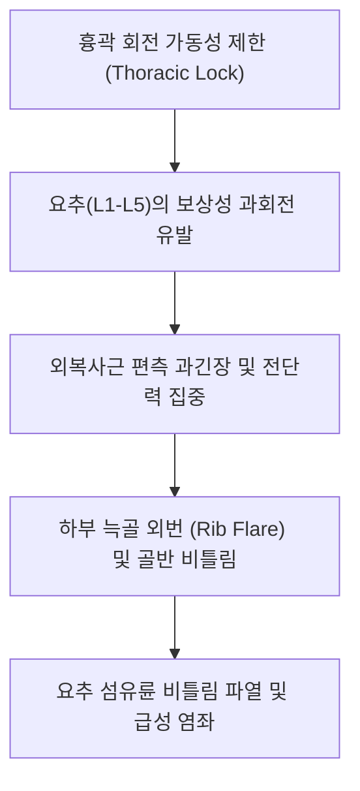

# [[외복사근]](External Oblique)

> **핵심 요약 (Key Summary)**:
> 하부 제5~12[[늑골]] 외측면에서 기시하여 [[장골능]], [[백선]], [[치골결절]]에 정지하는 최표층 복벽 사선 근육.
> 체간 대측(반대쪽) 회전, 동측 측굴, 골반 전방경사 억제를 담당하며 하부 [[갈비사이신경]](T7-T12)의 지배를 받음.
> 회전 운동 손상, 늑골 외번(Rib flare), 서혜부 가성 방사통을 유발하며 전방 사선 사슬(AOS) 재활 및 일월·경문혈 자침의 핵심 타깃임.

---
## 📌 목차
1. [해부학적 정밀 구조 및 지배 신경/혈관](#1-해부학적-정밀-구조-및-지배-신경혈관)
2. [생체역학·토크 분석 & 근막 사슬 (Biomechanical Synergy)](#2-생체역학토크-분석--근막-사슬-biomechanical-synergy)
3. [근막통증증후군(TP) & 연관통 패턴 (Travell & Simons)](#3-근막통증증후군tp--연관통-패턴-travell--simons)
4. [초음파 해부학(Sonoanatomy) 및 중재 시술 랜드마크](#4-초음파-해부학sonoanatomy-및-중재-시술-랜드마크)
5. [⭐ 원장님 심층 임상 고찰 및 원본 필기 (Clinical Pearls)](#5-원장님-심층-임상-고찰-및-원본-필기-clinical-pearls)
6. [관련 임상 질환 및 운동손상 증후군 총괄](#6-관련-임상-질환-및-운동손상-증후군-총괄)
7. [추나·도수치료(MET/PIR) & 침구·약침·재활 프로토콜](#7-추나도수치료metpir--침구약침재활-프로토콜)
8. [출처 및 학술 참고 문헌 (References)](#8-출처-및-학술-참고-문헌-references)

---
## 1. 해부학적 정밀 구조 및 지배 신경/혈관

| 항목 | 상세 내용 |
| :--- | :--- |
| **기시 (Origin)** | 하부 제5~12[[늑골]](Ribs) 외측면 및 하연 (전거근 및 광배근 부착부와 톱니 모양 맞물림) |
| **정지 (Insertion)** | [[장골능]](Iliac crest) 외순 전방 절반, [[백선]](Linea alba), [[치골결절]](Pubic tubercle) (서혜인대 형성) |
| **신경 지배** | 제7~12 [[갈비사이신경]](Intercostal nn., T7-T12) 전피지 및 외측피지 |
| **혈관 공급** | 하부 늑간동맥, 늑하동맥, 심재장골회선동맥 |

### 🔬 해부학 도해 및 단면도
![[External_oblique_anatomy.png|450]]
> [해부학 도해]: 주머니에 손을 넣는 방향(하내측)으로 주행하며 전거근과 강력한 체간 사선 복합체를 이루는 외복사근.

![[Pasted image 20240117004406.png|450]]
> [표층 층판]: 늑골 외측면에서 시작하여 장골능과 백선 건막으로 모여드는 광범위한 근육 판.

![[Pasted image 20240227000504.png|450]]
> [서혜인대 부착부]: 치골결절과 ASIS 사이로 건막이 접혀 서혜관 천장과 인대를 형성하는 주행.

---
## 2. 생체역학·토크 분석 & 근막 사슬 (Biomechanical Synergy)

* **체간 대측 회전 주동**: 우측 외복사근 수축 시 흉곽을 전하방으로 당겨 상체를 **좌측(반대쪽)**으로 회전시킴.
* **전거근-외복사근 슬링 (Serratus-Oblique Sling)**: 상완골 전인 시 전거근의 장력이 외복사근으로 이어져 흉곽을 견고하게 안정화.
* **전방 사선 사슬 (Anterior Oblique Sling: AOS)**: 우측 외복사근 → 복직근초 건막 교차 → 좌측 [[내복사근]] → 좌측 [[장내전근]]으로 이어지는 보행 및 투구 동작의 핵심 대각선 파워 체인.

---
## 3. 근막통증증후군(TP) & 연관통 패턴 (Travell & Simons)

* **상부 늑골 TrP**:
  * 검상돌기 부근 및 가슴 아래 명치 부위의 결림과 뻐근한 통증(협심증 유사 통증 모사).
* **측복부 TrP (장골능 상방)**:
  * 서혜부, 음낭/고환, 음순 부위로 찌릿하게 내려가는 연관통(신장 결석 통증 모사).
* **하부 건막 TrP**:
  * 배뇨 시 방광 괄약근 경련 및 배뇨 곤란, 사타구니 결림 유발.

---

![[External_oblique_TriggerPoints.jpg|450]]
> [외복사근 발통점]: 늑골 하연(협심통 모사), 측복부, 서혜부 및 고환/음낭으로 방사되는 Travell & Simons 연관통 패턴.

---
## 4. 초음파 해부학(Sonoanatomy) 및 중재 시술 랜드마크

* **초음파 스캔 뷰**:
  * 측복부 횡단 스캔에서 가장 천층에 위치한 외복사근 확인(내복사근보다 얇고 건막 비율이 높음).
  * 늑골 하연 레벨에서는 늑골 뼈 음영 바로 표층을 덮고 있는 근막 확인.
* **자침 안전 마진**: 하부 늑골각 부근 자침 시 늑간신경 및 흉막(Pleura) 손상 방지를 위해 늑골 뼈 표면을 가이드 삼아 사자.

---
## 5. ⭐ 원장님 심층 임상 고찰 및 원본 필기 (Clinical Pearls)

* **요추의 회전 취약성과 외복사근 (원장님 필기 100% 보존)**:
  * 요추는 관절돌기(Facet joint)의 해부학적 구조상 시상면 굴곡/신전에는 유리하지만, 회전 각도는 분절당 1~2도(전체 요추 합쳐도 5~10도)에 불과함.
  * 회전 운동은 흉추(Thoracic)에서 일어나야 하는데, 등이 굳어 흉추가 돌지 않으면 외복사근이 요추를 억지로 비틀어 요추 추간판의 섬유륜 파열을 유발함.
  * 골프 스윙이나 테니스 후 발생하는 급성 요통 환자는 반드시 외복사근 긴장과 흉추 회전 제한을 함께 치료해야 함.
* **늑골 외번(Rib Flare) 교정 팁**:
  * 호기 시 하부 늑골이 모아지지 않고 붕 떠 있는 환자는 외복사근 상부 섬유가 이완성 약화 상태임. 외복사근을 활성화하여 늑골을 골반 쪽으로 끌어내리는 호기 테크닉 적용.
* **서혜부 가성 탈장 통증 감별**:
  * 서혜인대 부착부의 외복사근 TrP는 외과적 탈장(Hernia)이 없음에도 서혜관 통증을 유발하므로, 압통점 자침으로 수술 없이 호전되는 경우가 많음.

---
## 6. 관련 임상 질환 및 운동손상 증후군 총괄

| 임상 질환 / 증후군 | 병리적 연관 기전 | 주요 증상 및 이학적 검사 | 핵심 교정 타깃 |
| :--- | :--- | :--- | :--- |
| 골프 요통 / 회전 염좌 | 과도한 체간 회전 시 외복사근 연축 | 백스윙/팔로우스루 시 측복부 찌릿한 격통 | 외복사근 침도 치료, 흉추 가동성 추나 |
| 늑골 외번 (Rib Flare) | 외복사근 약화로 늑골 하연 벌어짐 | 흉식 호흡 우세, 요추 과전만, 코어 풀림 | 호기 시 늑골 하강 유도 도수, 외복사근 강화 |
| 가성 서혜부 탈장통 | 외복사근 하부 건막 발통점 | 기침 시 서혜부 결림, 찌르는 듯한 사타구니통 | 서혜인대 부착부 소염 약침, TrP 침치료 |
| 전방 사선 사슬(AOS) 부전 | 외복사근-반대측 내전근 협응 상실 | 보행 시 골반 동요, 방향 전환 시 서혜통 | 대각선 사선 슬링 재활(Chop & Lift) |

---
## 7. 추나·도수치료(MET/PIR) & 침구·약침·재활 프로토콜

* **한의학 경혈 매핑 및 침구 프로토콜**:
  * 담경 일월(GB24), 경문(GB25), 오추(GB27), 간경 장문(LR13).
  * 0.25×40mm 침을 사용하여 늑골 주행 방향을 따라 15도 사자(늑간 신경총 자극 방지).
* **근에너지기법 (MET/PIR)**:
  * 좌위에서 환자의 체간을 반대측으로 회전시킨 후, 환자에게 동측 회전 힘(20% 저항)을 7초간 요구, 호기와 함께 반대측 회전 각도를 늘려 신장.
* **재활 훈련 (Side Plank with Rotation & Pallof Press)**:
  * 안티 로테이션(Anti-rotation) 훈련을 통해 요추의 불필요한 비틀림을 방어하는 외복사근 강성 확보.

---
## 8. 출처 및 학술 참고 문헌 (References)

1. **Neumann, D. A.** (2016). *Kinesiology of the Musculoskeletal System: Foundations for Rehabilitation* (3rd ed.). Elsevier.
   - `[연구 요약]`: 외복사근과 내복사근의 회전 짝힘 및 대각선 복벽 장력 사슬 분석.
2. **Travell, J. G., & Simons, D. G.** (1999). *Myofascial Pain and Dysfunction: The Trigger Point Manual*. Williams & Wilkins.
   - `[연구 요약]`: 외복사근 발통점으로 인한 서혜부, 고환 통증 및 심장병 유사 전흉부 연관통 지도 규명.
3. **McGill, S. M.** (2010). Core training: Evidence translating to better performance and injury prevention. *Strength and Conditioning Journal*, 32(3), 33-46.
   - `[연구 요약]`: 척추 비틀림 손상 방지를 위한 외복사근의 등척성 브레이싱(Bracing) 기능 검증.
