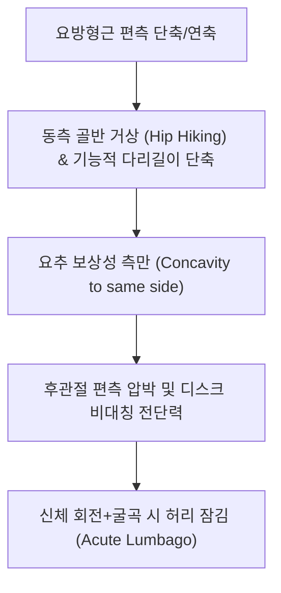

# [[요방형근]](Quadratus Lumborum, QL)

> **핵심 요약 (Key Summary)**:
> [[장골능]] 후내순에서 기시하여 제12[[늑골]] 하연 및 [[요추]] L1~L4 횡돌기 첨부에 정지하는 후복벽 핵심 사각근.
> 체간 측굴, 보행 시 골반 수평 유지(Hip hiking), 강제 호기 시 제12늑골 고정을 담당하며 [[늑하신경]](T12) 및 요추신경 전지(L1-L4)의 지배를 받음.
> 급만성 요통의 최대 주범(The Joker of Low Back Pain), 골반 불균형, 양말 신을 때 허리 통증을 유발하며 지실혈 심부 침도와 측와위 PIR의 핵심 타깃임.

---
## 📌 목차
1. [해부학적 정밀 구조 및 지배 신경/혈관](#1-해부학적-정밀-구조-및-지배-신경혈관)
2. [생체역학·토크 분석 & 근막 사슬 (Biomechanical Synergy)](#2-생체역학토크-분석--근막-사슬-biomechanical-synergy)
3. [근막통증증후군(TP) & 연관통 패턴 (Travell & Simons)](#3-근막통증증후군tp--연관통-패턴-travell--simons)
4. [초음파 해부학(Sonoanatomy) 및 중재 시술 랜드마크](#4-초음파-해부학sonoanatomy-및-중재-시술-랜드마크)
5. [⭐ 원장님 심층 임상 고찰 및 원본 필기 (Clinical Pearls)](#5-원장님-심층-임상-고찰-및-원본-필기-clinical-pearls)
6. [관련 임상 질환 및 운동손상 증후군 총괄](#6-관련-임상-질환-및-운동손상-증후군-총괄)
7. [추나·도수치료(MET/PIR) & 침구·약침·재활 프로토콜](#7-추나도수치료metpir--침구약침재활-프로토콜)
8. [출처 및 학술 참고 문헌 (References)](#8-출처-및-학술-참고-문헌-references)

---
## 1. 해부학적 정밀 구조 및 지배 신경/혈관

| 항목 | 상세 내용 |
| :--- | :--- |
| **기시 (Origin)** | [[장골능]](Iliac crest) 후내순 및 [[장요인대]](Iliolumbar ligament) |
| **정지 (Insertion)** | 제12[[늑골]](Rib) 내측 하연, [[요추]] L1~L4 [[횡돌기]](Transverse processes) 첨부 |
| **신경 지배** | **제12 [[늑하신경]](Subcostal nerve, T12)** 및 **제1~4 [[요추신경]](Lumbar nerves, L1-L4)** 전지 |
| **혈관 공급** | 요동맥(Lumbar aa.), 장요동맥(Iliolumbar a.) 요지, 늑하동맥 |

### 🔬 해부학 도해 및 단면도
![[Quadratus_lumborum_anatomy.png|450]]
> [해부학 도해]: 흉요근막 전엽과 중간층 사이에서 신장 후면을 받치며 장골능과 요추 횡돌기, 제12늑골을 잇는 요방형근의 3방향 섬유 주행.

![[Pasted image 20240116135227 1.png|447]]
> [구조적 특징]: 척추기립근 외측 심부에 위치하며 요추-골반 안정성을 유지하는 후복벽의 핵심 기둥.

---
## 2. 생체역학·토크 분석 & 근막 사슬 (Biomechanical Synergy)

* **3차원 섬유 주행 역학**:
  * 장요 섬유 (Iliolumbar): 장골능 → 요추 횡돌기 (수직/사선 분절 안정화).
  * 장늑 섬유 (Iliocostal): 장골능 → 제12늑골 (강력한 체간 측굴 주동).
  * 요늑 섬유 (Lumbocostal): 요추 횡돌기 → 제12늑골 (호기 시 늑골 안정화).
* **보행 시 골반 수평 제어**:
  * 유각기(Swing phase)에서 발이 바닥에 끌리지 않도록 골반을 들어 올림.
  * 중둔근 약화 시 보상적으로 과활성화되어 만성 피로와 통증 유발.
* **근막 사슬 연계 (Anatomy Trains)**: 외측선(Lateral Line)의 체간 핵심 분절이자 흉요근막 전엽과 중간층에 밀착되어 복횡근과 장력 연속성 형성.

---
## 3. 근막통증증후군(TP) & 연관통 패턴 (Travell & Simons)

* **4대 발통점 패턴**:
  * **TrP 1 (천부 외측 상부)**: 장골능 상연을 따라 둔부 외측 및 대퇴 외측으로 방사.
  * **TrP 2 (천부 외측 하부)**: 천장관절 및 둔부 하부, 좌골결절 부위로 묵직한 통증 방사.
  * **TrP 3 (심부 내측 상부)**: 천골 및 서혜부, 고환/음순으로 찌르는 듯한 통증 방사(신경통 모사).
  * **TrP 4 (심부 내측 하부)**: 대퇴 전자부 및 대퇴 전면으로 방사.
* **통증의 별칭**: "The Joker of Low Back Pain" - 추간판 탈출증, 천장관절염, 전자부 활액낭염, 신장 결석을 완벽히 모사하는 가성 통증 유발.

---

![[Quadratus_lumborum_TriggerPoints.jpg|450]]
> [요방형근 4대 발통점]: 장골능, 천장관절, 둔부 및 서혜부로 방사되는 'The Joker of Low Back Pain' Travell & Simons 연관통 패턴.

---
## 4. 초음파 해부학(Sonoanatomy) 및 중재 시술 랜드마크

* **초음파 Shamrock View (삼엽충 랜드마크)**:
  * 요추 L3-L4 레벨 외측 복벽에서 탐촉자를 후방으로 회전.
  * 요추 횡돌기(줄기), 척추기립근(후엽), 대요근(전엽), 요방형근(외측엽)이 이루는 명확한 삼엽충 구조 확인.
* **자침 안전 마진**:
  * 제12늑골 하단에는 신장(Kidney) 하극이 위치하므로 상부 내측 자침 시 절대 주의.
  * 흉요근막 중간층(Middle layer of TLF)을 타깃으로 침 끝을 진입시켜 복막 및 신장 손상 방지.

---
## 5. ⭐ 원장님 심층 임상 고찰 및 원본 필기 (Clinical Pearls)

* **골반 전방경사와 특이 통증 양상 (원장님 팁 100% 보존)**:
  * 요방형근이 경직되면 근복 자체뿐 아니라 골반 아래쪽, 천장관절, 둔부 및 서혜부로 강한 연관통 방사.
  * 요추부 회전 및 측굴을 유도하며 주로 골반 전방경사를 유도함.
  * **양말을 신거나 발톱을 깎을 때(체간 굴곡+회전의 나선 경사 동작) 허리가 끊어질 듯한 통증**을 호소하는 대표적인 근육.
* **급성 요협통(담결림)의 80% 점유**:
  * 무거운 물건을 들며 허리를 돌릴 때 뚝 하면서 허리를 펴지도 굽히지도 못하는 급성 요통 환자의 대다수가 요방형근의 급성 연축임.
* **자침 깊이와 촉진 노하우 (원장님 필기 보존)**:
  * 측복부(허리 옆면) 장골능 상연과 제11·12늑골 사이에서 전내측 방향으로 깊게 자입(최소 4~5cm 이상 심부 진입 필요).
  * 표층 척추기립근에 걸리지 않도록 최장근 외측연을 타고 들어가야 요방형근에 정확히 적중.

---
## 6. 관련 임상 질환 및 운동손상 증후군 총괄

| 임상 질환 / 증후군 | 병리적 연관 기전 | 주요 증상 및 이학적 검사 | 핵심 교정 타깃 |
| :--- | :--- | :--- | :--- |
| [[요방형근 증후군]] | 요방형근 TrP 활성화 및 연축 | 기침 시 허리 격통, 寝返り(뒤척임) 불능, 보행 제한 | 지실혈 심부 침도, 측와위 PIR |
| 기능적 다리길이 차이 | 편측 요방형근 단축으로 골반 거상 | 서 있을 때 골반 높이 비대칭, 척추 기능적 측만 | 단축 측 요방형근 이완, 반대편 중둔근 강화 |
| 가성 좌골신경통 | QL 연관통의 천장관절/둔부 방사 | 디스크 탈출 없는 둔부/대퇴 외측 묵직한 방사통 | 요방형근 심부 발통점 소염 약침 |
| 호흡 연관성 요통 | 횡격막 호기 시 제12늑골 과긴장 고정 | 깊은 숨을 들이쉬거나 내쉴 때 하부 요늑부 결림 | 횡격막-요방형근 근막 연계 이완 추나 |

---
## 7. 추나·도수치료(MET/PIR) & 침구·약침·재활 프로토콜

* **한의학 경혈 매핑 및 침구 프로토콜**:
  * 지실(BL52), 요안(EX-B7), 경문(GB25).
  * 0.35×60mm 또는 0.35×75mm 장침을 사용하여 기립근 외측연에서 척추체를 향해 내하방 45도로 4~5cm 심부 자입.
  * 중성어혈약침 또는 녹용 약침을 부착부(장골능, 제12늑골 하연)에 분할 주입.
* **근에너지기법 (MET/PIR)**:
  * 환자를 환측이 위로 오도록 측와위로 눕히고, 상측 하지를 베드 앞쪽으로 하수(골반 회전).
  * 시술자가 장골능을 하방으로, 늑골을 상방으로 벌리며 가벼운 골반 거상 저항(등척성 수축) 7초 후, 호기와 함께 측복부를 최대로 신장.
* **재활 운동 (Side Plank & McGill QL Exercise)**:
  * 척추의 축 회전 없이 순수 관상면 안정성을 회복하는 사이드 플랭크 훈련.

---
## 8. 출처 및 학술 참고 문헌 (References)

1. **Standring, S.** (2020). *Gray's Anatomy: The Anatomical Basis of Clinical Practice* (42nd ed.). Elsevier.
   - `[연구 요약]`: 요방형근의 3차원 근섬유 해부학과 요추 횡돌기 부착부 및 흉요근막 층판 구조 규명.
2. **Simons, D. G., & Travell, J. G.** (1999). *Myofascial Pain and Dysfunction: The Trigger Point Manual* (Vol. 1, 2nd ed.). Williams & Wilkins.
   - `[연구 요약]`: 요방형근 발통점이 천골, 둔부, 대전자 및 서혜부로 방사하는 4대 연관통 패턴과 가성 디스크 감별법 제시.
3. **McGill, S. M.** (2007). *Low Back Disorders: Evidence-Based Prevention and Rehabilitation*. Human Kinetics.
   - `[연구 요약]`: 요방형근의 체간 측굴 안정화 기전 및 요추 부하를 최소화하는 사이드 브릿지(Side bridge) 운동의 근전도학적 우수성 입증.
