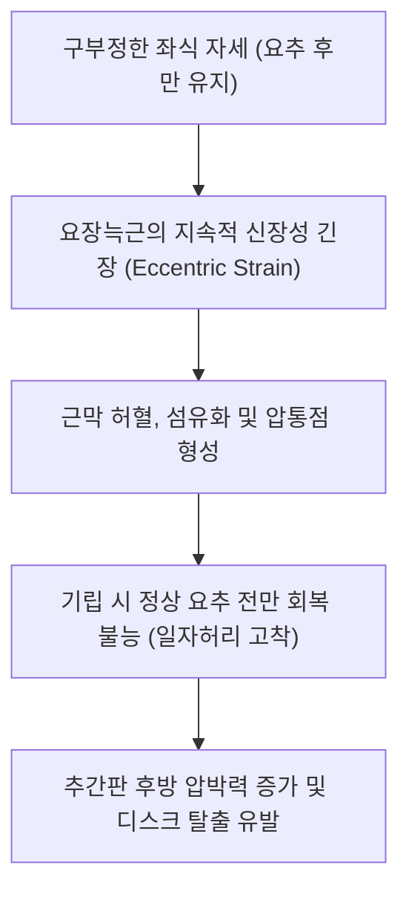

# [[요장늑근]](Iliocostalis Lumborum)

> **핵심 요약 (Key Summary)**:
> [[천골]] 후면, [[장골능]] 후부 내순, [[흉요근막]]에서 기시하여 하부 제6~7개 [[늑골]]의 늑골각 하연 및 [[요추]] 횡돌기에 정지하는 척주기립근 요부 외측 기둥.
> 요추 신전, 동측 측굴, 골반 전방경사 유지 및 체간 측방 동요 방어를 주동하며 [[척수신경 후지]](T7-L5)의 지배를 받음.
> 장시간 좌식으로 인한 신장성 과긴장, 일자허리, 척추기립근 증후군을 유발하며 지실혈 사자 및 측와위 PIR의 핵심 타깃임.

---
## 📌 목차
1. [해부학적 정밀 구조 및 지배 신경/혈관](#1-해부학적-정밀-구조-및-지배-신경혈관)
2. [생체역학·토크 분석 & 근막 사슬 (Biomechanical Synergy)](#2-생체역학토크-분석--근막-사슬-biomechanical-synergy)
3. [근막통증증후군(TP) & 연관통 패턴 (Travell & Simons)](#3-근막통증증후군tp--연관통-패턴-travell--simons)
4. [초음파 해부학(Sonoanatomy) 및 중재 시술 랜드마크](#4-초음파-해부학sonoanatomy-및-중재-시술-랜드마크)
5. [⭐ 원장님 심층 임상 고찰 및 원본 필기 (Clinical Pearls)](#5-원장님-심층-임상-고찰-및-원본-필기-clinical-pearls)
6. [관련 임상 질환 및 운동손상 증후군 총괄](#6-관련-임상-질환-및-운동손상-증후군-총괄)
7. [추나·도수치료(MET/PIR) & 침구·약침·재활 프로토콜](#7-추나도수치료metpir--침구약침재활-프로토콜)
8. [출처 및 학술 참고 문헌 (References)](#8-출처-및-학술-참고-문헌-references)

---
## 1. 해부학적 정밀 구조 및 지배 신경/혈관

| 항목 | 상세 내용 |
| :--- | :--- |
| **기시 (Origin)** | [[천골]](Sacrum) 후면, [[장골능]](Iliac crest) 후부 내순, [[흉요근막]](TLF) 및 요추 극돌기 |
| **정지 (Insertion)** | 하부 제6~7개 [[늑골]](Ribs)의 늑골각(Costal angle) 하연 및 [[요추]] L1~L4 [[횡돌기]](Transverse processes) |
| **신경 지배** | [[척수신경 후지]](Dorsal rami of lumbar & thoracic spinal nerves) 외측지 (T7~L5) |
| **혈관 공급** | 요동맥(Lumbar aa.), 늑간동맥, 장요동맥 |

### 🔬 해부학 도해 및 단면도
![[Iliocostalis_anatomy.png|450]]
> [해부학 도해]: 장골능과 천골에서 기시하여 하부 늑골각으로 뻗어 올라가는 요장늑근의 정밀 부착부.

![[Pasted image 20240116141045 1.png|450]]
> [구조적 특징]: 척추기립근군 중 가장 외측에 위치하여 늑골과 골반을 연결하며 측방 안정성을 담당하는 요장늑근.

---
## 2. 생체역학·토크 분석 & 근막 사슬 (Biomechanical Synergy)

* **체간 측굴 및 신전 지렛대**: 기립근 중 가장 외측에 위치하여 체간을 같은 쪽으로 구부리는 모멘트 암이 가장 크며, 양측 수축 시 요추 전만을 지탱.
* **보행 시 골반 대측 처짐 방어**: 입각기(Stance phase)에서 반대측 골반이 아래로 떨어지지 않도록 동측 요장늑근과 요방형근이 협동 수축.
* **근막 사슬 연계 (Anatomy Trains)**: 표재후방선(Superficial Back Line)의 외측 경계이자 흉요근막을 통해 대둔근과 나선형 장력 연결.

---
## 3. 근막통증증후군(TP) & 연관통 패턴 (Travell & Simons)

* **하부 요추 TrP**: 장골능 바로 위 근복에 위치하며, 둔부 외측 및 천장관절, 대퇴 후외측 상부로 묵직한 통증 방사.
* **상부 흉요추 TrP**: 제12늑골각 부근에 위치하여 하복부 및 서혜부로 통증 투사(내장 산통 모사).
* **증상 특징**: 오래 앉아 있다가 일어설 때 허리 양옆이 뻐근하여 손으로 허리를 받쳐야 함.

---

![[Iliocostalis_lumborum_TriggerPoints.jpg|450]]
> [요장늑근 발통점]: 장골능 상연 및 둔부 외측, 천장관절로 방사되는 Travell & Simons 연관통 패턴.

---
## 4. 초음파 해부학(Sonoanatomy) 및 중재 시술 랜드마크

* **초음파 스캔**:
  * 요추 L2-L3 레벨 횡단 스캔에서 최장근의 외측, 요방형근의 후방에 위치한 요장늑근 단면 확인.
  * 흉요근막 후엽의 외측 경계(Lateral raphe)와 인접 부위 확인.
* **자침 안전 마진**: 늑골각 하단 자침 시 침 첨이 늑골 하연을 넘어 늑간강으로 깊이 들어가지 않도록 45도 내하방 사자.

---
## 5. ⭐ 원장님 심층 임상 고찰 및 원본 필기 (Clinical Pearls)

* **역학적 손상 기전과 신장성 긴장 (원장님 필기 100% 보존)**:
  * 장시간 구부정하게 앉거나 비틀린 자세를 유지하면 요장늑근에 과도한 신장성 긴장(Eccentric strain)이 축적되어 만성 섬유화 및 허리 운동 제한 초래.
  * 요장늑근이 약화되면 기립 시 척추 전만이 소실되며 디스크 압박 하중이 급격히 증가함.
* **지실혈(BL52) 자침의 랜드마크**:
  * 척추 극돌기 외측 3촌 지실혈은 요장늑근의 내측연이자 요방형근으로 들어가는 관문임.
  * 요장늑근의 경결 띠를 먼저 관통하며 득기감을 유도하고, 심부로 진입하여 요방형근까지 동시에 치료하는 복합 자침술 적용.
* **일자허리 환자의 기립 시 통증**:
  * 척추 만곡이 사라진 환자는 요장늑근이 팽팽한 고무줄처럼 당겨져 있으므로, 억지로 꺾거나 과신전시키지 말고 근막 이완(PIR) 후 점진적 전만 형성 추나 시행.

---
## 6. 관련 임상 질환 및 운동손상 증후군 총괄

| 임상 질환 / 증후군 | 병리적 연관 기전 | 주요 증상 및 이학적 검사 | 핵심 교정 타깃 |
| :--- | :--- | :--- | :--- |
| 기립근 피로성 요통 | 요장늑근 신장성 과부하 및 허혈 | 오래 앉아 있거나 서 있을 때 요배부 결림 | 지실혈 심부 침도, 온열 요법 |
| [[요추 만곡 소실]](일자허리) | 요장늑근 만성 신장 및 긴장 고착 | 척추 전만각 감소, 앙와위 시 허리 뜸 | 요장늑근 근막 이완, 전만 추나 |
| 기능적 골반 불균형 | 편측 요장늑근 단축 | 골반 높이 비대칭, 보행 시 한쪽 허리 당김 | 단축 측 요장늑근 PIR, 골반 교정 |
| 가성 신장통 | 상부 요장늑근 발통점 연관통 | 갈비뼈 아래 옆구리 뻐근함, 신장 질환 모사 | 늑골각 부착부 소염 약침 |

---
## 7. 추나·도수치료(MET/PIR) & 침구·약침·재활 프로토콜

* **한의학 경혈 매핑 및 침구 프로토콜**:
  * 지실(BL52), 황문(BL51), 위창(BL50), 요안(EX-B7).
  * 0.30×60mm 호침으로 척추체를 향해 30~45도 내하방 사자.
* **근에너지기법 (MET/PIR)**:
  * 환자를 측와위로 눕히고 상체를 전굴+반대측 측굴시킨 상태에서 등척성 신전 저항 7초 후, 호기와 함께 이완 신장.
* **재활 운동 (Side Bridge & Bird-Dog)**:
  * 척추 중심을 안정화하며 요장늑근의 지구력을 회복하는 단계별 코어 운동.

---
## 8. 출처 및 학술 참고 문헌 (References)

1. **Bogduk, N.** (2005). *Clinical Anatomy of the Lumbar Spine and Sacrum*. Churchill Livingstone.
   - `[연구 요약]`: 요장늑근의 층판 해부학과 요추 횡돌기 및 흉요근막 장력 전달 연구.
2. **Travell, J. G., & Simons, D. G.** (1999). *Myofascial Pain and Dysfunction*. Williams & Wilkins.
   - `[연구 요약]`: 요장늑근 발통점의 둔부 및 요추 수직 방사통 패턴.
3. **McGill, S. M.** (2007). *Low Back Disorders*. Human Kinetics.
   - `[연구 요약]`: 요장늑근의 외측 척추 강성(Lateral stiffness) 기여도 정량화.
