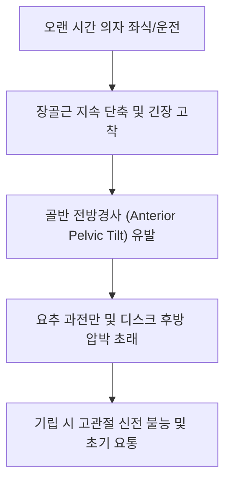

# [[장골근]](Iliacus Muscle)

> **핵심 요약 (Key Summary)**:
> [[장골]]의 장골와 상부 2/3 및 천골 날개에서 기시하여 [[대퇴골]] 소전자에 정지하는 부채꼴 형태의 골반 내재근.
> 고관절 굴곡 및 골반 전방경사를 주동하며 [[대퇴신경]](Femoral nerve, L2-L4)의 지배를 받음.
> 장시간 좌식으로 인한 단축, 서혜부 전면 통증, 기립 시 고관절 신전 제한을 유발하며 장골와 내측 사자 및 Thomas 신전 도수의 핵심 타깃임.

---
## 📌 목차
1. [해부학적 정밀 구조 및 지배 신경/혈관](#1-해부학적-정밀-구조-및-지배-신경혈관)
2. [생체역학·토크 분석 & 근막 사슬 (Biomechanical Synergy)](#2-생체역학토크-분석--근막-사슬-biomechanical-synergy)
3. [근막통증증후군(TP) & 연관통 패턴 (Travell & Simons)](#3-근막통증증후군tp--연관통-패턴-travell--simons)
4. [초음파 해부학(Sonoanatomy) 및 중재 시술 랜드마크](#4-초음파-해부학sonoanatomy-및-중재-시술-랜드마크)
5. [⭐ 원장님 심층 임상 고찰 및 원본 필기 (Clinical Pearls)](#5-원장님-심층-임상-고찰-및-원본-필기-clinical-pearls)
6. [관련 임상 질환 및 운동손상 증후군 총괄](#6-관련-임상-질환-및-운동손상-증후군-총괄)
7. [추나·도수치료(MET/PIR) & 침구·약침·재활 프로토콜](#7-추나도수치료metpir--침구약침재활-프로토콜)
8. [출처 및 학술 참고 문헌 (References)](#8-출처-및-학술-참고-문헌-references)

---
## 1. 해부학적 정밀 구조 및 지배 신경/혈관

| 항목 | 상세 내용 |
| :--- | :--- |
| **기시 (Origin)** | [[장골]](Ilium)의 [[장골와]](Iliac fossa) 상부 2/3, 내측 장골능 및 [[천골]] 익부(Ala of sacrum) |
| **정지 (Insertion)** | [[대퇴골]](Femur) 소전자(Lesser trochanter) - 대요근건 외측에 합류하여 건 형성 |
| **신경 지배** | [[대퇴신경]](Femoral nerve, L2-L4) 분지 |
| **혈관 공급** | 장요동맥(Iliolumbar a.)의 장골지, 심재대퇴회선동맥(Deep circumflex iliac a.) |

### 🔬 해부학 도해 및 단면도
![[Iliacus_anatomy.png|450]]
> [해부학 도해]: 골반 안쪽 오목한 장골와를 가득 채우며 근육열공을 통해 대퇴골 소전자로 집중되는 장골근의 부채꼴 구조.

![[Pasted image 20240116135437 1.png|361]]
> [구조적 특징]: 골반 내측연에서 서혜인대 심부로 통과하여 대요근과 함께 대퇴 전면으로 노출되는 주행 경로.

---
## 2. 생체역학·토크 분석 & 근막 사슬 (Biomechanical Synergy)

* **고관절 굴곡 모멘트**: 대요근과 함께 고관절을 가슴 쪽으로 당기며, 대퇴골이 고정되었을 때는 골반을 앞쪽으로 회전시켜 전방경사 유도.
* **대퇴골두 안정화**: 비구(Acetabulum) 전면을 가로지르며 대퇴골두를 후상방 비구와 안으로 압박하여 고관절 관절 중심화(Joint centration)에 기여.
* **근막 사슬 연계 (Anatomy Trains)**: 심부전방선(Deep Front Line) 하부 파트로서 내전근군(Adductor longus/brevis)과 서혜인대 심부에서 근막적으로 연결.

---
## 3. 근막통증증후군(TP) & 연관통 패턴 (Travell & Simons)

* **발통점 위치**:
  * 장골와 내측연 상부 1/3 및 서혜인대 바로 상방의 장골와 오목한 부위.
* **연관통 방사 패턴**:
  * 서혜부 전면 전체에 뻐근하고 쥐어짜는 듯한 통증.
  * 대퇴 전상부 및 동측 천장관절, 둔부 내측으로 확산.
* **임상 증상**:
  * 의자에서 일어날 때 허리와 서혜부를 펴지 못함.
  * 걷거나 달릴 때 발을 뒤로 뻗는 고관절 신전 동작 시 서혜부 통증 격화.

---

![[Iliopsoas_TriggerPoints.jpg|450]]
> [장골근 발통점]: 서혜인대 직하방 및 대퇴 전상부 1/3 영역으로 집중 투사되는 Travell & Simons 연관통 패턴.

---
## 4. 초음파 해부학(Sonoanatomy) 및 중재 시술 랜드마크

* **초음파 스캔 랜드마크**:
  * ASIS 내측 횡단 스캔: 장골익(Iliac wing)의 강한 고에코 곡선 뼈 음영 바로 위를 덮고 있는 장골근 복식 확인.
  * 서혜부 사선 스캔: 서혜인대 하방에서 대퇴신경(FN)을 감싸고 있는 장골근과 대요근건 확인.
* **자침 안전 마진**:
  * 맹장(Cecum, 우측) 및 구불결장(Sigmoid colon, 좌측) 등 복강 내 장기가 장골근 내측에 인접하므로, 장골와 뼈 바닥을 향해 외측으로 사자하여 복강 천공 절대 방지.

---
## 5. ⭐ 원장님 심층 임상 고찰 및 원본 필기 (Clinical Pearls)

* **좌식 생활과 장골근 단축 (원장님 필기 100% 보존)**:
  * 오랜 시간 의자에 앉아 있거나 장시간 운전을 하는 현대인은 장골근이 지속적으로 단축 상태에 놓임.
  * 기립 시 골반이 앞으로 끌려가며 골반 전방경사 및 요추 전만 증가를 유발하여 디스크 압박 및 만성 요통 초래.
* **촉진법 및 임상 팁**:
  * 환자를 앙와위로 눕히고 고관절과 슬관절을 살짝 굴곡시킨 상태(복벽 이완)에서, ASIS 내측 장골와 안쪽으로 시술자의 손가락을 뼈를 긁듯이 비스듬히 밀어 넣어 압통점과 경결을 확인.
* **감별 진단 (고관절 충돌 vs 장골근 건염)**:
  * 고관절 굴곡+내회전 시 서혜부 전면 통증이 날카로우면 관절와순 파열(Labral tear), Thomas 검사에서 고관절 신전 각도가 현저히 떨어지며 묵직한 통증이 발생하면 장골근 단축으로 감별.

---
## 6. 관련 임상 질환 및 운동손상 증후군 총괄

| 임상 질환 / 증후군 | 병리적 연관 기전 | 주요 증상 및 이학적 검사 | 핵심 교정 타깃 |
| :--- | :--- | :--- | :--- |
| [[장요근 증후군]] | 장골근 단축 및 대퇴신경 포착 | 서혜부 통증, 대퇴 전면 감각 이상, [[토마스 검사]] 양성 | 장골와 내측 약침, 고관절 PIR |
| [[골반 전방경사]] | 장골근 과긴장으로 골반 전방 견인 | 요추 과전만, 둔근 약화, 오리궁둥이 보행 | 장골근 이완 및 복횡근/둔근 강화 |
| 서혜부 건초염 | 대퇴골 소전자 부착부 마찰 | 달리기나 킥킹 시 서혜부 결림 및 날카로운 통증 | 부착부 소염 약침, 온열 요법 |
| [[가성 고관절 충돌]] | 장골근 단축에 의한 대퇴골두 전방 활주 | 고관절 깊은 굴곡 시 찝힘 감각 | 장골근 이완 및 관절낭 후방 활주 추나 |

---
## 7. 추나·도수치료(MET/PIR) & 침구·약침·재활 프로토콜

* **한의학 경혈 매핑 및 자침 프로토콜**:
  * 충문(SP12), 부사(SP13), 오추(GB27), 유도(GB28)혈 주변 장골능 내측연 사자.
  * 장골와 뼈 바닥을 향해 45도 각도로 외하방 자입(침 끝이 장골 뼈에 닿도록 유도하여 안전 확보).
* **근에너지기법 (MET/PIR)**:
  * Thomas test 포지션에서 환자가 고관절을 약하게 굴곡(시술자 저항)하게 한 후 7초 유지, 호기와 함께 고관절 신전 및 외회전을 유도하여 장골근 신장.
* **장골와 직접 근막 이완술 (Soft Tissue Mobilization)**:
  * 시술자가 ASIS 내측 장골와를 지지하며 호기 시 손가락으로 장골와 내측면을 부드럽게 글라이딩하며 유착 박리.

---
## 8. 출처 및 학술 참고 문헌 (References)

1. **Standring, S.** (2020). *Gray's Anatomy: The Anatomical Basis of Clinical Practice* (42nd ed.). Elsevier.
   - `[연구 요약]`: 장골근의 장골와 기시 및 근육열공 주행 해부학과 대퇴신경 분지 분석.
2. **Simons, D. G., & Travell, J. G.** (1999). *Myofascial Pain and Dysfunction: The Trigger Point Manual* (Vol. 1, 2nd ed.). Williams & Wilkins.
   - `[연구 요약]`: 장골근 발통점이 대퇴 전상부 및 요추 동측 척추선으로 방사하는 연관통 지도 제시.
3. **Kendall, F. P., et al.** (2005). *Muscles: Testing and Function with Posture and Pain* (5th ed.). Lippincott Williams & Wilkins.
   - `[연구 요약]`: 장골근 단축과 골반 전방경사 및 고관절 신전 가동범위 제한의 상관관계 분석.
