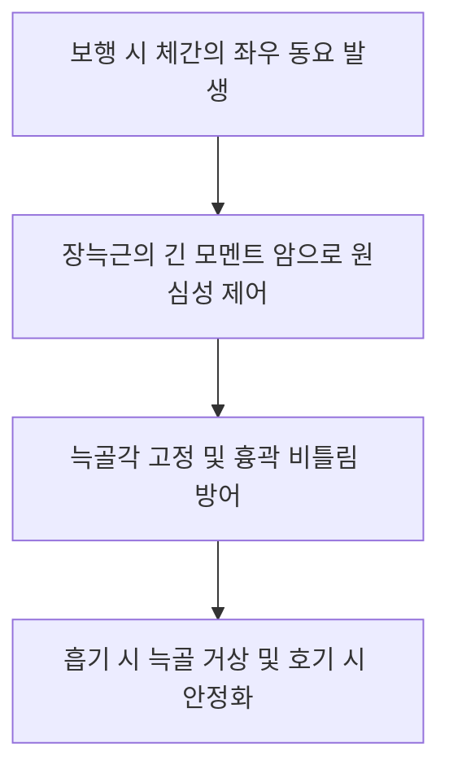

# [[장늑근]](Iliocostalis Muscle)

> **핵심 요약 (Key Summary)**:
> 천골, 장골능, 늑골각에서 기시하여 상부 늑골각과 경추 횡돌기에 정지하는 척주기립근 최외측 근육 기둥.
> 척추 신전, 동측 측굴, 회전 저항 및 늑골 가동성 제어를 주동하며 척수신경 후지(T1-L5)의 지배를 받음.
> 늑골 하강 제한으로 인한 얕은 흉식 호흡, 척추측만, 만성 등/허리 통증을 유발하며 방광경 2선 자침 및 늑골 가동 추나의 핵심 타깃임.

---
## 📌 목차
1. [해부학적 정밀 구조 및 지배 신경/혈관](#1-해부학적-정밀-구조-및-지배-신경혈관)
2. [생체역학·토크 분석 & 근막 사슬 (Biomechanical Synergy)](#2-생체역학토크-분석--근막-사슬-biomechanical-synergy)
3. [근막통증증후군(TP) & 연관통 패턴 (Travell & Simons)](#3-근막통증증후군tp--연관통-패턴-travell--simons)
4. [초음파 해부학(Sonoanatomy) 및 중재 시술 랜드마크](#4-초음파-해부학sonoanatomy-및-중재-시술-랜드마크)
5. [⭐ 원장님 심층 임상 고찰 및 원본 필기 (Clinical Pearls)](#5-원장님-심층-임상-고찰-및-원본-필기-clinical-pearls)
6. [관련 임상 질환 및 운동손상 증후군 총괄](#6-관련-임상-질환-및-운동손상-증후군-총괄)
7. [추나·도수치료(MET/PIR) & 침구·약침·재활 프로토콜](#7-추나도수치료metpir--침구약침재활-프로토콜)
8. [출처 및 학술 참고 문헌 (References)](#8-출처-및-학술-참고-문헌-references)

---
## 1. 해부학적 정밀 구조 및 지배 신경/혈관

| 분절 | 기시 (Origin) | 정지 (Insertion) | 신경 지배 |
| :--- | :--- | :--- | :--- |
| [[요장늑근]] (I. Lumborum) | 천골 후면, 장골능 후내순, 흉요근막 | 하부 제6~7개 늑골각 하연, 요추 횡돌기 | 척수신경 후지 외측지 (T7-L5) |
| [[흉장늑근]] (I. Thoracis) | 하부 제7~12늑골각 상연 | 상부 제1~6늑골각 하연, C7 횡돌기 | 척수신경 후지 외측지 (T1-T6) |
| [[경장늑근]] (I. Cervicis) | 제3~6늑골각 | 경추 C4~C6 횡돌기 후결절 | 척수신경 후지 외측지 (C4-C8) |

### 🔬 해부학 도해 및 단면도
![[Iliocostalis_anatomy.png|450]]
> [해부학 도해]: 장골에서 시작하여 늑골각을 계단식으로 연결하며 경추까지 올라가는 장늑근의 최외측 주행.

![[장늑근-20240727212153646.png|450]]
> [구조적 특징]: 척추 정중선에서 가장 멀리 떨어져 늑골과 척추의 측방 안정성을 담당하는 해부학적 위치.

---
## 2. 생체역학·토크 분석 & 근막 사슬 (Biomechanical Synergy)

* **최대 외측 모멘트 암 (Longest Moment Arm)**: 척추 회전 중심축에서 가장 멀리 위치하여 체간의 측굴(Lateral flexion) 및 회전 저항 토크가 척주기립근 중 가장 큼.
* **호흡 운동과의 기계적 연동**: 늑골각에 직접 부착되므로 근육이 경직되면 늑골의 상하 버킷 핸들(Bucket-handle) 운동을 방해하여 흉식 호흡 장애 유발.
* **근막 사슬 연계 (Anatomy Trains)**: 외측선(Lateral Line) 및 표재후방선(Superficial Back Line)과 흉요근막을 매개로 복사근군과 장력 교환.

---
## 3. 근막통증증후군(TP) & 연관통 패턴 (Travell & Simons)

* **요추부 발통점**: 둔부 중앙, 천장관절, 장골능 상연으로 방사하며 보행 시 허리 옆라인 통증.
* **흉추부 발통점**: 견갑골 외측연 및 액와부, 흉곽 전면으로 돌아 나오는 늑간통 모사.
* **경추부 발통점**: 경추 기저부 및 두통, 어깨 결림 동반.

---

![[Iliocostalis_lumborum_TriggerPoints.jpg|450]]
> [장늑근 발통점]: 늑골각 및 둔부 외측선으로 투사되는 Travell & Simons 연관통 패턴.

---
## 4. 초음파 해부학(Sonoanatomy) 및 중재 시술 랜드마크

* **초음파 스캔**: 늑골각 레벨에서 늑골 음영 바로 위에 위치한 장늑근 근복 확인.
* **자침 안전 마진**: 늑골 외측연 자침 시 늑간 공간으로 깊게 찌르면 흉막강 천공 위험이 있으므로 반드시 늑골 뼈 표면을 가이드로 삼아 수평 사자.

---
## 5. ⭐ 원장님 심층 임상 고찰 및 원본 필기 (Clinical Pearls)

* **자세 불균형과 얕은 호흡 증후군 (원장님 필기 100% 보존)**:
  * 장늑근의 단축 및 만성 과긴장은 늑골 하강과 확장을 제한하여 흉곽 확장을 방해하고 **얕은 호흡(Chest breathing)**을 유도함.
  * 숨을 깊이 들이마실 때 등 뒤쪽 갈비뼈가 결리고 숨이 끝까지 안 들어가는 환자는 장늑근 압통점을 박리해야 흉곽이 열림.
* **척추측만증(Scoliosis)에서의 비대칭성**:
  * 척추측만의 오목(Concave) 측 장늑근은 심하게 단축되어 섬유화되고, 볼록(Convex) 측은 과신장되어 허혈성 통증 호발.
* **골반 불균형과의 연계**:
  * 요장늑근은 장골능에 직접 붙으므로 골반 높낮이 차이(Pelvic obliquity)가 있을 때 요방형근과 함께 가장 먼저 과긴장되는 근육임.

---
## 6. 관련 임상 질환 및 운동손상 증후군 총괄

| 임상 질환 / 증후군 | 병리적 연관 기전 | 주요 증상 및 이학적 검사 | 핵심 교정 타깃 |
| :--- | :--- | :--- | :--- |
| [[늑간신경통]] 모사증 | 흉장늑근 TrP에 의한 늑골 방사통 | 심호흡 시 늑골 부위 찌릿한 통증 | 늑골각 부착부 소염 약침 |
| 얕은 호흡 증후군 | 장늑근 경직으로 늑골 가동성 저하 | 호흡 곤란감, 불안감, 만성 상부 등 결림 | 장늑근 근막 이완, 늑골 추나 |
| 만성 측요통 | 요장늑근 단축 및 골반 비대칭 | 보행 시 허리 외측선 결림, 장골능 통증 | 요장늑근 침도, 골반 교정 |
| [[척추측만증]] | 좌우 장늑근 장력 불균형 | 흉요추 측만 곡선, 양측 늑골 높이 차이 | 오목측 PIR 이완, 볼록측 강화 |

---
## 7. 추나·도수치료(MET/PIR) & 침구·약침·재활 프로토콜

* **한의학 경혈 매핑 및 침구 프로토콜**:
  * 방광경 2선: 부분(BL41), 백호(BL42), 고황(BL43), 신당(BL44), 격관(BL46), 혼문(BL47), 양강(BL48), 의사(BL49), 위창(BL50), 황문(BL51), 지실(BL52).
  * 늑골각 뼈 표면을 향해 15~30도 사자(절대 직자 금지).
* **근에너지기법 (MET/PIR)**:
  * 좌위에서 환자의 체간을 반대측으로 측굴 및 회전시킨 상태에서 동측 측굴 저항 7초 후, 호기와 함께 측방 신장.
* **늑골 가동 추나 (Rib Mobilization)**:
  * 앙와위/복와위에서 시술자의 손바닥으로 늑골각을 접촉하고 호기 시 전하방으로 흉곽 펌핑 유도.

---
## 8. 출처 및 학술 참고 문헌 (References)

1. **Bogduk, N.** (2005). *Clinical Anatomy of the Lumbar Spine and Sacrum*. Churchill Livingstone.
   - `[연구 요약]`: 장늑근의 늑골 부착부와 측방 안정화 모멘트 암 분석.
2. **Travell, J. G., & Simons, D. G.** (1999). *Myofascial Pain and Dysfunction*. Williams & Wilkins.
   - `[연구 요약]`: 장늑근 발통점의 늑간 및 복부 방사통 패턴 규명.
3. **Kendall, F. P., et al.** (2005). *Muscles: Testing and Function with Posture and Pain*. Lippincott Williams & Wilkins.
   - `[연구 요약]`: 척추측만증 및 골반 불균형 환자에서의 장늑근 역학 분석.
