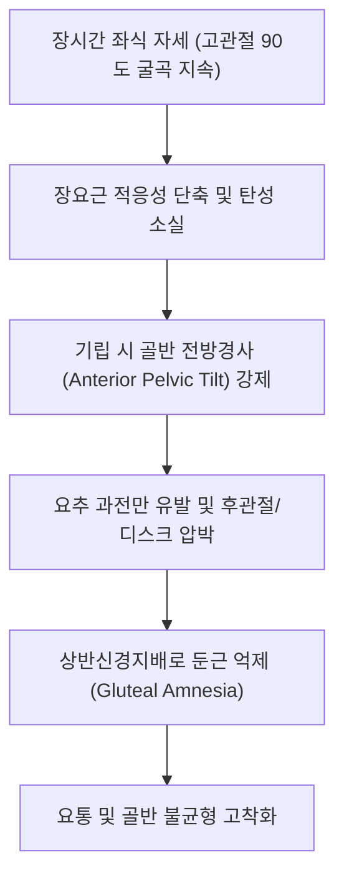

# [[장요근]](Iliopsoas Muscle)

> **핵심 요약 (Key Summary)**:
> [[흉추]] T12~[[요추]] L5 척추체와 [[장골와]]에서 기시하여 [[대퇴골]] 소전자에 정지하는 체간-하지 연결 핵심 복합근.
> 고관절 굴곡의 최우선 주동근이자 요추 전만각 및 골반 전방경사를 결정하며 [[대퇴신경]](L2-L4) 및 요추신경총의 지배를 받음.
> 좌식 생활로 인한 굴곡구축, [[장요근 증후군]], 요추 과전만 및 추간판 전단력 증가를 유발하며 고관절 신전 PIR과 심부 약침의 핵심 타깃임.

---
## 📌 목차
1. [해부학적 정밀 구조 및 지배 신경/혈관](#1-해부학적-정밀-구조-및-지배-신경혈관)
2. [생체역학·토크 분석 & 근막 사슬 (Biomechanical Synergy)](#2-생체역학토크-분석--근막-사슬-biomechanical-synergy)
3. [근막통증증후군(TP) & 연관통 패턴 (Travell & Simons)](#3-근막통증증후군tp--연관통-패턴-travell--simons)
4. [초음파 해부학(Sonoanatomy) 및 중재 시술 랜드마크](#4-초음파-해부학sonoanatomy-및-중재-시술-랜드마크)
5. [⭐ 원장님 심층 임상 고찰 및 원본 필기 (Clinical Pearls)](#5-원장님-심층-임상-고찰-및-원본-필기-clinical-pearls)
6. [관련 임상 질환 및 운동손상 증후군 총괄](#6-관련-임상-질환-및-운동손상-증후군-총괄)
7. [추나·도수치료(MET/PIR) & 침구·약침·재활 프로토콜](#7-추나도수치료metpir--침구약침재활-프로토콜)
8. [출처 및 학술 참고 문헌 (References)](#8-출처-및-학술-참고-문헌-references)

---
## 1. 해부학적 정밀 구조 및 지배 신경/혈관

| 항목 | [[대요근]] (Psoas Major) | [[장골근]] (Iliacus) |
| :--- | :--- | :--- |
| **기시 (Origin)** | T12~L5 추체 외측면, 추간판, 요추 횡돌기 | 장골와 상부 2/3, 내측 장골능, 천골 날개 |
| **정지 (Insertion)** | [[대퇴골]] 소전자 (장요근건 공유) | [[대퇴골]] 소전자 (대요근건 외측 합류) |
| **신경 지배** | [[요추신경총]](L1, L2, L3 전지 분지) | [[대퇴신경]](Femoral nerve, L2-L4 분지) |
| **혈관 공급** | 요동맥(Lumbar aa.), 장요동맥 요지 | 장요동맥 장골지, 심재대퇴회선동맥 |

### 🔬 해부학 도해 및 단면도
![[장요근-20240728010236544.png|450]]
> [도해 설명]: 대요근과 장골근이 서혜인대 심부의 근육열공(Lacuna musculorum)을 통과하여 대퇴골 소전자로 모여드는 해부학적 주행.

![[Psoas_major_anatomy.png|450]]
> [해부학적 단면]: 후복벽 요추체 외측에서 골반강을 가로질러 대퇴 전면으로 이어지는 주행 경로.

---
## 2. 생체역학·토크 분석 & 근막 사슬 (Biomechanical Synergy)

* **고관절 굴곡 1차 엔진**: 보행 유각기(Swing phase) 시작 시 대퇴를 전상방으로 견인하는 일차 구동력.
* **요추-골반 복합체(Lumbopelvic Complex) 안정화**: 양측 수축 시 직립 자세에서 체간 전후 흔들림을 통제하는 텐트 로프 역할.
* **근막 사슬 연계 (Anatomy Trains)**: 심부전방선(Deep Front Line)의 핵심 주축으로 횡격막 각(Crura)과 섬유성으로 연속되며, 족저근막에서부터 두개저까지 체간 중심축 긴장을 조절.

---
## 3. 근막통증증후군(TP) & 연관통 패턴 (Travell & Simons)

* **대요근 TP (요추부 및 서혜부)**:
  * 요추를 따라 동측으로 수직 주행하는 허리 통증(척추 기립선 외측).
  * 천장관절, 둔부 내측 및 서혜부 전면, 대퇴 전상부로 확산되는 뻐근한 심부통.
* **장골근 TP (서혜부 및 대퇴부)**:
  * 서혜인대 바로 아래 및 대퇴 전면 상부 1/3 영역에 집중되는 연관통.
  * 보행 시 고관절 신전 말기에 서혜부가 결리고 찢어질 듯한 통증 유발.
* **신경 포착 징후**: 대요근 근복 사이를 관통하는 [[음부대퇴신경]](Genitofemoral n.), 외측으로 빠져나오는 [[외측대퇴피신경]](Lateral femoral cutaneous n.), [[대퇴신경]] 압박으로 인한 서혜부 화끈거림 및 대퇴 전외측 이상감각.

---

![[Iliopsoas_TriggerPoints.jpg|450]]
> [장요근 발통점]: 요추 척추선 수직 방사통 및 서혜부, 대퇴 전면으로 투사되는 Travell & Simons 연관통 패턴.

---
## 4. 초음파 해부학(Sonoanatomy) 및 중재 시술 랜드마크

* **초음파 스캔 뷰 (Short-axis Scan)**:
  * 서혜인대 레벨: 대퇴동맥(FA) 외측, 대퇴신경(FN) 심부에 위치한 타원형의 고에코 장요근건 및 저에코 근복 확인.
  * 요추 레벨 (L3-L4 단축 뷰): 요추 횡돌기와 추체 사이에서 요신경총 분지들이 위치하는 대요근 구획(Psoas compartment) 관찰.
* **안전 마진 및 위험 구조물 회피**:
  * 전방 접근: 복막(Peritoneum), 대퇴동정맥 회피 필수.
  * 후방 접근: 신장 하극(Kidney lower pole) 및 상행/하행 결장 천공 주의.

---
## 5. ⭐ 원장님 심층 임상 고찰 및 원본 필기 (Clinical Pearls)

* **좌식 생활과 굴곡구축의 임상적 실체**:
  * 의자에 오래 앉아 있는 현대인의 장요근은 항상 90도로 접혀 단축 상태를 학습함.
  * 일어설 때 대퇴골이 바닥을 향해 내려가면서 단축된 장요근이 요추와 골반을 전하방으로 강하게 잡아당김.
  * 그 결과 **일어설 때 허리가 바로 펴지지 않고 한참 동안 엉거주춤 굽힌 채 걷는 현상** 발생.
* **척추전방전위증 환자에서의 치명적 위험**:
  * 대요근이 과긴장되면 요추 추체를 앞쪽으로 잡아당기는 전방 전단력(Shear force)이 극대화됨.
  * L4-L5 전방전위증 환자에게 복근 운동(윗몸일으키기 등)을 무리하게 시키면 대요근이 먼저 수축하여 전위가 악화되고 극심한 방사통을 유발함.
* **대요근 vs 대퇴근막장근(TFL) 보상 기전 감별**:
  * 앙와위에서 고관절을 굴곡시킬 때 순수한 시상면 굴곡이 나오지 않고 발이 바깥쪽으로 벌어지거나 대퇴가 외회전/외전되면 대요근 억제 및 TFL/봉공근의 대리 보상 활성화로 진단.

---
## 6. 관련 임상 질환 및 운동손상 증후군 총괄

| 임상 질환 / 증후군 | 병리적 연관 기전 | 주요 증상 및 이학적 검사 | 핵심 교정 타깃 |
| :--- | :--- | :--- | :--- |
| [[장요근 증후군]] | 장요근 과긴장 및 점액낭염 | 서혜부 통증, 고관절 신전 제한, [[토마스 검사]] 양성 | 장요근건 PIR, 초음파 유도하 약침 |
| [[골반 전방경사]] | 장요근 단축 및 대둔근 약화 | 하부 교차 증후군, 요추 과전만, 둔부 처짐 | 장요근 이완 및 [[대둔근]] 강화 짝힘 재교육 |
| [[척추전방전위증]] | 대요근의 요추 전방 전단력 | 기립 시 요통 악화, 신전 시 척추 전방 미끄러짐 | 대요근 이완, 복횡근 중심 코어 안정화 |
| 고관절 충돌 증후군 | 대퇴골두 전방 활주 제어 실패 | 고관절 심굴곡 시 서혜부 전면 찝힘(Pincer/Cam) | 장요근 후방 활주 유도 추나, 장골근 자침 |

---
## 7. 추나·도수치료(MET/PIR) & 침구·약침·재활 프로토콜

* **한의학 경혈 매핑 및 자침 프로토콜**:
  * 복모혈 기해(CV6), 관원(CV4) 외측의 비경 기충(ST30), 충문(SP12), 부사(SP13)에서 서혜인대 직하방 장요근 부착부 사자.
  * 요추부에서는 대장수(BL25), 관원수(BL26) 외측 3.5~4촌 지점에서 횡돌기 전외측을 향해 심부 자입.
* **근에너지기법 (MET/PIR)**:
  * 환자를 베드 끝에 걸터앉히고 편측 고관절을 굴곡시켜 흉부에 밀착(Thomas 자세).
  * 검사 측 하지를 베드 아래로 하수시킨 상태에서 환자에게 가벼운 고관절 굴곡 힘(20% 힘)을 7~10초간 요구한 후, 호기와 함께 고관절 신전을 유도하여 심부 신장.
* **신경 포착 해소**: 외측대퇴피신경 및 대퇴신경 포착 부위인 ASIS 내하측 근육열공 주변에 소염 약침 주입.

---
## 8. 출처 및 학술 참고 문헌 (References)

1. **Bogduk, N., Pearcy, M., & Hadfield, G.** (1992). Anatomy and biomechanics of psoas major. *Clinical Biomechanics*, 7(2), 109-119.
   - `[연구 요약]`: 대요근의 기시 분절별 모멘트 암 분석을 통해 순수 요추 굴곡근이 아닌 요추-골반 수직 압축 및 안정화 기전 규명.
2. **Travell, J. G., & Simons, D. G.** (1999). *Myofascial Pain and Dysfunction: The Trigger Point Manual* (Vol. 2). Williams & Wilkins.
   - `[연구 요약]`: 장요근 복합체의 발통점 위치 및 요추 수직선, 서혜부, 대퇴 전면으로 방사하는 연관통 경로 정립.
3. **McGill, S. M.** (2007). *Low Back Disorders: Evidence-Based Prevention and Rehabilitation*. Human Kinetics.
   - `[연구 요약]`: 윗몸일으키기 동작 시 장요근 활성화에 따른 요추 압박력(over 3000N) 측정 및 대체 코어 운동(Curl-up) 제시.
