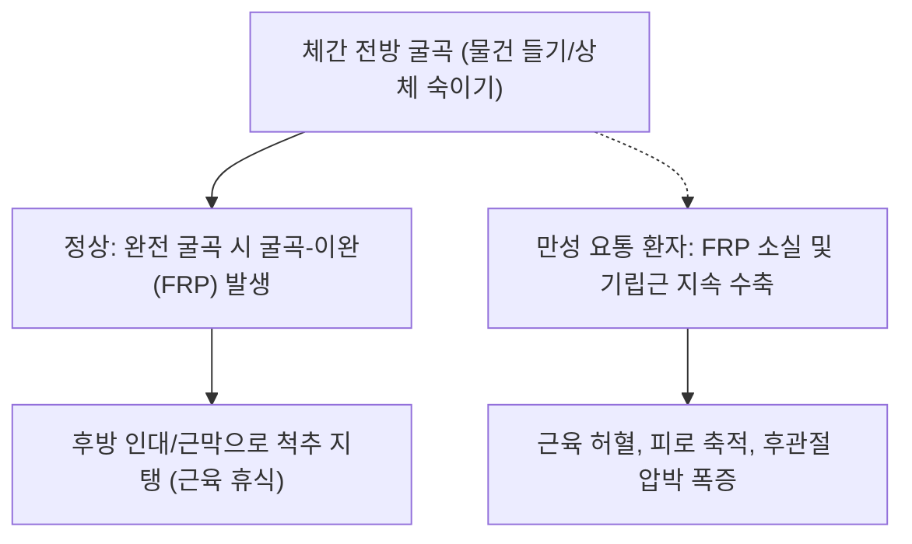

# [[척주기립근]](Erector Spinae)

> **핵심 요약 (Key Summary)**:
> 천골 후면, 장골능, 흉요근막에서 기시하여 늑골과 척추 횡돌기, 극돌기를 잇는 3대 세로 기둥(장늑근-최장근-극근) 근육군.
> 척추의 신전, 측굴, 기립 자세 유지를 주동하며 척수신경 후지(Dorsal rami)의 분절별 신경 지배를 받음.
> 굴곡-이완 현상(FRP) 소실, 만성 요배통, 일자허리 및 척추 피로 증후군을 초래하며 방광경 유혈 배혈 및 척추 신전 재활의 핵심 타깃임.

---
## 📌 목차
1. [해부학적 정밀 구조 및 지배 신경/혈관](#1-해부학적-정밀-구조-및-지배-신경혈관)
2. [생체역학·토크 분석 & 근막 사슬 (Biomechanical Synergy)](#2-생체역학토크-분석--근막-사슬-biomechanical-synergy)
3. [근막통증증후군(TP) & 연관통 패턴 (Travell & Simons)](#3-근막통증증후군tp--연관통-패턴-travell--simons)
4. [초음파 해부학(Sonoanatomy) 및 중재 시술 랜드마크](#4-초음파-해부학sonoanatomy-및-중재-시술-랜드마크)
5. [⭐ 원장님 심층 임상 고찰 및 원본 필기 (Clinical Pearls)](#5-원장님-심층-임상-고찰-및-원본-필기-clinical-pearls)
6. [관련 임상 질환 및 운동손상 증후군 총괄](#6-관련-임상-질환-및-운동손상-증후군-총괄)
7. [추나·도수치료(MET/PIR) & 침구·약침·재활 프로토콜](#7-추나도수치료metpir--침구약침재활-프로토콜)
8. [출처 및 학술 참고 문헌 (References)](#8-출처-및-학술-참고-문헌-references)

---
## 1. 해부학적 정밀 구조 및 지배 신경/혈관

| 근육 기둥 | 구성 분절 (외측 → 내측) | 주요 부착부 (기시 → 정지) | 역학적 특징 |
| :--- | :--- | :--- | :--- |
| [[장늑근]] (Iliocostalis) | [[요장늑근]], 흉장늑근, 경장늑근 | 천골/장골능 → 늑골각 및 경추 횡돌기 | 최대 측방 모멘트 암, 측굴·회전 저항 |
| [[최장근]] (Longissimus) | [[흉최장근]], 경최장근, 두최장근 | 천골/요추 횡돌기 → 흉요추 횡돌기, 유양돌기 | 최대 근육 볼륨, 강력한 척추 신전 주동 |
| [[극근]] (Spinalis) | 흉극근, 경극근, 두극근 | 하부 극돌기 → 상부 극돌기 | 최내측 주행, 척추 시상면 전만 유지 |

### 🔬 해부학 도해 및 단면도
![[Longissimus_anatomy.png|450]]
> [해부학 도해]: 천골에서 두개저까지 척추 기둥을 따라 평행하게 뻗어 있는 척주기립근 3대 기둥.

![[Iliocostalis_anatomy.png|450]]
> [외측 기둥]: 장골능에서 늑골각으로 이어지는 장늑근의 계단식 분절 주행.

---
## 2. 생체역학·토크 분석 & 근막 사슬 (Biomechanical Synergy)

* **항중력 척추 신전 모멘트**: 직립 시 체간 중력 중심선(전방 편향)에 대항하여 지속적인 신전 토크를 발생시키는 인체 최대의 항중력 근육군.
* **굴곡-이완 현상(Flexion-Relaxation Phenomenon: FRP)**: 상체를 완전히 숙였을 때 정상적으로는 기립근 근전도 신호가 꺼지며 흉요근막과 후방 인대로 체중을 지탱하지만, 요통 환자는 이 기전이 파괴되어 만성 피로 발생.
* **근막 사슬 연계 (Anatomy Trains)**: 표재후방선(Superficial Back Line)의 핵심 축으로 족저근막, 비복근, 햄스트링, 천결절인대, 모상건막과 연속된 장력선 형성.

---
## 3. 근막통증증후군(TP) & 연관통 패턴 (Travell & Simons)

* **요추부 기립근 TrP**:
  * 척추 기립선을 따라 둔부 및 천장관절, 천골 후면으로 방사하는 묵직한 통증.
  * 아침에 일어날 때 허리가 굳어 펴지지 않고, 한동안 움직여야 부드러워짐.
* **흉추부 기립근 TrP**:
  * 견갑골 사이 능형근 부위 및 늑골을 따라 앞가슴으로 뻗어 나가는 담결림 통증(협심통 모사).

---

![[Longissimus_thoracis_TriggerPoints.jpg|450]]
> [척주기립근 발통점]: 요천추부 및 둔부 상부, 척추 기립선을 따라 투사되는 Travell & Simons 연관통 패턴.

---
## 4. 초음파 해부학(Sonoanatomy) 및 중재 시술 랜드마크

* **초음파 스캔 랜드마크 (요추 후방 횡단 뷰)**:
  * 요추 극돌기(고에코 그림자) 외측에서 다열근(심부)을 덮고 있는 거대한 척주기립근 근복 관찰.
  * 흉요근막 후엽(과에코 선) 바로 아래에서 최장근과 장늑근의 근막 경계 확인.
* **자침 안전 마진**: 흉추부 자침 시 늑간 공간으로 깊게 찌르면 기흉 위험이 있으므로 항상 늑골 뼈 표면을 가이드 삼아 사자.

---
## 5. ⭐ 원장님 심층 임상 고찰 및 원본 필기 (Clinical Pearls)

* **굴곡-이완 현상(FRP) 소실과 만성 요배통 (원장님 필기 100% 보존)**:
  * 만성 요통 환자는 허리를 숙일 때 기립근이 이완되지 않고 끝까지 뻣뻣하게 버팀. 이는 척추 분절 불안정성을 표층 대근육으로 억지로 틀어막으려는 보상 작용임.
  * 기립근만 마사지하거나 풀어주면 일시적으로 시원하지만 오히려 척추가 더 덜컹거리므로, 심부 [[다열근]]과 [[복횡근]]을 먼저 강화해야 기립근이 스스로 이완됨.
* **일자허리(Flat Back) 환자에서의 기립근 피로**:
  * 정상 요추 전만이 소실된 일자허리 환자는 척주기립근이 항상 과도한 신장성 수축(Eccentric contraction) 상태에 놓여 근막 섬유화와 허혈성 통증이 만성화됨.
* **방광경 배수혈 자침의 핵심 원리**:
  * 척추 극돌기 외측 1.5촌(내측선: 최장근 라인)과 3촌(외측선: 장늑근 라인)은 척수신경 후지 내측지와 외측지가 분포하는 자리임.
  * 심부 자침 시 척수분절 반사를 통해 척추 주위 근긴장 완화 및 내장기 기능 동시 조절.

---
## 6. 관련 임상 질환 및 운동손상 증후군 총괄

| 임상 질환 / 증후군 | 병리적 연관 기전 | 주요 증상 및 이학적 검사 | 핵심 교정 타깃 |
| :--- | :--- | :--- | :--- |
| 만성 근근막성 요통 | 기립근 지속 과긴장 및 TrP 형성 | 아침 기립 시 요배통, 허리 젖힘 제한 | 방광경 배수혈 심부 침도, 전침 |
| [[요추 만곡 소실]](일자허리) | 기립근 만성 피로 및 요추 전만 소실 | 오래 서 있거나 걸을 때 허리 묵직함 | 요추 전만 회복 추나, 맥켄지 신전 |
| 척추 피로 증후군 | 기립근 지구력 저하 및 허혈성 통증 | 오후가 되면 허리가 끊어질 듯 피로 | 척추 신전 지구력 재활(Bird-Dog) |
| [[척추측만증]] | 좌우 기립근 불균형 단축/신장 | 늑골 돌출(Rib hump), 척추 비대칭 | 볼록측 강화 및 오목측 근막 박리 |

---
## 7. 추나·도수치료(MET/PIR) & 침구·약침·재활 프로토콜

* **한의학 경혈 매핑 및 침구 프로토콜**:
  * 방광경 1선: 간수(BL18), 담수(BL19), 비수(BL20), 위수(BL21), 신수(BL23), 기해수(BL24), 대장수(BL25).
  * 방광경 2선: 백황(BL51), 지실(BL52).
  * 0.30×60mm 침을 사용하여 척추체를 향해 45도 내하방 사자.
* **근에너지기법 (MET/PIR)**:
  * 환자를 좌위 또는 앙와위에서 고관절과 척추를 최대로 굴곡시킨 상태에서 가벼운 신전 저항 7초 후, 호기와 함께 굴곡 각도 증진.
* **재활 훈련 (McGill Bird-Dog & Roman Chair Back Extension)**:
  * 척추 과신전을 피하고 중립을 유지한 채 둔근과 척주기립근을 동시에 강화.

---
## 8. 출처 및 학술 참고 문헌 (References)

1. **McGill, S. M.** (2007). *Low Back Disorders: Evidence-Based Prevention and Rehabilitation*. Human Kinetics.
   - `[연구 요약]`: 척주기립근의 생체역학적 부하 및 굴곡-이완 현상(FRP)의 메커니즘과 코어 운동 프로토콜 분석.
2. **Bogduk, N.** (2005). *Clinical Anatomy of the Lumbar Spine and Sacrum*. Churchill Livingstone.
   - `[연구 요약]`: 척주기립근 3대 기둥의 분절별 부착부와 척수신경 후지 지배 해부학 규명.
3. **Travell, J. G., & Simons, D. G.** (1999). *Myofascial Pain and Dysfunction*. Williams & Wilkins.
   - `[연구 요약]`: 요흉부 기립근 발통점이 천골, 둔부, 복부 및 서혜부로 방사하는 연관통 경로 정립.
