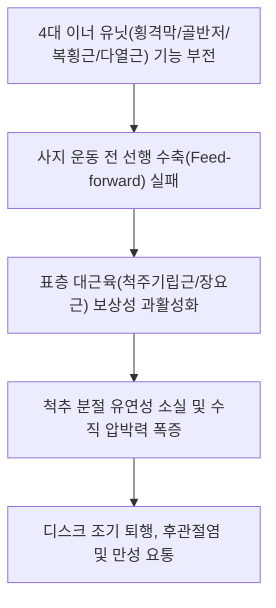

# [[코어 근육]](Core Musculature)

> **핵심 요약 (Key Summary)**:
> [[횡격막]](천장), [[골반저근]](바닥), [[복횡근]](벽), [[다열근(요부)]](후벽)의 4대 이너 유닛(Inner Unit)으로 구성된 인체 체간 중심 실린더.
> 복강 내압(IAP) 형성, 척추 전방 전단력 차단 및 사지 운동 시 선제적 안정화(Feed-forward)를 주동하며 체간 신경근의 유기적 지배를 받음.
> 코어 붕괴로 인한 표층 기립근 보상 과긴장, 만성 요통, 디스크 탈출증을 유발하며 호흡 기반 재활 및 McGill 코어 훈련의 총괄 타깃임.

---
## 📌 목차
1. [해부학적 정밀 구조 및 지배 신경/혈관](#1-해부학적-정밀-구조-및-지배-신경혈관)
2. [생체역학·토크 분석 & 근막 사슬 (Biomechanical Synergy)](#2-생체역학토크-분석--근막-사슬-biomechanical-synergy)
3. [근막통증증후군(TP) & 연관통 패턴 (Travell & Simons)](#3-근막통증증후군tp--연관통-패턴-travell--simons)
4. [초음파 해부학(Sonoanatomy) 및 중재 시술 랜드마크](#4-초음파-해부학sonoanatomy-및-중재-시술-랜드마크)
5. [⭐ 원장님 심층 임상 고찰 및 원본 필기 (Clinical Pearls)](#5-원장님-심층-임상-고찰-및-원본-필기-clinical-pearls)
6. [관련 임상 질환 및 운동손상 증후군 총괄](#6-관련-임상-질환-및-운동손상-증후군-총괄)
7. [추나·도수치료(MET/PIR) & 침구·약침·재활 프로토콜](#7-추나도수치료metpir--침구약침재활-프로토콜)
8. [출처 및 학술 참고 문헌 (References)](#8-출처-및-학술-참고-문헌-references)

---
## 1. 해부학적 정밀 구조 및 지배 신경/혈관

| 이너 유닛 구획 | 대표 근육 | 해부학적 위치 및 역할 | 지배 신경 |
| :--- | :--- | :--- | :--- |
| **천장 (Roof)** | [[횡격막]] (Diaphragm) | 흉곽 하구 폐쇄, 호흡 펌프 및 상부 복압 제어 | [[횡격막신경]](Phrenic n., C3-C5) |
| **바닥 (Floor)** | [[골반저근]] (Pelvic Floor) | 골반 출구 폐쇄, 내장기 지지 및 하부 복압 지탱 | [[음부신경]](Pudendal n., S2-S4) |
| **전·측벽 (Walls)** | [[복횡근]] (Transversus Abdominis) | 흉요근막과 백선을 연결하는 수평 코르셋 | 하부 [[갈비사이신경]](T7-T12), [[장골하복신경]](L1) |
| **후벽 (Back)** | [[다열근(요부)]] (Lumbar Multifidus) | 요추 횡돌기와 극돌기를 분절별로 잠그는 빗장 | [[척수신경 후지]](Dorsal rami) 내측지 |

### 🔬 해부학 도해 및 단면도
![[Transversus_abdominis_anatomy.png|450]]
> [전측벽 코르셋]: 흉요근막과 결합하여 척추 둘레를 360도로 감싸는 복횡근의 수평 주행.

![[Pelvic_floor_anatomy.png|450]]
> [하부 바닥 돔]: 골반 장기를 받치며 복압의 하방 누수를 차단하는 골반저근의 플랫폼.

---
## 2. 생체역학·토크 분석 & 근막 사슬 (Biomechanical Synergy)

* **유압 증폭기 메커니즘 (Hydraulic Amplifier Model)**:
  * 4대 이너 유닛이 동시에 수축하면 닫힌 원통형 복강 내에 유압(IAP)이 형성되어 요추 추간판에 가해지는 축성 하중을 30~50% 직접 경감.
* **선제적 분절 안정화 (Feed-Forward Stabilization)**:
  * 뇌에서 팔다리를 움직이기 30~50ms 전에 코어 실린더를 먼저 조여 척추의 미세 흔들림과 전방 전단력을 선제적으로 방어.
* **아우터 유닛(Outer Unit)과의 연계**:
  * 전방 사선 사슬(AOS), 후방 사선 사슬(POS), 측면 사슬(LS), 심부 세로 사슬(DLS)의 파워를 안정적으로 지지하는 베이스캠프 역할.

---
## 3. 근막통증증후군(TP) & 연관통 패턴 (Travell & Simons)

* **코어 부전 환자의 전형적 통증**:
  * 특정 한 지점의 통증보다는 "허리 전체가 끊어질 것 같다", "오래 서 있거나 걸으면 허리가 굳어서 펴지지 않는다"는 광범위한 피로성 요배통 호소.
* **표층 보상근의 2차성 발통점**:
  * 코어가 풀리면서 과부하를 떠안은 [[요방형근]], [[장요근]], [[흉최장근]]에 다발성 발통점 발생.

---

![[Quadratus_lumborum_TriggerPoints.jpg|450]]
> [코어 기능부전 보상 발통점]: 4대 이너 유닛 약화 시 과부하가 걸리는 요방형근 및 기립근의 발통점 패턴.

---
## 4. 초음파 해부학(Sonoanatomy) 및 중재 시술 랜드마크

* **실시간 초음파 바이오피드백 (RUSI)**:
  * 측복벽에서 복횡근의 수축 두께 변화율 관찰.
  * 요추 후방에서 다열근의 단면적 증가율 측정.
  * 환자가 호흡할 때 코어 근육이 정상적으로 두꺼워지는지 시각적으로 확인하며 운동 지도.

---
## 5. ⭐ 원장님 심층 임상 고찰 및 원본 필기 (Clinical Pearls)

* **코어 시스템 붕괴의 악순환 (원장님 필기 100% 보존)**:
  * 네 근육 중 하나라도 약화되거나 타이밍이 어긋나면(예: 만성 요통으로 다열근 위축 또는 얕은 흉식 호흡으로 횡격막 경직), 표층 기립근([[최장근]], [[요장늑근]])이 보상적으로 과활성화되어 허리가 굳고 통증이 만성화됨.
  * 따라서 요통 치료의 핵심은 뭉친 겉근육을 풀어주는 동시에, 꺼져 있는 심부 코어 4인방을 다시 켜는(Re-activation) 신경근 재교육임.
* **플랭크(Plank)의 오용과 브레이싱 vs 드로잉 인**:
  * 허리가 아픈 환자에게 무작정 고강도 플랭크를 시키면 겉근육만 더 굳어 디스크가 악화됨.
  * 처음에는 앙와위에서 호흡과 함께 배꼽을 당기는 드로잉 인(Drawing-in)으로 복횡근을 깨운 뒤, 점진적으로 브레이싱(Bracing)으로 넘어가야 함.
* **골반저근과 횡격막의 호흡 피스톤 커플링**:
  * 횡격막이 내려갈 때 골반저근도 부드럽게 늘어나며 내려가고, 숨을 내쉴 때 함께 올라와야 완벽한 복압 조절이 가능함. 횡격막을 풀지 않고 골반저근만 조이면 복압 불균형으로 탈장이 올 수 있음.

---
## 6. 관련 임상 질환 및 운동손상 증후군 총괄

| 임상 질환 / 증후군 | 병리적 연관 기전 | 주요 증상 및 이학적 검사 | 핵심 교정 타깃 |
| :--- | :--- | :--- | :--- |
| 만성 난치성 요통 | 코어 실린더 붕괴로 요추 전단력 누적 | 동작 시작 시 요통, 자세 유지 피로 | 4대 이너 코어 활성화 재활 |
| [[요추 추간판 탈출증]] | 코어 감압 부전으로 디스크 과부하 | 방사통, 하지 거상 제한, 굴곡 악화 | McGill Big 3, 복강내압 안정화 |
| 척추전방전위증 | 다열근/복횡근 지지력 상실 | 기립 시 요추 미끄러짐, 신전통 | 골반 후방경사 및 코어 등척성 강화 |
| 산후 체간 불균형 | 복직근 이개 및 골반저 이완 | 보행 시 골반 흔들림, 요실금 | 횡격막-복횡근-골반저 협응 호흡 |

---
## 7. 추나·도수치료(MET/PIR) & 침구·약침·재활 프로토콜

* **한의학 경혈 매핑 및 침구 프로토콜**:
  * 복부: 중완(CV12), 기해(CV6), 관원(CV4), 대횡(SP15).
  * 요배부: 신수(BL23), 대장수(BL25), 요부 화타협척혈(EX-B2).
  * 횡격막: 거궐(CV14), 일월(GB24), 기문(LR14).
  * 골반저: 회음(CV1), 장강(GV1), 차료(BL32).
* **호흡 기반 코어 통합 도수치료**:
  * 횡격막 도수 이완 후 늑골-골반 간 피스톤 호흡 유도.
* **McGill Big 3 재활 프로토콜**:
  * Curl-up(복직근/복횡근), Side Plank(요방형근/외복사근), Bird-Dog(다열근/기립근/둔근)을 매일 처방하여 척추 압박 없는 안전한 코어 구축.

---
## 8. 출처 및 학술 참고 문헌 (References)

1. **Richardson, C. A., et al.** (1999). *Therapeutic Exercise for Spinal Segmental Stabilization in Low Back Pain*. Churchill Livingstone.
   - `[연구 요약]`: 4대 이너 코어 근육의 협동 수축과 척추 분절 안정화 치료학의 학술적 기반 정립.
2. **McGill, S. M.** (2015). *Low Back Disorders: Evidence-Based Prevention and Rehabilitation* (3rd ed.). Human Kinetics.
   - `[연구 요약]`: 코어 브레이싱의 척추 보호 메커니즘과 McGill Big 3 운동의 생체역학적 우수성 입증.
3. **Hodges, P. W., & Gandevia, S. C.** (2000). Changes in intra-abdominal pressure during postural and respiratory activation of the human diaphragm. *Journal of Applied Physiology*, 89(3), 967-976.
   - `[연구 요약]`: 횡격막의 호흡 및 자세 안정화 이중 기능과 복강 내압 형성 기전 규명.
