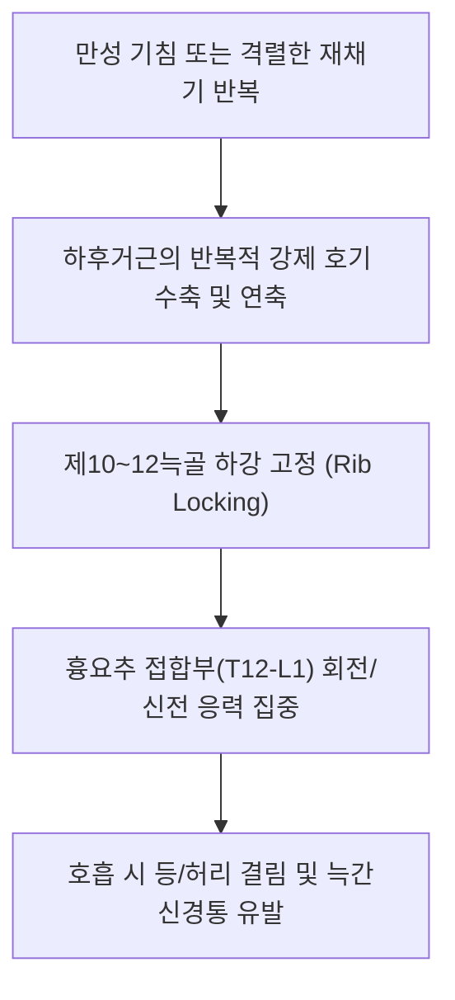

# [[하후거근]](Serratus Posterior Inferior)

> **핵심 요약 (Key Summary)**:
> [[흉추]] T11~[[요추]] L2 극돌기 및 [[흉요근막]]에서 기시하여 하부 제9~12[[늑골]] 하연 외측부에 정지하는 흉요추 접합부 사선 근육.
> 하부 늑골 하강, 강제 호기 보조, 횡격막 수축 시 제12늑골 고정을 주동하며 제9~12 [[갈비사이신경]](T9-T12)의 지배를 받음.
> 만성 기침 시 등 통증, TLJ 증후군, 늑간신경통을 초래하며 광배근 심층 촉진 및 늑골각 침도의 핵심 타깃임.

---
## 📌 목차
1. [해부학적 정밀 구조 및 지배 신경/혈관](#1-해부학적-정밀-구조-및-지배-신경혈관)
2. [생체역학·토크 분석 & 근막 사슬 (Biomechanical Synergy)](#2-생체역학토크-분석--근막-사슬-biomechanical-synergy)
3. [근막통증증후군(TP) & 연관통 패턴 (Travell & Simons)](#3-근막통증증후군tp--연관통-패턴-travell--simons)
4. [초음파 해부학(Sonoanatomy) 및 중재 시술 랜드마크](#4-초음파-해부학sonoanatomy-및-중재-시술-랜드마크)
5. [⭐ 원장님 심층 임상 고찰 및 원본 필기 (Clinical Pearls)](#5-원장님-심층-임상-고찰-및-원본-필기-clinical-pearls)
6. [관련 임상 질환 및 운동손상 증후군 총괄](#6-관련-임상-질환-및-운동손상-증후군-총괄)
7. [추나·도수치료(MET/PIR) & 침구·약침·재활 프로토콜](#7-추나도수치료metpir--침구약침재활-프로토콜)
8. [출처 및 학술 참고 문헌 (References)](#8-출처-및-학술-참고-문헌-references)

---
## 1. 해부학적 정밀 구조 및 지배 신경/혈관

| 항목 | 상세 내용 |
| :--- | :--- |
| **기시 (Origin)** | [[흉추]] T11~[[요추]] L2 [[극돌기]](Spinous processes), 극간인대 및 [[흉요근막]](TLF) 건막 |
| **정지 (Insertion)** | 하부 제9~12[[늑골]](Ribs) 하연 외측부 (상외측 사선 주행) |
| **신경 지배** | 제9~12 [[갈비사이신경]](Intercostal nn., T9-T12) 전지 및 늑하신경(Subcostal n., T12) |
| **혈관 공급** | 하부 후륵간동맥(Posterior intercostal aa.), 요동맥 상부 분지 |

### 🔬 해부학 도해 및 단면도
![[Serratus_posterior_inferior_anatomy.png|450]]
> [해부학 도해]: 흉요추 이행부에서 상외측으로 부채꼴 모양으로 뻗어 하부 4개 늑골에 부착하는 하후거근.

![[Pasted image 20240116141248 1.png|481]]
> [구조적 특징]: 표층 광배근의 심층, 심부 척추기립근(최장근/장늑근)의 천층을 사선으로 가로지르는 층판 구조.

---
## 2. 생체역학·토크 분석 & 근막 사슬 (Biomechanical Synergy)

* **강제 호기 늑골 하강 (Forced Expiration)**: 기침, 재채기, 트럼펫 연주 등 강하게 숨을 토해낼 때 하부 늑골을 아래와 안쪽으로 당겨 흉곽을 압축.
* **횡격막의 닻(Anchor) 역할**: 흡기 시 [[횡격막]]이 수축하여 중심건을 내릴 때 제12늑골이 위로 딸려 올라가지 않도록 [[요방형근]]과 함께 아래에서 단단히 고정.
* **근막 사슬 연계 (Anatomy Trains)**: 기능선(Functional Line) 및 나선선(Spiral Line)의 배측 교차점으로 광배근과 흉요근막을 매개로 연결.

---
## 3. 근막통증증후군(TP) & 연관통 패턴 (Travell & Simons)

* **발통점 위치**: 제10~12늑골 하연, 척추기립근 외측 가장자리와 만나는 근복 부위.
* **연관통 방사**:
  * 하부 흉추에서 요추 상부, 제10~12늑골을 따라 앞쪽 옆구리로 돌아 나오는 뻐근한 통증.
  * 기침을 세게 하거나 깊은 숨을 내쉴 때 등 뒤쪽 갈비뼈가 결리는 통증.

---

![[Serratus_posterior_inferior_TriggerPoints.jpg|450]]
> [하후거근 발통점]: 제9~12늑골 및 흉요추 접합부를 따라 앞쪽 옆구리로 돌아 나오는 Travell & Simons 연관통 패턴.

---
## 4. 초음파 해부학(Sonoanatomy) 및 중재 시술 랜드마크

* **초음파 단축 뷰**:
  * T12-L1 레벨 늑골각 횡단 스캔.
  * 표층의 광배근(얇은 저에코 판) → **하후거근(중간 저에코 띠)** → 기립근(심부 두꺼운 근복)의 3층 샌드위치 구조 식별.
* **자침 안전 마진**: 늑골 하단에는 폐 늑막동(Costodiaphragmatic recess)이 인접하므로 늑골 뼈 표면을 향해 15도 평행 사자 필수.

---
## 5. ⭐ 원장님 심층 임상 고찰 및 원본 필기 (Clinical Pearls)

* **기침 시 등 통증 메커니즘 (원장님 필기 100% 보존)**:
  * 만성 기침 환자나 흡연자에서 하후거근이 과사용되어 경직되면, 기침할 때마다 제10~12늑골 부착부에서 강한 견인통이 발생함.
  * 환자들은 "기침할 때마다 등이 울리고 결린다"고 호소하며, 단순 요통으로 오진하기 쉬움.
* **TLJ(흉요추 접합부) 층판 해부학 노하우 (원장님 팁)**:
  * 광배근을 젖히면 바로 하후거근이 나오고, 그 아래 기립근과 다열근이 위치함을 반드시 기억해야 함.
  * 흉요추 이행부(T12-L1)는 회전 운동이 일어나는 흉추와 회전이 불가능한 요추가 만나는 관절학적 취약 지점이므로, 하후거근의 비대칭 긴장이 TLJ 증후군을 촉발함.
* **요방형근과의 감별 및 협력**:
  * 제12늑골 하연에서는 하후거근(상방 주행)과 요방형근(하방 주행)이 서로 반대 방향으로 늑골을 당김. 두 근육의 장력 균형이 깨지면 늑골이 비틀리며 만성 옆구리 통증 발생.

---
## 6. 관련 임상 질환 및 운동손상 증후군 총괄

| 임상 질환 / 증후군 | 병리적 연관 기전 | 주요 증상 및 이학적 검사 | 핵심 교정 타깃 |
| :--- | :--- | :--- | :--- |
| [[하후거근 증후군]] | 하후거근 발통점 및 늑골 부착부 건염 | 기침/호흡 시 등 하부 결림, 늑골 압통 | 하후거근 압통점 침도, 온열 요법 |
| [[TLJ 증후군]] | 흉요추 이행부 기능부전 및 T12 신경 자극 | 장골능 상연 통증, 서혜부 가성 방사통 | TLJ 분절 추나 교정, 하후거근 이완 |
| 늑간신경통 모사증 | T11-T12 늑간신경 통로 주변 근막 유착 | 늑골 주행을 따른 편측 찌릿한 통증 | 늑간신경 분지 주변 약침 치료 |
| 흉곽 호기 부전 | 하후거근 연축으로 늑골 하강 고정 | 끝까지 숨을 내쉬지 못함, 흉곽 뻣뻣함 | 늑골 가동 도수, 호흡 재교육 |

---
## 7. 추나·도수치료(MET/PIR) & 침구·약침·재활 프로토콜

* **한의학 경혈 매핑 및 침구 프로토콜**:
  * 방광경 위창(BL50), 황문(BL51), 지실(BL52), 삼초수(BL22), 신수(BL23).
  * 0.25×40mm 침을 사용하여 늑골 주행 방향(상외측)으로 15~30도 사자.
* **근에너지기법 (MET/PIR)**:
  * 좌위에서 환자의 체간을 최대로 신전+흡기 유도 상태에서 하후거근의 수축 저항 후, 호기와 함께 굴곡 스트레칭.
* **TLJ 분절 추나 (Thoracolumbar Junction Manipulation)**:
  * 앙와위 또는 복와위에서 T12-L1 분절의 회전 및 신전 제한을 해소하는 드롭 기법 적용.

---
## 8. 출처 및 학술 참고 문헌 (References)

1. **Standring, S.** (2020). *Gray's Anatomy* (42nd ed.). Elsevier.
   - `[연구 요약]`: 하후거근의 부착부 해부학과 흉요추 이행부 근막 층판 구조 분석.
2. **Travell, J. G., & Simons, D. G.** (1999). *Myofascial Pain and Dysfunction*. Williams & Wilkins.
   - `[연구 요약]`: 하후거근 발통점으로 인한 하부 등 및 늑골 연관통 지도 제시.
3. **Maigne, R.** (1981). Low back pain of thoracolumbar origin (T11-T12-L1). *Spine*, 6(3), 277-283.
   - `[연구 요약]`: 흉요추 이행부(TLJ) 기능장애와 하후거근을 포함한 배측 연부조직 통증 기전 규명.
