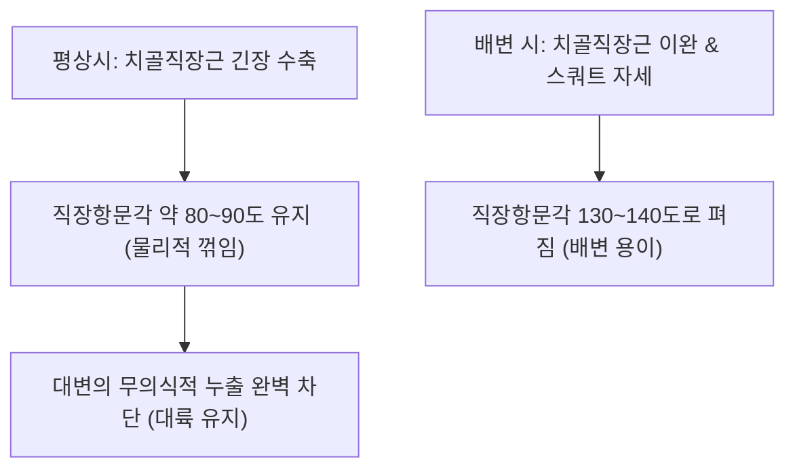

# [[항문거근]](Levator Ani)

> **핵심 요약 (Key Summary)**:
> [[치골직장근]], [[치골미골근]], [[장골미골근]]의 3부로 구성되어 골반강 바닥의 주축을 이루는 깔때기형 근육판.
> 직장항문각(80~90도) 유지, 대소변 자제 대륙(Continence) 형성 및 골반 장기 거상을 주동하며 [[음부신경]](S2-S4) 및 S4 직접 운동지의 지배를 받음.
> 골반장기탈출증(POP), 만성 항문거근 증후군, 미골통, 변실금을 유발하며 장강혈 심부 침구 및 직장항문각 재활의 핵심 타깃임.

---
## 📌 목차
1. [해부학적 정밀 구조 및 지배 신경/혈관](#1-해부학적-정밀-구조-및-지배-신경혈관)
2. [생체역학·토크 분석 & 근막 사슬 (Biomechanical Synergy)](#2-생체역학토크-분석--근막-사슬-biomechanical-synergy)
3. [근막통증증후군(TP) & 연관통 패턴 (Travell & Simons)](#3-근막통증증후군tp--연관통-패턴-travell--simons)
4. [초음파 해부학(Sonoanatomy) 및 중재 시술 랜드마크](#4-초음파-해부학sonoanatomy-및-중재-시술-랜드마크)
5. [⭐ 원장님 심층 임상 고찰 및 원본 필기 (Clinical Pearls)](#5-원장님-심층-임상-고찰-및-원본-필기-clinical-pearls)
6. [관련 임상 질환 및 운동손상 증후군 총괄](#6-관련-임상-질환-및-운동손상-증후군-총괄)
7. [추나·도수치료(MET/PIR) & 침구·약침·재활 프로토콜](#7-추나도수치료metpir--침구약침재활-프로토콜)
8. [출처 및 학술 참고 문헌 (References)](#8-출처-및-학술-참고-문헌-references)

---
## 1. 해부학적 정밀 구조 및 지배 신경/혈관

| 세부 구성근 | 기시 (Origin) | 정지 (Insertion) | 핵심 기능 |
| :--- | :--- | :--- | :--- |
| [[치골직장근]] (Puborectalis) | 치골체 후면 | 직장-항문 접합부 뒤를 U자형 고리(Sling)로 감쌈 | 직장항문각(80~90도) 유지, 배변 자제 |
| [[치골미골근]] (Pubococcygeus) | 치골체 후면 | 항문미골인대, [[미골]] | 골반 장기 거상 및 요도 질 지지 |
| [[장골미골근]] (Iliococcygeus) | 내폐쇄근막 건궁, 좌골극 | 미골 및 항문미골체 | 골반저 후외측 탄탄한 섬유판 지지 |

### 🔬 해부학 도해 및 단면도
![[Levator_ani_anatomy.png|450]]
> [해부학 도해]: 직장과 비뇨생식기를 감싸며 치골과 미골 사이를 잇는 항문거근의 깔때기 모양 3차원 구조.

---
## 2. 생체역학·토크 분석 & 근막 사슬 (Biomechanical Synergy)

* **직장항문각(Anorectal Angle) 제어 밸브**:
  * 치골직장근이 직장을 앞쪽으로 당겨 호스를 꺾듯 직장을 꺾어 놓음으로써 평상시 대변 자제 유지. 배변 시에는 이완되어 통로를 일직선화.
* **골반 장기 탈출 방어 돔**: 복압이 가해질 때 하방으로 밀려나지 않도록 상방으로 저항하는 팽팽한 탄성 돔 형성.
* **근막 사슬 연계 (Anatomy Trains)**: 심부전방선(Deep Front Line)의 기저 지지대로 내폐쇄근막(Obturator fascia) 및 이상근막과 연결.

---
## 3. 근막통증증후군(TP) & 연관통 패턴 (Travell & Simons)

* **항문거근 증후군 (Levator Ani Syndrome)**:
  * 직장 내부에 공이나 단단한 막대기가 들어차 있는 듯한 묵직하고 지속적인 통증.
  * 배변 후에도 시원하지 않고 항문 속이 뻐근하게 당김.
* **미골통 및 둔부 방사통**: 미골 주변 및 천골 하부, 대퇴 후내측으로 퍼지는 둔통.

---

![[Levator_ani_TriggerPoints.jpg|450]]
> [항문거근 발통점]: 직장 내부 묵직한 둔통 및 미골통, 좌골결절 통증을 유발하는 Travell & Simons 연관통 패턴.

---
## 4. 초음파 해부학(Sonoanatomy) 및 중재 시술 랜드마크

* **초음파 스캔**:
  * 회음부 시상 스캔에서 항문관(Anal canal) 및 직장 전벽과 후벽의 치골직장근 고리 구조 확인.
  * 항문 괄약근(Anal sphincter)과의 경계면 식별.
* **자침 안전 마진**: 직장 벽 천공을 절대 방지하기 위해 미골 전면으로 자침 시 촉진 손가락으로 직장 위치를 확인하거나 외측으로 사자.

---
## 5. ⭐ 원장님 심층 임상 고찰 및 원본 필기 (Clinical Pearls)

* **배변 자세와 치골직장근 역학 (원장님 팁)**:
  * 양변기에 앉아 허리를 꼿꼿이 세우면 치골직장근이 완전히 풀리지 않아 배변 시 과도한 복압이 필요함.
  * 발 아래에 15~20cm 발판(Squatty Potty)을 두고 상체를 앞으로 35도 기울이는 쭈구려 앉기(Squat) 자세를 취하면 치골직장근이 완전히 이완되어 직장항문각이 펴지며 배변이 원활해짐.
* **항문거근 증후군의 스트레스 연관성**:
  * 항문거근은 교감신경 긴장 시 무의식적으로 항문을 조이는 버릇이 있는 신경과민형 환자에게 다발함.
  * 직장 수지 검사 시 치골직장근 띠를 살짝 튕기면 극심한 압통을 호소함.
* **장강혈(GV1) 및 승산혈(BL57) 배혈**:
  * 미골 첨부와 항문 사이의 장강혈 자침은 항문거근의 연축을 푸는 최고 요혈이며, 종아리 승산혈과 배혈 시 항문 괄약근 이완 효과가 배가됨.

---
## 6. 관련 임상 질환 및 운동손상 증후군 총괄

| 임상 질환 / 증후군 | 병리적 연관 기전 | 주요 증상 및 이학적 검사 | 핵심 교정 타깃 |
| :--- | :--- | :--- | :--- |
| [[항문거근 증후군]] | 항문거근 만성 경련 및 발통점 | 직장 내 공이 낀 듯한 뻐근함, 야간통 | 장강혈 침도, 좌욕 및 근막 마사지 |
| [[골반장기탈출증]](POP) | 치골미골근 파열 및 열공 확장 | 자궁/직장 탈출, 밑이 묵직한 하수감 | 골반저근 재활, 한방 익기인경탕 |
| 변실금 (Fecal Incontinence) | 치골직장근 신경 손상 및 이완 | 가스 및 묽은 변 조절 불능 | S4 신경근 자극 전침, 케겔 훈련 |
| 난치성 미골통 | 치골미골근의 편측 단축 견인 | 의자에 앉을 때 꼬리뼈 닿는 통증 | 미골 정복 추나, 부착부 약침 |

---
## 7. 추나·도수치료(MET/PIR) & 침구·약침·재활 프로토콜

* **한의학 경혈 매핑 및 침구 프로토콜**:
  * 장강(GV1), 회음(CV1), 백회(GV20), 차료(BL32), 승산(BL57).
  * 장강혈: 미골 첨단과 항문 사이에서 미골 전면을 따라 상방으로 0.30×40mm 사자(깊이 2~3cm).
* **미골 정복 추나 (Coccyx Mobilization)**:
  * 직장 내 수지 조작 또는 미골 외측 연부조직 신전을 통해 전방으로 굴곡 변위된 미골을 후방으로 정렬.
* **골반저 바이오피드백 재활**:
  * 배변 시 힘주기와 이완을 구분하는 역설적 수축(Paradoxical contraction) 교정 훈련.

---
## 8. 출처 및 학술 참고 문헌 (References)

1. **DeLancey, J. O. L. (1994)**. The anatomy of the pelvic floor. *Curr Opin Obstet Gynecol*, 6(4), 313-316. [PMID: 7742491](https://pubmed.ncbi.nlm.nih.gov/7742491/)
   - `[연구 요약]`: 항문거근의 세부 구조와 골반 장기 지지 기전의 해부학적 정립.
2. **Bharucha, A. E. (2006)**. Pelvic floor: anatomy and function. *Neurogastroenterol Motil*, 18(7), 507-519. [PMID: 16771766](https://pubmed.ncbi.nlm.nih.gov/16771766/)
   - `[연구 요약]`: 치골직장근의 직장항문각 유지와 배변 제어 신경역학 연구.
3. **Travell, J. G., & Simons, D. G.** (1999). *Myofascial Pain and Dysfunction*. Williams & Wilkins.
   - `[연구 요약]`: 항문거근 발통점과 직장 통증 증후군의 임상 감별 진단학.