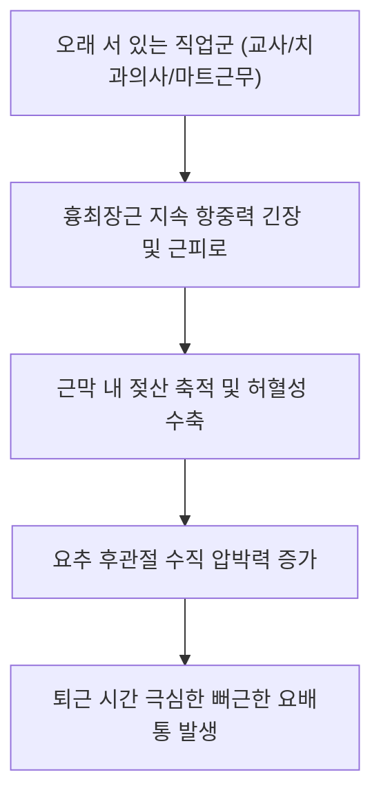

# [[흉최장근]](Longissimus Thoracis)

> **핵심 요약 (Key Summary)**:
> [[천골]] 후면, [[장골능]], [[요추]] 극돌기에서 기시하여 흉요추 [[횡돌기]] 첨부 및 늑골각에 정지하는 척주기립근의 최대 볼륨 중심 기둥.
> 척추 신전, 직립 체간 지탱, 비틀림 저항 및 흡기 보조를 주동하며 [[척수신경 후지]](T1-L3)의 지배를 받음.
> 장시간 기립 직업군의 피로성 요배통, 척추기립근 증후군, 요추 과전만을 초래하며 방광경 1선(배수혈) 심부 자침의 핵심 타깃임.

---
## 📌 목차
1. [해부학적 정밀 구조 및 지배 신경/혈관](#1-해부학적-정밀-구조-및-지배-신경혈관)
2. [생체역학·토크 분석 & 근막 사슬 (Biomechanical Synergy)](#2-생체역학토크-분석--근막-사슬-biomechanical-synergy)
3. [근막통증증후군(TP) & 연관통 패턴 (Travell & Simons)](#3-근막통증증후군tp--연관통-패턴-travell--simons)
4. [초음파 해부학(Sonoanatomy) 및 중재 시술 랜드마크](#4-초음파-해부학sonoanatomy-및-중재-시술-랜드마크)
5. [⭐ 원장님 심층 임상 고찰 및 원본 필기 (Clinical Pearls)](#5-원장님-심층-임상-고찰-및-원본-필기-clinical-pearls)
6. [관련 임상 질환 및 운동손상 증후군 총괄](#6-관련-임상-질환-및-운동손상-증후군-총괄)
7. [추나·도수치료(MET/PIR) & 침구·약침·재활 프로토콜](#7-추나도수치료metpir--침구약침재활-프로토콜)
8. [출처 및 학술 참고 문헌 (References)](#8-출처-및-학술-참고-문헌-references)

---
## 1. 해부학적 정밀 구조 및 지배 신경/혈관

| 항목 | 상세 내용 |
| :--- | :--- |
| **기시 (Origin)** | [[천골]](Sacrum) 후면, [[장골능]](Iliac crest), [[요추]] L1~L5 [[극돌기]](Spinous processes) 및 [[흉요근막]](TLF) |
| **정지 (Insertion)** | 흉추부: T1~T12 흉추 [[횡돌기]](Transverse processes) 첨부 및 하부 제4~12[[늑골]] 각 사이 / 요추부: L1~L5 요추 부돌기 |
| **신경 지배** | [[척수신경 후지]](Dorsal rami of thoracic & lumbar spinal nerves) 내측지 및 외측지 (T1~L3) |
| **혈관 공급** | 요동맥(Lumbar aa.), 후륵간동맥(Posterior intercostal aa.) |

### 🔬 해부학 도해 및 단면도
![[Longissimus_anatomy.png|450]]
> [해부학 도해]: 척추 양옆에서 가장 크고 긴 볼륨을 형성하며 흉추와 요추를 잇는 흉최장근의 주 기둥.

![[Pasted image 20240116141027 1.png|450]]
> [구조적 특징]: 엎드렸을 때(Prone) 척추 정중선 외측 1.5촌 라인에서 가장 두껍게 만져지는 기립근의 본체.

---
## 2. 생체역학·토크 분석 & 근막 사슬 (Biomechanical Synergy)

* **척추 신전 1차 구동원 (Prime Extensor)**: 척추기립근 중 단면적이 가장 크며, 척추 전방 굴곡 토크에 대항하여 직립 척추를 세우는 최대의 신전력 발생.
* **회전 진동 억제**: 보행 시 골반과 상체 사이에서 발생하는 역회전 토크를 중간에서 흡수하여 부드러운 전진 보행 유도.
* **근막 사슬 연계 (Anatomy Trains)**: 표재후방선(Superficial Back Line)의 주력 엔진으로 두최장근 및 햄스트링과 축성 긴장 연결.

---
## 3. 근막통증증후군(TP) & 연관통 패턴 (Travell & Simons)

* **하부 요추 TrP**: 엉덩이(둔부) 상부 및 천골 후면으로 넓게 퍼지는 묵직한 통증.
* **중간 흉추 TrP**: 견갑간부(고황혈 주변) 및 등 중앙부의 결림 통증(담결림 호발 부위).
* **특징**: 서 있거나 걸을 때 허리가 굳어 뒤로 젖히기 힘들고, 엎드려 허리를 지압받으면 시원하다고 느낌.

---

![[Longissimus_thoracis_TriggerPoints.jpg|450]]
> [최장근 발통점]: 요추부 기립근 고랑 및 둔부 상부로 넓게 퍼지는 Travell & Simons 연관통 패턴.

---
## 4. 초음파 해부학(Sonoanatomy) 및 중재 시술 랜드마크

* **초음파 스캔**:
  * 척추 정중선에서 외측 2~3cm 지점 횡단 스캔.
  * 표층의 흉요근막 후엽 아래에 크고 둥근 저에코 근복을 형성하는 최장근 관찰.
  * 최장근 심부의 요추 횡돌기 및 늑골 결절 뼈 음영 확인.
* **자침 안전 마진**: 요추부에서는 횡돌기를 랜드마크 삼아 자침하며, 흉추부에서는 늑골 뼈 표면을 가이드로 활용하여 기흉 예방.

---
## 5. ⭐ 원장님 심층 임상 고찰 및 원본 필기 (Clinical Pearls)

* **직업적 과부하와 근막통 (원장님 필기 100% 보존)**:
  * 장시간 서 있는 직업군(교사, 마트 근무자, 치과의사, 외과의사) 및 고중량 데드리프트/스쿼트를 반복하는 사람에게 만성 과긴장 호발.
  * 이들은 추나 치료 시 장요근, 요방형근, 다열근과 연계하여 척추의 전후 밸런스를 맞춰야 재발하지 않음.
* **엎드린 자세(Prone)에서의 촉진 노하우 (원장님 필기 보존)**:
  * 환자를 엎드리게 했을 때 척추 양옆에서 가장 두껍게 튀어나와 육안으로 관찰되는 척추기립근의 주 기둥이 바로 흉최장근임.
  * 이 부위가 판자처럼 딱딱하게 굳어 있으면 배수혈 자침과 함께 흉요근막 롤링(Rolling) 테크닉이 특효.
* **맥켄지(McKenzie) 신전 운동 시 주의점**:
  * 최장근이 극도로 단축된 환자에게 무리한 맥켄지 신전을 시키면 후관절(Facet) 충돌로 오히려 통증이 악화되므로, 온열 및 침 치료로 긴장을 먼저 푼 후 신전 유도.

---
## 6. 관련 임상 질환 및 운동손상 증후군 총괄

| 임상 질환 / 증후군 | 병리적 연관 기전 | 주요 증상 및 이학적 검사 | 핵심 교정 타깃 |
| :--- | :--- | :--- | :--- |
| 만성 기립근 피로 증후군 | 장시간 기립으로 인한 최장근 허혈 | 오후 시간대 요배부 뻐근한 피로통 | 배수혈 침도, 흉요근막 이완 추나 |
| [[후관절 증후군]](Facet Syndrome) | 최장근 과긴장으로 관절면 압박 | 허리 신전 및 회전 시 요통 악화 | 후관절 부위 소염 약침, 굴곡 재활 |
| 견갑간부 근막동통증 | 흉추 레벨 최장근 발통점 | 등 중앙 담결림, 깊은 호흡 시 뻐근함 | 고황·신당혈 심부 침치료 |
| 요추 과전만 (Hyperlordosis) | 최장근 단축으로 척추 후방 압축 | 엉덩이가 뒤로 빠지고 요추 전만 심화 | 최장근 스트레칭, 복근 강화 |

---
## 7. 추나·도수치료(MET/PIR) & 침구·약침·재활 프로토콜

* **한의학 경혈 매핑 및 침구 프로토콜**:
  * 방광경 1선: 폐수(BL13), 궐음수(BL14), 심수(BL15), 독수(BL16), 격수(BL17), 간수(BL18), 담수(BL19), 비수(BL20), 위수(BL21), 삼초수(BL22), 신수(BL23), 기해수(BL24), 대장수(BL25).
  * 0.30×60mm 침으로 척추 극돌기를 향해 45도 내하방 사자.
* **근에너지기법 (MET/PIR)**:
  * 좌위 체간 굴곡 및 회전 상태에서 신전 등척성 저항 7초 후 이완.
* **재활 훈련 (Cat-Camel & Prone Cobra)**:
  * 척추 분절 가동성을 회복하고 최장근의 과도한 연축을 이완하는 캣-카멜 운동.

---
## 8. 출처 및 학술 참고 문헌 (References)

1. **Bogduk, N.** (2005). *Clinical Anatomy of the Lumbar Spine and Sacrum*. Churchill Livingstone.
   - `[연구 요약]`: 흉최장근의 해부학적 기시, 정지 및 척추 신전 토크 발생 기전 분석.
2. **Travell, J. G., & Simons, D. G.** (1999). *Myofascial Pain and Dysfunction*. Williams & Wilkins.
   - `[연구 요약]`: 흉최장근 발통점의 둔부 및 요배부 연관통 지도 규명.
3. **McGill, S. M.** (2007). *Low Back Disorders*. Human Kinetics.
   - `[연구 요약]`: 척추 기립 자세에서 최장근의 지속적 수축과 근피로 발생에 관한 근전도 연구.
