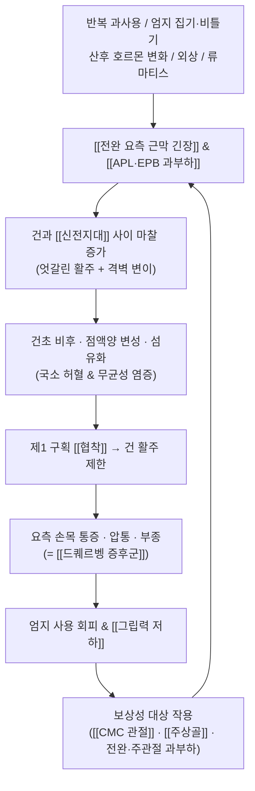
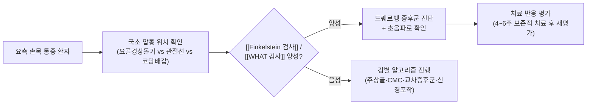

# 🩺 [[드퀘르벵 증후군]] (De Quervain's Syndrome / de Quervain's Tenosynovitis, 橈骨莖狀突起腱鞘炎, ICD-10 M65.4 / KCD M65.4)

> **핵심 3줄 요약 (Key Summary)**:
> - 📍 **병소 부위 & 해부·병태생리**: 손목 제1 배측 신전구획(first dorsal compartment) 내 [[장무지외전근]](APL, abductor pollicis longus)과 [[단무지신근]](EPB, extensor pollicis brevis) 건초가 신전지대(extensor retinaculum) 아래에서 반복적 미세외상으로 비후·협착되어 통증을 유발하는 [[협착성 건초염]]이다.
> - 🚩 **전형적 임상 양상 & 3대 징후**: ① 요골경상돌기(radial styloid) 국소 압통 및 부종, ② 엄지 신전·외전 및 척측 편위 시 통증 악화, ③ [[Finkelstein 검사]](Eichhoff 검사) 양성 — 집기(pinch)·그립(grip)·아기 들어올리기 동작에서 통증 재현.
> - 🛠️ **핵심 감별 검사 & 한·양방 다각적 치료 전략**: [[Finkelstein 검사]]·[[Eichhoff 검사]]·[[WHAT 검사]]·초음파로 진단, 보존적 치료(부목 고정·NSAIDs·건초 내 스테로이드 주입)가 1차이며, 한의 통합 치료로 [[양계]](LI5)·[[합곡]](LI4)·[[외관]](TE5) 중심 [[침]]·[[전침]], [[봉독약침]]·[[황련해독탕약침]] 국소 주입, 전완 근막 [[추나]](JS 기법), 변증별 [[활혈거어제]](급성)·[[보익제]](만성)를 병행한다.
> - ⚠️ **응급 의뢰 레드플래그 & 악화 요인**: 외상 후 해부학적 코담배갑 심부 압통([[주상골 골절]] 의심), 발열·발적·미만성 종창([[화농성 건초염]]), 급성 엄지 하수(EPL 파열), 진행성 감각·운동 결손([[경추 신경근병증]]·말초신경 손상) 시 즉시 영상검사 및 전문과 의뢰. 급성기 강한 심부 마찰·강압 마사지·과도한 신전 스트레칭은 금기.

---

## 📌 목차
1. [질환 개요 & 해부학적 병태생리](#1-질환-개요--해부학적-병태생리)
2. [병태생리 메커니즘 & 생체역학적 악순환 네트워크](#2-병태생리-메커니즘--생체역학적-악순환-네트워크)
3. [임상 증상 & 이학적 검사(Physical Exam) 알고리즘](#3-임상-증상--이학적-검사physical-exam-알고리즘)
4. [감별 진단 매트릭스 (Differential Diagnosis)](#4-감별-진단-매트릭스-differential-diagnosis)
5. [한의 통합 치료 프로토콜 (침·약침·추나·한약)](#5-한의-통합-치료-프로토콜-침약침추나한약)
6. [재활 운동 & 생활습관 티칭 가이드](#6-재활-운동--생활습관-티칭-가이드)
7. [💡 사용자 진료실 핵심 필기 & 임상 노하우 (Melt-In 잔여 심화 집약)](#7--사용자-진료실-핵심-필기--임상-노하우-melt-in-잔여-심화-집약)
8. [출처 및 학술 참고 문헌 (References)](#8-출처-및-학술-참고-문헌-references)

---

## 1. 질환 개요 & 해부학적 병태생리

![[질환_해부학_메디컬일러스트.jpg|450]]
> [그림 1: ① 질환/병태생리 메디컬 일러스트 — 요골경상돌기 부위 제1 배측 신전구획의 건초 비후와 협착 소견, 외부 고해상도 학술 도해 삽입 필요]

* **질환 정의 및 분류**:
  * **정의**: 손목 배측 제1 신전구획을 통과하는 [[장무지외전근]](APL)과 [[단무지신근]](EPB) 건 및 그 건초(tenosynovium)가 신전지대(extensor retinaculum)에 의해 협착·비후되어, 엄지 운동 시 심한 요측 손목 통증을 일으키는 대표적 [[협착성 건초염]](stenosing tenosynovitis)이다. 1895년 스위스 외과의 Fritz de Quervain이 처음 기술한 이래 동일 명칭으로 통용된다.
  * **분류**: 특발성(원발성)과 이차성(류마티스관절염, 당뇨, 산후·수유기, 외상 후, 반복 직업성 과사용)으로 구분한다. 해부학적 변이 — 특히 EPB 건이 별도의 격벽(subcompartment, septum)에 의해 분리된 경우 — 가 존재하며, 이 변이는 스테로이드 주입이나 수술적 유리술의 실패 원인 중 하나로 논의된다(자세한 유병률 수치는 문헌별 편차가 커 **근거 미확인**).
  * **호발 연령/성별/직업군**: 30~50대 여성에서 흔하며, 출산 후 아기를 반복적으로 들어올리고 안는 수유기 여성에게서 빈발하여 **"엄마 손목(mother's wrist, baby wrist)"**이라는 별칭이 붙었다(Tamura & Shikino, 2020). 반복적인 엄지 집기·비틀기·타건, 스마트폰 엄지 타이핑, 주방·미용·조립·악기 연주 등 손목 요측 부하가 큰 직업군에서 위험이 증가한다. 류마티스관절염, 당뇨, 비만, 갑상선 질환 등 전신질환과의 연관성도 보고된다(Fakoya & Tarzian, 2023).
  * **자연경과**: 대부분 보존적 치료에 반응하나, 진단이 지연되면 만성화되어 통증-회피-근력저하의 악순환이 고착되고, 드물게 건 파열이나 수술적 유리술까지 진행한다.

* **관련 해부학적 구조물**:
  * **골격 및 관절**: [[요골]] 원위단의 요골경상돌기(radial styloid), [[주상골]](scaphoid), [[대능형골]](trapezium) 및 [[제1 중수수지관절]](CMC joint). 제1 신전구획의 천장을 이루는 [[신전지대]](extensor retinaculum)는 요골 원위부 배측에 부착된 섬유성 띠로, 이 띠가 APL·EPB 건 위를 덮으며 실질적인 "터널 천장" 역할을 한다. 해부학적 코담배갑(anatomical snuffbox)은 요측 손목의 표면 표지(landmark)로, 그 심부에 [[요골동맥]]과 [[주상골]]이 위치한다.
  * **근육 및 근막**: [[장무지외전근]](APL)은 전완 배측 중위 1/3에서 기시하여 제1 중수골 기저부에 정지하며 엄지의 외전과 요측 편위를 담당한다. [[단무지신근]](EPB)은 요골 배측 및 골간막에서 기시하여 엄지 첫마디뼈 기저부에 정지하고 엄지의 신전을 담당한다. 두 건은 같은 구획을 통과하지만 정지부가 달라 운동 시 서로 다른 방향으로 미끄러지며, 이 "엇갈린 활주(varying glide)"가 마찰을 증폭시키는 구조적 취약점이 된다. 또한 주변의 [[제1 배측 골간근]]·[[장무지신근]](EPL, 제3 구획)과의 근막 연속성이 보상 패턴에 관여한다.
  * **신경 및 혈관**: [[요골동맥]]이 코담배갑 심부를 통과하고, [[표재요골신경]](superficial radial nerve)의 배측지가 요측 전완 피하를 주행하며 제1 신전구획 표층과 인접한다. 따라서 맹검(bllind) 스테로이드 주입이나 심부 자침·약침 시 표재요골신경 손상(감각 저하·작열통) 및 요골동맥 천자 위험이 있어 세심한 주의가 필요하다(Ilyas & Ast, 2007; Fakoya & Tarzian, 2023).

---

## 2. 병태생리 메커니즘 & 생체역학적 악순환 네트워크

![[질환_관련_구조물_해부도해.png|450]]
> [그림 2: ② 관련 해부학적 구조물 도해 — 제1 배측 신전구획 단면, APL·EPB 건의 주행, 신전지대 및 격벽 변이, 인접 표재요골신경·요골동맥 위치]

### 1) 해부학적 포착 및 압박 기전
* **터널 병태생리**: 제1 배측 구획은 신전지대가 만드는 골섬유성 터널(tunnel)이다. 반복적 미세외상이 누적되면 건초(활액초)와 신전지대가 비후되고, 건 자체에는 점액양 변성(myxoid degeneration)과 섬유화가 진행되어 단면적이 증가한다. 결과적으로 "내용물은 커지고 통로는 좁아지는" 상대적 협착이 발생하여 건의 활주가 제한되고, 엄지 신전·외전 시 마찰 통증이 유발된다(Ilyas & Ast, 2007).
* **조직학적 특성**: 고전적으로 "건초염(-itis)"이라 불리지만, 실제 조직 소견은 염증세포 침윤보다는 건초의 섬유성 비후와 점액양 변성 같은 **퇴행성·기계적 변화**가 우세하다는 기술이 다수 문헌에 존재한다. 다만 병기별 염증성 요소의 비중은 문헌 간 이견이 있어 **근거 미확인** 항목으로 두고, 임상적으로는 "염증 + 퇴행성 협착"의 혼합 병태로 이해하는 것이 안전하다.
* **해부학적 변이의 임상적 의미**: APL 건은 여러 갈래로 나뉘는 경우가 흔하고, EPB 건이 별도 격벽에 의해 분리된 아구획에 위치하는 변이가 존재한다. 이러한 변이에서는 주입 약물이 병소 구획에 도달하지 못해 스테로이드 주입 반응이 불충분해질 수 있으며, 초음파 유도하 주입이 이를 보완하는 전략으로 제안된다(Chong & Pradhan, 2024).
* **감별 포인트**: 병소가 **손목 관절선 바로 근위부(요골경상돌기 높이)**라는 점이, 4~6 cm 더 근위부에서 발생하는 [[교차 증후군]](intersection syndrome)과의 핵심 감별 축이다.

### 2) 생체역학적 연쇄 반응 (Kinetic Chain)
* **국소(수부·손목)**: 엄지 집기(pinch)는 제1 중수수지관절과 요측 손목에 높은 압축·전단 부하를 만든다. 통증으로 엄지 사용이 줄면 [[단무지외전근]]·[[단무지신근]]의 실질적 위축과 [[대어깨근]]·[[제1 배측 골간근]]의 과긴장이 발생한다.
* **근위(전완·주관절·경추)**: 요측 손목 통증이 지속되면 환자는 손목을 척측으로 고정하고 팔꿈치와 어깨를 들어올리는 보상 전략을 취한다. 이는 [[회외근]](supinator) 및 [[완요측수근신근]](ECRL)·[[장요측수근신근]](ECRB)의 과부하를 유발하고, 나아가 견갑대 안정화 근육의 불균형으로 이어진다.
* **신경역학적 연쇄**: [[표재요골신경]]은 요측 전완의 근막 터널을 통과하므로, 전완 요측 근막의 긴장이 증가하면 신경 활주(neurodynamics)가 제한되어 저림·이상감각이 동반될 수 있다. 실제로 드퀘르벵 환자에서 감각 이상이 동반되는 경우 신경 포착 동반 여부를 반드시 감별해야 한다.
* **중추성 변화**: 만성 통증이 3개월 이상 지속되면 통증 과민화(central sensitization)로 인해 국소 자극 없이도 통증이 확산될 수 있으므로, 만성군에서는 단순 국소 치료만으로는 반응이 제한적일 수 있다.

---

## 3. 임상 증상 & 이학적 검사(Physical Exam) 알고리즘

### 1) 주소증 및 신경학적 증상
* **통증(주 증상)**: 요골경상돌기 부위의 찌르는 듯한 통증 또는 둔통. 엄지를 쓰는 순간(문고리 돌리기, 병뚜껑 열기, 젖병 들기, 무거운 컵 집기, 빨래 짜기)에 날카롭게 악화되며, 엄지와 요측 손목으로 퍼지는 방사 패턴을 보인다. 야간통 및 아침 첫 동작 시 강직감이 동반될 수 있다(Tamura & Shikino, 2020).
* **부종 및 종괴감**: 요골경상돌기 위에 국소 종창이 관찰되며, 일부에서는 딱딱한 결절이나 염발음(crepitus)이 촉지된다. 이는 건초의 비후 및 섬유화가 진행된 소견으로 해석된다.
* **운동 장애 및 근력 저하**: 엄지의 능동적 신전·외전 시 통증으로 인한 운동 제한이 나타나고, 통증성 억제로 집기력(pinch strength)이 감소한다. 진행되면 엄지 사용 전체를 회피하는 습관성 패턴이 형성된다.
* **감각 이상**: 전형적으로는 감각 저하가 뚜렷하지 않으나, [[표재요골신경]] 자극이 동반되면 요측 엄지 배측부의 저림·작열통이 추가된다. **명확한 감각 저하·근위축이 있다면 다른 질환을 우선 감별**해야 한다(Fakoya & Tarzian, 2023).
* **혈관/자율신경 증상**: 냉감·청색증·부종이 현저하고 맥박 약화가 동반되면 [[복합부위통증증후군]](CRPS)이나 혈관성 병변을 감별해야 한다.

### 2) 필수 이학적 검사법 (Physical Examination)
* [[Finkelstein 검사]](Finkelstein test / Eichhoff test): 환자가 엄지를 손바닥 안에 넣어 주먹을 쥐고(엄지를 네 손가락으로 감싼 자세), 검사자가 손목을 급격히 척측 편위시킨다. 요골경상돌기 부위에 격렬한 통증이 재현되면 양성이다. 드퀘르벵의 대표 선별 검사로 민감도는 높으나 특이도는 낮아 다른 요측 손목 병변에서도 양성으로 나타날 수 있다.
  * **명칭 주의(임상 팁)**: 1930년대 문헌 고증에 따르면 원래 기술한 검사는 **Eichhoff 검사**이며, Finkelstein 검사는 별도의 변형 기법을 지칭한다. 실제 논문·교과서에서는 두 명칭이 거의 혼용되므로, 진료실에서는 "엄지를 감싸고 손목을 새끼손가락 쪽으로 꺾는 검사"로 환자에게 설명하면 충분하다(Ilyas & Ast, 2007).
* [[WHAT 검사]](wrist hyperflexion and abduction of the thumb test): 손목을 굴곡한 상태에서 엄지를 외전시켜 통증 유발 여부를 확인한다. Finkelstein 검사보다 자세가 단순하여 급성 통증이 심한 환자에서도 시행 가능하고, Finkelstein 검사와 조합하면 진단적 가치가 높아진다는 보고가 있다.
* **국소 압통 및 부종 촉진**: 요골경상돌기 정점에 국한된 압통과 국소 종창을 확인한다. 손목 관절선(radiocarpal joint line)과의 거리를 반드시 구분해야 하며, 관절선 압통이 더 뚜렷하면 [[수근관절 관절염]]이나 [[주상골 골절]]을 우선 의심한다.
* **저항성 검사(resisted test)**: 엄지 외전·신전에 저항을 주며 통증 재현 여부를 확인한다. 통증은 건 부착부가 아닌 제1 구획(요골경상돌기 높이)에 국한되어야 한다.
* **표재요골신경 자극 검사**: 전완 요측 배부를 따라 [[Tinel 징후]] 및 감각 검사를 시행하여 신경 포착 여부를 감별한다.
* **초음파(영상 검사)**: 병소 건초의 비후, 건초 내 삼출액, 건 주위 활액 증가, 파워도플러 신호 증가를 확인할 수 있다. 진단 보조 및 주입 유도에 유용하나, 조기 경증에서는 정상 소견을 보일 수 있어 정상 소견이 진단을 배제하지는 못한다(Chong & Pradhan, 2024).
* **방사선(X-ray)**: 건초 병변 자체는 관찰되지 않지만, 외상력이 있거나 골 병변이 의심되면 [[주상골 골절]]·[[CMC 골관절염]]·[[칼슘 침착성 건염]] 감별을 위해 반드시 시행한다.

### 3) 진단 흐름 요약

---

## 4. 감별 진단 매트릭스 (Differential Diagnosis)

| 감별 질환 | 호발 병소 및 원인 | 주소증 차이점 | 특이적 이학적 검사 소견 |
| :--- | :--- | :--- | :--- |
| [[드퀘르벵 증후군]] (본 질환) | 제1 배측 신전구획(APL·EPB 건초)의 협착 | 요골경상돌기 국소 통증, 엄지 신전·외전 시 악화, 통증 범위 국소적 | [[Finkelstein 검사]]·[[WHAT 검사]] 양성, 요골경상돌기 국소 압통·부종 |
| [[CMC 골관절염]](제1 중수수지관절) | 제1 중수수지관절 연골 마모(중년 이후 여성) | 그립·집기 시 관절 자체 통증, 관절 변형·부종, 양측성 경향 | [[Grind 검사]](축성 압박+회전) 양성, 방사선상 관절간격 협소·골극 |
| [[교차 증후군]](Intersection syndrome) | 제2 구획(ECRL/ECRB)과 APL/EPB 교차부, 손목 근위 4~6 cm | 병소가 더 **근위부**, 운동 시 마찰음·염발음, 미만성 부종 | 근위부 압통·부종, 마찰 시 염발음 촉지, Finkelstein 검사 약양성 |
| [[표재요골신경 포착]](cheiralgia paresthetica) | 전완 요측 표재요골신경 압박(시계줄·외상·근막) | 작열통·저림 등 **감각 이상 위주**, 운동 시 통증은 경미 | [[Tinel 징후]] 양성, 신경 주행부 압통, 감각 저하 |
| [[주상골 골절]](또는 잠재 골절) | 외상력 후 주상골 | 해부학적 코담배갑 **심부** 압통, 엄지 축성 압박통 | [[주상골 압통]], 축성 압박 검사 양성, X-ray/CT/MRI 필요 |
| [[수근관절 관절염]](요수근/STT 관절) | 요수근 관절 또는 주상골-대능형골-대능형골 관절 | 미만성 손목 통증, 아침 강직, 관절선 압통 | 손목 관절선 압통, 관절 삼출, 방사선 소견 |
| [[건초 거대세포종]](배측 손목 결절) | 손목 배측 결절(관절액 유출) | 국소 결절 촉지, 크기 변화, 경미한 통증 | 결절 촉지, 투과조명 양성, 초음파로 액체 저류 확인 |
| [[경추 신경근병증 C6]] | C6 신경근 압박(추간판·골극) | 목·어깨·엄지까지 방사통, 저림·근력저하 동반 | [[Spurling 검사]] 양성, [[경추 견인 검사]]에서 통증 완화, 심부건반사 저하 |
| [[화농성 건초염]] | 세균 감염(상처·주사·혈행) | 급성 발열, 심한 미만성 종창·발적, 전신 증상 | 발적·열감, 극심한 수동 운동 통증, 혈액검사 염증 수치 상승 |

> [!TIP]
> **감별의 3대 축**: ① **압통의 정확한 위치**(요골경상돌기 = 드퀘르벵 / 관절선 = 관절염 / 코담배갑 심부 = 주상골 / 근위 4~6 cm = 교차 증후군), ② **감각 이상의 유무**(있으면 신경 병변 우선), ③ **외상력·전신 증상의 유무**(있으면 골절·감염·염증성 질환 우선). 이 세 가지만 문진·촉진으로 정리해도 대부분의 감별이 가능하다.

---

## 5. 한의 통합 치료 프로토콜 (침·약침·추나·한약)

![[질환_치료_약침_시술점.png|400]]
> [그림 3: ③ 한의/양방 치료 시술점 — 약침 주입점(양계·아시혈), 초음파 유도하 건초 주위 타겟, 전완 요측 근막 추나 방향 도해]

> [!WARNING]
> 아래 한의 치료 프로토콜은 **임상 경험 및 전통적 변증 논리에 기반한 접근**이며, 드퀘르벵 증후군에 대한 침·약침·추나·한약의 유효성을 직접 검증한 대규모 무작위 대조시험은 제공된 문헌 범위 내에서 확인되지 않는다(**근거 미확인**). 따라서 서양의학적 보존적 치료(부목 고정·스테로이드 주입)와 병행하는 통합적 접근으로 위치시키고, 반드시 반응을 재평가한다.

* **침구 치료 (Acupuncture)**:
  * **국소 근위 취혈**: [[양계]](LI5, 陽谿) — 해부학적 코담배갑에 위치하여 제1 배측 신전구획 바로 위에 자침되는 **주요 표적혈**이다. [[태연]](LU9, 太淵), [[열결]](LU7, 列缺), [[양지]](TE4, 陽池)를 병용하여 요측 수근부 기혈 순환을 도모한다.
  * **원위 취혈**: [[합곡]](LI4, 合谷), [[삼간]](LI3, 三間), [[외관]](TE5, 外關), [[수삼리]](LI10, 手三里), [[곡지]](LI11, 曲池)를 배합하여 수양명경·수소양경의 경기를 소통시킨다. 엄지 배측은 수양명경 유주와 밀접하므로 양명경 위주로 구성하는 것이 임상적으로 합리적이다.
  * **아시혈(阿是穴)**: 요골경상돌기 주위 압통점에 2~4개 추가 자침. **건초 자체를 관통하는 심자(深刺)는 피하고**, 신전지대 표층 및 건초 주위에 자침한다.
  * **전침(Electroacupuncture)**: [[양계]](LI5)–[[합곡]](LI4) 또는 [[양계]](LI5)–[[외관]](TE5) 배합. 급성 염증기에는 저주파(2 Hz) 위주, 만성화·근력저하 동반 시 2/100 Hz 교대 자극을 고려한다. **급성기에는 강자극·장시간(20분 초과) 자극이 오히려 통증을 악화시킬 수 있으므로** 강도와 시간을 보수적으로 설정한다(구체적 최적 주파수 프로토콜은 **근거 미확인**).
  * **자침 시 해부학적 주의**: [[태연]](LU9)은 요골동맥 촉지 부위에 위치하므로 혈관 천자를 피하고, [[양계]](LI5) 주위는 표재요골신경 배측지 주행부이므로 저림·전기 감각이 과도하게 방사되면 즉시 자침 깊이를 조정한다.
  * **치료 빈도(경험적)**: 급성기 주 2~3회, 만성기 주 1~2회를 기본으로 하되 통증·기능 호전에 따라 조정한다.

* **약침 치료 (Pharmacopuncture)**:
  * **급성 염증·부종기**: [[황련해독탕약침]](청열·소염 목적) 또는 [[청열소염약침]] 계열을 요골경상돌기 주위 아시혈 및 [[양계]](LI5)에 소량 주입한다.
  * **만성 협착·건 조직 변성기**: [[봉독약침]] 또는 [[자하거약침]], [[신바로약침]] 계열을 고려하여 조직 재생 및 국소 순환 개선을 도모한다. 단, 봉독약침은 **반드시 피부반응검사(피내 테스트) 후 시행**하고, 아나필락시스 병력·임신·심혈관 질환자에게는 금기 또는 극히 신중하게 적용한다.
  * **주입 기법(경험적)**: 30G·13 mm 또는 26~30G의 가는 주사침을 사용하여 **피하~건초 표층**에 0.1~0.3 mL/point로 소량 주입한다. **건 내(intratendinous) 직접 주입은 건 파열 위험이 있어 금기**이며, 심부로 밀어 넣지 않는다.
  * **금기 및 회피 부위**: 해부학적 코담배갑 심부의 [[요골동맥]] 주행부, 표재요골신경 주행부에 대한 직접 주입은 회피한다. 주입 직후 환자의 감각 이상(저림·화끈거림) 발생 여부를 반드시 확인한다.
  * **근거 수준**: 약침의 드퀘르벵 증후군에 대한 유효성 근거는 제공 문헌에서 확인되지 않는다(**근거 미확인**).

* **추나 치료 (Chuna Manipulation)**:
  * **수근관절 견인·활주 도수**: 환자 전완을 고정하고 손목 관절에 축성 견인 및 요측 활주(radial glide)를 저강도·저속도로 적용하여 관절낭 긴장과 제1 구획 압력을 완화한다.
  * **근막 이완(JS 기법)**: 전완 요측 근막, 완요측수근신근 및 장무지외전근·단무지신근 근복을 따라 경도의 종방향 마찰 이완을 시행한다. **급성 염증기에는 강한 심부 마찰·강압 마사지를 피하고**, 접촉 압력을 최소화한다.
  * **근위부 정렬 교정**: 경추(C6~C7) 및 상흉추(T1~T2)의 가동술을 병행하여 신경근 연관성을 고려한 상부 사슬 치료를 시행한다. 이는 요측 손목 통증이 경추 기원인 경우(감별 필요)에도 유효하다.
  * **금기 수기**: 급성 골절(주상골 포함) 의심, 감염성 관절염·건초염, 종양, 심한 골다공증, 급성 염증기의 강한 신전(척측 편위) 도수는 금기이다.

* **한약 치료 (Herbal Medicine)**:
  * **급성기(어혈·열증, 實證)**: 어혈을 제거하고 열을 내리는 원칙으로 [[복원활혈탕]](復元活血湯), [[당귀수산]](當歸鬚散), [[도홍사물탕]] 가감을 고려한다. 국소 발열·발적·부종이 뚜렷한 경우 청열 활혈 위주로 구성한다.
  * **만성기(기혈허·한습, 虛證)**: 기혈을 보하고 근골을 강건하게 하는 원칙으로 [[독활기생탕]](獨活寄生湯), [[오적산]](五積散), [[쌍화탕]] 계열 또는 [[소경활혈탕]](疏經活血湯) 가감을 고려한다. 통증이 한랭 자극에 악화되고 온열에 완화되는 양상이면 온경산한(溫經散寒) 약물(계지·세신·오수유 등)을 가한다.
  * **변증 포인트**: 수양명경 순행 부위의 병변인 만큼, 기혈 순환 장애(기체혈어)와 담습(痰濕)의 정체를 함께 평가하고, 산후·수유기 여성에서는 기혈 이중 허손을 염두에 두고 보익(補益) 비중을 높인다.
  * **근거 수준**: 특정 처방의 드퀘르벵 증후군에 대한 임상적 유효성 자료는 제공 문헌에서 확인되지 않는다(**근거 미확인**). 따라서 변증 논리에 기반한 경험적 처방으로 운용하고, 서양의학적 치료와 병행 시 상호작용 및 환자의 복약 순응도를 확인한다.

### 치료 전략 요약표

| 병기 | 서양의학적 접근 (문헌 근거) | 한의 통합 접근 (경험적) |
| :--- | :--- | :--- |
| **급성기** (2주 이내, 심한 통증·부종) | 활동 조절, 엄지 스패이카 부목 고정, NSAIDs, 건초 내 스테로이드 주입 고려 | 저자극 침 + 청열소염 약침, 강한 마찰 회피, 청열활혈 한약 |
| **아급성기** (2~6주) | 부목 유지, 주입 반복 또는 물리치료, 초음파 유도 주입 고려 | 침·전침(저주파) + 약침 병행, 전완 근막 JS 이완 |
| **만성기** (6주 이상, 협착 진행) | 보존적 치료 실패 시 수술적 유리술 고려 | 봉독·자하거 약침, 온경 보익 한약, 근력 재건 운동 |
| **재발·난치성** | 영상 재평가, 격벽 변이 확인, 초음파 유도 주입/수술 | 근위 경추·견갑대 정렬 교정, 자세 교정 중심 관리 |

---

## 6. 재활 운동 & 생활습관 티칭 가이드

* **이완 및 스트레칭 (Stretching)**:
  * 만성기(급성 통증이 가라앉은 후)에 한하여, 엄지를 손바닥 쪽으로 부드럽게 굴곡시키고 손목을 경미하게 척측 편위하는 **저강도 정적 스트레칭**을 15~20초간, 하루 3~5회 시행한다.
  * **주의**: 이 동작은 Finkelstein 검사와 동일한 자세이므로, **급성기에는 절대 시행하지 않는다.** 통증이 3/10 이하로 조절된 후에만 시작하며, 스트레칭 후 통증이 30분 이상 지속되면 강도를 줄이거나 중단한다.
  * 전완 요측 근막 및 완요측수근신근의 근막 이완을 위해 온찜질(40℃ 내외, 10~15분)을 병행하면 순응도가 높아진다.

* **강화 및 안정화 운동 (Strengthening)**:
  * **등척성(isometric) 운동**: 엄지 외전·신전 방향으로 힘을 주되 관절 움직임 없이 5초간 유지, 10회 3세트. 통증을 유발하지 않는 범위에서 시행하며, 초기 재활의 핵심이다.
  * **저항 밴드 운동**: 통증이 조절된 후 노란색(최저 강도) 밴드로 엄지 외전·신전 저항 운동을 주 3회 시행한다.
  * **심부 안정화**: 견갑대 안정화(하부 승모근·전거근 활성화)와 손목 심부 굴곡근 안정화를 병행하여 근위부 보상 부하를 줄인다.
  * **악력 재건**: 통증이 사라진 뒤 부드러운 스폰지를 쥐었다 펴는 동작부터 시작하여 점진적으로 강도를 올린다.

* **신경 활주 운동 (Neurodynamics)**:
  * [[표재요골신경]] 활주 운동이 필요한 경우(요측 전완 저림 동반 시): 어깨를 내리고 팔꿈치를 편 상태에서 전완을 회내(pronation)하고 손목을 굴곡·척측 편위시켜 긴장을 준 뒤, 천천히 풀어주는 동작을 반복한다.
  * **원칙**: 통증이 아닌 "당기는 느낌"까지만 진행하며, 저림이 증가하면 즉시 중단한다. 하루 2~3세트, 10회씩 시행한다.

* **일상생활 자세 티칭 (Ergonomics)**:
  * **엄지 사용 최소화**: 스마트폰은 양손으로 들고 검지로 입력하기, 문자 대신 음성 입력 활용, 병뚜껑은 도구(오프너) 사용, 젖병·주전자는 엄지가 아닌 **손바닥 전체로 감싸 들기**.
  * **수유·육아 자세**: 아기를 안을 때 엄지로 겨드랑이를 걸치지 말고 **전완으로 엉덩이를 받치고 몸통에 밀착**시킨다. 수유 시 쿠션을 사용하여 손목의 지지 부담을 줄인다.
  * **작업 환경**: 키보드·마우스는 손목이 중립(neutral)이 되도록 하고, 마우스 대신 트랙패드/펜 태블릿 고려. 손목을 과신전시키는 낮은 책상 높이를 조정한다.
  * **보조기 사용**: 급성기에는 **엄지 스패이카 부목(thumb spica splint)**을 착용하여 제1 구획의 활주 부하를 줄인다. 다만 장기간(6주 이상) 고정은 근력 저하를 유발하므로 통증 조절에 따라 착용 시간을 단계적으로 줄인다.
  * **주의 자세**: 손목을 새끼손가락 쪽으로 꺾은 상태에서 엄지에 힘을 주는 모든 동작(빨래 짜기, 걸레 비틀기, 무거운 프라이팬 들기)을 회피한다.

---

## 7. 💡 사용자 진료실 핵심 필기 & 임상 노하우 (Melt-In 잔여 심화 집약)

> [!IMPORTANT]
> 본 섹션은 상부 1~6번 섹션에 이미 완전히 녹여낸 기본 개념(정의·해부·병태생리·검사·치료)을 중복 기재하지 않고, **진료실 실전에서만 얻어지는 고유 관찰·문진 스크립트·손맛 노하우만** 압축 수록한 구역이다.

* **상부 섹션에 미처 다 담지 못한 고유 원문 필기**:
  * **"엄마 손목" 문진의 결정적 단서**: 산후 6개월 이내 여성 + 아기 안고 수유 + 양측성 경향 → 드퀘르벵 가능성을 최우선으로 배치한다. 다만 산후에는 호르몬 변화와 인대 이완이 겹치므로, 단순 과사용 외에 [[산후 풍습]]·기혈허 변증을 함께 고려하여 보익 처방을 병행하는 것이 반응이 좋다(경험적).
  * **양측성 요측 손목 통증**은 드퀘르벵 외에 류마티스관절염, 당뇨 관련 건 병변, 갑상선 질환을 시사할 수 있으므로 전신 문진을 반드시 추가한다.
  * **증상 기간이 길수록 결과가 나쁘다**: 6주 이상 지속된 만성군에서는 국소 치료 단독으로 반응이 제한적이므로, 초기 2주 내 적극 개입이 예후에 유리하다는 것이 문헌의 일반적 흐름이다(Chong & Pradhan, 2024). 진료실에서는 "2주 룰"을 기억하고 조기 개입을 원칙으로 한다.
  * **수술 후 환자 관리**: 제1 구획 유리술 후에도 요측 감각 저하·반흔 압통이 남을 수 있어, 수술 병력 청취는 필수다(Ilyas & Ast, 2007). 수술 후에도 잔여 통증이 있으면 유착성 반흔과 표재요골신경 자극을 감별한다.

* **진료실 실전 감별 & 치료 노하우**:
  * **1. 실전 문진 체크리스트 (내원 5분 내 순서대로)**:
    1. **"어느 손가락으로 가리킬 수 있나요?"** — 손끝으로 정확히 요골경상돌기를 짚으면 드퀘르벵 확률 상승. 손바닥 전체를 문지르면 관절염·미만성 병변 가능.
    2. **"언제 시작되었고, 넘어지거나 부딪힌 적이 있나요?"** — 외상력 있으면 주상골 등 골 병변을 최우선 배제.
    3. **"아기를 안거나 젖병을 들 때, 빨래를 짤 때 아픈가요?"** — 기능적 유발 동작 확인.
    4. **"엄지와 검지 사이가 저리거나 화끈거리나요?"** — 표재요골신경 동반 여부.
    5. **"목이 아프거나 팔로 내려가는 느낌이 있나요?"** — 경추 기원 감별.
    6. **"발열, 전신 관절 통증, 아침 강직이 1시간 이상 있나요?"** — 염증성 전신질환·감염 감별.
  * **2. 치료 순서 및 손맛 노하우**:
    * **자침 순서**: 원위(합곡·삼간) → 근위(외관·수삼리·곡지) → 국소(양계·아시혈)의 순으로 진행하면 환자의 긴장과 통증 예기를 줄일 수 있다(경험적). 국소 자침은 마지막에, 그리고 **환자가 "찌릿"이 아닌 "묵직"하다고 표현하는 깊이**에서 멈춘다.
    * **양계(LI5) 자침 팁**: 손목을 살짝 척측 편위시킨 상태에서 코담배갑의 함몰부를 확인하고, 천자 후 45도 내외로 원위부를 향해 자침하면 신전지대 자극이 자연스럽다. 단, 환자가 전기 방사감을 호소하면 즉시 후퇴시킨다.
    * **약침 주입 각도**: 요골경상돌기를 기준으로 **피부면에 대해 약 15~30도로 평행하게(oblique-flat)** 진입시켜 건초 표층에 얇게 확산시킨다. 수직 심자는 요골동맥·신경 손상 위험이 있어 피한다.
    * **추나 적용 체위**: 환자 앉은 자세에서 팔꿈치를 90도 굴곡, 전완을 회중(neutral)으로 고정한 뒤 저강도 견인을 건다. 급성기에는 손목 견인을 생략하고 **전완 근막 JS 이완만** 시행하는 편이 안전하다.
    * **치료 반응 판정 기준(경험적)**: 2~3회 치료 후 ① Finkelstein 검사 시 통증 강도(NRS)가 2점 이상 감소, ② 엄지 집기 시 통증 지연 시간 증가, ③ 야간통 감소 — 세 가지 중 2개 이상 개선되면 유지, 개선이 없으면 감별 재점검 및 영상 의뢰를 고려한다.
  * **3. 환자 티칭 스크립트 (그대로 읽어주는 멘트)**:
    * **병태 설명**: *"이 부위에는 엄지를 움직이는 힘줄 두 개가 좁은 터널 같은 길을 지나갑니다. 반복해서 무리하게 쓰면 이 터널이 붓고 좁아져서, 힘줄이 지나갈 때 쓸리는 통증이 생깁니다. 그래서 엄지를 쥐거나 돌릴 때 아프고, 손목을 새끼손가락 쪽으로 꺾을 때 더 아픈 겁니다."*
    * **행동 수칙 3가지**: *"첫째, 엄지로 꽉 집지 마세요. 컵이나 냄비는 손바닥 전체로 감싸 드세요. 둘째, 아기 안을 때는 엄지를 겨드랑이에 걸지 말고 팔뚝으로 받치고 몸에 붙여 안아주세요. 셋째, 빨래 짜기·걸레 비틀기처럼 손목을 꺾은 채 힘을 주는 일은 통증이 없어질 때까지 미뤄주세요."*
    * **재발 방지 멘트**: *"이 병은 완전히 좋아진 뒤에도 같은 동작을 반복하면 70~80%에서 다시 올 수 있습니다. 통증이 없어진 뒤에도 2주 정도는 무리한 엄지 사용을 줄이고, 손목 스트레칭과 엄지 힘 기르기 운동을 꾸준히 해주시면 재발을 크게 줄일 수 있습니다."*
    * **주의 경고**: *"갑자기 손목이 퉁퉁 붓고 열이 나거나, 넘어져서 다친 뒤 손목이 아프면 즉시 오시거나 영상검사를 받으세요. 그리고 엄지가 힘없이 처지거나 저림이 팔로 퍼지면 다른 원인일 수 있으니 그때도 바로 말씀해주세요."*
  * **4. 감별 직관 팁(임상 관찰)**:
    * 환자가 **"엄지와 검지 사이가 저리다"**고 하면서 Finkelstein 검사에서 통증이 아닌 **방사 저림**이 유발되면, 드퀘르벵 단독이 아니라 [[표재요골신경 포착]]이나 [[경추 신경근병증 C6]]가 병발했을 가능성이 높다. 이 경우 국소 치료만 하면 반응이 느리다.
    * 요골경상돌기보다 **4~6 cm 근위부**에 압통과 염발음이 있으면 [[교차 증후군]]을 먼저 생각하고, 제2 구획 주변을 치료 표적으로 삼는다.
    * 노년 여성에서 엄지 기저부 관절 자체의 변형·압통이 있으면 [[CMC 골관절염]]을 우선 배치하고 방사선 검사를 권한다.

---

## 8. 출처 및 학술 참고 문헌 (References)

1. **대한정형외과학회 / 척추신경외과학회 교과서** — 수부 질환 및 요측 손목 통증 감별 진단 총론.
2. **Goel R, Abzug JM (2015)**. *de Quervain's tenosynovitis: a review of the rehabilitative options*. **Hand (N Y)**, 10(1), 1-5. PMID: 25762881
   - **[연구 요약]**: 드퀘르벵 증후군의 재활·보존적 치료 옵션을 검토한 리뷰. 건초 내 코르티코스테로이드 주입, 엄지 스패이카 부목 고정, 활동 조절 등이 주요 보존적 치료 축으로 정리되며, 수술적 유리술은 보존적 치료에 반응하지 않는 경우로 제한된다. 물리적 모달리티 단독의 근거는 상대적으로 제한적임을 시사한다.
3. **Chong HH, Pradhan A (2024)**. *Advancements in de Quervain Tenosynovitis Management: A Comprehensive Network Meta-Analysis*. **J Hand Surg Am**. PMID: 38613563
   - **[연구 요약]**: 드퀘르벵 증후군의 다양한 치료법(보존적 치료, 스테로이드 주입, 초음파 유도 주입, 수술적 유리술 등)을 네트워크 메타분석으로 비교한 최신 종합 연구. 특정 단일 치료가 모든 지표에서 절대적으로 우월하다고 단정하기는 어렵고, 치료 선택은 증상 기간·해부학적 변이·환자 특성