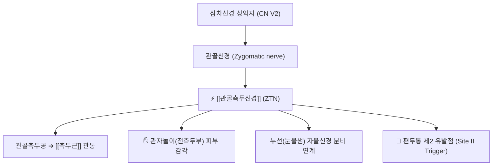

# ⚡ [[관골측두신경]] (Zygomaticotemporal Nerve / 顴骨側頭神經, CN V2)

> **핵심 3줄 요약 (Key Summary)**:
> - 🗺️ 신경 기원 & 해부학적 주행: 삼차신경 제2지인 상악신경(Maxillary nerve, CN V2)의 관골신경(Zygomatic nerve) 분지, 하안와열을 지나 안와 외측벽의 관골측두공을 관통하여 [[측두근]](Temporalis)을 뚫고 피하로 상행.
> - 🎯 운동 지배(근육군) & 감각 지배 영역: 순수 감각 신경. 외안각(눈꼬리) 외측 관자놀이(측두부 전방) 피부 감각 지배, 누선(눈물샘) 부교감신경 분비 섬유 전달.
> - ⚠️ 호발 포착 부위 & 관련 임상 질환: 관골측두공(Zygomaticotemporal foramen) 골관 및 [[측두근]] 심부근막 관통부, [[측두부 편두통]](Migraine trigger site 2), 관자놀이 압박성 두통.
> - 🔍 주요 이학적 검사 & 신경학적 징후: 안와 외측연 후방 1.5cm 지점 티넬 징후, 측두근 악력 저작 시 관자놀이 두통 악화.

---

## 📌 목차
1. [신경 기원 & 해부학적 분지 경로 (Anatomy & Course)](#1-신경-기원--해부학적-분지-경로-anatomy--course)
2. [신경 지배 맵 & 기능 네트워크 (Innervation Map)](#2-신경-지배-맵--기능-네트워크-innervation-map)
3. [호발 포착 부위 & 터널 증후군 병태생리](#3-호발-포착-부위--터널-증후군-병태생리)
4. [손상 레벨별 임상 증상 & 신경학적 결손](#4-손상-레벨별-임상-증상--신경학적-결손)
5. [관련 이학적 검사 & 신경 감별 매트릭스](#5-관련-이학적-검사--신경-감별-매트릭스)
6. [한의 신경 치료 프로토콜 (약침·침도·신경수기)](#6-한의-신경-치료-프로토콜-약침침도신경수기)
7. [💡 사용자 진료실 핵심 필기 & 임상 팁 (원문 보존)](#7--사용자-진료실-핵심-필기--임상-팁-원문-보존)
8. [출처 및 학술 참고 문헌 (References)](#8-출처-및-학술-참고-문헌-references)

---

## 1. 신경 기원 & 해부학적 분지 경로 (Anatomy & Course)

![[관골측두신경-상악신경-Gray778.png|420]]
> [그림 1] 안와 내벽에서 기원하여 안와 외측벽 관골측두공을 관통해 측두부로 진입하는 [[관골측두신경]]의 해부도 (출처: Gray's Anatomy)

* **신경 기원 (Origin & Spinal Segments)**:
  * 삼차신경(Trigeminal nerve, CN V)의 제2 분지인 **상악신경(Maxillary nerve, V2)**에서 분지하는 관골신경(Zygomatic nerve)의 종말 분지입니다.
* **상세 주행 경로 (Detailed Pathway)**:
  1. 익구개와에서 분지하여 하안와열(Inferior orbital fissure)을 통해 안와강 외측벽으로 들어갑니다.
  2. 안와 외측벽의 관골(광대뼈) 내면에 위치한 **관골측두공(Zygomaticotemporal foramen)**을 통과합니다.
  3. 측두와(Temporal fossa)로 나와 [[측두근]](Temporalis) 전방 섬유를 뚫거나 그 전면을 지나 측두심근막을 관통합니다.
  4. 관자놀이(측두부 전방) 피하지방층으로 진입하여 이마 외측 및 전측두부 피부로 분지합니다.

---

## 2. 신경 지배 맵 & 기능 네트워크 (Innervation Map)

### 1) 감각 및 자율신경 지배
* 관자놀이 전방부 피부 통각 및 촉각을 담당하며, 익구개신경절 유래 부교감신경 섬유를 눈물샘신경으로 전달하는 교통로 역할을 합니다.

---

## 3. 호발 포착 부위 & 터널 증후군 병태생리

* **편두통의 핵심 트리거 포인트 (Bahman Guyuron 분류 Site II)**:
  * 외안각(눈꼬리)에서 외방으로 약 1.5cm, 상방으로 1.5cm 지점의 측두근 섬유와 근막 관통부에서 신경이 포착되면, 박동성의 극심한 **관자놀이 [[편두통]]**이 촉발됩니다.
* **이갈이 및 턱관절 장애 연계**:
  * 스트레스나 이악물기로 측두근이 만성 연축되면 관골측두공 출구가 좁아지며 신경 허혈이 악화됩니다.

---

## 4. 손상 레벨별 임상 증상 & 신경학적 결손

* 관자놀이를 바늘로 찌르거나 쥐어짜는 듯한 편두통, 모자나 안경테가 닿을 때 심해지는 이질통, 눈물이 동반되는 자율신경성 두통.

---

## 5. 관련 이학적 검사 & 신경 감별 매트릭스

* **관골측두공 압통 검사**: 눈꼬리 외측 관골궁 상방 1.5cm 지점을 지그시 누를 때 평소 앓던 관자놀이 편두통이 즉각 유발되면 양성.

---

## 6. 한의 신경 치료 프로토콜 (약침·침도·신경수기)

* **태양혈(EX-HN5) 침도 미세 감압**:
  * 관자놀이 태양혈 부위의 측두근막 긴장대에 침도를 접촉하여 미세 절개 감압술을 시행합니다.
* **측두근 이완 침치료 및 신바로 약침**:
  * 하관(ST7), 솔곡(GB8), 현로(GB5)에 자침하여 측두근 과긴장을 해소합니다.

---

## 7. 💡 사용자 진료실 핵심 필기 & 임상 팁 (원문 보존)

* **"안경만 쓰면 관자놀이가 쑤신다"는 편두통 환자**:
  * 안경다리가 닿는 관자놀이 부위가 아파서 안경을 못 쓰겠다는 환자는 관골측두신경의 포착입니다.
  * 태양혈 바로 앞쪽 관골측두신경 출구에 약침 0.2cc를 주입하면 즉각 안경 압박통이 소실됩니다.

---

## 8. 출처 및 학술 참고 문헌 (References)

* Demartini, Z., et al. (2025). "Ultrasound-guided pulsed radiofrequency of zygomaticotemporal nerve for refractory temporal headaches." *Anaesthesia Reports*, 13(2), e12340. [PMID: 41133131](https://pubmed.ncbi.nlm.nih.gov/41133131/)
  - [연구 요약]: 난치성 관자놀이 편두통 환자에서 관골측두신경의 고주파 감압 시술과 초음파 해부학적 유도 기법 검증.
* Janis, J. E., et al. (2019). "Nerve Entrapment Headaches at the Temple: Zygomaticotemporal and/or Auriculotemporal Nerve?" *Pain Physician*, 22(1), E45-E54. [PMID: 30700076](https://pubmed.ncbi.nlm.nih.gov/30700076/)
  - [연구 요약]: 측두부 두통에서 관골측두신경과 이개측두신경의 포착 부위 감별 진단 및 수술적 감압술 효과 규명.
* Totonchi, A., et al. (2010). "The zygomaticotemporal branch of the trigeminal nerve: Part II. Anatomical variations." *Plastic and Reconstructive Surgery*, 126(2), 589-594. [PMID: 20375758](https://pubmed.ncbi.nlm.nih.gov/20375758/)
  - [연구 요약]: 카데바 해부를 통한 관골측두신경의 측두근 관통 지점 지형도 및 편두통 유발 메커니즘 분석.

<!-- 보관 태그(1회용·링크오류, 필요시 복원): 측두부 -->
