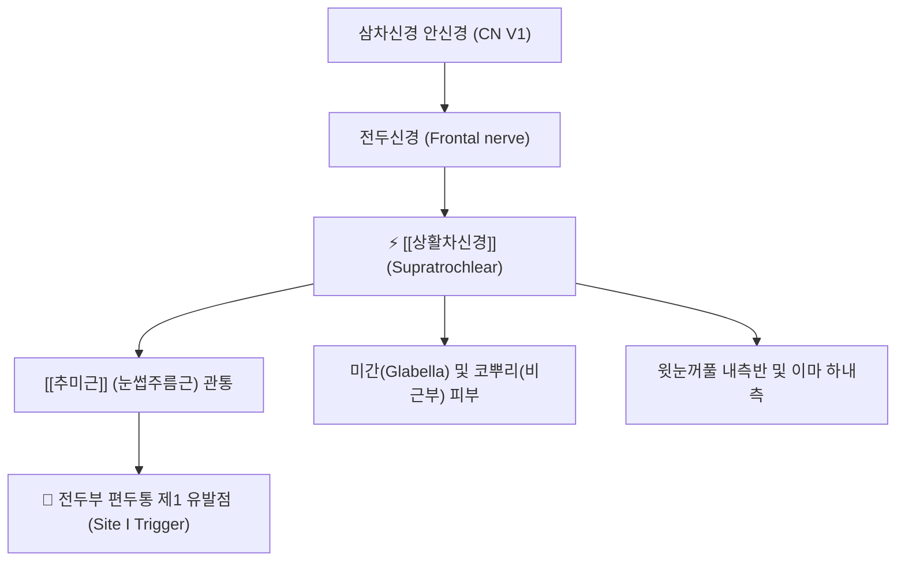

# ⚡ [[상활차신경]] (Supratrochlear Nerve / 上滑車神經, CN V1)

> **핵심 3줄 요약 (Key Summary)**:
> - 🗺️ 신경 기원 & 해부학적 주행: 삼차신경 제1지인 안신경(Ophthalmic nerve, CN V1) 전두신경 분지, 상사근 활차(Trochlea) 상방을 통과하여 [[추미근]](Corrugator supercilii) 및 전두근을 뚫고 이마 내측 피하로 상행.
> - 🎯 운동 지배(근육군) & 감각 지배 영역: 순수 감각 신경. 미간(Glabella), 코뿌리(비근부), 상안검(윗눈꺼풀) 내측 및 이마 하내측 피부 감각 지배.
> - ⚠️ 호발 포착 부위 & 관련 임상 질환: [[추미근]] 실질 관통부(미간 주름근), [[전두부 편두통]](Frontal migraine trigger site 1), 미간 찌푸림 시 안와상부 신경통.
> - 🔍 주요 이학적 검사 & 신경학적 징후: 안와 상내측 연(찬죽혈 부근) 압통 및 방사통, 미간 핀치(Pinch) 유발 검사.

---

## 📌 목차
1. [신경 기원 & 해부학적 분지 경로 (Anatomy & Course)](#1-신경-기원--해부학적-분지-경로-anatomy--course)
2. [신경 지배 맵 & 기능 네트워크 (Innervation Map)](#2-신경-지배-맵--기능-네트워크-innervation-map)
3. [호발 포착 부위 & 터널 증후군 병태생리](#3-호발-포착-부위--터널-증후군-병태생리)
4. [손상 레벨별 임상 증상 & 신경학적 결손](#4-손상-레벨별-임상-증상--신경학적-결손)
5. [관련 이학적 검사 & 신경 감별 매트릭스](#5-관련-이학적-검사--신경-감별-매트릭스)
6. [한의 신경 치료 프로토콜 (약침·침도·신경수기)](#6-한의-신경-치료-프로토콜-약침침도신경수기)
7. [💡 사용자 진료실 핵심 필기 & 임상 팁 (원문 보존)](#7--사용자-진료실-핵심-필기--임상-팁-원문-보존)
8. [출처 및 학술 참고 문헌 (References)](#8-출처-및-학술-참고-문헌-references)

---

## 1. 신경 기원 & 해부학적 분지 경로 (Anatomy & Course)

![[7. 얼굴신경-20240915222603541.png|420]]
> [그림 1] 안와 상벽을 주행하여 추미근을 뚫고 미간과 이마 내측으로 분지하는 [[상활차신경]]과 안면 신경망

* **신경 기원 (Origin & Spinal Segments)**:
  * 삼차신경(CN V)의 제1 분지인 **안신경(Ophthalmic nerve, V1)**의 주 줄기인 전두신경(Frontal nerve)에서 분지합니다.
* **상세 주행 경로 (Detailed Pathway)**:
  1. 안와강 상벽을 따라 전방으로 주행하다가 상안와연에 도달하기 전 안와상신경의 내측에서 분기합니다.
  2. 안구의 상사근 활차(Trochlea) 바로 윗부분을 지나 안와강을 빠져나옵니다.
  3. 눈썹 안쪽 끝의 **[[추미근]](Corrugator supercilii)** 근육 섬유를 수직 관통합니다.
  4. 전두근(Frontalis) 심층 근막을 뚫고 피하로 올라와 미간과 이마 내측 피부로 방사상 분지합니다.

---

## 2. 신경 지배 맵 & 기능 네트워크 (Innervation Map)

---

## 3. 호발 포착 부위 & 터널 증후군 병태생리

* **추미근(눈썹주름근) 근복 관통 터널**:
  * 스트레스, 모니터 주시, 눈부심 등으로 미간을 찌푸리는 습관이 지속되면 추미근이 비후·경축되어 관통하는 상활차신경을 강하게 쥐어짜며 허혈성 두통을 유발합니다 (Guyuron 편두통 분류 제1 트리거 사이트).

---

## 4. 손상 레벨별 임상 증상 & 신경학적 결손

* 눈썹 안쪽 및 미간 부위가 묵직하고 찌르는 듯한 통증, 눈을 크게 뜨거나 찌푸릴 때 통증 심화, 안구 내측 연관통.

---

## 5. 관련 이학적 검사 & 신경 감별 매트릭스

* **찬죽혈(BL2) 압진 검사**: 눈썹 안쪽 끝 오목한 부위를 손가락 끝으로 압박할 때 이마 안쪽으로 방사통 유발 여부 확인.

---

## 6. 한의 신경 치료 프로토콜 (약침·침도·신경수기)

* **찬죽(BL2) 침도 미세 박리술**:
  * 찬죽혈 부위 안와상연 골면에 침도를 접촉시켜 추미근 건막의 섬유성 조임을 횡방향으로 안전하게 절개합니다.
* **미간 부위 신바로 약침**:
  * 인당(EX-HN3)과 찬죽혈 피하에 약침 0.2cc를 주입하여 국소 신경 부종을 가라앉힙니다.

---

## 7. 💡 사용자 진료실 핵심 필기 & 임상 팁 (원문 보존)

* **"미간을 찌푸리면 머리가 지끈거려요"**:
  * 컴퓨터를 오래 보거나 집중할 때 인상을 쓰면서 이마 앞쪽이 조여오는 환자는 추미근에 상활차신경이 포착된 상태입니다.
  * 찬죽혈의 추미근을 침도로 살짝 풀어주면 찌푸릴 때의 통증이 즉각 사라지고 눈 뜨기가 훨씬 편안해집니다.

---

## 8. 출처 및 학술 참고 문헌 (References)

* Gfrerer, L., et al. (2020). "Migraine Surgery at the Frontal Trigger Site: An Analysis of Intraoperative Anatomy." *Plastic and Reconstructive Surgery*, 145(2), 523-531. [PMID: 31985652](https://pubmed.ncbi.nlm.nih.gov/31985652/)
  - [연구 요약]: 전두부 편두통 환자에서 상활차신경과 추미근 관통 경로의 해부학적 변이 분석 및 신경 감압 성적 규명.
* Vincent, M. B. (2018). "Treatment of Frontal Secondary Headache Attributed to Supratrochlear and Supraorbital Nerve Entrapment With Oral Medication or Botulinum Toxin Type A vs Endoscopic Decompression Surgery." *JAMA Facial Plastic Surgery*, 20(5), 370-377. [PMID: 29801115](https://pubmed.ncbi.nlm.nih.gov/29801115/)
  - [연구 요약]: 상활차신경 및 안와상신경 포착성 전두부 두통 환자의 약물, 보툴리눔 독소 및 수술적 감압 치료 효과 비교.
* Janis, J. E., et al. (2015). "Topographic Relationship between the Supratrochlear Nerve and Corrugator Supercilii Muscle." *Toxins*, 7(7), 2608-2619. [PMID: 26193317](https://pubmed.ncbi.nlm.nih.gov/26193317/)
  - [연구 요약]: 상활차신경과 추미근의 3차원 지형 해부도를 정립하고 신경 압박 차단점의 임상 좌표 제시.

<!-- 보관 태그(1회용·링크오류, 필요시 복원): 추미근 -->
