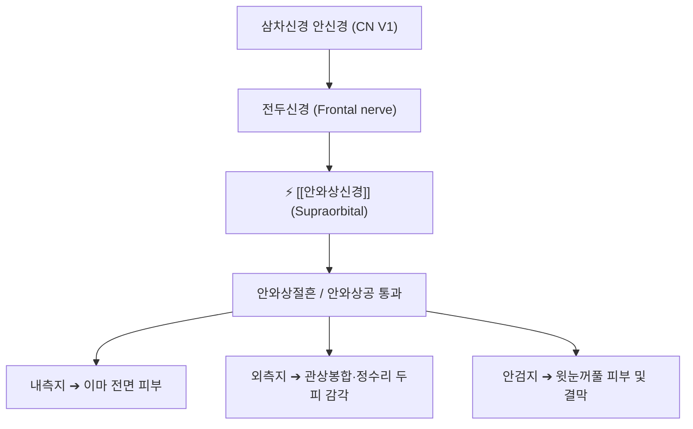

# ⚡ [[안와상신경]] (Supraorbital Nerve / 眼窩上神經, CN V1)

> **핵심 3줄 요약 (Key Summary)**:
> - 🗺️ 신경 기원 & 해부학적 주행: 삼차신경 안신경(CN V1) 전두신경의 외측 주 분지, 안와 상벽을 따라 전방으로 주행하여 **안와상절흔(Supraorbital notch) 또는 안와상공(Foramen)**을 통과해 이마와 두피로 상행.
> - 🎯 운동 지배(근육군) & 감각 지배 영역: 순수 감각 신경. 윗눈꺼풀 중앙부, 결막, 이마(전두부) 전면 및 두정부(정수리) 관상봉합선 부근까지 두피 감각 지배.
> - ⚠️ 호발 포착 부위 & 관련 임상 질환: 안와상절흔/공의 골성 인대 터널, [[안와상신경통]](Supraorbital neuralgia / Goggle headache, 안경·수경 압박통), 전두부 긴장성 편두통.
> - 🔍 주요 이학적 검사 & 신경학적 징후: 안와상절흔(눈썹 안쪽 1/3 지점) 압진 시 번개 치는 듯한 방전통(티넬 징후), 이마 두피 이질통.

---

## 📌 목차
1. [신경 기원 & 해부학적 분지 경로 (Anatomy & Course)](#1-신경-기원--해부학적-분지-경로-anatomy--course)
2. [신경 지배 맵 & 기능 네트워크 (Innervation Map)](#2-신경-지배-맵--기능-네트워크-innervation-map)
3. [호발 포착 부위 & 터널 증후군 병태생리](#3-호발-포착-부위--터널-증후군-병태생리)
4. [손상 레벨별 임상 증상 & 신경학적 결손](#4-손상-레벨별-임상-증상--신경학적-결손)
5. [관련 이학적 검사 & 신경 감별 매트릭스](#5-관련-이학적-검사--신경-감별-매트릭스)
6. [한의 신경 치료 프로토콜 (약침·침도·신경수기)](#6-한의-신경-치료-프로토콜-약침침도신경수기)
7. [💡 사용자 진료실 핵심 필기 & 임상 팁 (원문 보존)](#7--사용자-진료실-핵심-필기--임상-팁-원문-보존)
8. [출처 및 학술 참고 문헌 (References)](#8-출처-및-학술-참고-문헌-references)

---

## 1. 신경 기원 & 해부학적 분지 경로 (Anatomy & Course)

![[7. 얼굴신경-20240915222712514.png|420]]
> [그림 1] 안와상절흔을 통과하여 이마 전체와 관상봉합까지 두피 피하를 상행하는 [[안와상신경]]의 해부도

* **신경 기원 (Origin & Spinal Segments)**:
  * 삼차신경(CN V)의 제1 분지인 **안신경(Ophthalmic nerve, V1)**의 가장 굵은 분지인 전두신경(Frontal nerve)에서 유래합니다.
* **상세 주행 경로 (Detailed Pathway)**:
  1. 상안검거근(Levator palpebrae superioris) 상면을 따라 안와강 전방으로 직행합니다.
  2. 안와 상연 내측 1/3과 외측 2/3 경계에 위치한 **안와상절흔(Supraorbital notch)** 또는 뼈 구멍인 **안와상공(Supraorbital foramen)**을 통과합니다.
  3. 안와상연을 넘어 전두골 표면으로 꺾여 올라간 뒤, 내측지(Medial branch)와 외측지(Lateral branch)로 갈라집니다:
     * **내측지**: 전두근을 뚫고 표층으로 나와 이마 피부 지배.
     * **외측지**: 모상건막(Galea aponeurotica) 심층을 따라 두정골 관상봉합(정수리)까지 길게 상행.

---

## 2. 신경 지배 맵 & 기능 네트워크 (Innervation Map)

---

## 3. 호발 포착 부위 & 터널 증후군 병태생리

* **안와상절흔의 골성 인대 터널**:
  * 안와상절흔 입구를 가로지르는 골화된 섬유성 인대(Supraorbital ligament)에 신경이 끼이거나, 완전한 뼈 구멍(Foramen) 형태로 갇혀 있을 때 외부 압박에 취약해집니다.
* **모자, 고글, 헬멧 압박 (수경 두통, Goggle Headache)**:
  * 수영 안경이나 이마를 조이는 헬멧이 안와상절흔의 신경을 직접 누르면 허혈성 신경통이 발생합니다.

---

## 4. 손상 레벨별 임상 증상 & 신경학적 결손

* 눈썹 위에서부터 이마, 정수리까지 전기가 오듯 찌릿찌릿한 통증, 빗질할 때 두피가 따갑고 쓰라림, 이마 감각 마비.

---

## 5. 관련 이학적 검사 & 신경 감별 매트릭스

* **안와상절흔 압통 검사 (SON Notch Sign)**:
  * 눈썹 안쪽 1/3 부위의 뼈 홈을 손가락 끝으로 지그시 누를 때 이마 위로 뻗치는 방전통이 있으면 양성.

---

## 6. 한의 신경 치료 프로토콜 (약침·침도·신경수기)

* **어요(EX-HN4), 양백(GB14) 침도 감압술**:
  * 안와상절흔 입구에 침도를 골막과 수평 방향으로 접근시켜 인대성 결합조직을 미세 절개합니다.
* **신바로 약침 및 전침 요법**:
  * 안와상연 피하에 약침 0.2cc를 주입하고, 저주파 전침을 걸어 전두근 연축을 해소합니다.

---

## 7. 💡 사용자 진료실 핵심 필기 & 임상 팁 (원문 보존)

* **"모자만 쓰면 이마가 저려요" - 안와상신경통 감별**:
  * 모자나 헬멧 테두리가 닿는 이마 부위가 아프다는 환자는 눈썹뼈 안쪽 안와상절흔을 만져보아야 합니다.
  * 뼈 홈 부위가 좁아져 신경이 눌려 있는 경우가 많으며, 어요혈 주위를 침도로 1~2회 박리해주면 모자를 써도 통증이 재발하지 않습니다.

---

## 8. 출처 및 학술 참고 문헌 (References)

* Pareja, J. A., et al. (2001). "Supraorbital neuralgia: a clinical study." *Cephalalgia*, 21(3), 210-213. [PMID: 11442557](https://pubmed.ncbi.nlm.nih.gov/11442557/)
  - [연구 요약]: 안와상신경통의 전형적인 임상 양상, 안와상절흔 압통 진단 기준 및 국소 신경 차단술 효과 규명.
* Iwanaga, J., et al. (2014). "[Scalp neuralgia and headache elicited by cranial superficial anatomical causes: supraorbital neuralgia, occipital neuralgia, and post-craniotomy headache]." *Clinical Neurology (Rinsho Shinkeigaku)*, 54(12), 1012-1014. [PMID: 24943074](https://pubmed.ncbi.nlm.nih.gov/24943074/)
  - [연구 요약]: 두개골 표재 신경(안와상신경, 후두신경)의 해부학적 포착과 난치성 두피 신경통의 병태생리 고찰.
* Vincent, M. B. (2018). "Treatment of Frontal Secondary Headache Attributed to Supratrochlear and Supraorbital Nerve Entrapment." *JAMA Facial Plastic Surgery*, 20(5), 370-377. [PMID: 29801115](https://pubmed.ncbi.nlm.nih.gov/29801115/)
  - [연구 요약]: 안와상신경 감압 수술의 편두통 호전 효과 검증.

<!-- 보관 태그(1회용·링크오류, 필요시 복원): 이마통증 -->
