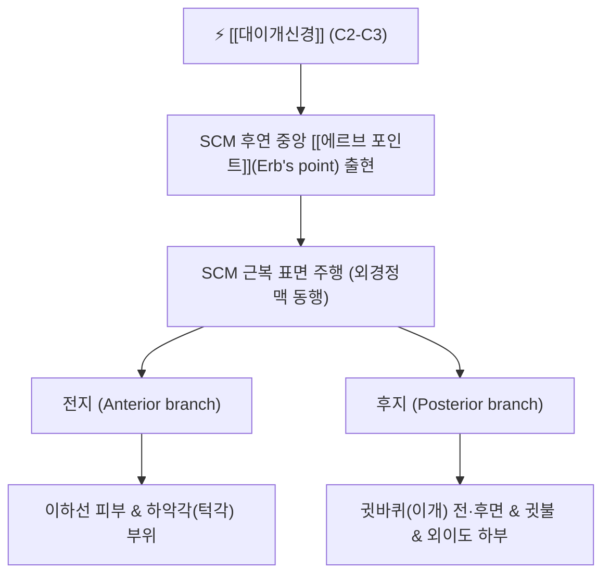

# ⚡ [[대이개신경]] (Great Auricular Nerve / 大耳介神經, C2-C3)

> **핵심 3줄 요약 (Key Summary)**:
> - 🗺️ 신경 기원 & 해부학적 주행: 경신경총(C2-C3) 기원, [[흉쇄유돌근]](SCM) 후연 중앙부인 에르브 포인트(Erb's point)에서 피하로 나와 SCM 표면을 사선으로 가로질러 귓바퀴로 상행.
> - 🎯 운동 지배(근육군) & 감각 지배 영역: 순수 감각 신경. 귓바퀴(이개) 전·후면 대부분, 외이도 하부, 턱각(하악각) 피부 및 이하선(침샘) 피막 감각 지배.
> - ⚠️ 호발 포착 부위 & 관련 임상 질환: SCM 후연 에르브 포인트 및 이하선 하연 결합조직, [[대이개신경통]](귓바퀴 주변 찌르는 듯한 통증), 턱관절 장애 연관 이개통, 이하선 수술 후 감각 이상.
> - 🔍 주요 이학적 검사 & 신경학적 징후: SCM 중간부 에르브 포인트 티넬 징후(귓바퀴 방사통), 귓바퀴 하부 감각 저하 또는 이질통.

---

## 📌 목차
1. [신경 기원 & 해부학적 분지 경로 (Anatomy & Course)](#1-신경-기원--해부학적-분지-경로-anatomy--course)
2. [신경 지배 맵 & 기능 네트워크 (Innervation Map)](#2-신경-지배-맵--기능-네트워크-innervation-map)
3. [호발 포착 부위 & 터널 증후군 병태생리](#3-호발-포착-부위--터널-증후군-병태생리)
4. [손상 레벨별 임상 증상 & 신경학적 결손](#4-손상-레벨별-임상-증상--신경학적-결손)
5. [관련 이학적 검사 & 신경 감별 매트릭스](#5-관련-이학적-검사--신경-감별-매트릭스)
6. [한의 신경 치료 프로토콜 (약침·침도·신경수기)](#6-한의-신경-치료-프로토콜-약침침도신경수기)
7. [💡 사용자 진료실 핵심 필기 & 임상 팁 (원문 보존)](#7--사용자-진료실-핵심-필기--임상-팁-원문-보존)
8. [출처 및 학술 참고 문헌 (References)](#8-출처-및-학술-참고-문헌-references)

---

## 1. 신경 기원 & 해부학적 분지 경로 (Anatomy & Course)

![[대이개신경_흉쇄유돌근_주행해부도_Gray.png|420]]
> [그림 1] 흉쇄유돌근(SCM) 후연의 Erb's point에서 나와 근복 표면을 타고 귓바퀴로 직행하는 [[대이개신경]]의 해부도 (출처: Gray's Anatomy)

* **신경 기원 (Origin & Spinal Segments)**:
  * 경신경총(Cervical plexus)의 표층 감각 분지 중 가장 굵은 신경으로, **제2, 3 경신경(C2, C3)** 전지에서 기원합니다.
* **상세 주행 경로 (Detailed Pathway)**:
  1. 경추 횡돌기 사이에서 나와 [[흉쇄유돌근]](Sternocleidomastoid, SCM)의 뒤쪽 가장자리 중앙부인 **에르브 포인트(Erb's point, 신경점)**에서 경부 심부근막을 뚫고 표층으로 나옵니다.
  2. 흉쇄유돌근의 외측 표면을 비스듬히 아래에서 위로, 뒤에서 앞으로 가로지르며 주행합니다.
  3. 외경정맥(External jugular vein)의 바로 뒤쪽에서 나란히 상행합니다.
  4. 귓바퀴(이개) 하단 및 이하선 부근에서 2개의 종말 분지로 갈라집니다:
     * **전지(Anterior branch)**: 이하선 표면 피부 및 하악각(턱모서리) 부위 피부로 분지.
     * **후지(Posterior branch)**: 귓바퀴 후면, 유돌돌기 피부, 귓불(이수) 및 외이도 바닥으로 분지.

---

## 2. 신경 지배 맵 & 기능 네트워크 (Innervation Map)

![[경신경총-신경가지-Gray805.png|430]]
> [그림 2] 경신경총의 4대 표층 감각 신경망(소후두신경, 대이개신경, 횡경신경, 쇄골상신경)의 체표 투영도

### 1) 감각 신경 지배 (Sensory Distribution)
* 귓바퀴(이개)의 상부 일부(외이신경 지배)를 제외한 **이개의 전·후면 대부분, 귓불(Lobule), 외이도 입구 하부, 이하선 피막 및 하악각 피부**의 체성 감각을 담당합니다.

---

## 3. 호발 포착 부위 & 터널 증후군 병태생리

* **SCM 후연 에르브 포인트(Erb's point)**:
  * 거북목 자세나 교통사고 편타 손상 시 SCM이 단축·경직되면 심부근막을 뚫고 나오는 신경 출구에서 조임이 발생합니다.
* **하악각 및 이하선 하연 결합조직**:
  * 턱관절 장애나 이갈이로 익돌근과 교근, 이하선 근막이 긴장할 때 말단 분지가 압박됩니다.

---

## 4. 손상 레벨별 임상 증상 & 신경학적 결손

| 상태 | 주요 임상 양상 | 신경학적 소견 |
| :--- | :--- | :--- |
| **대이개신경통 (Neuralgia)** | 귓바퀴 주변이 콕콕 쑤시고 타는 듯한 날카로운 발작통, 귓불을 만지면 통증 | Erb's point 압진 시 귓바퀴로 통증 방사 |
| **신경 마비 / 손상** | 귓불과 귓바퀴 하부의 먹먹한 남의 살 같은 감각 저하 (면도 시 무감각) | 감각 둔마, 귀걸이 착용 시 통각 상실 |

---

## 5. 관련 이학적 검사 & 신경 감별 매트릭스

* **에르브 포인트 티넬 검사 (Erb's Point Tinel Sign)**:
  * 흉쇄유돌근 후연 중앙부를 검지 끝으로 톡톡 두드렸을 때 귓바퀴와 턱각으로 찌릿한 방전통이 번지면 양성.
* **이비인후과적 중이염/외이도염 감별**:
  * 이경 검사상 고막과 외이도 점막이 깨끗함에도 귀 주변 통증을 호소할 때 대이개신경통 확진.

---

## 6. 한의 신경 치료 프로토콜 (약침·침도·신경수기)

* **에르브 포인트(천정혈) 약침 치료**:
  * SCM 후연 중앙 Erb's point 부위에 황련해독탕 또는 자하거 약침 0.3cc를 얕게 주입하여 피하 신경 부종을 가라앉힙니다.
* **예풍(TE17) 및 완골(GB12) 침치료**:
  * 귓바퀴 뒤쪽 유돌돌기 주변 압통점에 0.25×30mm 침으로 자침하여 후지 분지의 포착을 해소합니다.
* **SCM 근막 이완술 (SCM Release)**:
  * 환자의 고개를 반대측으로 회전시킨 상태에서 SCM 근복을 집게손가락으로 부드럽게 쥐어 유착을 풀어줍니다.

---

## 7. 💡 사용자 진료실 핵심 필기 & 임상 팁 (원문 보존)

* **이비인후과에서 "귀에 이상 없다"는데 귀가 아프다는 환자**:
  * 귀 안쪽이 쑤시고 아파서 이비인후과를 3군데나 다녔는데 중이염도 아니고 고막도 멀쩡하다는 환자는 십중팔구 대이개신경통입니다.
  * 목 옆의 흉쇄유돌근 중간을 살짝 눌러주면 환자가 "거길 누르면 바로 귀가 찌릿하다"고 소리칩니다. SCM만 2~3회 침으로 풀어주면 완치됩니다.

---

## 8. 출처 및 학술 참고 문헌 (References)

* Tubbs, R. S., et al. (2025). "The anatomy of the cutaneous branches of the cervical plexus and its clinical significance - The Great Auricular Nerve. A systematic review with meta-analysis." *Folia Morphologica*, 84(4), 712-723. [PMID: 41257499](https://pubmed.ncbi.nlm.nih.gov/41257499/)
  - [연구 요약]: 대이개신경의 척수 기원, 흉쇄유돌근 표면 주행 변이 및 귓바퀴 감각 지배 영역에 대한 메타분석과 임상 신경차단 랜드마크 제시.
* Sargon, M. F., et al. (2024). "Activation thresholds for electrical phrenic nerve stimulation at the neck: evaluation of stimulation pulse parameters in a simulation study." *Journal of Neural Engineering*, 21(6), 066021. [PMID: 39555768](https://pubmed.ncbi.nlm.nih.gov/39555768/)
  - [연구 요약]: 경부 외측 삼각에서 경신경총 피하지들과 인접 심부 신경의 해부학적 상관관계를 전산화 시뮬레이션으로 규명.
* Gurses, I. A., et al. (2024). "Spinal accessory nerve anatomy in the posterior cervical triangle: A systematic review with meta-analysis." *Clinical Anatomy*, 37(1), 58-69. [PMID: 37767816](https://pubmed.ncbi.nlm.nih.gov/37767816/)
  - [연구 요약]: 후경각에서 Erb's point 주변을 통과하는 대이개신경과 부신경의 주행 교차점 및 의인성 손상 방지 가이드라인 제시.

<!-- 보관 태그(1회용·링크오류, 필요시 복원): 귓바퀴통증 -->
