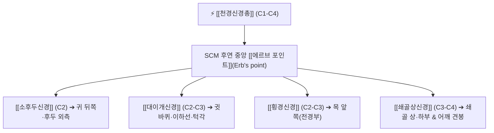

# ⚡ [[천경신경총]] (Superficial Cervical Plexus / 淺頸神經叢, C1-C4)

> **핵심 3줄 요약 (Key Summary)**:
> - 🗺️ 신경 기원 & 해부학적 주행: 제1~4경신경(C1-C4) 전지에서 기원, [[흉쇄유돌근]](SCM) 후연 중앙부인 **[[에르브 포인트]](Erb's point / 신경점)**에서 경부 심부근막을 뚫고 표층 피하로 일괄 출현.
> - 🎯 운동 지배(근육군) & 감각 지배 영역: 순수 감각 신경망 총칭. 4대 주요 피하지([[소후두신경]], [[대이개신경]], [[횡경신경]], [[쇄골상신경]])를 통해 후두부·귓바퀴·전경부·쇄골상부 피부 감각 전담.
> - ⚠️ 호발 포착 부위 & 관련 임상 질환: SCM 후연 에르브 포인트 근막 출구, 경부 신경통, 거북목 및 편타 손상 후 경부 방사통, 천경신경총 차단술(SCPB) 부위.
> - 🔍 주요 이학적 검사 & 신경학적 징후: SCM 후연 중앙부 티넬 징후(귀·목·쇄골 방사통), 두경부 피부분절 감각 이상 스크리닝.

---

## 📌 목차
1. [신경 기원 & 해부학적 분지 경로 (Anatomy & Course)](#1-신경-기원--해부학적-분지-경로-anatomy--course)
2. [신경 지배 맵 & 기능 네트워크 (Innervation Map)](#2-신경-지배-맵--기능-네트워크-innervation-map)
3. [호발 포착 부위 & 터널 증후군 병태생리](#3-호발-포착-부위--터널-증후군-병태생리)
4. [손상 레벨별 임상 증상 & 신경학적 결손](#4-손상-레벨별-임상-증상--신경학적-결손)
5. [관련 이학적 검사 & 신경 감별 매트릭스](#5-관련-이학적-검사--신경-감별-매트릭스)
6. [한의 신경 치료 프로토콜 (약침·침도·신경수기)](#6-한의-신경-치료-프로토콜-약침침도신경수기)
7. [💡 사용자 진료실 핵심 필기 & 임상 팁 (원문 보존)](#7--사용자-진료실-핵심-필기--임상-팁-원문-보존)
8. [출처 및 학술 참고 문헌 (References)](#8-출처-및-학술-참고-문헌-references)

---

## 1. 신경 기원 & 해부학적 분지 경로 (Anatomy & Course)

![[경신경총-신경가지-Gray805.png|430]]
> [그림 1] C1-C4 전지에서 형성되어 Erb's point에서 사방으로 뻗어나가는 [[천경신경총]]의 4대 피하 분지 해부도 (출처: Gray's Anatomy)

* **신경 기원 (Origin & Spinal Segments)**:
  * 경신경총(Cervical plexus)의 표층 감각 분지군으로, **제1, 2, 3, 4 경신경(C1-C4)** 전지의 문합 고리에서 형성됩니다.
* **에르브 포인트(Erb's point, Punctum nervosum)와 4대 방사 분지**:
  * 흉쇄유돌근(SCM) 후연의 위아래 1/2 중간 지점에서 경부 심부근막(Deep cervical fascia)을 뚫고 피하로 일괄 솟아오른 뒤, 4방향으로 방사상 분지합니다:
    1. **상행 분지 1**: **[[소후두신경]](Lesser occipital nerve, C2)** $
ightarrow$ SCM 후연을 따라 상행하여 측두부 후면 및 후두 외측 피부로 주행.
    2. **상행 분지 2**: **[[대이개신경]](Great auricular nerve, C2-C3)** $
ightarrow$ SCM 표면을 사선으로 가로질러 귓바퀴(이개) 및 이하선으로 주행.
    3. **횡행 분지**: **[[횡경신경]](Transverse cervical nerve, C2-C3)** $
ightarrow$ SCM 중앙부를 수평으로 가로질러 전경부(목 앞쪽) 피부로 주행.
    4. **하행 분지**: **[[쇄골상신경]](Supraclavicular nerve, C3-C4)** $
ightarrow$ 후경삼각 피하를 하행하여 쇄골을 넘어 흉골·어깨 전면 피부로 주행.

---

## 2. 신경 지배 맵 & 기능 네트워크 (Innervation Map)

![[경부신경-체표투영-Gray1210.png|420]]
> [그림 2] 경부 외측 삼각에서 관찰되는 천경신경총 가지들의 체표 투영도

---

## 3. 호발 포착 부위 & 터널 증후군 병태생리

* **에르브 포인트(Erb's point) 근막 출구 비후**:
  * 목을 앞으로 빼는 거북목 자세나 전화기를 귀와 어깨 사이에 끼우는 습관은 SCM 후연의 근막을 만성 긴장시켜 4대 피하신경 출구를 동시에 조입니다.

---

## 4. 손상 레벨별 임상 증상 & 신경학적 결손

* **천경신경총 증후군**: 귀 뒤, 귓바퀴, 목 앞, 쇄골 위까지 목덜미 전체가 뻐근하고 만지면 스멀거리거나 남의 살처럼 감각이 이상함.
* **경부 림프절 수술 또는 갑상선 수술 후 합병증**: 수술 절개선 부위의 신경 절단으로 목 앞과 귓불의 영구적 감각 마비 발생.

---

## 5. 관련 이학적 검사 & 신경 감별 매트릭스

* **Erb's point 압진 티넬 검사**:
  * SCM 뒤쪽 중간점을 엄지로 가볍게 눌렀을 때 귀 뒤, 귓바퀴, 쇄골로 동시에 찌릿한 방전통이 방사되면 양성.

---

## 6. 한의 신경 치료 프로토콜 (약침·침도·신경수기)

* **Erb's point(천정혈 LI17 외방) 침도 미세 감압**:
  * SCM 후연 중앙 피하지방층에 침도를 얕게 자입하여 심부근막 출구의 섬유성 조임을 해소합니다.
* **천경신경총 약침 요법**:
  * Erb's point 주변 피하에 자하거 약침 또는 신바로 약침 0.5cc를 부채꼴 모양으로 나누어 침윤 주입합니다.

---

## 7. 💡 사용자 진료실 핵심 필기 & 임상 팁 (원문 보존)

* **목 옆의 마스터 포인트 (Erb's point)**:
  * "목도 아프고 귀도 아프고 쇄골도 아프다"며 통증 부위가 산발적인 환자는 여러 군데 침을 놓을 필요 없이, SCM 후연 중간의 Erb's point 한 자리에 약침 0.5cc를 주입하고 SCM을 이완시키면 4개 신경이 동시에 감압되어 모든 증상이 한 번에 호전됩니다.

---

## 8. 출처 및 학술 참고 문헌 (References)

* Tang, J., et al. (2026). "Anatomical study of the superficial cervical plexus targeted for sensory nerve blocks in neonates." *Regional Anesthesia and Pain Medicine*, 51(8), 612-619. [PMID: 40866302](https://pubmed.ncbi.nlm.nih.gov/40866302/)
  - [연구 요약]: 천경신경총의 Erb's point 출현 위치 및 4대 피하지의 분지 변이와 국소마취 차단술의 정밀 해부학적 좌표 분석.
* Wang, Y., et al. (2026). "Anatomical and Morphological Structure of the Lesser Occipital Nerve." *Zhongguo Yi Xue Ke Xue Yuan Xue Bao*, 48(4), 485-491. [PMID: 42660834](https://pubmed.ncbi.nlm.nih.gov/42660834/)
  - [연구 요약]: 천경신경총 기원 소후두신경의 주행 및 상완신경총·부신경과의 미세 신경 교통지 해부도 규명.
* Kim, H. S., et al. (2026). "Regional Anaesthesia Approaches in Head and Neck Surgery: Current Evidence and Clinical Applications." *Journal of Clinical Medicine*, 15(9), 3120. [PMID: 42194532](https://pubmed.ncbi.nlm.nih.gov/42194532/)
  - [연구 요약]: 두경부 및 갑상선 수술 시 천경신경총 초음파 유도하 신경 차단술의 진통 효과와 안전성 고찰.

<!-- 보관 태그(1회용·링크오류, 필요시 복원): 피하신경 -->
