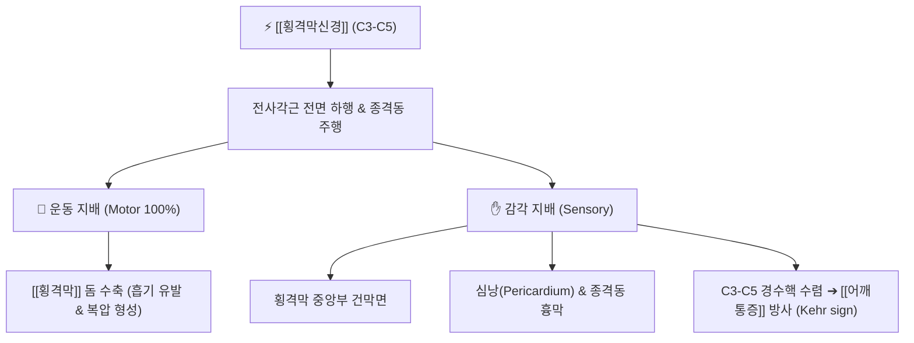

# ⚡ [[횡격막신경]] (Phrenic Nerve / 膈神經, C3-C5)

> **핵심 3줄 요약 (Key Summary)**:
> - 🗺️ 신경 기원 & 해부학적 주행: 제3~5경신경(C3-C5, 주로 C4) 전지 기원, [[전사각근]](Scalenus anterior) 전면을 사선으로 하행하여 쇄골하동정맥 사이를 지나 종격동을 거쳐 [[횡격막]](Diaphragm)으로 진입.
> - 🎯 운동 지배(근육군) & 감각 지배 영역: 주 호흡근인 [[횡격막]]의 유일한 운동 신경 지배(100%), 횡격막 중앙부·심낭(Pericardium)·종격동 흉막의 감각 지배.
> - ⚠️ 호발 포착 부위 & 관련 임상 질환: 전사각근 비후 및 흉곽상구 포착, [[횡격막 마비]](기이호흡), 난치성 딸꾹질, 심폐 질환 시 C3-C5 분절을 통한 어깨·쇄골상부 연관통(Kehr 징후).
> - 🔍 주요 이학적 검사 & 신경학적 징후: 형광투시 스니프 검사(Sniff test, 환측 횡격막 역설적 거상), 흉부 X-ray 횡격막 거상 소견, 폐활량(FVC) 앙와위 급감.

---

## 📌 목차
1. [신경 기원 & 해부학적 분지 경로 (Anatomy & Course)](#1-신경-기원--해부학적-분지-경로-anatomy--course)
2. [신경 지배 맵 & 기능 네트워크 (Innervation Map)](#2-신경-지배-맵--기능-네트워크-innervation-map)
3. [호발 포착 부위 & 터널 증후군 병태생리](#3-호발-포착-부위--터널-증후군-병태생리)
4. [손상 레벨별 임상 증상 & 신경학적 결손](#4-손상-레벨별-임상-증상--신경학적-결손)
5. [관련 이학적 검사 & 신경 감별 매트릭스](#5-관련-이학적-검사--신경-감별-매트릭스)
6. [한의 신경 치료 프로토콜 (약침·침도·신경수기)](#6-한의-신경-치료-프로토콜-약침침도신경수기)
7. [💡 사용자 진료실 핵심 필기 & 임상 팁 (원문 보존)](#7--사용자-진료실-핵심-필기--임상-팁-원문-보존)
8. [출처 및 학술 참고 문헌 (References)](#8-출처-및-학술-참고-문헌-references)

---

## 1. 신경 기원 & 해부학적 분지 경로 (Anatomy & Course)

![[횡격막신경-주행-Gray806.png|420]]
> [그림 1] 경추 분절(C3-C5)에서 기원하여 전사각근 전면을 하행하는 [[횡격막신경]]의 경부 해부학적 주행도 (출처: Gray's Anatomy)

* **신경 기원 (Origin & Spinal Segments)**:
  * 경신경총(Cervical plexus) 및 상완신경총 기저부의 **제3, 4, 5 경신경(C3, C4, C5)** 전지에서 기원하며, 주 분지는 C4에서 유래합니다 ("C3, 4, 5 keeps the diaphragm alive").
* **상세 주행 경로 (Detailed Pathway)**:
  1. **경부 주행**: [[전사각근]](Scalenus anterior)의 외측연 상부에서 형성되어, 전사각근초(Fascial sheath) 심부에서 근복의 전면을 외측에서 내측으로 비스듬히 가로지르며 하행합니다.
  2. **흉곽 상구 통과**: 쇄골하동맥(Subclavian artery)의 앞쪽과 쇄골하정맥(Subclavian vein)의 뒤쪽 사이 간극을 통과하여 종격동으로 진입합니다.
  3. **흉강 및 종격동 주행**: 심막횡격동맥(Pericardiacophrenic artery)과 나란히 주행하며, 우측 신경은 상대정맥 및 심낭 우측을 지나고, 좌측 신경은 대동맥궁과 좌심실 외측 심낭을 따라 주행합니다.
  4. **종말 분지**: [[횡격막]](Diaphragm)의 흉강면에 도달하여 건막(Central tendon) 부위에서 방사상으로 근육지(Muscular branches)를 냅니다.

---

## 2. 신경 지배 맵 & 기능 네트워크 (Innervation Map)

![[횡격막과 갈비 형태-20240825222204402.png|450]]
> [그림 2] [[횡격막]]의 돔 구조 및 흉곽 내벽 부착부 — 횡격막신경에 의해 통어되는 인체 중심 호흡 펌프 구조

### 1) 운동 신경 지배 (Motor Innervation)
* **[[횡격막]](Diaphragm)**: 인체 전체 환기량의 70% 이상을 담당하는 주 호흡근에 대한 **유일한 운동 신경 지배**를 제공합니다. 신경 자극 시 횡격막이 수축·하강하여 흉강 음압을 형성하고 공기를 흡입합니다.

### 2) 감각 신경 지배 (Sensory Innervation)
* 횡격막의 중앙부 건막 및 흉막·복막면, 섬유성 심낭 및 벽측 종격동 흉막의 고유 감각과 통각을 전달합니다.
* (주변부 횡격막 감각은 하부 늑간신경 T7-T12가 지배).

---

## 3. 호발 포착 부위 & 터널 증후군 병태생리

![[횡격막신경-종격동횡격막-Gray808.png|430]]
> [그림 3] 흉곽 상구를 지나 종격동 심낭 외측을 타고 횡격막 실질로 관통하는 주행도 (출처: Gray's Anatomy)

* **제1 포착 부위: 전사각근 전면 근막 터널**:
  * 컴퓨터 업무, 거북목([[거북목 증후군]]), [[상부교차 증후군]]으로 인해 [[전사각근]]과 [[중사각근]]이 비후·단축되면 전사각근 표면을 감싸는 경정맥하 근막이 조여지며 횡격막신경이 기계적으로 압박됩니다.
* **제2 포착 부위: 쇄골하혈관 간극 및 흉곽 상구**:
  * 쇄골 골절 후 가골 형성이나 [[흉곽출구 증후군]](TOS) 환경에서 쇄골하동정맥 사이 주행로가 협착되어 견인 손상이 발생합니다.

---

## 4. 손상 레벨별 임상 증상 & 신경학적 결손

| 손상/병변 유형 | 주요 호소 증상 | 호흡역학적 결손 | 전형적 징후 |
| :--- | :--- | :--- | :--- |
| **편측 횡격막신경 마비** | 안정 시 무증상, 운동 시 호흡곤란, 앙와위 호흡곤란 | 폐활량(FVC) 20~30% 감소 | 흉부 X-ray상 환측 횡격막 거상, 흡기 시 기이운동 |
| **양측 횡격막신경 손상** | 극심한 기좌호흡, 수면무호흡, 폐포저환기 | 앙와위 폐활량 50% 이상 급감 | 보조호흡근([[흉쇄유돌근]], [[사각근]])의 병적 과흥분 |
| **신경 포착 및 자극** | 난치성 만성 딸꾹질, 가슴 답답함, 어깨 방사통 | 얕고 빠른 흉식 호흡 패턴 고착 | 동측 [[견갑거근]] 및 승모근 상부 만성 결림 동반 |

---

## 5. 관련 이학적 검사 & 신경 감별 매트릭스

* **형광투시 스니프 검사 (Fluoroscopic Sniff Test)**:
  * 환자에게 코로 빠르게 숨을 들이마시게(Sniff) 할 때 정상 횡격막은 하강하지만, 마비된 횡격막은 흉강 내 음압에 의해 위로 딸려 올라가는 **역설적 기이운동(Paradoxical motion)**을 확인하여 확진.
* **커 징후 (Kehr's Sign)**:
  * 비장 파열, 횡격막 하 농양, 담낭염 등으로 횡격막이 자극될 때 C3-C5 감각신경 수렴 현상으로 좌측 또는 우측 쇄골상와 및 어깨 견봉 부위로 날카로운 통증이 투사됨.

---

## 6. 한의 신경 치료 프로토콜 (약침·침도·신경수기)

* **전사각근 간극 침도 미세 감압술**:
  * 흉쇄유돌근 후연과 전사각근 사이 횡격막신경 주행 경로(C4 분절 높이)를 초음파로 확인하거나 경추 횡돌기 전결절을 촉지한 후, 침도를 사각으로 진입시켜 경부 심부 근막 유착을 안전하게 박리합니다.
* **신경 약침 요법**:
  * 결분(ST12), 천주(BL10), 기사(ST11) 부위에 자하거 약침 또는 신바로 약침 0.3~0.5cc를 주입하여 신경 부종과 허혈을 개선합니다.
* **흉곽 상구 및 경추 교정 추나**:
  * 상부 경추(C3-C5)의 회전 변위를 바로잡고, 쇄골과 제1늑골 간격을 넓히는 흉곽 출구 이완 수기요법을 병행합니다.

---

## 7. 💡 사용자 진료실 핵심 필기 & 임상 팁 (원문 보존)

* **어깨 결림 환자의 숨겨진 호흡근 이상 감별**:
  * 만성적으로 앞가슴 답답함과 함께 목·어깨 통증을 호소하는 환자 중, 폐나 심장 내과 검사에서 이상이 없는데도 횡격막 호흡이 전혀 안 되고 목 근육으로만 숨을 쉬는 환자는 십중팔구 [[전사각근]]에 횡격막신경이 눌려 있는 상태입니다.
  * 전사각근을 가볍게 압박했을 때 횡격막 부위의 불쾌감이나 어깨 끝으로 방사통이 재현되는지 반드시 확인해야 합니다.
* **난치성 딸꾹질(Singultus)의 침구 특효혈**:
  * 수일간 멈추지 않는 딸꾹질 환자에게 전사각근 부위의 천정(LI17) 및 결분(ST12)을 부드럽게 지압하고, 내관(PC6)과 족삼리(ST36)에 강자침을 시행하면 미주신경-횡격막신경 반사궁이 차단되어 즉각 소퇴됩니다.

---

## 8. 출처 및 학술 참고 문헌 (References)

* Waxenbaum, J. A., et al. (2026). "Anatomy, Head and Neck: Cervical Nerves." *StatPearls Publishing*. [PMID: 30844163](https://pubmed.ncbi.nlm.nih.gov/30844163/)
  - [연구 요약]: 경신경총의 형성과 C3-C5 전지에서 유래하는 횡격막신경의 경부 주행, 전사각근과의 해부학적 상관성 및 임상 손상 기전을 총괄 기술.
* Matsuoka, T., et al. (2013). "A new scenario of the evolutionary derivation of the mammalian diaphragm from shoulder muscles." *Journal of Anatomy*, 222(5), 504-518. [PMID: 23448284](https://pubmed.ncbi.nlm.nih.gov/23448284/)
  - [연구 요약]: 포유류 횡격막이 경추 부위 근육군에서 기원하여 하강했음을 발생학적으로 증명하고, 횡격막신경이 경추(C3-C5)에서 기원하여 흉강을 가로지르는 긴 주행로를 갖게 된 진화생물학적 메커니즘을 규명.
* Kaufman, M. R., et al. (2024). "Surgical Treatment of Phrenic Nerve Injury." *Thoracic Surgery Clinics*, 34(1), 45-56. [PMID: 8181380](https://pubmed.ncbi.nlm.nih.gov/38040439/)
  - [연구 요약]: 횡격막신경 손상 및 만성 압박 환자에서 신경 감압술과 재건술의 임상 성적을 분석하고 횡격막 운동성 회복 평가 지침을 제시.
