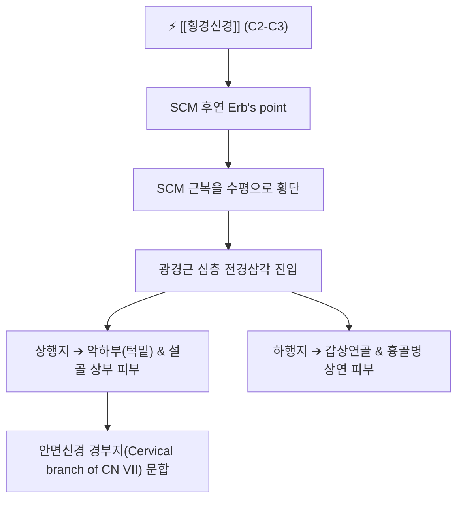

# ⚡ [[횡경신경]] (Transverse Cervical Nerve / 頸橫神經, C2-C3)

> **핵심 3줄 요약 (Key Summary)**:
> - 🗺️ 신경 기원 & 해부학적 주행: 경신경총(C2-C3) 기원, [[에르브 포인트]](Erb's point)에서 나와 [[흉쇄유돌근]](SCM) 중앙부를 수평으로 가로질러 광경근(Platysma) 심층을 통해 전경부(목 앞쪽)로 주행.
> - 🎯 운동 지배(근육군) & 감각 지배 영역: 순수 감각 신경. 하악 하연부터 흉골병 상연에 이르는 **전경부(목 앞면 전체) 피부 감각** 지배, 안면신경 경부지와 문합.
> - ⚠️ 호발 포착 부위 & 관련 임상 질환: SCM 근막 관통부 및 광경근 유착, 목 앞쪽의 원인 모를 찌르는 통증, 갑상선 수술 후 전경부 감각 이상.
> - 🔍 주요 이학적 검사 & 신경학적 징후: SCM 중간 전연 압통 및 목 앞쪽 방사통, 전경부 감각 저하 또는 이질통.

---

## 📌 목차
1. [신경 기원 & 해부학적 분지 경로 (Anatomy & Course)](#1-신경-기원--해부학적-분지-경로-anatomy--course)
2. [신경 지배 맵 & 기능 네트워크 (Innervation Map)](#2-신경-지배-맵--기능-네트워크-innervation-map)
3. [호발 포착 부위 & 터널 증후군 병태생리](#3-호발-포착-부위--터널-증후군-병태생리)
4. [손상 레벨별 임상 증상 & 신경학적 결손](#4-손상-레벨별-임상-증상--신경학적-결손)
5. [관련 이학적 검사 & 신경 감별 매트릭스](#5-관련-이학적-검사--신경-감별-매트릭스)
6. [한의 신경 치료 프로토콜 (약침·침도·신경수기)](#6-한의-신경-치료-프로토콜-약침침도신경수기)
7. [💡 사용자 진료실 핵심 필기 & 임상 팁 (원문 보존)](#7--사용자-진료실-핵심-필기--임상-팁-원문-보존)
8. [출처 및 학술 참고 문헌 (References)](#8-출처-및-학술-참고-문헌-references)

---

## 1. 신경 기원 & 해부학적 분지 경로 (Anatomy & Course)

![[대이개신경_흉쇄유돌근_주행해부도_Gray.png|420]]
> [그림 1] SCM 후연 Erb's point에서 나와 수평으로 근복을 가로질러 목 앞쪽으로 뻗는 [[횡경신경]]의 해부학적 주행 (출처: Gray's Anatomy)

* **신경 기원 (Origin & Spinal Segments)**:
  * 경신경총(Cervical plexus)의 **제2, 3 경신경(C2, C3)** 전지에서 기원합니다.
* **상세 주행 경로**:
  1. SCM 후연 중간 지점인 Erb's point에서 나와, 흉쇄유돌근의 외측면을 **수평(Transverse)**으로 앞쪽을 향해 가로지릅니다.
  2. 외경정맥(External jugular vein)의 심부 또는 천부를 통과합니다.
  3. 광경근(Platysma) 심층을 지나 전경삼각(Anterior cervical triangle)으로 진입합니다.
  4. 상행지(Ascending branch)와 하행지(Descending branch)로 갈라져 목 앞쪽 정중선까지 방사상 분지합니다.

---

## 2. 신경 지배 맵 & 기능 네트워크 (Innervation Map)

---

## 3. 호발 포착 부위 & 터널 증후군 병태생리

* **SCM 전연 및 광경근 심부 근막 유착**:
  * 고개를 한쪽으로 돌리고 자는 습관이나 스마트폰 고개 숙임으로 전경부 근막이 찌그러지면 신경이 압박받습니다.

---

## 4. 손상 레벨별 임상 증상 & 신경학적 결손

* 목 앞쪽 피부를 살짝만 꼬집어도 소스라치게 아프거나, 반대로 목걸이가 닿아도 느낌이 둔마된 감각 저하.
* 갑상선 암 수술 또는 경부 림프절 곽청술 후 목 앞부분의 남의 살 같은 무감각증.

---

## 5. 관련 이학적 검사 & 신경 감별 매트릭스

* **SCM 전연 수평 횡단부 압진 검사**: 목 빗근 앞쪽 모서리 중앙을 지그시 눌렀을 때 울대뼈(갑상연골) 주변으로 찌릿한 통증 방사 여부 확인.

---

## 6. 한의 신경 치료 프로토콜 (약침·침도·신경수기)

* **인영(ST9) 외방 및 부돌(LI18) 침치료**:
  * SCM 전연 부돌혈 부위에 0.25×30mm 침으로 평자(平刺)하여 피하신경을 이완합니다.
* **전경부 자하거 약침 요법**:
  * 수술 후 반흔 부위에 약침 0.3cc를 침윤 주입하여 신경 재생을 촉진합니다.

---

## 7. 💡 사용자 진료실 핵심 필기 & 임상 팁 (원문 보존)

* **목 앞쪽이 조이고 칼칼하다는 환자 (매핵기와 감별)**:
  * 인후부에 이물감이 있다고 호소할 때 내시경에 이상이 없고 목 앞 피부를 만지면 쓰라리다고 한다면, 한의학적 매핵기(기체증)와 더불어 횡경신경의 표층 포착을 의심해야 합니다. 부돌혈 자침으로 즉효를 봅니다.

---

## 8. 출처 및 학술 참고 문헌 (References)

* Tubbs, R. S., et al. (2025). "The anatomy of the cutaneous branches of the cervical plexus." *Folia Morphologica*, 84(4), 712-723. [PMID: 41257499](https://pubmed.ncbi.nlm.nih.gov/41257499/)
  - [연구 요약]: 경신경총 횡경신경의 흉쇄유돌근 횡단 지형도 및 전경부 감각 신경망 해부학적 변이 분석.
* Kim, H. S., et al. (2026). "Regional Anaesthesia Approaches in Head and Neck Surgery." *Journal of Clinical Medicine*, 15(9), 3120. [PMID: 42194532](https://pubmed.ncbi.nlm.nih.gov/42194532/)
  - [연구 요약]: 갑상선 수술 시 횡경신경을 포함한 표재경신경총 차단술의 임상 효과 검증.
* Tang, J., et al. (2026). "Anatomical study of the superficial cervical plexus targeted for sensory nerve blocks." *Regional Anesthesia and Pain Medicine*, 51(8), 612-619. [PMID: 40866302](https://pubmed.ncbi.nlm.nih.gov/40866302/)
  - [연구 요약]: 횡경신경의 분지 경로와 초음파 랜드마크 분석.

<!-- 보관 태그(1회용·링크오류, 필요시 복원): 전경부, 목통증 -->
