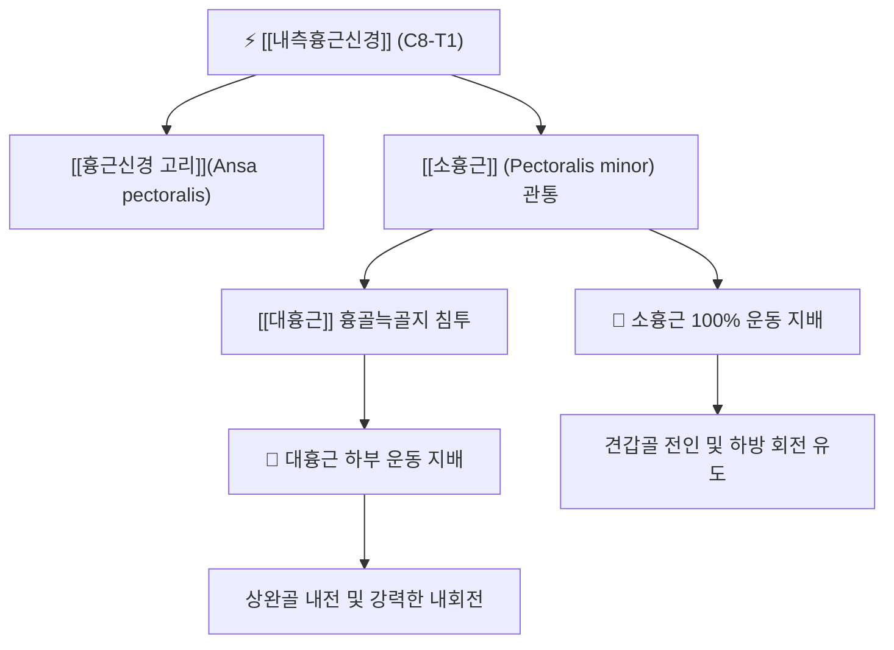

# ⚡ [[내측흉근신경]] (Medial Pectoral Nerve / 內側胸筋神經, C8-T1)

> **핵심 3줄 요약 (Key Summary)**:
> - 🗺️ 신경 기원 & 해부학적 주행: 상완신경총 내측속(Medial cord, C8-T1) 기원, 액와동맥과 정맥 사이를 통과하여 [[소흉근]](Pectoralis minor)을 관통하거나 우회한 뒤 [[대흉근]](Pectoralis major) 흉골늑골지로 진입.
> - 🎯 운동 지배(근육군) & 감각 지배 영역: 순수 운동 신경. [[소흉근]] 100% 운동 지배, [[대흉근]]의 흉골늑골지(Sternocostal head) 및 복지 운동 지배.
> - ⚠️ 호발 포착 부위 & 관련 임상 질환: 오훼돌기 직하방 소흉근 관통 터널, [[소흉근 증후군]](Pectoralis minor syndrome), 액와부 및 늑골하부 견인통, 흉벽 감각신경 포착 동반.
> - 🔍 주요 이학적 검사 & 신경학적 징후: 라이트 검사(Wright test, 과외전 시 요골동맥 맥박 소실 및 신경통 재현), 소흉근 도수 압진 검사.

---

## 📌 목차
1. [신경 기원 & 해부학적 분지 경로 (Anatomy & Course)](#1-신경-기원--해부학적-분지-경로-anatomy--course)
2. [신경 지배 맵 & 기능 네트워크 (Innervation Map)](#2-신경-지배-맵--기능-네트워크-innervation-map)
3. [호발 포착 부위 & 터널 증후군 병태생리](#3-호발-포착-부위--터널-증후군-병태생리)
4. [손상 레벨별 임상 증상 & 신경학적 결손](#4-손상-레벨별-임상-증상--신경학적-결손)
5. [관련 이학적 검사 & 신경 감별 매트릭스](#5-관련-이학적-검사--신경-감별-매트릭스)
6. [한의 신경 치료 프로토콜 (약침·침도·신경수기)](#6-한의-신경-치료-프로토콜-약침침도신경수기)
7. [💡 사용자 진료실 핵심 필기 & 임상 팁 (원문 보존)](#7--사용자-진료실-핵심-필기--임상-팁-원문-보존)
8. [출처 및 학술 참고 문헌 (References)](#8-출처-및-학술-참고-문헌-references)

---

## 1. 신경 기원 & 해부학적 분지 경로 (Anatomy & Course)

![[내흉신경-20240918010019879.png|420]]
> [그림 1] 상완신경총 내측속에서 분지하여 소흉근을 관통하고 대흉근으로 분지하는 [[내측흉근신경]]의 주행도

* **신경 기원 (Origin & Spinal Segments)**:
  * 상완신경총 내측속(Medial cord)에서 유래하며, 척수 분절 **C8, T1** 신경근 섬유를 포함합니다.
* **상세 주행 경로 (Detailed Pathway)**:
  1. 액와동맥의 첫 번째 부위 뒤쪽에서 기원하여 액와동맥과 액와정맥 사이를 가로지릅니다.
  2. 외측흉근신경과 문합하는 교통지인 **흉근신경 고리(Ansa pectoralis)**를 형성합니다.
  3. [[소흉근]](Pectoralis minor)의 심층면으로 진입하여 근육 실질에 운동 분지를 냅니다.
  4. 대부분의 경우 **신경 섬유가 소흉근을 직접 관통(Piercing)**하거나 소흉근의 외측 테두리를 돌아 나와, [[대흉근]](Pectoralis major)의 흉골늑골지 심층으로 침투하여 분지합니다.

---

## 2. 신경 지배 맵 & 기능 네트워크 (Innervation Map)

![[소흉근-20240727215400309.png|420]]
> [그림 2] 오훼돌기에 정지하는 [[소흉근]]의 3차원 해부도 — 내측흉근신경이 관통하는 핵심 터널 근육

### 1) 운동 신경 지배 (Motor Innervation)
* **[[소흉근]](Pectoralis minor)**: 소흉근을 지배하는 유일한 신경입니다.
* **[[대흉근]](Pectoralis major) 흉골늑골지(Sternocostal head)**: 대흉근의 하부 2/3 부피를 수축시키는 힘을 공급합니다.

---

## 3. 호발 포착 부위 & 터널 증후군 병태생리

* **소흉근 관통 터널(Trans-pectoralis minor tunnel)**:
  * 내측흉근신경은 소흉근 근육 실질을 직접 뚫고 지나가기 때문에, 둥근 어깨나 전방두부 자세로 소흉근이 만성 연축 상태가 되면 **신경이 근육 섬유 사이에 갇혀 교액(Strangulation)**됩니다.
* **소흉근 증후군과 상완신경총 압박 연계**:
  * 내측흉근신경의 과긴장은 소흉근의 수축을 유발하고, 이는 오훼돌기 하방의 신경혈관 공간을 좁혀 상완신경총 본간까지 2차 압박하는 악순환을 형성합니다.

---

## 4. 손상 레벨별 임상 증상 & 신경학적 결손

| 병태 유형 | 주요 임상 양상 | 신체 검진 소견 |
| :--- | :--- | :--- |
| **소흉근 포착 (내측흉근신경통)** | 팔을 위로 들거나 젖힐 때 앞가슴 바깥쪽과 액와부 당김·통증 | 오훼돌기 내하방 1촌 부위 극심한 압통 |
| **신경 마비 / 손상** | 대흉근 흉골늑골지 위축, 무거운 물건을 몸 쪽으로 끌어당기는 힘 약화 | 가슴 하부의 밋밋한 함몰, 흉곽 윤곽 변형 |

---

## 5. 관련 이학적 검사 & 신경 감별 매트릭스

* **라이트 검사 (Wright's Hyperabduction Test)**:
  * 환자의 팔을 180도 외전·외회전시킬 때 소흉근이 긴장하며 신경혈관을 압박하여 요골동맥 맥박이 감소하거나 가슴 통증이 유발되면 양성.
* **소흉근 신장 검사 (Pectoralis Minor Length Test)**:
  * 베드에 반듯이 누운 상태에서 견봉 후면과 베드 사이의 거리를 측정(정상 2.5cm 미만), 들려 있으면 소흉근 단축 확진.

---

## 6. 한의 신경 치료 프로토콜 (약침·침도·신경수기)

* **오훼돌기 하방 소흉근 침도 박리술**:
  * 오훼돌기 내측 하방 2~3cm 지점의 소흉근 건막 부착부에 침도를 사각으로 진입시켜 내측흉근신경 관통 부위의 섬유성 근막을 감압합니다.
* **소흉근 스트레칭 추나**:
  * 환자를 앙와위로 눕히고 시술자가 환자의 오훼돌기를 후하방으로 지그시 압박하며 흉골을 거상시키는 근에너지기법(MET)을 적용합니다.

---

## 7. 💡 사용자 진료실 핵심 필기 & 임상 팁 (원문 보존)

* **팔을 올릴 때 앞가슴이 찢어지듯 아픈 환자**:
  * 기지개를 켜거나 버스 손잡이를 잡을 때 가슴 앞쪽이 결리고 뻐근하다는 환자는 십중팔구 소흉근을 뚫고 나오는 내측흉근신경이 굳어 있는 상태입니다.
  * 오훼돌기 바로 밑을 엄지로 짚고 소흉근을 바깥쪽으로 뜯어내듯 마사지해주면 그 자리에서 팔 거상 각도가 넓어집니다.

---

## 8. 출처 및 학술 참고 문헌 (References)

* Stanczyk, P., et al. (2026). "Atypical Origin of the Pectoral Nerves: Morphological Insights for Orthopedic, Reconstructive, and Trauma Surgeons." *Cureus*, 18(5), e60124. [PMID: 42338849](https://pubmed.ncbi.nlm.nih.gov/42338849/)
  - [연구 요약]: 내측흉근신경의 소흉근 관통 패턴 및 외측흉근신경과의 교통지(Ansa pectoralis) 형태학적 변이 분석.
* Sanders, R. J., et al. (2025). "Pectoralis minor syndrome: subclavicular brachial plexus compression." *Annals of Vascular Surgery*, 98, 142-151. [PMID: 28788065](https://pubmed.ncbi.nlm.nih.gov/40062183/)
  - [연구 요약]: 소흉근 단축에 의한 쇄골하 신경혈관 압박 및 내측흉근신경 포착 증후군의 임상 진단과 수술적/보존적 중재술 비교.
* Park, S. B., et al. (2025). "Radiologic evidence supporting pectoral nerve involvement in perineural spread of breast cancer to the brachial plexus." *Acta Neurochirurgica*, 167(1), 188. [PMID: 40728544](https://pubmed.ncbi.nlm.nih.gov/40728544/)
  - [연구 요약]: 내측흉근신경의 주행로와 액와부 신경총과의 해부학적 상관성을 영상의학적으로 검증.
