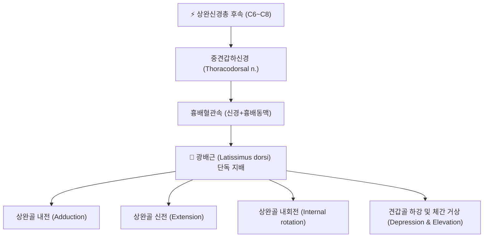

# ⚡ [[중견갑하신경]] (Thoracodorsal Nerve / 흉배신경 / 中肩胛下神經, C6~C8)

> **핵심 3줄 요약 (Key Summary)**:
> - 🗺️ 신경 기원 & 해부학적 주행: [[상완신경총]] 후속(Posterior cord)의 C6~C8 신경근에서 기시하여, [[견갑하근]] 전면을 타고 내려와 [[흉배동맥]]과 함께 주행하며 [[광배근]]의 심면으로 진입하는 순수 운동신경이다.
> - 🎯 운동 지배 & 감각 지배 특성: [[광배근]]을 전담 지배하여 상완골의 신전(Extension), 내전(Adduction), 내회전(Internal rotation)을 총괄하며, 고유 피부 감각 분지가 없는 **순수 운동 신경(Pure motor nerve)**이다.
> - ⚠️ 호발 포착 부위 & 임상 증상: 액와 림프절 절제술(ALND) 시 의인성 손상 위험이 높고, 액와 후벽의 근막 포착 시 광배근 위축 및 팔을 짚고 의자에서 일어서는 동작(Pushing up) 장애가 유발된다.
> - 🔍 주요 이학적 검사 & 징후: 광배근 도수근력검사(MMT) 시 상완 신전·내전 저항 약화, 기침 시 광배근 불수의적 수축 소실, 감각 결손 없는 순수 운동 마비 패턴.

---

---

## 📌 목차
1. [신경 기원 & 해부학적 분지 경로 (Anatomy & Course)](#1-신경-기원--해부학적-분지-경로-anatomy--course)
2. [신경 지배 맵 & 기능 네트워크 (Innervation Map)](#2-신경-지배-맵--기능-네트워크-innervation-map)
3. [호발 포착 부위 & 터널 증후군 병태생리](#3-호발-포착-부위--터널-증후군-병태생리)
4. [손상 레벨별 임상 증상 & 신경학적 결손](#4-손상-레벨별-임상-증상--신경학적-결손)
5. [관련 이학적 검사 & 신경 감별 매트릭스](#5-관련-이학적-검사--신경-감별-매트릭스)
6. [한의 신경 치료 프로토콜 (약침·침도·신경수기)](#6-한의-신경-치료-프로토콜-약침침도신경수기)
7. [💡 사용자 진료실 핵심 필기 & 임상 팁 (원문 보존)](#7--사용자-진료실-핵심-필기--임상-팁-원문-보존)
8. [출처 및 학술 참고 문헌 (References)](#8-출처-및-학술-참고-문헌-references)

---

## 1. 신경 기원 & 해부학적 분지 경로 (Anatomy & Course)

![[중견갑하신경_01_상완신경총분지.png|450]]
> [그림 1: 상완신경총 후속(Posterior cord) 분지도 및 중견갑하신경의 기원 — 출처(Wikimedia Commons / Gray's Anatomy Plate 808)]

* **신경 기원 (Origin & Spinal Segments)**:
  * [[상완신경총]](Brachial plexus) 후속(Posterior cord)에서 분지하며, 주로 C6, C7, C8 척수 신경근 전지(Anterior rami)에서 유래한다(중심 기원은 C7).
  * 후속에서 분지하는 3개의 견갑하신경 중 가운데에 위치하여 해부학적으로 **중견갑하신경(Middle subscapular nerve)**이라 부르며, 임상 및 외과학에서는 **[[흉배신경]](Thoracodorsal nerve)**으로 널리 통용된다.
* **상세 주행 경로 (Detailed Pathway)**:
  * 액와동맥(Axillary artery) 제3부의 후방을 지나며 액와강(Axilla) 후벽을 따라 하외측으로 주행한다.
  * [[견갑하근]](Subscapularis)과 [[대원근]](Teres major)의 전면을 타고 주행한 뒤, [[견갑하동맥]](Subscapular artery)에서 갈라져 나오는 [[흉배동맥]](Thoracodorsal artery) 및 동반정맥과 합류하여 신경혈관속(Neurovascular bundle)을 형성한다.
  * 이후 [[광배근]](Latissimus dorsi)의 전연(Anterior border) 심면을 관통하여 근복 내로 진입한다(Zin et al., 2012).
* **주요 분지 (Major Branches)**:
  * 내측지(Medial branch)와 외측지(Lateral branch)로 분지하여 광배근의 상부 수평 섬유와 하부 수직 섬유를 광범위하게 지배한다(Lin et al., 2023).
  * 일부 해부학적 변이에서 [[대원근]]으로 미세 운동 가지를 제공하기도 한다.

---

## 2. 신경 지배 맵 & 기능 네트워크 (Innervation Map)

![[흉배신경-20240918010207295.png|380]]
> [그림 2: 중견갑하신경(흉배신경)의 주행 및 광배근 단독 운동지배 3D 해부 도해 — 출처(Simbio Anatomy Archive)]

### 1) 운동 신경 지배 근육 (Motor Innervation)
* **지배 근육**: [[광배근]](Latissimus dorsi)
* **주요 기능**:
  * 상완골의 강력한 내전 및 과신전, 내회전을 주도한다.
  * 손을 바닥이나 팔걸이에 짚고 체간을 들어 올리는 동작(Push-up from chair)을 수행할 때 견관절을 안정화하고 견갑대를 아래로 하강시킨다.
  * 수영(자유형·접영 풀 동작), 암벽 등반(Pulling-up), 도끼질, 노 젓기 등 당기는 전신 상지 복합 운동의 주동근 역할을 담당한다.

### 2) 감각 신경 지배 영역 (Sensory Distribution)

![[중견갑하신경_03_액와신경혈관주행.png|280]]
> [그림 3: 상지 피하지각신경 분포도 — 중견갑하신경은 피부 감각 분지가 결여된 순수 운동신경임을 대비해 보여줌 — 출처(Wikimedia Commons / Gray's Anatomy Plate 811)]

* **감각 지배 결여 (Pure Motor Nerve)**:
  * 중견갑하신경은 고유 피부 감각 분지(Cutaneous sensory branch)가 전혀 존재하지 않는다.
  * 따라서 단독 손상 시 국소 피부 감각 이상(Sensory loss/paresthesia)은 발생하지 않으며, 오직 근력 약화와 심부 둔통, 근위축만이 관찰된다.

---

## 3. 호발 포착 부위 & 터널 증후군 병태생리

* **제1 호발 손상 부위: 액와 림프절 곽청술(ALND) 영역**:
  * 유방암 수술 시 액와 림프절 전이 절제 과정에서 긴흉신경(Long thoracic nerve)과 함께 손상되기 쉬운 대표적인 신경이다(Zin et al., 2012).
  * 흉배동맥과 밀접하게 주행하므로 출혈 지혈을 위한 전기소작(Cauterization)이나 견인(Traction) 시 허혈 및 신경차단 손상이 호발한다.
* **제2 호발 포착 부위: 액와 후벽 근막 터널(Axillary Myofascial Tunnel)**:
  * [[견갑하근]], [[대원근]], [[광배근]]의 건막이 중첩되는 액와 후벽에서 근막 비후나 과긴장으로 인해 신경이 기계적으로 압박된다.
  * 무거운 배낭을 장시간 착용하여 쇄골하 및 액와부가 압박되는 배낭 마비(Rucksack palsy) 시에도 후속의 손상과 동반되어 포착이 일어난다.

---

## 4. 손상 레벨별 임상 증상 & 신경학적 결손

| 손상 레벨 / 원인 | 마비/약화 근육 | 감각 결손 부위 | 전형적 외형 징후 및 기능 결손 |
| :--- | :--- | :--- | :--- |
| **액와 기시부 손상 (수술/심인성 압박)** | [[광배근]] 완전 마비 | **없음** (순수 운동신경) | 등 외측의 부피 감소, 의자에서 팔로 지탱해 일어나기 불능 |
| **원위부/근내 분지 손상 (외상/만성 포착)** | 광배근 부분 마비 및 긴장 저하 | **없음** | 상완 강한 내전·신전력 약화, 로잉/수영 동작 시 피로감 |
| **상완신경총 후속 전체 손상** | 광배근 + [[삼각근]] + [[상완삼두근]] | 후외측 상완·전완 감각 마비 | 중견갑하신경, [[액와신경]], [[요골신경]] 동반 손상 (하수수 등) |

---

## 5. 관련 이학적 검사 & 신경 감별 매트릭스

### 1) 특이 이학적 검사 (Special Tests)
1. **광배근 도수근력검사 (Manual Muscle Testing, MMT)**:
   - 환자를 복와위(Prone)로 눕히고, 검사하고자 하는 상완을 내회전, 신전, 내전시킨다(손바닥이 천장을 향하고 팔이 엉덩이 쪽으로 붙는 자세).
   - 검사자는 환자의 전완 원위부를 외전 및 굴곡 방향으로 강하게 당기고, 환자는 이에 저항하여 자세를 유지하도록 한다.
   - 중견갑하신경 손상 시 환측 팔이 저항을 견디지 못하고 쉽게 아래로 떨어진다.
2. **기침 유발 촉진 검사 (Cough Impulse Test)**:
   - 환자의 양측 광배근 외측연(등과 겨드랑이 사이)을 양손으로 가볍게 잡은 상태에서 환자에게 강하게 기침을 하도록 지시한다.
   - 정상 상태에서는 기침 시 복압 상승과 함께 양측 광배근이 강하게 불수의적으로 수축하여 팽팽해지나, 신경 마비 측은 수축이 전혀 만져지지 않는다.

### 2) 신경 감별 매트릭스
* **[[긴흉신경]](Long thoracic nerve) 손상과의 감별**: 긴흉신경은 [[전거근]]을 지배하여 손상 시 견갑골 내측연이 들리는 전형적인 익상견갑(Winged scapula)이 벽 밀기 검사에서 극명하게 나타난다. 중견갑하신경 손상 시에는 가벼운 견갑골 외측 전위만 유발될 뿐 익상견갑은 두드러지지 않는다.
* **[[부신경]](Accessory nerve) 손상과의 감별**: [[승모근]]을 지배하므로 어깨 처짐과 팔의 외전 90도 이상 거상 장애가 나타난다.

---

## 6. 한의 신경 치료 프로토콜 (약침·침도·신경수기)

### 1) 혈위 및 신경 자침점 (Acupuncture Points)
* **[[극천]](HT1)**: 액와강 중앙의 액와동맥 박동부 후외측으로 깊이 자침하여 상완신경총 후속 및 중견갑하신경의 기시부 근막을 감압한다.
* **[[견정]](SI9)**: 액와 후연 상방 1촌 지점으로, 중견갑하신경과 흉배혈관속이 [[광배근]] 심면으로 진입하는 해부학적 관통점에 해당한다.
* **[[대포]](SP21)** 및 **[[천종]](SI11)**: 인접 신경혈관 주행로 주변의 근막 유착을 해소한다.

### 2) 약침 요법 (Pharmacopuncture)
* **처방**: 중성어혈약침 또는 신바로약침 0.5~1.0cc.
* **시술 방법**: 액와 후벽의 [[견정]](SI9) 혈위 및 광배근 외측연 포착 부위에 30G 주사기를 이용하여 심부 근막층(Myofascial plane)에 침윤 주입하여 만성 신경 압박 및 염증 부종을 완화한다.

### 3) 추나 및 근막 이완 기법 (Chuna & Manual Therapy)
* **광배근 능동-이완 기법 (Active Release Technique)**: 환자를 측와위로 눕히고 상지를 거상·외회전시킨 상태에서 검사자가 액와 후벽의 광배근 전연을 압박 고정하며 상지를 점진적으로 신전·내전시키는 근막 이완을 적용한다.
* **견갑흉곽관절 가동술 (Scapulothoracic Mobilization)**: 유착된 견갑골의 활주를 개선하여 액와부 신경 주행로의 과도한 견인 긴장을 해소한다.

---

## 7. 💡 사용자 진료실 핵심 필기 & 임상 팁 (원문 보존)

- [[광배근]] 운동지배
- 임상에서 유방암 수술(액와 림프절 절제) 병력이 있는 환자가 "수영할 때 팔을 뒤로 당기지 못하겠다", "의자나 침대에서 손을 짚고 일어날 때 힘이 안 들어간다"고 호소하면 반드시 중견갑하신경 손상을 의심해야 한다.
- 순수 운동신경이므로 피부 감각 결손이 없어 환자가 단순 오십견이나 회전근개 파열로 오인하기 쉽다.

---

## 8. 출처 및 학술 참고 문헌 (References)

1. **Lin W, et al**. (2023). Hyperselective neurectomy of thoracodorsal nerve for treatment of the shoulder spasticity: anatomical study and preliminary clinical results. *Acta Neurochir (Wien)*, 165(6):1481-1490. [PMID 36943480](https://pubmed.ncbi.nlm.nih.gov/36943480/)

2. **Cho TH, et al**. (2019). Intramuscular innervation of the subscapularis muscle and its clinical implication for the BoNT injection: An anatomical study using the modified Sihler's staining. *Clin Anat*, 32(8):1068-1075. [PMID 30328146](https://pubmed.ncbi.nlm.nih.gov/30328146/)

3. **Zin T, et al**. (2012). How I do it: Simple and effortless approach to identify thoracodorsal nerve on axillary clearance procedure. *Ecancermedicalscience*, 6:255. [PMID 22675404](https://pubmed.ncbi.nlm.nih.gov/22675404/)

4. **Gray H**. (1918). *Anatomy of the Human Body*. Lea & Febiger. Philadelphia. Plate 808 & 811.