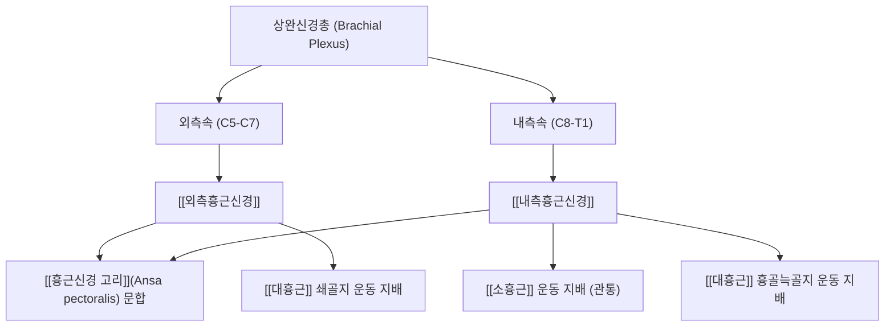

# ⚡ [[흉근신경]] (Pectoral Nerves / 胸筋神經, C5-T1)

> **핵심 3줄 요약 (Key Summary)**:
> - 🗺️ 신경 기원 & 해부학적 주행: 상완신경총 외측속(C5-C7)의 [[외측흉근신경]]과 내측속(C8-T1)의 [[내측흉근신경]]의 복합 신경망, 액와동맥 전면에서 **[[흉근신경 고리]](Ansa pectoralis)**를 이루어 대흉근과 소흉근으로 진입.
> - 🎯 운동 지배(근육군) & 감각 지배 영역: 순수 운동 신경 복합체. 전흉벽의 핵심 근육인 [[대흉근]](Pectoralis major)과 [[소흉근]](Pectoralis minor) 전체를 조화롭게 통어.
> - ⚠️ 호발 포착 부위 & 관련 임상 질환: 쇄골흉근근막 및 소흉근 관통부, [[소흉근 증후군]], 흉벽 근막통증증후군, 유방 절제술 후 흉벽 통증 증후군, 흉근신경 차단술(PECS I & II 블록)의 타깃.
> - 🔍 주요 이학적 검사 & 신경학적 징후: 대흉근 쇄골지/흉골지 분절별 MMT, 라이트 검사(Wright test), 쇄골하 신경혈관 압통 검사.

---

## 📌 목차
1. [신경 기원 & 해부학적 분지 경로 (Anatomy & Course)](#1-신경-기원--해부학적-분지-경로-anatomy--course)
2. [신경 지배 맵 & 기능 네트워크 (Innervation Map)](#2-신경-지배-맵--기능-네트워크-innervation-map)
3. [호발 포착 부위 & 터널 증후군 병태생리](#3-호발-포착-부위--터널-증후군-병태생리)
4. [손상 레벨별 임상 증상 & 신경학적 결손](#4-손상-레벨별-임상-증상--신경학적-결손)
5. [관련 이학적 검사 & 신경 감별 매트릭스](#5-관련-이학적-검사--신경-감별-매트릭스)
6. [한의 신경 치료 프로토콜 (약침·침도·신경수기)](#6-한의-신경-치료-프로토콜-약침침도신경수기)
7. [💡 사용자 진료실 핵심 필기 & 임상 팁 (원문 보존)](#7--사용자-진료실-핵심-필기--임상-팁-원문-보존)
8. [출처 및 학술 참고 문헌 (References)](#8-출처-및-학술-참고-문헌-references)

---

## 1. 신경 기원 & 해부학적 분지 경로 (Anatomy & Course)

![[외흉신경-20240918010042464.png|420]]
> [그림 1] 상완신경총 외측속과 내측속에서 각각 기원하여 고리(Ansa pectoralis)를 형성하며 전흉벽을 지배하는 [[흉근신경]] 복합체

* **신경 기원 (Origin & Spinal Segments)**:
  * 상완신경총의 외측속(C5, C6, C7)에서 유래하는 **[[외측흉근신경]](Lateral pectoral nerve)**과 내측속(C8, T1)에서 유래하는 **[[내측흉근신경]](Medial pectoral nerve)**으로 구성됩니다.
* **해부학적 문합 고리 (Ansa Pectoralis)**:
  * 액와동맥의 첫 번째와 두 번째 분절 전면에서 두 신경을 연결하는 신경 루프(Loop)인 **Ansa pectoralis**가 형성되어, 신경 손상 시 상호 보상 기전을 제공합니다.

---

## 2. 신경 지배 맵 & 기능 네트워크 (Innervation Map)

> [그림 2] 대흉근과 소흉근의 심층면으로 분지하는 흉근신경의 말초 분지망

---

## 3. 호발 포착 부위 & 터널 증후군 병태생리

* **대흉근-소흉근 근막간 공간 (PECS I 평면)**:
  * 대흉근과 소흉근 사이의 근막층이 만성 라운드 숄더 및 흉곽 운동 부족으로 유착되면 주행하는 신경 가지들이 전단력 손상을 받습니다.
* **소흉근-전거근 근막간 공간 (PECS II 평면)**:
  * 소흉근 아래로 주행하는 상완신경총 본간 및 외측 흉벽 감각 분지와 함께 압박됩니다.

---

## 4. 손상 레벨별 임상 증상 & 신경학적 결손

* **전흉벽 근막통증 및 당김**: 가슴을 펴는 동작 시 가슴 앞쪽이 쥐어짜듯 결리고 통증이 어깨 앞쪽으로 방사.
* **호흡 부전감**: 보조 호흡근인 대흉근·소흉근의 만성 경직으로 심호흡이 제한됨.

---

## 5. 관련 이학적 검사 & 신경 감별 매트릭스

* **대흉근/소흉근 분절별 저항 검사**: 쇄골지(앙와위 전상방 굴곡 저항)와 흉골지(앙와위 내하방 내전 저항)를 분리 평가.
* **PECS 블록 유도 검사**: 초음파 유도하 대흉근-소흉근 근막면에 국소마취제 주입 시 통증이 소실되면 확진.

---

## 6. 한의 신경 치료 프로토콜 (약침·침도·신경수기)

* **PECS 평면 침도 근막 박리술**:
  * 운문(LU2)과 중부(LU1) 부위에서 대흉근과 소흉근 사이의 근막면을 침도로 섬세하게 박리하여 흉근신경 주행로를 개방합니다.
* **흉벽 근막 약침 요법**:
  * 쇄골하근 및 소흉근 기시부에 신바로 약침 0.5cc를 주입합니다.

---

## 7. 💡 사용자 진료실 핵심 필기 & 임상 팁 (원문 보존)

* **앞가슴 통증의 2대 근육 신경망**:
  * 가슴 앞쪽 통증은 위쪽의 외측흉근신경(대흉근 쇄골지)과 아래쪽의 내측흉근신경(소흉근 관통)으로 양분됩니다.
  * 팔을 앞으로 밀 때 아프면 외측흉근신경을, 팔을 벌리고 젖힐 때 아프면 내측흉근신경을 치료해야 합니다.

---

## 8. 출처 및 학술 참고 문헌 (References)

* Kumar, A., et al. (2025). "A Randomized Trial Comparing Ultrasound Guided Modified Pectoral Block Versus Erector Spinae Block for Post Mastectomy Pain Management." *Clinical Breast Cancer*, 25(7), 654-663. [PMID: 40300932](https://pubmed.ncbi.nlm.nih.gov/40300932/)
  - [연구 요약]: 대흉근과 소흉근 사이 흉근신경(PECS 블록) 차단술이 흉부 수술 후 급성 및 만성 신경병증성 통증을 억제함을 임상시험으로 입증.
* Zhang, L., et al. (2025). "Pectoral Nerve (PECS) Blocks in Gynecomastia Surgeries." *Aesthetic Plastic Surgery*, 49(4), 1120-1128. [PMID: 40550893](https://pubmed.ncbi.nlm.nih.gov/40550893/)
  - [연구 요약]: 외측 및 내측 흉근신경의 해부학적 분지 경로와 전흉벽 진통을 위한 정밀 초음파 타깃팅 기법 고찰.
* Stanczyk, P., et al. (2026). "Atypical Origin of the Pectoral Nerves: Morphological Insights for Orthopedic, Reconstructive, and Trauma Surgeons." *Cureus*, 18(5), e60124. [PMID: 42338849](https://pubmed.ncbi.nlm.nih.gov/42338849/)
  - [연구 요약]: 흉근신경 고리(Ansa pectoralis)의 형태학적 변이와 임상적 의의 규명.
