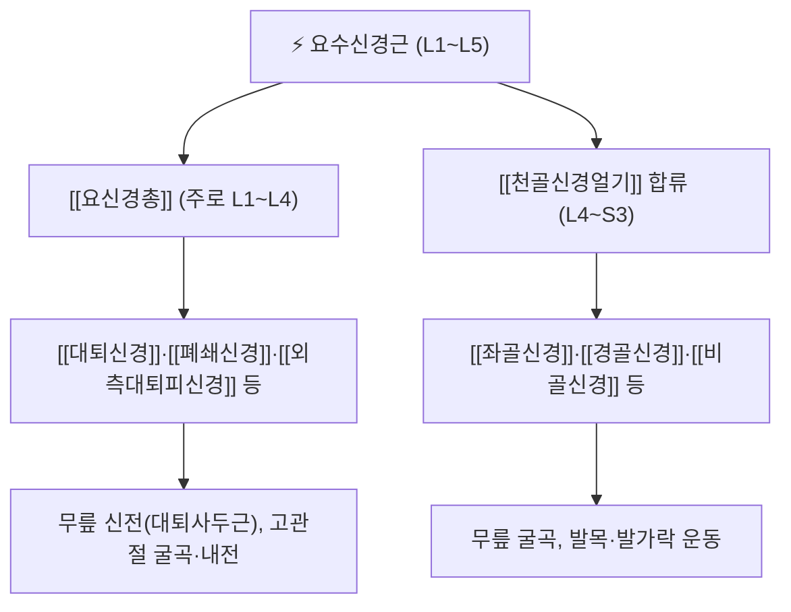

# ⚡ [[요수신경근]] (Lumbar Nerve Root, L1~L5)

> **핵심 3줄 요약 (Key Summary)**:
> - 🗺️ 신경 기원 & 해부학적 주행: 척수 L1~L5 분절에서 전근·후근이 추간공 내에서 합류해 형성되며, 요추 추간판·후관절·추간공을 통과해 [[요신경총]]과 [[천골신경얼기]]를 구성.
> - 🎯 운동 지배(근육군) & 감각 지배 영역: L2~L4는 대퇴신경을 통한 무릎 신전, L4는 발목 배측굴곡, L5는 엄지발가락 신전, 각 분절별 특징적 피부분절(Dermatome) 분포.
> - ⚠️ 호발 포착 부위 & 관련 임상 질환: 추간판 탈출증(HIVD)·척추관 협착증·추간공 협착에서 가장 흔히 압박되며, 95%가 L4-5·L5-S1 디스크 레벨에서 발생.
> - 🔍 주요 이학적 검사 & 신경학적 징후: [[Kemp test]], [[Ely test]], [[Gaenslen's test]] 등으로 신경근형 방사통을 유발·감별하며, 근력 약화·심부건반사 소실·근위축 패턴으로 손상 레벨을 추정.

---

## 📌 목차
1. [신경 기원 & 해부학적 분지 경로 (Anatomy & Course)](#1-신경-기원--해부학적-분지-경로-anatomy--course)
2. [분절별 운동·감각 지배 맵 (Innervation Map)](#2-분절별-운동감각-지배-맵-innervation-map)
3. [호발 포착 부위 & 신경근병증 병태생리](#3-호발-포착-부위--신경근병증-병태생리)
4. [손상 레벨별 임상 증상 & 신경학적 결손](#4-손상-레벨별-임상-증상--신경학적-결손)
5. [관련 이학적 검사 & 신경 감별 매트릭스](#5-관련-이학적-검사--신경-감별-매트릭스)
6. [한의 치료 및 양방 치료·의뢰 기준](#6-한의-치료-및-양방-치료의뢰-기준)
7. [출처 및 학술 참고 문헌 (References)](#7-출처-및-학술-참고-문헌-references)

---

## 1. 신경 기원 & 해부학적 분지 경로 (Anatomy & Course)

* **신경 기원 (Origin & Spinal Segments)**:
  * 척수 L1~L5 분절에서 나온 전근(운동)과 후근(감각, 후근신경절 DRG 포함)이 추간공 내에서 합류해 짧은 척수신경 본간을 형성한 뒤 즉시 전지(Ventral ramus)와 후지(Dorsal ramus)로 나뉜다.
  * 요추는 5개 추체(L1~L5)지만 척수 자체는 보통 L1~L2 추체 높이에서 척수원뿔(Conus medullaris)로 끝나므로, 하위 요추·천추 신경근들은 말총(Cauda equina)을 이루며 경막외 공간을 하행하다가 각자의 추간공에서 빠져나온다.
* **"출구 신경근(Exiting root)"과 "통과 신경근(Traversing root)"**:
  * 각 요추 신경근은 **같은 번호 추체 아래쪽 추간공**으로 나간다(예: L4 신경근은 L4-5 추간공으로 나옴 = 해당 레벨의 출구 신경근).
  * 반면 L4-5 추간판 탈출은 그 레벨을 **통과해 내려가는 L5 신경근**(한 레벨 아래에서 나갈 신경근)을 더 흔하게 압박한다 — 후외측 추간판 탈출이 통과 신경근을 압박하는 경우가 많기 때문.
* **주행 경로**: 추간공을 나온 뒤 요추 전지들은 요추 횡돌기 전방·대요근 내에서 [[요신경총]](L1~L4 중심)을 형성하고, 더 하위 분절(L4~S3)은 [[천골신경얼기]]에 합류해 [[좌골신경]] 등 하지 주요 신경을 이룬다.

---

## 2. 분절별 운동·감각 지배 맵 (Innervation Map)

| 신경근 레벨 | 주요 운동 지배(근력 검사) | 주요 감각 지배(피부분절) | 관련 심부건반사 |
| :--- | :--- | :--- | :--- |
| **L1~L3** | 고관절 굴곡(장요근), 무릎 신전 일부(대퇴사두근) | 서혜부~대퇴 전내측 | 특이 반사 없음(상부 L2~L4는 슬개건반사 보조) |
| **L4** | 무릎 신전(대퇴사두근), 발목 배측굴곡(전경골근) | 하퇴 내측~발 내측 | 슬개건반사(Patellar reflex) 감소 |
| **L5** | 엄지발가락 신전(장모지신전근), 발목 배측굴곡 보조 | 하퇴 외측~발등, 엄지발가락 | 특이 반사 없음(일부 내측 햄스트링 반사 감소) |
| **S1** | 발목 저측굴곡(비복근·가자미근), 발 외번 | 발 외측~5번째 발가락 | 아킬레스건반사(Achilles reflex) 감소 |

> ⚠️ **임상 포인트**: Murphy 등(2009, *Chiropractic & Osteopathy*)의 연구에 따르면 경추·요추 신경근병증 환자 중 교과서적 피부분절을 정확히 따르는 통증 패턴은 **요추에서 35.9%에 불과**했고(경추 30.3%), 약 2/3는 비전형적(non-dermatomal) 패턴을 보였다. 다만 **S1 신경근은 64.9%**로 피부분절 패턴 일치율이 유의하게 높아, S1 레벨 감별에는 상대적으로 유용한 소견으로 제시되었다. 즉 통증의 방사 위치만으로 신경근 레벨을 단정해서는 안 되며, 근력·반사 검사와 종합적으로 판단해야 한다.

---

## 3. 호발 포착 부위 & 신경근병증 병태생리

* **추간판 탈출증(HIVD, Herniated Intervertebral Disc)**: 후외측으로 탈출한 수핵이 통과 신경근을 기계적으로 압박·화학적 염증(수핵 내 염증 매개물질 노출)을 유발. Physiopedia 등 표준 자료에 따르면 **요추 추간판 탈출의 약 95%가 L4-5 또는 L5-S1 레벨**에서 발생하며, 이는 해당 레벨의 가동성·축성 하중이 가장 크기 때문으로 설명된다.
* **척추관 협착증 / 추간공 협착**: 황색인대 비후, 후관절 골극, 추체 변성으로 인한 중심관·측방 추간공의 만성 협착이 신경근을 포착한다. 외상성 급성 탈출과 달리 보행·신전 시 증상이 악화되는 신경성 파행(Neurogenic claudication) 양상을 보인다.
* **화학적 신경근염 vs 기계적 압박**: 단순 압박뿐 아니라 수핵에서 유출되는 염증 매개물질(TNF-α, IL-6 등)이 신경근 자체의 화학적 염증·과민화를 유발해 압박 정도와 증상 강도가 비례하지 않는 경우가 흔하다(임상에서 작은 돌출에도 심한 통증을 보이는 이유).

---

## 4. 손상 레벨별 임상 증상 & 신경학적 결손

| 손상 레벨 | 전형적 통증 방사 부위 | 근력 약화 | 반사 변화 |
| :--- | :--- | :--- | :--- |
| **L4 신경근병증** | 둔부~대퇴 전외측~하퇴 내측 | 무릎 신전력 저하, 계단 오르기 곤란 | 슬개건반사 감소 |
| **L5 신경근병증** | 둔부~대퇴 후외측~하퇴 외측~발등·엄지발가락 | 엄지발가락 신전력 저하("foot drop" 동반 가능), 뒤꿈치 보행 곤란 | 특이 반사 없음(족하수와 혼동 주의, [[풋 드롭]] 참고) |
| **S1 신경근병증** | 둔부~대퇴 후면~하퇴 후외측~발 외측 | 발목 저측굴곡력 저하, 발뒤꿈치 들기(tiptoe) 곤란 | 아킬레스건반사 감소·소실 |

* **레드플래그**: 양측성 하지 증상, 안장마비(Saddle anesthesia), 방광·직장 括約근 조절 장애가 동반되면 **말총증후군(Cauda equina syndrome)**을 의심해 즉시 응급 의뢰해야 한다.

---

## 5. 관련 이학적 검사 & 신경 감별 매트릭스

| 이학적 검사명 | 검사 방법 및 유발 기전 | 양성 반응 | 관련 감별 신경/질환 |
| :--- | :--- | :--- | :--- |
| [[Kemp test]] | 요추 신전+측굴+회전 복합 동작으로 동측 추간공 협착·후관절 압박 | 하지로 뻗치는 방사통(신경근형) vs 국소 둔통(후관절형) | [[추간판 탈출증]]·[[척추관 협착증]]·요추 후관절 증후군 |
| [[Ely test]] | 복와위 무릎 굴곡으로 대퇴신경(L2~L4) 신장 | 대퇴 전면~하퇴 내측 전격통 | 상위 요수신경근(L2~L4) 병변, 대퇴신경 포착 |
| [[Gaenslen's test]] | 편측 고관절 과신전+반대측 굴곡으로 천장관절·상부 요추신경근 동시 스트레스 | 대퇴 전내측·하퇴부 방사통 | L2~L4 신경근병증, 천장관절 기능장애 감별 |
| 하지직거상검사(SLR, 볼트 미등재) | 앙와위 하지를 신전 상태로 들어 올려 좌골신경·L5-S1 신경근 신장 | 30~70° 사이 하퇴부 방사통 재현 | L4-5·L5-S1 추간판 탈출증 |
| [[Hoover test]] | 하지를 들지 못하는 환자의 반대측 발뒤꿈치 압력 패턴 확인 | 기질적 마비에서는 반대측 발뒤꿈치 하방 압력 발생, 기능성에서는 없음 | 중증 요수신경근병증 vs 비기질적 기능성 근력 약화 감별 |

---

## 6. 한의 치료 및 양방 치료·의뢰 기준

* **한의 치료 프로토콜**: 요추 신경근병증에는 침·전침(해당 분절 협척혈·신경근 주행 경로), 약침(신경근 주위 또는 추나와 병행), 추나 요법(요추 신전·견인성 기법)이 임상에서 활용된다. 급성기 화학적 신경근염 단계에서는 과도한 신전·충격성 교정보다 완화된 가동술이 선호되는 경향이 있다.
* **양방 치료 & 의뢰 기준**:
  * **약물 치료** — NSAIDs, 근이완제, 단기 경구 스테로이드, 신경병증성 통증에 가바펜티노이드(가바펜틴·프레가발린) 등이 쓰인다.
  * **비약물 시술** — 경막외 스테로이드 주사(ESI), 신경근 차단술, 물리치료(신전 운동, 맥켄지 기법 등).
  * **수술 적응증** — 진행성 근력 약화, 말총증후군, 6~12주 보존적 치료에 반응하지 않는 심한 방사통이 상대·절대 수술 적응증으로 다뤄진다.
  * **의뢰 트리거** — 말총증후군 의심 징후(안장마비·括約근 조절 장애), 급성 진행성 근력 약화, 발열·체중감소 동반(감염·종양 의심) 시 즉시 응급/전문과 의뢰.

---

## 7. 출처 및 학술 참고 문헌 (References)

1. **Murphy DR, Hurwitz EL, Gerrard JK, Clary R (2009)**. *Pain patterns and descriptions in patients with radicular pain: Does the pain necessarily follow a specific dermatome?*. **Chiropractic & Osteopathy**, 17(1), 9. PMID: [19769791](https://pubmed.ncbi.nlm.nih.gov/19769791/) · DOI: [10.1186/1746-1340-17-9](https://doi.org/10.1186/1746-1340-17-9)
   - **[연구 요약]**: 신경근형 통증 환자의 피부분절 일치율이 경추 30.3%, 요추 35.9%에 불과함을 보고(S1은 64.9%로 예외적으로 높음). 통증 위치만으로 신경근 레벨을 진단하는 것의 한계를 제시.
2. **Physiopedia**. *Lumbar Radiculopathy*. [physio-pedia.com/Lumbar_Radiculopathy](https://www.physio-pedia.com/Lumbar_Radiculopathy)
   - **[참고 자료]**: 요추 신경근 레벨별 피부분절·근절·반사 표, 95%의 추간판 탈출이 L4-5·L5-S1에서 발생한다는 임상 통계 요약. (PubMed 검증 대상 아님)
3. 볼트 내 교차 참조: [[요신경총]] · [[천골신경얼기]] · [[좌골신경]] · [[대퇴신경]] · [[풋 드롭]] · [[Kemp test]] · [[Ely test]] · [[Gaenslen's test]] · [[Hoover test]]

> 검증 메모 (2026-10-05): 1번은 PMID 19769791로 실존 확인되며 핵심 수치(35.9%, 64.9%)는 검색 스니펫에서 직접 확인한 범위다. 추간판 탈출 95% L4-5/L5-S1 통계 및 분절별 운동·감각·반사 표는 Physiopedia·spine-health 등 교육용 표준 자료의 일반적 서술을 종합한 것으로, 개별 원저 논문 1편을 특정해 인용한 것은 아니다(교과서적 합의 수준 서술).
