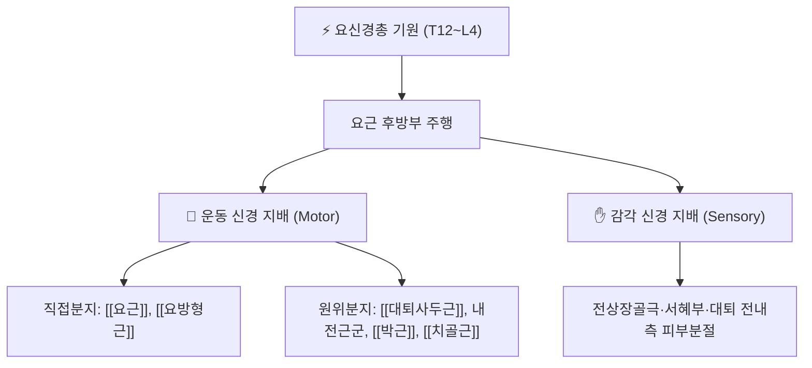

# ⚡ [[요신경총]] (Lumbar Plexus / 腰椎神經叢, T12~L4)

> **핵심 3줄 요약 (Key Summary)**:
> - 🗺️ 신경 기원 & 해부학적 주행: T12~L4(주력 L1~L4) 척수신경 전지에서 기원하여 [[요근]](psoas major) 후방부에 매립된 상태로 형성되는 요추부 신경총.
> - 🎯 운동 지배(근육군) & 감각 지배 영역: 직접분지는 [[요근]]·[[요방형근]]을, 원위 종말가지는 [[대퇴사두근]]·내전근군·[[박근]]·[[치골근]]을 지배하며 전상장골극~하지 앞안쪽 전체의 감각을 관할.
> - ⚠️ 호발 포착 부위 & 관련 임상 질환: 서혜인대 하방([[외측대퇴피신경]] 포착에 의한 [[이상지각성 대퇴신경통]]), 폐쇄공([[폐쇄신경]] 포착), 척추 내시경/최소침습 수술 중 의인성 손상.
> - 🔍 주요 이학적 검사 & 신경학적 징후: 대퇴신경 신장 검사(Femoral nerve stretch test), 무릎 신전력 약화(대퇴사두근), 내전근 약화(폐쇄신경), 서혜부~대퇴전외측 감각 이상.

---

---

## 📌 목차
1. [신경 기원 & 해부학적 분지 경로 (Anatomy & Course)](#1-신경-기원--해부학적-분지-경로-anatomy--course)
2. [신경 지배 맵 & 기능 네트워크 (Innervation Map)](#2-신경-지배-맵--기능-네트워크-innervation-map)
3. [호발 포착 부위 & 터널 증후군 병태생리](#3-호발-포착-부위--터널-증후군-병태생리)
4. [손상 레벨별 임상 증상 & 신경학적 결손](#4-손상-레벨별-임상-증상--신경학적-결손)
5. [관련 이학적 검사 & 신경 감별 매트릭스](#5-관련-이학적-검사--신경-감별-매트릭스)
6. [한의 신경 치료 프로토콜 (약침·침도·신경수기)](#6-한의-신경-치료-프로토콜-약침침도신경수기)
7. [💡 사용자 진료실 핵심 필기 & 임상 팁 (원문 보존)](#7--사용자-진료실-핵심-필기--임상-팁-원문-보존)
8. [출처 및 학술 참고 문헌 (References)](#8-출처-및-학술-참고-문헌-references)

---

> [!IMPORTANT]
> **🖼️ 신경 노트 필수 3종 도해 수록 및 사전 시각 검수(Zero Blind Linking) 완료**
> 첨부파일 폴더 기존 보유 이미지 3종을 `Read`로 실물 확인 후 수록했습니다. 단, 동일 폴더에서 발견된 `이상지각성대퇴신경통_방사통_감각이상_영역.png`는 시각 검증 결과 실제로는 보티첼리 「비너스의 탄생」 다리 부분에 주황색 음영을 임의로 덧입힌 이미지로, 의학적 도해가 아니어서 **사용하지 않았습니다**(하단 5장 지식 공백 분석에 별도 보고).

## 1. 신경 기원 & 해부학적 분지 경로 (Anatomy & Course)

![[요신경총_분지도해_장골하복신경_음부대퇴신경.png|450]]
> [그림 1] 요신경총의 척수 분절 기원(T12~L5) 및 주요 분지(장골하복신경·장골서혜신경·음부대퇴신경·외측대퇴피신경·폐쇄신경·대퇴신경) 해부도

* **신경 기원 (Origin & Spinal Segments)**:
  * T12~L5 척수신경 전지(anterior rami)에서 형성되며, 주력 기여 분절은 L1~L4.
* **상세 주행 경로 (Detailed Pathway)**:
  * 척주 측방, 추간공을 나와 [[요근]](psoas major) 근복 후방부에 매립된 형태로 신경총을 이루며 하행.
* **주요 분지 (Major Branches)**:

| 분지 신경 | 척수 분절 | 주요 기능 |
| :--- | :--- | :--- |
| [[장골하복신경]] | T12~L1 | 복벽근 운동, 둔부·서혜부 감각 |
| [[장골서혜신경]] | L1 | 서혜부·대퇴 내측 상부 감각, 복벽근 보조 운동 |
| [[음부대퇴신경]] | L1~L2 | 생식가지·대퇴가지(서혜부 감각, 거고근 반사) |
| [[외측대퇴피신경]] | L2~L3 | 대퇴 외측 감각(순수 감각신경) |
| [[대퇴신경]] | L2~L4 | 요신경총 최대 분지 — 대퇴 전면 운동·감각 |
| [[폐쇄신경]] | L2~L4 | 대퇴 내전근군 운동 |

---

## 2. 신경 지배 맵 & 기능 네트워크 (Innervation Map)

### 1) 운동 신경 지배 근육 (Motor Innervation)

![[대퇴신경-20240918102932333.png|420]]
> [그림 2] [[대퇴신경]](L2~L4)의 요근 내 주행 및 [[대퇴사두근]] 지배 모식도

* **직접분지(신경총 자체)**: [[요근]], [[요방형근]] — 체간 안정 및 고관절 굴곡 보조.
* **원문 보존 분지 요약(요신경총 노트)**: L1~L4 척수신경이 재분배되어 [[요신경총]]을 형성하여 [[장골근]], [[대퇴사두근]], [[봉공근]], [[치골근]]의 운동·피부감각을 지배하고, [[폐쇄신경]]을 형성하여 [[내전근]] 운동·피부감각을 지배한다.
* **[[대퇴신경]] 지배**: [[대퇴사두근]](대퇴직근·외측광근·내측광근·중간광근), [[장요근]], [[치골근]], [[봉공근]] — 무릎 신전 및 고관절 굴곡의 핵심.
* **[[폐쇄신경]] 지배**: 내전근군([[장내전근]], [[단내전근]], [[대내전근]]), [[박근]], [[외폐쇄근]] — 고관절 내전.

### 2) 감각 신경 지배 영역 (Sensory Distribution)
* [[외측대퇴피신경]]: 대퇴 외측 순수 감각.
* [[대퇴신경]] 피부가지([[복재신경]] 포함): 대퇴 전면~하퇴 내측 감각.
* [[음부대퇴신경]]·[[장골서혜신경]]: 서혜부~대퇴 내측 상부 감각.

---

## 3. 호발 포착 부위 & 터널 증후군 병태생리

![[폐쇄신경-20240918103203459.png|420]]
> [그림 3] [[폐쇄신경]]의 폐쇄공(obturator canal) 통과 경로 및 내전근군 지배 도해 — 요신경총(L2~L4) 기원이 함께 표시됨

* **서혜인대 하방 포착([[외측대퇴피신경]])**:
  * 비만·임신·벨트 압박 등으로 서혜인대 하방에서 포착되어 [[이상지각성 대퇴신경통]](Meralgia paresthetica)을 유발.
* **폐쇄공 포착([[폐쇄신경]])**:
  * 폐쇄막·폐쇄외근 사이 폐쇄공 통과부에서 포착되어 대퇴 내측 통증 및 내전근 약화 유발.
* **의인성 손상**:
  * 최소침습 척추수술(사측방 요추체간유합술 등) 중 요근을 통과하는 요신경총 손상 사례가 보고되며, 대개 3개월 이내 회복 경향(StatPearls, PMID 31424721).

---

## 4. 손상 레벨별 임상 증상 & 신경학적 결손

| 손상 레벨 / 부위 | 마비/약화 근육 | 감각 결손 부위 | 전형적 외형 징후 (Deformity) |
| :--- | :--- | :--- | :--- |
| **[[대퇴신경]] 손상** | [[대퇴사두근]] — 무릎 신전 약화 | 대퇴 전면~하퇴 내측 | 계단 오르기·무릎 꺾임(buckling) |
| **[[폐쇄신경]] 손상** | 내전근군 — 고관절 내전 약화 | 대퇴 내측 국소 감각 이상 | 보행 시 외전 편위(circumduction) |
| **[[외측대퇴피신경]] 손상** | 운동 결손 없음(순수 감각신경) | 대퇴 외측 감각 이상·작열감 | [[이상지각성 대퇴신경통]] 전형 양상 |

---

## 5. 관련 이학적 검사 & 신경 감별 매트릭스

| 이학적 검사명 | 검사 방법 및 유발 기전 | 양성 반응 | 관련 감별 신경/질환 |
| :--- | :--- | :--- | :--- |
| 대퇴신경 신장 검사(Femoral nerve stretch test) | 복와위 슬관절 굴곡·고관절 신전 | 대퇴 전면 방사통 재현 | [[대퇴신경]] 포착·L2~L4 신경근병증 |
| 골반압박검사(Pelvic compression test) | 측와위 장골능 압박 | 서혜인대 하방 감각이상 재현 | [[이상지각성 대퇴신경통]] |

---

## 6. 한의 신경 치료 프로토콜 (약침·침도·신경수기)

* **신경 포착 해제 약침술 (Hydrodissection)**:
  * [[요근]] 내 [[대퇴신경]] 주행부, 서혜인대 하방 [[외측대퇴피신경]] 포착점, 폐쇄공 [[폐쇄신경]] 포착점을 타겟으로 한 약침 자입 시 인접 대퇴동·정맥 손상 방지가 최우선.
* **침도 및 전침 치료**: ⚠️ 확인 필요 — 요신경총 특이적 침도 프로토콜 문헌은 이번 조사 범위 내에서 확인하지 못함.
* **신경 가동술 (Neurodynamic Mobilization)**: 슬럼프 검사 변형 및 대퇴신경 슬라이더 기법을 통한 요근-신경총 유착 완화(⚠️ 구체적 프로토콜 확인 필요).

---

## 7. 💡 사용자 진료실 핵심 필기 & 임상 팁 (원문 보존)

* **사용자 원문 필기**: ⚠️ 아직 등록된 원장님 임상 필기가 없습니다. 요신경총 관련 진료 경험이 있다면 이 섹션에 추가해 주세요.
* **신경 촉진(Palpation) & 자침 안전 수칙**:
  * [[요근]] 내 신경총 주행 특성상 후복막강 대혈관(대동맥·대정맥·요관)에 근접하므로, 심부 자입 시 초음파 유도 병행이 권장됨.

---

## 8. 출처 및 학술 참고 문헌 (References)

1. **Singh O, Al Khalili Y. (2023)**. *Anatomy, Back, Lumbar Plexus*. StatPearls Publishing. PMID: [31424721](https://pubmed.ncbi.nlm.nih.gov/31424721/).
   - **[연구 요약]**: 요신경총의 T12~L5(주력 L1~L4) 척수분절 기원, 요근 내 주행, 6대 종말가지(장골하복·장골서혜·음부대퇴·외측대퇴피·대퇴·폐쇄신경)의 분절 기원과 지배 근육을 정리하고, 최소침습 척추수술 후 의인성 손상이 대개 3개월 내 회복된다고 보고.

