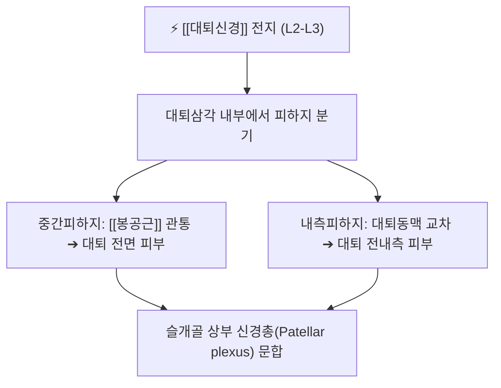

# ⚡ [[전대퇴피신경]] (Anterior Femoral Cutaneous Nerve / 前大腿皮神經, L2-L3)

> **핵심 3줄 요약 (Key Summary)**:
> - 🗺️ 신경 기원 & 해부학적 주행: 요신경총(L2-L3) 대퇴신경(Femoral nerve) 전지의 피하 분지군, 대퇴삼각을 지나 광근근막을 관통하여 대퇴 전면부 피하로 분지.
> - 🎯 운동 지배(근육군) & 감각 지배 영역: 순수 감각 신경. 대퇴부 전면 및 전내측 피부 감각(서혜인대 하방부터 슬개골 상부까지) 지배.
> - ⚠️ 호발 포착 부위 & 관련 임상 질환: 봉공근(Sartorius) 관통부 및 대퇴근막 관통공, [[대퇴신경통]], 대퇴사두근 건 재건술 후 의인성 감각 신경 손상.
> - 🔍 주요 이학적 검사 & 신경학적 징후: 대퇴 전면부 핀프릭(Pin-prick) 감각 검사, 대퇴삼각 부위 압통 검사.

---

## 📌 목차
1. [신경 기원 & 해부학적 분지 경로 (Anatomy & Course)](#1-신경-기원--해부학적-분지-경로-anatomy--course)
2. [신경 지배 맵 & 기능 네트워크 (Innervation Map)](#2-신경-지배-맵--기능-네트워크-innervation-map)
3. [호발 포착 부위 & 터널 증후군 병태생리](#3-호발-포착-부위--터널-증후군-병태생리)
4. [손상 레벨별 임상 증상 & 신경학적 결손](#4-손상-레벨별-임상-증상--신경학적-결손)
5. [관련 이학적 검사 & 신경 감별 매트릭스](#5-관련-이학적-검사--신경-감별-매트릭스)
6. [한의 신경 치료 프로토콜 (약침·침도·신경수기)](#6-한의-신경-치료-프로토콜-약침침도신경수기)
7. [💡 사용자 진료실 핵심 필기 & 임상 팁 (원문 보존)](#7--사용자-진료실-핵심-필기--임상-팁-원문-보존)
8. [출처 및 학술 참고 문헌 (References)](#8-출처-및-학술-참고-문헌-references)

---

## 1. 신경 기원 & 해부학적 분지 경로 (Anatomy & Course)

![[전대퇴피신경-대퇴전면분지-Gray827.png|420]]
> [그림 1] 대퇴동맥 외측에서 갈라져 나와 대퇴 전면을 덮는 [[전대퇴피신경]]의 분지 해부도 (출처: Gray's Anatomy)

* **신경 기원 (Origin & Spinal Segments)**:
  * 요신경총(Lumbar plexus) **제2, 3 요추신경(L2, L3)**에서 기원하는 대퇴신경(Femoral nerve)의 전피하지(Anterior cutaneous branches)입니다.
* **상세 주행 경로**:
  1. 서혜인대(Inguinal ligament) 하방 대퇴삼각(Femoral triangle) 내부에서 대퇴신경 본간으로부터 갈라집니다.
  2. 내측분지(Intermediate cutaneous nerve)와 외측분지(Medial cutaneous nerve)로 나뉩니다.
  3. [[봉공근]](Sartorius) 근복을 뚫거나 근막을 관통하여 광근근막(Fascia lata) 표층 피하지방층으로 분지합니다.
  4. 대퇴사두근 전면을 따라 하행하여 슬개골 주변 신경망(Patellar plexus) 형성에 기여합니다.

---

## 2. 신경 지배 맵 & 기능 네트워크 (Innervation Map)

![[전대퇴피신경-요신경총-Gray823.png|420]]
> [그림 2] 요신경총에서 기원하는 대퇴신경과 전대퇴피신경의 척수 분절 기원 모식도

---

## 3. 호발 포착 부위 & 터널 증후군 병태생리

* **봉공근 관통부 및 대퇴근막 출구**:
  * 타이트한 청바지 착용, 안전벨트 압박, 골반 전방경사로 장요근과 대퇴직근이 과긴장할 때 대퇴근막을 관통하는 구멍에서 조임이 발생합니다.
* **외측대퇴피신경(LFCN, 감각이상성 대퇴신경통)과의 구별**:
  * LFCN은 허벅지 바깥쪽을 지배하나, 전대퇴피신경은 허벅지 바로 앞면과 무릎 위쪽을 지배합니다.

---

## 4. 손상 레벨별 임상 증상 & 신경학적 결손

* 허벅지 앞쪽이 화끈거리거나 얼얼하게 시린 감각 이상(Dysesthesia), 손으로 쓸어내릴 때 전기가 통하는 듯한 과민 반응.
* 무릎 인공관절 수술이나 전방십자인대(ACL) 재건술 시 건 채취 부위 절개로 인한 신경 손상.

---

## 5. 관련 이학적 검사 & 신경 감별 매트릭스

* **대퇴삼각 압통 검사**: 서혜인대 중앙 하방 2~3cm 지점을 압박할 때 대퇴 전면으로 저림이 재현되는지 확인.

---

## 6. 한의 신경 치료 프로토콜 (약침·침도·신경수기)

* **복토(ST32), 비관(ST31) 침치료**:
  * 대퇴 전면부 위경(胃經) 경혈을 따라 0.25×40mm 침으로 자침하여 피하신경 포착을 해소합니다.
* **장요근 및 봉공근 근막 이완 추나**:
  * 고관절 신전 기법을 통해 대퇴 전면 근막의 긴장도를 낮춰줍니다.

---

## 7. 💡 사용자 진료실 핵심 필기 & 임상 팁 (원문 보존)

* **허벅지 앞면이 시리고 화끈거린다는 노인 환자**:
  * 요추 3-4번 디스크로 오진하기 쉬우나, 하지직거상(SLR) 검사가 정상이고 대퇴사두근 근력 저하가 없다면 전대퇴피신경의 말초 포착입니다. 복토혈 주변 약침 치료로 신속히 개선됩니다.

---

## 8. 출처 및 학술 참고 문헌 (References)

* Ruzbarsky, J. J., et al. (2026). "Anatomical relationship between the distal lateral femoral cutaneous nerve and the quadriceps tendon autograft harvest site: a cadaveric study with implications for acl reconstruction surgery." *Surgical and Radiologic Anatomy*, 48(8), 915-923. [PMID: 42616156](https://pubmed.ncbi.nlm.nih.gov/42616156/)
  - [연구 요약]: 무릎 및 대퇴사두근 수술 시 대퇴 전면 피하신경의 주행과 의인성 신경 손상 방지 가이드라인 제시.
* Barton, D., et al. (2026). "Surgical Anatomical Study of the Lateral Femoral Cutaneous Nerve in Direct Anterior Approach for Total Hip Arthroplasty." *Clinical Anatomy*, 39(3), 345-353. [PMID: 41793066](https://pubmed.ncbi.nlm.nih.gov/41793066/)
  - [연구 요약]: 대퇴 전외측 피하신경들의 분지 변이와 고관절 전방 접근 수술 시 보존 기법 규명.
* Miniato, M. A., et al. (2026). "Anatomy, Bony Pelvis and Lower Limb: Femoral Nerve and Branches." *StatPearls Publishing*. [PMID: 30335334](https://pubmed.ncbi.nlm.nih.gov/30335334/)
  - [연구 요약]: 대퇴신경 전피하지의 기원, 대퇴부 피부분절 감각 신경망 해부학적 총괄 기술.
