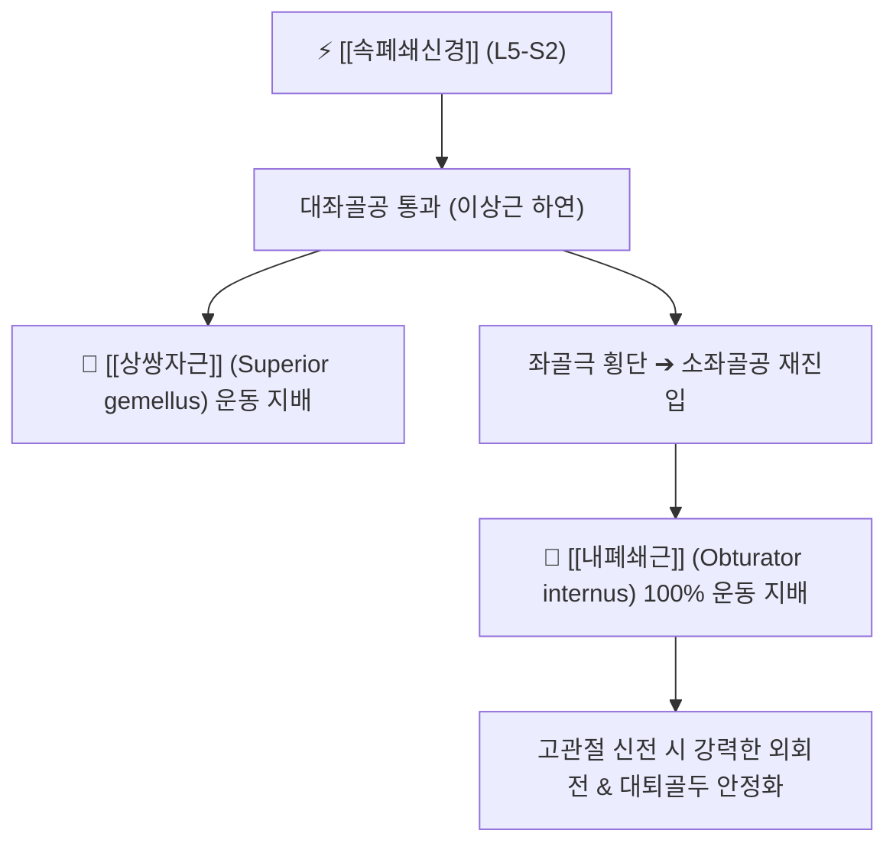

# ⚡ [[속폐쇄신경]] (Nerve to Obturator Internus / 內閉鎖筋神經, L5-S2)

> **핵심 3줄 요약 (Key Summary)**:
> - 🗺️ 신경 기원 & 해부학적 주행: 천골신경총(L5, S1, S2) 전지 기원, [[이상근]](Piriformis) 하연으로 대좌골공을 빠져나와 좌골극을 가로지른 후 소좌골공을 통해 골반 내면의 [[내폐쇄근]](Obturator internus) 심층면으로 진입.
> - 🎯 운동 지배(근육군) & 감각 지배 영역: 순수 운동 신경. 고관절의 핵심 외회전근인 **[[내폐쇄근]](Obturator internus)**과 **[[상쌍자근]](Superior gemellus)** 운동 지배.
> - ⚠️ 호발 포착 부위 & 관련 임상 질환: 이상근 하공 및 좌골극 주변 인대성 협착, [[심부 둔부 증후군]](Deep Gluteal Syndrome), 고관절 심부 후방 둔통.
> - 🔍 주요 이학적 검사 & 신경학적 징후: 고관절 굴곡·내회전 시 심부 둔통 유발(FADIR 검사), 좌골결절 상외측 심부 압통.

---

## 📌 목차
1. [신경 기원 & 해부학적 분지 경로 (Anatomy & Course)](#1-신경-기원--해부학적-분지-경로-anatomy--course)
2. [신경 지배 맵 & 기능 네트워크 (Innervation Map)](#2-신경-지배-맵--기능-네트워크-innervation-map)
3. [호발 포착 부위 & 터널 증후군 병태생리](#3-호발-포착-부위--터널-증후군-병태생리)
4. [손상 레벨별 임상 증상 & 신경학적 결손](#4-손상-레벨별-임상-증상--신경학적-결손)
5. [관련 이학적 검사 & 신경 감별 매트릭스](#5-관련-이학적-검사--신경-감별-매트릭스)
6. [한의 신경 치료 프로토콜 (약침·침도·신경수기)](#6-한의-신경-치료-프로토콜-약침침도신경수기)
7. [💡 사용자 진료실 핵심 필기 & 임상 팁 (원문 보존)](#7--사용자-진료실-핵심-필기--임상-팁-원문-보존)
8. [출처 및 학술 참고 문헌 (References)](#8-출처-및-학술-참고-문헌-references)

---

## 1. 신경 기원 & 해부학적 분지 경로 (Anatomy & Course)

![[음부신경-천골신경총-Gray829.png|420]]
> [그림 1] 천골신경총 L5-S2에서 분지하여 좌골극을 넘어 소좌골공으로 들어가는 [[속폐쇄신경]]의 해부도 (출처: Gray's Anatomy)

* **신경 기원 (Origin & Spinal Segments)**:
  * 천골신경총(Sacral plexus)의 **제5 요추신경(L5) 및 제1, 2 천추신경(S1, S2)** 전지에서 기원합니다.
* **상세 주행 경로**:
  1. 골반강을 나와 [[이상근]](Piriformis) 하연의 대좌골공을 통과합니다 (음부신경의 외측, 좌골신경의 내측에 위치).
  2. 대좌골공을 빠져나오자마자 **[[상쌍자근]](Superior gemellus)**의 심층면으로 분지를 냅니다.
  3. 좌골극(Ischial spine)의 후면을 가로질러 주행합니다.
  4. 소좌골공(Lesser sciatic foramen)을 통과하여 골반 내면으로 다시 진입합니다.
  5. **[[내폐쇄근]](Obturator internus)**의 골반 내측면(심층면)으로 들어가 근육 실질에 방사상으로 정지합니다.

---

## 2. 신경 지배 맵 & 기능 네트워크 (Innervation Map)

---

## 3. 호발 포착 부위 & 터널 증후군 병태생리

* **이상근 하공 및 좌골극 마찰**:
  * 좌골신경, 음부신경과 함께 이상근 하공을 통과하므로, 이상근 증후군 발생 시 동반 압박되어 심부 둔통을 가중시킵니다.

---

## 4. 손상 레벨별 임상 증상 & 신경학적 결손

* 엉덩이 깊은 곳의 뻐근한 만성 통증, 양반다리를 하거나 고관절을 외회전할 때 둔부 심부 결림.
* 내폐쇄근 위축 시 보행 중 대퇴골두의 후방 안정성 저하.

---

## 5. 관련 이학적 검사 & 신경 감별 매트릭스

* **FADIR 검사 (굴곡-내전-내회전 검사)**:
  * 내폐쇄근과 상쌍자근을 최대로 신장시킬 때 둔부 깊은 곳에서 통증이 유발되면 양성.

---

## 6. 한의 신경 치료 프로토콜 (약침·침도·신경수기)

* **환도(GB30) 심부 장침 자침**:
  * 0.30×75mm 장침을 대전자와 천골열공 연결선 외측 1/3 지점에서 수직 심부 자침하여 내폐쇄근 건막을 자극합니다.
* **둔부 심부 외회전근 MET 추나**:
  * 고관절 내회전 방향으로 등장성 수축 후 이완을 유도합니다.

---

## 7. 💡 사용자 진료실 핵심 필기 & 임상 팁 (원문 보존)

* **좌골신경통으로 오진되는 심부 둔통**:
  * 엉덩이 깊은 곳이 아프다고 해서 무조건 이상근이나 디스크만 볼 것이 아니라, 그 아래에 있는 내폐쇄근과 속폐쇄신경의 과긴장을 함께 치료해야 둔부 깊숙한 잔여 통증이 말끔히 해결됩니다.

---

## 8. 출처 및 학술 참고 문헌 (References)

* Ploteau, S., et al. (2026). "Two layers of fascia envelop the pudendal nerve canal: a cadaver study." *International Journal of Colorectal Disease*, 41(1), 55. [PMID: 41772256](https://pubmed.ncbi.nlm.nih.gov/41772256/)
  - [연구 요약]: 내폐쇄근 근막과 알콕관의 미세 해부 구조 및 속폐쇄신경의 주행 관계 규명.
* Leslie, S. W., et al. (2026). "Pudendal Nerve Entrapment Syndrome." *StatPearls Publishing*. [PMID: 31334992](https://pubmed.ncbi.nlm.nih.gov/31334992/)
  - [연구 요약]: 소좌골공 및 좌골극 주변을 통과하는 신경 다발의 해부학적 포착 증후군 고찰.
* Davis, D. D., et al. (2026). "Anatomy, Sciatic Nerve and Deep Gluteal Space." *StatPearls Publishing*. [PMID: 29494038](https://pubmed.ncbi.nlm.nih.gov/29494038/)
  - [연구 요약]: 심부 둔부 공간 내 외회전근군과 속폐쇄신경의 해부학적 지형도 총괄.

<!-- 보관 태그(1회용·링크오류, 필요시 복원): 내폐쇄근 -->
