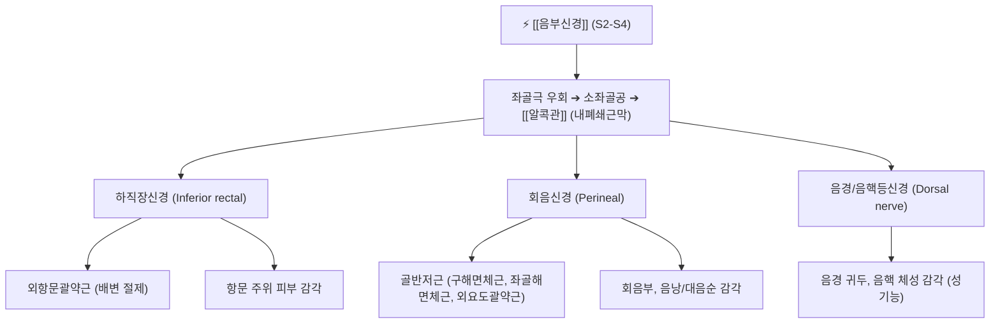

# ⚡ [[음부신경]] (Pudendal Nerve / 陰部神經, S2-S4)

> **핵심 3줄 요약 (Key Summary)**:
> - 🗺️ 신경 기원 & 해부학적 주행: 천골신경총(S2-S4) 기원, 대좌골공을 나와 좌골극(Ischial spine)과 천골극인대를 감아돌아 소좌골공으로 진입 후 내폐쇄근 근막 터널인 [[알콕관]](Alcock's canal)을 관통.
> - 🎯 운동 지배(근육군) & 감각 지배 영역: 외항문괄약근·외요도괄약근·구해면체근 운동 지배, 회음부·음낭/대음순·음경/음핵 피부 감각 지배.
> - ⚠️ 호발 포착 부위 & 관련 임상 질환: 천골결절인대와 천골극인대 사이 간극 및 알콕관 내부, [[음부신경통]](Pudendal Neuralgia, 앉을 때 극심해지는 회음부·골반 작열통), 배뇨통·성교통.
> - 🔍 주요 이학적 검사 & 신경학적 징후: 낭츠 진단 기준(Nantes criteria), 좌골극 내측 압통(Tinel sign), 구해면체 반사(BCR) 지연 또는 소실.

---

## 📌 목차
1. [신경 기원 & 해부학적 분지 경로 (Anatomy & Course)](#1-신경-기원--해부학적-분지-경로-anatomy--course)
2. [신경 지배 맵 & 기능 네트워크 (Innervation Map)](#2-신경-지배-맵--기능-네트워크-innervation-map)
3. [호발 포착 부위 & 터널 증후군 병태생리](#3-호발-포착-부위--터널-증후군-병태생리)
4. [손상 레벨별 임상 증상 & 신경학적 결손](#4-손상-레벨별-임상-증상--신경학적-결손)
5. [관련 이학적 검사 & 신경 감별 매트릭스](#5-관련-이학적-검사--신경-감별-매트릭스)
6. [한의 신경 치료 프로토콜 (약침·침도·신경수기)](#6-한의-신경-치료-프로토콜-약침침도신경수기)
7. [💡 사용자 진료실 핵심 필기 & 임상 팁 (원문 보존)](#7--사용자-진료실-핵심-필기--임상-팁-원문-보존)
8. [출처 및 학술 참고 문헌 (References)](#8-출처-및-학술-참고-문헌-references)

---

## 1. 신경 기원 & 해부학적 분지 경로 (Anatomy & Course)

![[음부신경-천골신경총-Gray829.png|420]]
> [그림 1] 천골신경총(S2-S4)에서 유래하여 대좌골공을 빠져나와 좌골극을 우회하는 [[음부신경]]의 해부도 (출처: Gray's Anatomy)

* **신경 기원 (Origin & Spinal Segments)**:
  * 천골신경총(Sacral plexus)의 **제2, 3, 4 천수신경(S2, S3, S4)** 전지에서 기원합니다.
* **상세 주행 경로 (Detailed Pathway)**:
  1. 골반강 내에서 형성된 후 [[이상근]](Piriformis) 하연을 지나 대좌골공(Greater sciatic foramen)을 통해 골반 밖으로 탈출합니다.
  2. 좌골극(Ischial spine)의 첨부와 천골극인대(Sacrospinous ligament)를 외측에서 내측으로 고리처럼 감아 돕니다.
  3. 천골결절인대(Sacrotuberous ligament) 심부를 지나 소좌골공(Lesser sciatic foramen)을 통해 골반저 회음강으로 재진입합니다.
  4. 좌골직장와(Ischiorectal fossa) 외측벽에 위치한 [[내폐쇄근]](Obturator internus) 근막 중복부인 **[[알콕관]](Alcock's canal / Pudendal canal)** 내부를 내음부동정맥과 함께 주행합니다.
* **3대 주요 종말 분지**:
  * **하직장신경(Inferior rectal nerve)**: 알콕관 초입에서 분지하여 외항문괄약근 및 항문 주위 피부로 주행.
  * **회음신경(Perineal nerve)**: 천·심회음극 및 구해면체근, 좌골해면체근, 음낭/대음순 피부로 분지.
  * **음경/음핵등신경(Dorsal nerve of penis/clitoris)**: 비뇨생식격막을 관통하여 음경/음핵 귀두부 감각 지배.

---

## 2. 신경 지배 맵 & 기능 네트워크 (Innervation Map)

![[음부신경-회음부해부-Gray542.png|430]]
> [그림 2] 회음부 심층 해부도 — 알콕관을 통과한 후 외항문괄약근, 비뇨생식격막 및 외생식기로 뻗어나가는 음부신경 분지망

---

## 3. 호발 포착 부위 & 터널 증후군 병태생리

![[음부신경-안장마비-감각영역.png|400]]
> [그림 3] 음부신경 압박 시 발생하는 안장형(Saddle) 감각 이상 구역 및 알콕관 압박 부위

* **제1 포착 터널 (집게 기전, Pincer mechanism)**:
  * 천골결절인대와 천골극인대가 가위처럼 교차하는 틈새에 신경이 끼여 장시간 좌식 생활 시 압박이 극대화됨.
* **제2 포착 터널 ([[알콕관]] 내부, Alcock's canal)**:
  * 내폐쇄근의 만성 경축 및 근막 비후로 인해 알콕관 내강 압력이 상승하여 신경 허혈과 신경내막 섬유화 발생 (자전거 라이더 증후군).

---

## 4. 손상 레벨별 임상 증상 & 신경학적 결손

| 질환 / 병태 | 주요 임상 양상 | 특징적 완화/악화 인자 |
| :--- | :--- | :--- |
| **알콕관 증후군 (음부신경통)** | 회음부, 항문, 외생식기의 타는 듯한 작열통, 찌르는 통증, 이물감('골프공이 낀 느낌') | **앉으면 극심하게 악화**, 서 있거나 변기 시트(가운데 뚫린 곳)에 앉으면 완화 |
| **괄약근 기능부전** | 요절박, 잔뇨감, 분변실금 또는 배변 시 항문 경련통 | 복압 상승 시 악화 |
| **성기능 장애** | 음경/음핵 감각 둔마, 발기 시 통증, 성교통, 오르가즘 장애 | 장거리 사이클 주행 후 빈발 |

---

## 5. 관련 이학적 검사 & 신경 감별 매트릭스

* **낭츠 진단 기준 (Nantes Criteria, 음부신경통 확진 5대 원칙)**:
  1. 통증 부위가 음부신경 지배 영역(회음부, 항문, 생식기)에 국한됨.
  2. 통증이 앉아 있을 때 현저히 악화됨.
  3. 밤에 자는 동안 통증으로 깨지 않음 (수면 중 비체중부하).
  4. 객관적인 임상적 감각 소실이 두드러지지 않음 (신경병증성 통각과민 위주).
  5. 진단적 음부신경 차단술 시 즉각적인 통증 소실.
* **좌골극 압진 티넬 징후**: 직장수지검사(DRE) 또는 둔부 좌골결절 내측을 깊게 촉진할 때 회음부로 방사통 유발.

---

## 6. 한의 신경 치료 프로토콜 (약침·침도·신경수기)

* **좌골직장와 침도 미세 박리술**:
  * 좌골결절과 항문 사이 지점에서 초음파 유도하에 내폐쇄근 근막(알콕관 하연)으로 침도를 진입시켜 두터워진 섬유성 관을 감압합니다.
* **천골 신경근 및 회음혈 약침 치료**:
  * 차료(BL32), 중료(BL33), 회음(CV1) 및 환도(GB30) 부위에 자하거 약침 또는 황련해독탕 약침 0.5~1.0cc를 주입하여 골반강 신경염증을 진정시킵니다.
* **골반저 도수 치료 및 천장관절 MET 추나**:
  * 골반 변위로 인해 팽팽해진 천골결절인대의 장력을 줄이기 위해 골반 후방경사 교정 및 천골 가동술을 적용합니다.

---

## 7. 💡 사용자 진료실 핵심 필기 & 임상 팁 (원문 보존)

* **"의자에 앉을 수가 없어요" - 비뇨기과 전전 환자의 감별법**:
  * 만성 전립선염이나 만성 방광염으로 진단받고 항생제를 수개월 복용했으나 소변 검사는 깨끗하고 회음부 작열통만 극심한 남녀 환자는 음부신경통을 의심해야 합니다.
  * 환자에게 "도넛 방석(가운데가 파인 방석)에 앉으면 덜 아픈가요?"라고 물어보아 "그렇다"고 답하면 100% 알콕관 포착입니다.
* **장거리 자전거 라이딩 환자의 조기 티칭**:
  * 로드 자전거 안장의 코(Nose) 부위가 알콕관을 직접 압박하므로, 증상 발생 시 즉시 라이딩을 중단시키고 안장을 코 없는 안장(Noseless saddle)으로 교체하도록 지도해야 비가역적 신경 손상을 막을 수 있습니다.

---

## 8. 출처 및 학술 참고 문헌 (References)

* Riant, T., et al. (2026). "Pudendal Nerve Entrapment Within Alcock's Canal as a Compartment-Like Syndrome: A Systematic Review." *Cureus*, 18(7), e64102. [PMID: 42605488](https://pubmed.ncbi.nlm.nih.gov/42605488/)
  - [연구 요약]: 알콕관 내부의 음부신경 포착을 만성 구획 증후군 관점에서 체계적으로 분석하고 좌위 악화 통증의 생체역학적 기전 규명.
* Lee, S. H., et al. (2026). "Pudendal nerve entrapment at the level of sacrospinous ligament or Alcock's canal; laparoscopic management." *Obstetrics & Gynecology Science*, 69(4), 312-321. [PMID: 42619498](https://pubmed.ncbi.nlm.nih.gov/42619498/)
  - [연구 요약]: 천골극인대 및 알콕관 레벨에서의 복강경 신경 감압술 임상 성적과 해부학적 포착 랜드마크를 제시.
* Ploteau, S., et al. (2026). "Aetiology of pelvic neuropathies in women: a narrative review." *Facts, Views & Vision in ObGyn*, 18(3), 185-197. [PMID: 42738799](https://pubmed.ncbi.nlm.nih.gov/42738799/)
  - [연구 요약]: 만성 골반통 및 회음부 이상감각 환자에서 음부신경병증의 임상 평가 알고리즘과 다학제적 치료 프로토콜을 체계화.

<!-- 보관 태그(1회용·링크오류, 필요시 복원): 음부신경통 -->
