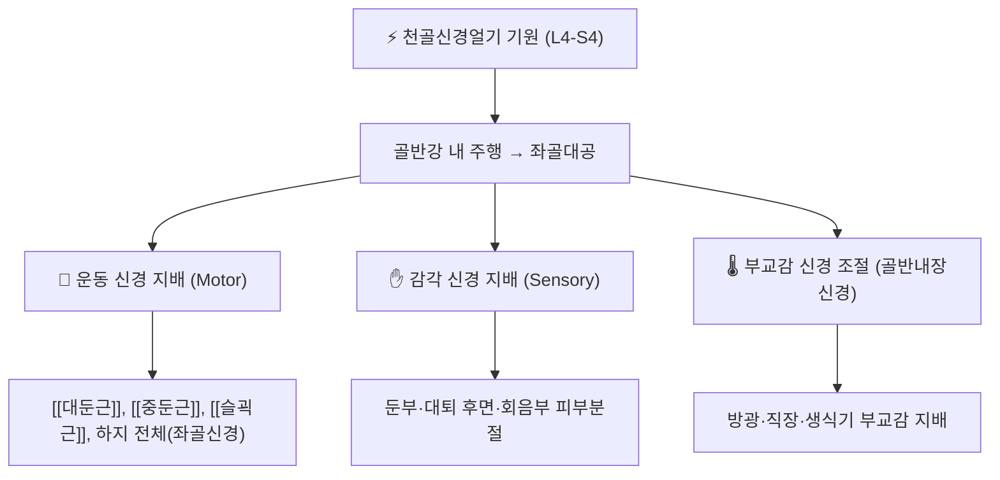

# ⚡ [[천골신경얼기]] (Sacral Plexus / 薦骨神經叢, L4~S4 척수신경 기원)

> **핵심 3줄 요약 (Key Summary)**:
> - 🗺️ 신경 기원 & 해부학적 주행: 요천골간(L4·L5) + 천골신경(S1~S4) 전지가 [[이상근]] 앞쪽에서 합류해 형성되는 신경얼기로, 골반강 후외측벽을 따라 좌골대공(greater sciatic foramen)을 향해 주행.
> - 🎯 운동 지배(근육군) & 감각 지배 영역: 둔부·대퇴 후면 근육([[대둔근]]·[[중둔근]]·[[슬괵근]] 등)과 하지 전체(좌골신경 경유)를 지배하며, 회음부·둔부·대퇴 후면 감각을 담당.
> - ⚠️ 호발 포착 부위 & 관련 임상 질환: [[이상근]] 하연·좌골대공·좌골결절-대퇴골 간극에서 포착되기 쉬우며 [[좌골신경통]]·[[이상근증후군]]과 밀접.
> - 🔍 주요 이학적 검사 & 신경학적 징후: [[라세그 검사]](SLR)·[[프라이버그 검사]] 등으로 좌골신경 포착 유발, 족하수·둔부 감각저하 소견.

---

---

## 📌 목차
1. [신경 기원 & 해부학적 분지 경로 (Anatomy & Course)](#1-신경-기원--해부학적-분지-경로-anatomy--course)
2. [신경 지배 맵 & 기능 네트워크 (Innervation Map)](#2-신경-지배-맵--기능-네트워크-innervation-map)
3. [호발 포착 부위 & 터널 증후군 병태생리](#3-호발-포착-부위--터널-증후군-병태생리)
4. [손상 레벨별 임상 증상 & 신경학적 결손](#4-손상-레벨별-임상-증상--신경학적-결손)
5. [관련 이학적 검사 & 신경 감별 매트릭스](#5-관련-이학적-검사--신경-감별-매트릭스)
6. [한의 신경 치료 프로토콜 (약침·침도·신경수기)](#6-한의-신경-치료-프로토콜-약침침도신경수기)
7. [💡 사용자 진료실 핵심 필기 & 임상 팁 (원문 보존)](#7--사용자-진료실-핵심-필기--임상-팁-원문-보존)
8. [출처 및 학술 참고 문헌 (References)](#8-출처-및-학술-참고-문헌-references)

---

> [!IMPORTANT]
> ⚠️ 이미지 미수록 — 이번 생성에서 `view_file` 시각 검증(Zero Blind Linking)을 거친 고해상도 신경 해부도를 확보하지 못해 필수 3종 이미지 규칙을 준수하지 못했습니다. 추후 시각 검증 후 보강이 필요합니다.

---

## 1. 신경 기원 & 해부학적 분지 경로 (Anatomy & Course)

* **신경 기원 (Origin & Spinal Segments)**:
  * [[요천골신경간]](lumbosacral trunk, L4 앞가지 일부 + L5)과 [[천골신경]] S1~S3(및 S4 일부) 앞가지가 골반강 내에서 합류해 형성되는 삼각형 모양의 신경판(neural plate).
  * 볼트 내 독서노트([[프로메테우스]] 해부학 원서)에서도 "천골신경얼기 가지 (L5-S1)"로 반복 언급되며, 이는 좌골신경 등 주요 분지의 기원 분절을 지칭한다.
* **상세 주행 경로 (Detailed Pathway)**:
  * [[이상근]] 앞면을 따라 편평하게 주행하다가 대부분의 섬유가 좌골대공(greater sciatic foramen)을 통해 골반강을 빠져나와 둔부로 진입한다.
  * 골반 내측에서는 [[속엉덩동맥]](internal iliac artery) 분지들과 밀접하게 주행하므로 골반 수술·부인과 시술 시 손상 위험이 있다.
* **주요 분지 (Major Branches)**:
  * **좌골신경(Sciatic nerve, L4~S3)**: 인체 최대 굵기 신경, 좌골대공을 통해 둔부로 나와 대퇴 후면을 주행.
  * **상둔신경(Superior gluteal nerve, L4~S1)**: 이상근 상연으로 빠져나와 [[중둔근]]·[[소둔근]]·[[대퇴근막장근]] 지배.
  * **하둔신경(Inferior gluteal nerve, L5~S2)**: 이상근 하연으로 빠져나와 [[대둔근]] 지배.
  * **후대퇴피신경(Posterior femoral cutaneous nerve, S1~S3)**: 대퇴 후면·둔부 하부 감각 지배.
  * **음부신경(Pudendal nerve, S2~S4)**: 알콕관(Alcock's canal)을 경유해 회음부·항문 영역 감각·운동 지배.
  * 이 외 이상근신경·속폐쇄근신경·대퇴방형근신경 등 단분지가 인접 근육을 지배.

---

## 2. 신경 지배 맵 & 기능 네트워크 (Innervation Map)

### 1) 운동 신경 지배 근육 (Motor Innervation)
* **둔부 근육군**: [[중둔근]]·[[소둔근]](상둔신경), [[대둔근]](하둔신경) — 고관절 외전 및 신전 기능.
* **대퇴 후면·하퇴·족부**: 좌골신경(경골신경+온종아리신경) 경유로 [[슬괵근]]·하퇴 전체 근육을 지배 — 무릎 굴곡, 발목·발가락 운동 전반.

### 2) 감각 신경 지배 영역 (Sensory Distribution)
* 둔부 하부·대퇴 후면(후대퇴피신경), 회음부·항문 주변(음부신경), 하퇴 및 족부(좌골신경 분지)의 광범위한 피부분절 감각을 담당한다.

---

## 3. 호발 포착 부위 & 터널 증후군 병태생리

* **제1 포착 부위 — 이상근 하연**:
  * [[이상근]]이 비대·단축되면 그 아래를 지나는 좌골신경(때로는 이상근을 관통하는 해부학적 변이 포함)이 눌려 [[이상근증후군]]을 유발.
* **제2 포착 부위 — 좌골결절-대퇴골 간극(ischiofemoral space)**:
  * 좌골결절과 대퇴골 소전자 사이 간극이 좁아지면 대퇴방형근과 함께 후대퇴피신경·좌골신경 분지가 자극받는 [[이상근증후군]] 유사 병태([[좌골대퇴충돌증후군]])가 발생할 수 있음(⚠️ 국내 한의 임상 보고 희박, 추정).
* **제3 포착 부위 — 알콕관**:
  * 음부신경이 폐쇄근막 이중막(Alcock's canal)을 통과하며 장시간 착석·자전거 타기 등으로 포착되어 [[음부신경통]]을 유발.

---

## 4. 손상 레벨별 임상 증상 & 신경학적 결손

| 손상 레벨 / 부위 | 마비/약화 근육 | 감각 결손 부위 | 전형적 외형 징후 (Deformity) |
| :--- | :--- | :--- | :--- |
| **얼기 전체(근위부) 손상** | 둔부·하지 전체 근력 저하 | 둔부·대퇴 후면·하지 전체 광범위 감각 저하 | 편측 하지 완전 마비 양상 |
| **좌골신경 분지 손상(원위부)** | 슬괵근·하퇴 전체 | 하퇴·족부 감각 이상 | 족하수(foot drop), 보행 이상 |
| **음부신경 단독 손상** | 회음부 괄약근 약화 | 회음부·항문 국소 감각 이상 | 배뇨·배변 조절 장애 동반 가능 |

---

## 5. 관련 이학적 검사 & 신경 감별 매트릭스

| 이학적 검사명 | 검사 방법 및 유발 기전 | 양성 반응 | 관련 감별 신경/질환 |
| :--- | :--- | :--- | :--- |
| [[라세그 검사]] (SLR) | 하지 신전 거상으로 좌골신경 신장 | 하지 방사통 재현 | [[좌골신경통]] |
| [[프라이버그 검사]] | 고관절 강제 내회전으로 이상근 신장 | 둔부·하지 방사통 유발 | [[이상근증후군]] |
| [[페이스 검사]] | 고관절 저항성 외회전·외전 | 둔부 통증 재현 | [[이상근증후군]] |

---

## 6. 한의 신경 치료 프로토콜 (약침·침도·신경수기)

* **신경 포착 해제 약침술 (Hydrodissection)**:
  * 이상근 주변·좌골신경 주행로 약침으로 근막 유착 이완 및 국소 염증 완화 목적 시술.
* **침도 및 전침 치료 (Acupotomy & EA)**:
  * 이상근 비대·유착 부위 침도 박리, 하지 방사통 부위 저주파 전침.
* **신경 가동술 (Neurodynamic Mobilization)**:
  * 좌골신경 슬라이더(Slider) 기법으로 신경 활주성 개선.

---

## 7. 💡 사용자 진료실 핵심 필기 & 임상 팁 (원문 보존)

* **⚠️ 내용 검토 필요**: 본 노트는 2026-09-23 다빈치가 미노트화 대기열 순번에 따라 신규 생성한 노트로([[프로메테우스]] 해부학 원서노트에서 4회 참조되던 미노트화 개념), 원장님의 진료실 실전 신경 촉진·자침 안전 수칙은 아직 반영되지 않았습니다.

---

## 8. 출처 및 학술 참고 문헌 (References)

1. **대한해부학회**. 『해부학용어집』 — 천골신경얼기(薦骨神經叢) 표준 용어.
2. **Bardeen CR, Elting AW (1901)**. *A statistical study of the variations in the formation and position of the lumbo-sacral plexus in man*. **Anat Anz**; 관련 후속 형태학 연구: PMID: [17231693](https://pubmed.ncbi.nlm.nih.gov/17231693/) (Morphology of the Sacral Plexus in Man).
   - **[연구 요약]**: 천골신경얼기 형성 분절(L4~S4)의 개체 변이 양상을 정량 분석한 고전적 해부학 연구.
3. **StatPearls (2023, 최종 갱신)**. *Anatomy, Back, Lumbosacral Trunk*. **StatPearls Publishing**. PMID: [30969700](https://pubmed.ncbi.nlm.nih.gov/30969700/)
   - **[연구 요약]**: 요천골간(L4-L5)이 천골신경얼기에 합류하는 경로와 임상적 의의(추간판탈출·분만 시 손상 등)를 정리.
4. **볼트 내부 참조**: [[프로메테우스]] (해부학 원서 독서노트) — 천골신경얼기 가지(L5-S1) 관련 4개소 언급.

<!-- 보관 태그(1회용·링크오류, 필요시 복원): 골반부 -->
