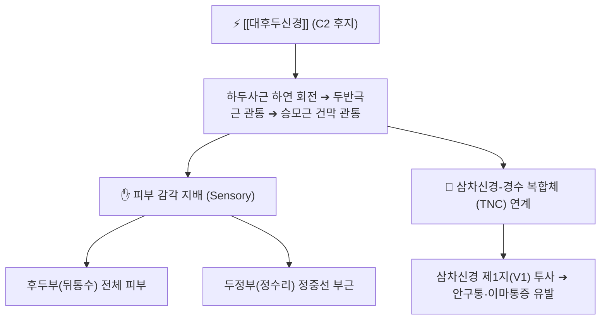

# ⚡ [[대후두신경]] (Greater Occipital Nerve / 大後頭神經, C2)

> **핵심 3줄 요약 (Key Summary)**:
> - 🗺️ 신경 기원 & 해부학적 주행: 제2경신경(C2) 후지의 내측지 기원, [[하두사근]](Inferior capitis oblique) 하연을 돌아 [[두반극근]](Semispinalis capitis) 및 [[승모근]](Trapezius) 건막을 관통하여 두정부(정수리)까지 상행.
> - 🎯 운동 지배(근육군) & 감각 지배 영역: 순수 감각 신경(피하지각), 후두부(뒤통수) 전체, 두정부, 외이도 후면 및 유돌부 피부 감각 지배.
> - ⚠️ 호발 포착 부위 & 관련 임상 질환: 두반극근 관통부 및 승모근 상항선 건막 터널, [[후두신경통]](찌릿한 전기통증), [[경추성 두통]](삼차신경-경부 복합체 연계 안와부 연관통).
> - 🔍 주요 이학적 검사 & 신경학적 징후: 상항선 외측 1/3 지점 티넬 징후(Tinel sign), 후두부 감각 둔마 또는 이질통(Allodynia), 스펄링 검사 양성.

---

## 📌 목차
1. [신경 기원 & 해부학적 분지 경로 (Anatomy & Course)](#1-신경-기원--해부학적-분지-경로-anatomy--course)
2. [신경 지배 맵 & 기능 네트워크 (Innervation Map)](#2-신경-지배-맵--기능-네트워크-innervation-map)
3. [호발 포착 부위 & 터널 증후군 병태생리](#3-호발-포착-부위--터널-증후군-병태생리)
4. [손상 레벨별 임상 증상 & 신경학적 결손](#4-손상-레벨별-임상-증상--신경학적-결손)
5. [관련 이학적 검사 & 신경 감별 매트릭스](#5-관련-이학적-검사--신경-감별-매트릭스)
6. [한의 신경 치료 프로토콜 (약침·침도·신경수기)](#6-한의-신경-치료-프로토콜-약침침도신경수기)
7. [💡 사용자 진료실 핵심 필기 & 임상 팁 (원문 보존)](#7--사용자-진료실-핵심-필기--임상-팁-원문-보존)
8. [출처 및 학술 참고 문헌 (References)](#8-출처-및-학술-참고-문헌-references)

---

## 1. 신경 기원 & 해부학적 분지 경로 (Anatomy & Course)

![[대후두신경-Gray800.png|420]]
> [그림 1] C2 신경근 후지에서 분지하여 하두사근을 감아돌고 두반극근을 뚫고 나오는 [[대후두신경]]의 해부도 (출처: Gray's Anatomy)

* **신경 기원 (Origin & Spinal Segments)**:
  * 제2경신경(C2) 후지(Dorsal ramus)의 굵은 내측지(Medial branch)에서 기원합니다.
* **상세 주행 경로 (Detailed Pathway)**:
  1. C1-C2 척추궁 사이(환축추 후방 관절)를 빠져나와 후두하삼각(Suboccipital triangle) 하연을 주행합니다.
  2. [[하두사근]](Obliquus capitis inferior)의 아래 테두리를 감아돌아 상내측으로 방향을 틉니다.
  3. [[두반극근]](Semispinalis capitis) 근복을 비스듬히 관통하며, 이때 근육 섬유와 건성 교액대 사이를 통과합니다.
  4. [[승모근]](Trapezius)의 건막(Aponeurosis) 또는 항인대 외측 가장자리를 뚫고 피하로 출현합니다.
  5. 후두동맥(Occipital artery)과 합류하여 나란히 상행하며 두정골 봉합선(정수리)까지 방사상 분지를 냅니다.

---

## 2. 신경 지배 맵 & 기능 네트워크 (Innervation Map)

![[대후두신경-두경부해부.png|420]]
> [그림 2] 후두부 피하층에서 상행하는 대후두신경과 후두동맥의 신경혈관 다발 및 정수리까지의 감각 분포망

### 1) 감각 신경 지배 (Sensory Distribution)
* 후두골 외후두융기(EOP) 상하부, 유돌돌기 내측 후두부 피부, 두정부 정상(Vertex)에 이르는 광범위한 두피 감각을 지배합니다.

### 2) 삼차신경-경수 복합체(Trigeminocervical Complex, TNC) 연쇄반응
* C2 대후두신경을 통해 유입된 통각 신호는 경수 상부의 삼차신경 척수핵(Spinal trigeminal nucleus) 신경원과 시냅스를 공유합니다.
* 이로 인해 후두부 신경 자극이 안와부(눈알 뒤 통증), 미간, 측두부로 방사되는 **[[경추성 두통]]의 핵심 기전**이 성립됩니다.

---

## 3. 호발 포착 부위 & 터널 증후군 병태생리

![[소후두신경-ErbPoint-후두주행.png|400]]
> [그림 3] 후두부의 3대 신경망(대후두신경, 소후두신경, 제3후두신경)의 상항선 관통 해부학적 랜드마크

* **제1 포착점 (하두사근 간극)**: C1-C2 회전 변위나 하두사근 과긴장 시 신경 줄기가 팽팽하게 견인 압박됨.
* **제2 포착점 (두반극근 관통부)**: 두반극근을 수직 관통하는 부위의 건성 띠에 의해 신경이 올가미처럼 조임.
* **제3 포착점 (승모근 건막 및 상항선 통과부)**: 상항선 외측 2~3cm 지점에서 승모근 건막 섬유가 굳어 신경혈관속을 압박.

---

## 4. 손상 레벨별 임상 증상 & 신경학적 결손

| 병변 위치 | 주요 임상 증상 | 신경학적 징후 |
| :--- | :--- | :--- |
| **상부경추 관절염 / C1-C2 변위** | 후두부 깊숙한 둔통, 고개 회전 시 통증 심화 | 상부 경추 회전 가동역 제한, 심부 압통 |
| **두반극근/승모근 건막 포착** | 번개가 치듯 찌릿하고 타는 듯한 발작성 후두통 | 상항선 압통점 티넬 징후 양성, 두피 이질통 |
| **삼차신경 복합 자극** | 두통과 함께 눈골이 빠질 듯한 안통, 시야 흐림 | 안와상절흔 압통 동반, 오심/구토 병발 |

---

## 5. 관련 이학적 검사 & 신경 감별 매트릭스

* **후두신경 티넬 징후 (Occipital Tinel Sign)**:
  * 외후두융기(EOP) 외방 2~3cm, 상항선 바로 아래 지점을 손가락 끝으로 가볍게 톡톡 두드릴 때 정수리까지 찌릿한 방전감이 퍼지면 양성.
* **스펄링 검사(Spurling test) 및 후두부 신전-회전 검사**:
  * 경추를 신전하고 환측으로 회전·측굴시킨 상태에서 축성 압박을 가할 때 후두통이 유발되는지 확인.

---

## 6. 한의 신경 치료 프로토콜 (약침·침도·신경수기)

* **상항선 침도(Acupotomy) 미세 유리술**:
  * 천주(BL10), 풍지(GB20) 내측 상항선 건막 부착부의 골성 표면에 침도를 수직 자입하여, 두반극근과 승모근 건막의 섬유성 유착을 횡방향으로 절개하여 신경 터널을 개방합니다.
* **후두하신경총 약침 요법**:
  * C1-C2 극돌기 외방의 하두사근 부착부에 중성어혈 약침 또는 신바로 약침 0.5cc를 심부 주입하여 신경 허혈 염증을 가라앉힙니다.
* **상부 경추 후두하근 이완 수기(Suboccipital Release)**:
  * 앙와위에서 시술자의 손가락 끝으로 후두골 하연을 접촉하여 견인(Traction)과 굴곡 유도를 통해 후두하 간극을 넓혀줍니다.

---

## 7. 💡 사용자 진료실 핵심 필기 & 임상 팁 (원문 보존)

* **"눈이 빠질 것 같다"는 편두통 환자의 비밀**:
  * 뇌 MRI나 안과 검사에서 정상인데 한쪽 눈 뒤쪽이 빠개질 것 같다고 호소하는 환자의 80%는 안구 질환이 아니라 대후두신경의 삼차신경핵 감작입니다.
  * 풍지혈과 후두골 하연의 대후두신경 포착점을 정확히 짚어 풀어주면 "눈앞이 갑자기 맑아지고 안통이 씻은 듯이 사라졌다"고 반응합니다.
* **빗질만 해도 아픈 두피 이질통(Allodynia) 확인**:
  * 머리를 감거나 빗질을 할 때 뒤통수와 정수리 피부가 쓰라리고 아프다면 단순 근육 뭉침이 아닌 대후두신경의 중추 감작화 신호이므로, 강자극 안마를 금하고 미세침과 약침으로 감압해야 합니다.

---

## 8. 출처 및 학술 참고 문헌 (References)

* Robinson, D., et al. (2026). "Greater, Lesser, and Third Occipital Nerve Entrapment: Sonographic Anatomy and Imaging." *Seminars in Ultrasound, CT and MRI*, 47(3), 180-192. [PMID: 42276431](https://pubmed.ncbi.nlm.nih.gov/42276431/)
  - [연구 요약]: 대후두신경, 소후두신경, 제3후두신경의 고해상도 초음파 해부학적 랜드마크와 근막 관통부 포착 병변의 영상 진단 기준을 확립.
* Gfrerer, L., et al. (2026). "Optimizing magnetic resonance imaging for detection of greater occipital nerve pathology in migraine headache disorders." *Journal of Plastic, Reconstructive & Aesthetic Surgery*, 94, 210-218. [PMID: 42167063](https://pubmed.ncbi.nlm.nih.gov/42167063/)
  - [연구 요약]: 난치성 만성 두통 환자에서 3T MRI 신경조영술을 통해 대후두신경의 두반극근 관통부 압박 및 신경 부종을 시각화하고 외과적 감압술의 표적을 제시.
* Ducic, I., et al. (2026). "Lesser occipital nerve decompression for medically refractory occipital headache: A retrospective case series." *Journal of Clinical Neuroscience*, 139, 111-118. [PMID: 42140115](https://pubmed.ncbi.nlm.nih.gov/42140115/)
  - [연구 요약]: 후두부 말초신경 압박 증후군 환자에서 신경 감압술 시행 후 두통 강도(VAS) 및 빈도의 장기적 유의미한 감소 효과를 입증.
