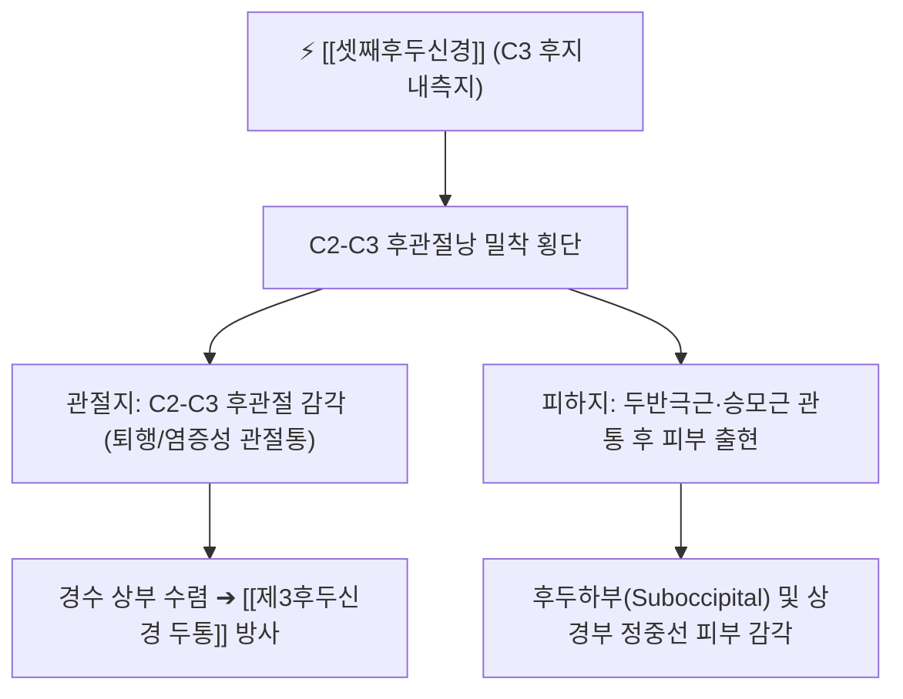

# ⚡ [[셋째후두신경]] (Third Occipital Nerve / 第三後頭神經, C3)

> **핵심 3줄 요약 (Key Summary)**:
> - 🗺️ 신경 기원 & 해부학적 주행: 제3경신경(C3) 후지의 깊은 내측지 기원, C2-C3 경추 후관절(Zygapophysial joint) 외측을 밀접하게 감아돌아 [[두반극근]](Semispinalis capitis) 및 [[승모근]](Trapezius)을 관통하여 후두하부 피하로 주행.
> - 🎯 운동 지배(근육군) & 감각 지배 영역: 순수 감각 신경. C2-C3 후관절낭의 고유 감각 및 후두부 최하부, 후경부 상부 정중선 부근 피부 감각 지배.
> - ⚠️ 호발 포착 부위 & 관련 임상 질환: C2-C3 후관절 외측 관절낭 비후 부위 및 승모근 건막 관통부, [[제3후두신경 두통]](Third Occipital Headache, 편타 손상 후 만성 후두통의 50% 원인).
> - 🔍 주요 이학적 검사 & 신경학적 징후: C2-C3 후관절 관절선 심부 압통, 경추 신전-회전 검사 양성, C3 후지 내측지 진단적 신경차단술 즉각 반응.

---

## 📌 목차
1. [신경 기원 & 해부학적 분지 경로 (Anatomy & Course)](#1-신경-기원--해부학적-분지-경로-anatomy--course)
2. [신경 지배 맵 & 기능 네트워크 (Innervation Map)](#2-신경-지배-맵--기능-네트워크-innervation-map)
3. [호발 포착 부위 & 터널 증후군 병태생리](#3-호발-포착-부위--터널-증후군-병태생리)
4. [손상 레벨별 임상 증상 & 신경학적 결손](#4-손상-레벨별-임상-증상--신경학적-결손)
5. [관련 이학적 검사 & 신경 감별 매트릭스](#5-관련-이학적-검사--신경-감별-매트릭스)
6. [한의 신경 치료 프로토콜 (약침·침도·신경수기)](#6-한의-신경-치료-프로토콜-약침침도신경수기)
7. [💡 사용자 진료실 핵심 필기 & 임상 팁 (원문 보존)](#7--사용자-진료실-핵심-필기--임상-팁-원문-보존)
8. [출처 및 학술 참고 문헌 (References)](#8-출처-및-학술-참고-문헌-references)

---

## 1. 신경 기원 & 해부학적 분지 경로 (Anatomy & Course)

![[대후두신경-두경부해부.png|420]]
> [그림 1] C2 대후두신경 바로 아래에서 C2-C3 후관절을 감아돌며 분지하는 [[셋째후두신경]](TON)의 주행 해부도

* **신경 기원 (Origin & Spinal Segments)**:
  * 제3경신경(C3) 후지(Dorsal ramus)의 내측지(Medial branch)에서 기원합니다.
* **상세 주행 경로 (Detailed Pathway)**:
  1. C2-C3 추간공을 나온 C3 후지의 내측지 본간에서 분지합니다.
  2. **C2-C3 후관절(Facet joint)의 외측 및 후면 관절낭을 밀착하여 감아돌며** 관절지(Articular branch)를 냅니다.
  3. [[두반극근]](Semispinalis capitis) 근복을 관통하여 후상방으로 주행합니다.
  4. [[승모근]](Trapezius) 건막을 뚫고 피하로 나와, C2 대후두신경의 내측에서 후두하부 정중선 피부로 분지합니다.
  5. 상항선 아래에서 대후두신경과 문합하여 후두 신경망을 형성합니다.

---

## 2. 신경 지배 맵 & 기능 네트워크 (Innervation Map)

### 1) 감각 신경 지배 (Sensory Distribution)
* **관절 감각**: C2-C3 척추 후관절(Zygapophysial joint)의 관절낭 통각 및 고유수용성 감각을 독점 지배.
* **피부 감각**: 외후두융기(EOP) 직하방 후두하부 피부, 상경부 목덜미 정중선 피부 감각 지배.

---

## 3. 호발 포착 부위 & 터널 증후군 병태생리

* **C2-C3 후관절낭 외측 협착 터널**:
  * 편타 손상(Whiplash injury)이나 퇴행성 경추증으로 C2-C3 후관절에 골극이 자라거나 관절낭이 비후되면, 관절면에 유착되어 주행하는 신경 줄기가 직접 압박·마찰을 받습니다.
* **두반극근 및 승모근 건막 관통부**:
  * 만성 일자목, 거북목 환자에서 후두하근과 두반극근이 과신장 경축될 때 관통 신경이 교액됩니다.

---

## 4. 손상 레벨별 임상 증상 & 신경학적 결손

| 병변 유형 | 주요 호소 증상 | 임상적 의의 |
| :--- | :--- | :--- |
| **제3후두신경 두통 (TON Headache)** | 후두하부에서 시작하여 정수리 또는 귀 뒤쪽으로 뻗치는 만성 둔통·조이는 통증 | **교통사고 편타 손상 후 만성 두통 환자의 약 50%**에서 단독 원인 |
| **C2-C3 후관절 증후군** | 목을 뒤로 젖히거나 아픈 쪽으로 회전할 때 후경부 극통 유발 | 아침 기상 시 목덜미 강직, 상부 승모근 연관통 |

---

## 5. 관련 이학적 검사 & 신경 감별 매트릭스

* **C2-C3 후관절 관절선 촉진 검사**:
  * 유돌기 하단과 C2 극돌기 사이의 C2-C3 후관절 부위를 깊게 압진할 때 환자가 호소하던 익숙한 후두통이 재현되면 양성.
* **대후두신경통과의 감별**:
  * 대후두신경통은 상항선 부위에서 정수리까지 찌릿한 방전통이 우세하나, 셋째후두신경통은 후두하부 깊은 곳의 묵직한 조임과 C2-C3 관절 가동 제한이 주 증상임.

---

## 6. 한의 신경 치료 프로토콜 (약침·침도·신경수기)

* **C2-C3 후관절 침도 박리술**:
  * C2-C3 후관절 외측 관절낭 부착부에 침도를 수직으로 접근시켜 뼈 표면에 닿은 후, 비후된 관절낭 인대 섬유를 미세 절개하여 신경 압박을 해소합니다.
* **후관절 약침 요법**:
  * C2-C3 후관절선에 신바로 약침 또는 봉약침 0.3cc를 관절낭 주변에 주입하여 무균성 신경염증을 치료합니다.
* **상부 경추 회전-신전 추나요법**:
  * 제한된 C2-C3 분절의 관절 가동성을 회복시키는 부드러운 분절 가동 추나를 적용합니다.

---

## 7. 💡 사용자 진료실 핵심 필기 & 임상 팁 (원문 보존)

* **교통사고 후 목뒤가 계속 뻐근하고 머리가 아픈 환자**:
  * 편타 손상 후 엑스레이에 뼈 이상이 없는데도 수개월간 뒤통수 통증을 호소하는 환자의 절반은 C2-C3 후관절을 감싸는 셋째후두신경의 손상입니다.
  * 천주혈 약간 외하방의 C2-C3 관절선을 엄지로 꾹 눌렀을 때 머리로 방사통이 생기면 이 신경을 타깃으로 침도 및 약침 치료를 시행해야 완치됩니다.

---

## 8. 출처 및 학술 참고 문헌 (References)

* Robinson, D., et al. (2026). "Greater, Lesser, and Third Occipital Nerve Entrapment: Sonographic Anatomy and Imaging." *Seminars in Ultrasound, CT and MRI*, 47(3), 180-192. [PMID: 42276431](https://pubmed.ncbi.nlm.nih.gov/42276431/)
  - [연구 요약]: 제3후두신경의 C2-C3 후관절 외측 해부학적 주행과 고해상도 초음파 영상 진단 랜드마크 체계화.
* Lord, S. M., et al. (1994). "Third occipital nerve headache: a prevalence study." *Journal of Neurology, Neurosurgery, and Psychiatry*, 57(10), 1187-1190. [PMID: 7931379](https://pubmed.ncbi.nlm.nih.gov/7931379/)
  - [연구 요약]: 편타 손상 후 만성 경추성 두통 환자의 56%에서 제3후두신경이 주요 통증 원인임을 이중맹검 진단적 차단술로 증명한 랜드마크 연구.
* Bogduk, N. (1986). "On the concept of third occipital headache." *Journal of Neurology, Neurosurgery, and Psychiatry*, 49(7), 775-780. [PMID: 3018167](https://pubmed.ncbi.nlm.nih.gov/3018167/)
  - [연구 요약]: 제3후두신경의 해부학적 주행, C2-C3 후관절 지배 신경 기전 및 후두통 증후군의 임상 병태생리 정립.
