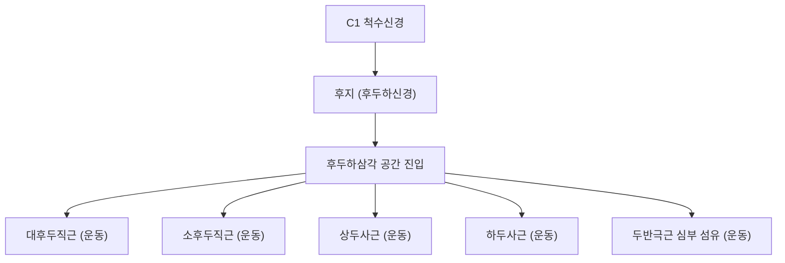

# ⚡ [[C1 척수신경]] (C1 Spinal Nerve)

> **핵심 요약 (Key Summary)**:
> 후두골과 제1경추(환추) 사이의 대후두공 하방 후두하 공간으로 빠져나오는 최상위 척수신경.
> 대부분 후근 감각신경절이 결여되어 순수 운동신경으로 기능하며 후지는 후두하신경이 되어 후두하삼각 근육을 지배하고 전지는 경신경고리 상근을 형성.
> 상부경추 부정렬(C0-C1 아탈구) 및 후두하근 과긴장 시 후두부 긴장, 경추성 두통, 시각 피로를 유발하여 상부경추 추나 및 풍지혈 심자 치료의 핵심 타깃.

---
## 📌 목차
1. [해부학적 기원 및 주행 분지 구조](#1-해부학적-기원-및-주행-분지-구조)
2. [전지(Anterior Ramus)와 경신경고리(Ansa Cervicalis) 연계](#2-전지anterior-ramus와-경신경고리ansa-cervicalis-연계)
3. [후지(Posterior Ramus)와 후두하신경(Suboccipital Nerve)](#3-후지posterior-ramus와-후두하신경suboccipital-nerve)
4. [상부경추 생체역학 및 삼차신경경부복합체(TCC) 연관성](#4-상부경추-생체역학-및-삼차신경경부복합체tcc-연관성)
5. [관련 임상 질환 및 감별 진단](#5-관련-임상-질환-및-감별-진단)
6. [추나요법(C0-C1 후두하 이완술) & 침구·약침 치료 프로토콜](#6-추나요법c0-c1-후두하-이완술--침구약침-치료-프로토콜)
7. [출처 및 학술 참고 문헌 (References)](#7-출처-및-학술-참고-문헌-references)

---
## 1. 해부학적 기원 및 주행 분지 구조

| 해부학적 구분 | 상세 내용 |
| :--- | :--- |
| **척수 기원 레벨** | 경수 제1분절(C1 segment), 후두골과 환추(C1, Atlas) 후궁 사이로 출구 |
| **신경근 특징** | 약 50~80%의 개체에서 후근(Dorsal root) 및 감각신경절이 결여되어 체성 피부 감각 분절(Dermatome)이 없음 |
| **주행 경로** | 추골동맥(Vertebral artery)과 함께 환추의 추골동맥구(Vertebral groove)를 지나며 전지와 후지로 분지 |
| **후지 (Dorsal Ramus)** | [[후두하신경]](Suboccipital nerve)으로 불리며 후두하삼각(Suboccipital triangle) 내부로 진입 |
| **전지 (Ventral Ramus)** | 환추 외측괴 외측으로 돌아내려가 C2 신경 전지와 문합하여 [[경신경총]] 형성 기여 |

---
## 2. 전지(Anterior Ramus)와 경신경고리(Ansa Cervicalis) 연계

* **설하신경(CN XII)과의 주행 공유**:
  * C1 전지의 체성 운동 섬유는 두개저 출구 부근에서 뇌신경 12번인 설하신경 줄기에 합류하여 동행합니다.
* **설골하근 및 턱설골근 지배**:
  * 설하신경을 타고 가다가 분지되어 [[갑상설골근]](Thyrohyoid)과 [[이설골근]](Geniohyoid)을 직접 운동 지배합니다.
* **[[목신경고리]](Ansa Cervicalis) 상근(Superior Root) 형성**:
  * C1 섬유의 일부가 설하신경에서 갈라져 나와 하방으로 주행하는 상근(Radix superior)을 형성하고, C2-C3에서 유래한 하근(Radix inferior)과 결합하여 고리 모양 신경망을 만듭니다.
  * 이를 통해 [[흉골설골근]], [[흉골갑상근]], [[견갑설골근]]을 지배하여 연하 및 발성 시 후두와 설골의 움직임을 조율합니다.

---
## 3. 후지(Posterior Ramus)와 후두하신경(Suboccipital Nerve)

* **후두하삼각의 순수 운동 조율**:
  * 후두하신경은 추골동맥 바로 심층, 하두사근 상연을 지나 후두하삼각 중심부로 분지합니다.
  * [[대후두직근]], [[소후두직근]], [[상두사근]], [[하두사근]] 4대 후두하근을 전담 운동 지배합니다.
* **고유수용감각(Proprioception)의 고밀도 센터**:
  * 후두하근군은 인체에서 근방추(Muscle spindle) 밀도가 가장 높은 부위로, C1 신경은 두경부의 미세 자세 조절, 전정안구반사(VOR) 및 안구 운동과의 협응 피드백을 중추신경계로 전달하는 핵심 고리입니다.

---
## 4. 상부경추 생체역학 및 삼차신경경부복합체(TCC) 연관성

* **C0-C1-C2 복합체의 역학적 스트레스**:
  * 전방두부자세(Turtle neck, FHP) 시 후두골이 신전 변위되면서 후두하 공간이 좁아지고 C1 신경 및 추골동맥이 역학적으로 압박됩니다.
* **삼차신경-경부 복합체 (Trigeminocervical Complex, TCC)**:
  * C1, C2, C3 신경근에서 들어오는 구심성 구심 섬유는 뇌간의 삼차신경 척수로핵(Spinal trigeminal nucleus)의 미측부(Pars caudalis)와 연접합니다.
  * C1-C2 영역의 고유수용성 자극 이상이나 통증 신호는 삼차신경 영역으로 수렴(Convergence)되어 안와 후부, 전두부, 측두부의 연관통을 야기합니다.

---
## 5. 관련 임상 질환 및 감별 진단

1. **경추성 두통 (Cervicogenic Headache)**:
   * 상부 경추의 관절 기능이상이나 C1-C3 신경 분지의 포착에 의해 편측 후두부에서 정수리 및 전두안와부로 투사되는 만성 박동성/압박성 두통.
2. **후두하신경 포착 증후군 (Suboccipital Nerve Entrapment)**:
   * 하두사근이나 두반극근의 단축·경결로 인해 후두하신경이 압박받을 경우, 순수 운동신경임에도 불구하고 근육의 허혈성 경련과 함께 후두부 심부의 둔통 및 묵직한 두중감을 유발.
3. **만성 안정피로 및 전정 어지럼증**:
   * 후두하근 긴장으로 인해 안구 운동 시 두통이 심해지거나 고개 회전 시 미세한 자세 불안정성 유발.

---
## 6. 추나요법(C0-C1 후두하 이완술) & 침구·약침 치료 프로토콜

### 1) 추나요법 (Chuna Manual Therapy)
* **후두하근 이완 기법 (Suboccipital Release)**:
  * 앙와위 환자의 후두골 하연(C0-C1 접합부)에 양손 손가락 패드를 거치하고 머리 무게를 이용해 상방 및 미측으로 부드럽게 지속 견인.
  * 두개천골요법(CST)의 CV4 기법 또는 근에너지기법(MET)을 활용하여 C0-C1 관절 간격 확보 및 C1 신경 감압.
* **상부경추 관절가동술**:
  * 환추(C1) 횡돌기를 접촉하여 회전 및 측굴 제한을 부드럽게 해소하는 저속 관절가동술 적용.

### 2) 침구 및 약침 치료
* **주요 혈위**:
  * 풍지(風池, GB20): 승모근과 흉쇄유돌근 사이, 후두하삼각 외측 함요처.
  * 아문(瘂門, GV15), 천주(BL10): C1 후궁 및 후두하삼각 근접 혈위.
* **약침 프로토콜**:
  * 풍지혈 및 C1 횡돌기 부위에 중성어혈 약침 또는 신바로 약침을 0.3~0.5cc 분주하여 후두하 신경주위 미세염증 완화 및 근막 유착 해소.
  * 안전 주의: 추골동맥 주행 부위이므로 지나친 심자(Deep insertion)를 피하고 해부학적 안전 심도를 엄격히 준수.

---
## 7. 출처 및 학술 참고 문헌 (References)

* Standring S. *Gray's Anatomy: The Anatomical Basis of Clinical Practice*. 42nd ed. Elsevier; 2020.
  * `[연구 요약]` 제1경신경의 발생학적 무신경절 특성과 후두하신경 및 경신경고리 상근으로의 주행 분지 체계.
* Bogduk N. The anatomical basis for cervicogenic headache. *J Manipulative Physiol Ther*. 1992;15(1):67-70.
  * `[연구 요약]` 상부경추 C1-C3 신경근과 삼차신경 척수로핵 간의 신경학적 수렴 메커니즘과 경추성 두통 유발 기전.
* 대한척추신경추나의학회. *척추신경추사의학*. 대한척추신경추나의학회; 2019.
  * `[연구 요약]` C0-C1 및 C1-C2 분절 아탈구에 대한 후두하 이완 추나기법과 상부경추 관절 가동술의 임상 효과.
