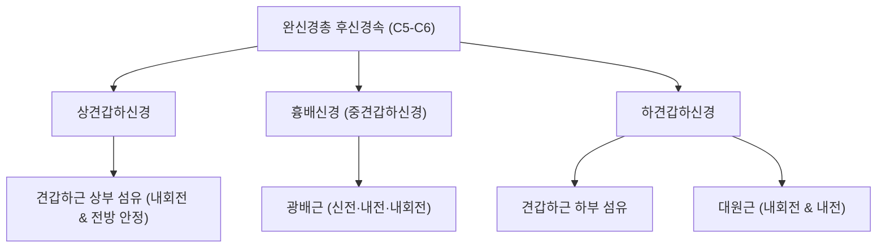

# ⚡ [[견갑하신경]] (Subscapular Nerve)

> **핵심 요약 (Key Summary)**:
> 완신경총 후신경속에서 분지하여 견갑골 전면의 견갑하와로 주행하는 순수 운동신경.
> 상견갑하신경은 견갑하근 상부를 지배하고 하견갑하신경은 견갑하근 하부와 대원근을 운동 지배하여 견관절 내회전 및 동적 전방 안정성 제공.
> 견갑하근 단축 및 오십견 환자에서 기능 저하가 동반되며 견관절 불안정성 개선을 위한 견갑골 가동 추나와 극천·견정혈 침구 치료의 핵심 표적.

---
## 📌 목차
1. [기존 메모 및 해부학 도해](#1-기존-메모-및-해부학-도해)
2. [해부학적 기원 및 분지 구조 (상·하견갑하신경)](#2-해부학적-기원-및-분지-구조-상하견갑하신경)
3. [지배 근육 및 생체역학적 기능](#3-지배-근육-및-생체역학적-기능)
4. [어깨 전방 안정성과 상완골두 중심화(Centration)](#4-어깨-전방-안정성과-상완골두-중심화centration)
5. [관련 임상 질환 및 운동손상 증후군](#5-관련-임상-질환-및-운동손상-증후군)
6. [추나·도수치료(견갑하근 이완술) & 침구·약침 치료 프로토콜](#6-추나도수치료견갑하근-이완술--침구약침-치료-프로토콜)
7. [출처 및 학술 참고 문헌 (References)](#7-출처-및-학술-참고-문헌-references)

---
## 1. 기존 메모 및 해부학 도해

- [[견갑하근]], [[대원근]] 운동 지배 

![[견갑하신경-20240918010133715.png]]
> [견갑하신경의 주행 및 분지 도해]

---
## 2. 해부학적 기원 및 분지 구조 (상·하견갑하신경)

| 신경 분지 | 기원 신경근 | 주행 경로 | 지배 근육 |
| :--- | :--- | :--- | :--- |
| [[상견갑하신경]] | 완신경총 후신경속 (C5, C6) | 후신경속 상부에서 분지하여 즉시 [[견갑하근]] 상부로 진입 | 견갑하근(Subscapularis) 상부 섬유 |
| [[중견갑하신경]] (흉배신경) | 후신경속 (C6, C7, C8) | 견갑골 외측연을 따라 하행하여 액와 후벽 형성 | [[광배근]](Latissimus dorsi) |
| [[하견갑하신경]] | 후신경속 (C5, C6) | 견갑하근 전면을 가로질러 외하방으로 주행 | 견갑하근 하부 섬유 및 [[대원근]](Teres major) |

---
## 3. 지배 근육 및 생체역학적 기능

* **[[견갑하근]] (Subscapularis)**:
  * 회전근개(Rotator cuff) 4총사 중 유일하게 견갑골 전면(견갑하와)에 위치하며 가장 크고 강력한 근육.
  * 상완골두를 관절와(Glenoid fossa) 중심에 단단히 밀착시키는 동적 안정자 역할을 하며, 상완골 내회전(Internal rotation)의 주동근으로 기능합니다.
* **[[대원근]] (Teres major)**:
  * 견갑골 하각 배면에서 기시하여 상완골 소결절능에 정지.
  * 상완골의 내전, 신전, 내회전력을 제공하여 광배근과 강력한 협동근(Synergist)을 형성합니다.

---
## 4. 어깨 전방 안정성과 상완골두 중심화(Centration)

* **상완골두 전방 활구(Anterior Glide) 방지**:
  * 투구 동작이나 수영, 벤치프레스 등 상지 외회전 및 신전 시 상완골두가 전방으로 밀려나는 전방 전위력을 견갑하근이 강력히 저지합니다.
  * 견갑하신경 손상이나 신경근증으로 견갑하근 근력이 약화되면 후방 회전근개와의 짝힘(Force-couple)이 붕괴되어 상완골두가 전방으로 치우치는 전방 충돌 증후군이 호발합니다.

---
## 5. 관련 임상 질환 및 운동손상 증후군

1. **견갑하근 건병증 및 파열 (Lift-off test, Belly-press test 양성)**:
   * 야구 투수, 배구 선수 등에서 어깨의 과도한 외회전 스트레스로 인한 견갑하신경 견인 손상 및 견갑하근 건 파열.
2. **동결견 (유착성 관절낭염, 오십견)**:
   * 견관절 외회전 제한의 주된 원인 구조물로, 견갑하근의 심한 단축과 구축이 관찰되며 이로 인해 관절낭 전면 섬유화 가속.
3. **상완신경총 후신경속 포착 증후군**:
   * 액와 공간의 섬유성 밴드나 견갑하근 비후에 의해 신경이 압박되어 어깨 심부의 방사통 및 내회전 근력 저하 유발.

---
## 6. 추나·도수치료(견갑하근 이완술) & 침구·약침 치료 프로토콜

### 1) 추나 및 연부조직 가동술
* **견갑하근 직접 압박 이완술 (Subscapularis Release)**:
  * 환자 측와위에서 견관절을 약간 굴곡·외전시켜 액와강을 개방.
  * 시술자의 수지를 액와 후벽을 타고 견갑골 전면(견갑하와)으로 밀어 넣어 견갑하근 근복을 접촉한 후, 호흡에 맞춰 부드러운 허혈성 압박 및 수동 외회전 스트레칭 적용.
* **견갑흉곽관절(Scapulothoracic Joint) 가동술**:
  * 흉곽에 유착된 견갑골을 들어올려 견갑하 공간의 활주 운동성 회복.

### 2) 침구 및 약침 치료
* **주요 혈위**:
  * 극천(極泉, HT1): 액와 중앙 동맥 박동처 후하방에서 견갑하근 방향으로 사자.
  * 견정(肩貞, SI9): 액와 후연 상방 1촌, 대원근과 소원근 사이로 하견갑하신경 진입부 근접 혈위.
  * 천종(天宗, SI11), 견우(LI15) 배합.
* **약침 프로토콜**:
  * 견갑하근의 만성 건염 및 유착 부위에 신바로 약침 또는 중성어혈 약침을 0.3~0.5cc 정밀 자침하여 염증 반응 차단 및 관절낭 연축 이완.

---
## 7. 출처 및 학술 참고 문헌 (References)

* Standring S. *Gray's Anatomy: The Anatomical Basis of Clinical Practice*. 42nd ed. Elsevier; 2020.
  * `[연구 요약]` 완신경총 후신경속으로부터의 상·중·하 견갑하신경 분지 해부학 및 견갑하근·대원근 운동 지배 체계.
* Gerber C, Krushell RJ. Isolated rupture of the tendon of the subscapularis muscle: Clinical features in 16 cases. *J Bone Joint Surg Br*. 1991;73(3):389-394.
  * `[연구 요약]` 견갑하근 손상 시의 임상 징후(Lift-off 검사) 및 견갑하신경 신경학적 기능 평가의 중요성.
* 대한척추신경추나의학회. *척추신경추사의학*. 대한척추신경추나의학회; 2019.
  * `[연구 요약]` 견관절 유착성 관절낭염에 대한 액와부 견갑하근 접촉 추나기법 및 견갑흉곽관절 가동술의 유효성.