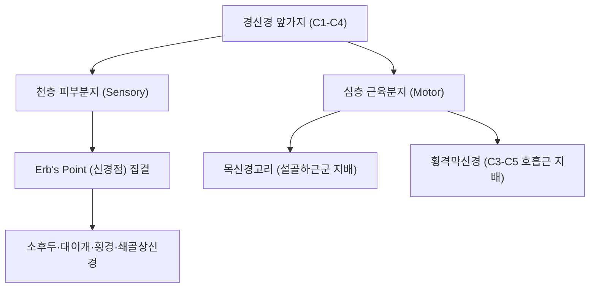

# ⚡ [[경신경 앞가지]] (Anterior Rami of Cervical Nerves)

> **핵심 요약 (Key Summary)**:
> C1부터 C8까지 8쌍의 경추 척수신경에서 분지되어 경부 전외측과 상지로 주행하는 주요 신경근 전지 복합체.
> C1-C4 앞가지는 경신경총을 형성하여 두경부 피부 감각 및 횡격막신경을 구성하고 C5-C8 앞가지는 완신경총을 이루어 상지 운동·감각을 전담 지배.
> 사각근 간극 통과 부위에서 전사각근 및 중사각근 경결 시 흉곽출구증후군과 경추 신경근증을 유발하여 사각근 이완 추나 및 경추 협척혈 침치료의 핵심 타깃.

---
## 📌 목차
1. [해부학적 구성 및 분절별 신경총 분지](#1-해부학적-구성-및-분절별-신경총-분지)
2. [상부 경신경 앞가지 (C1-C4)와 경신경총](#2-상부-경신경-앞가지-c1-c4와-경신경총)
3. [하부 경신경 앞가지 (C5-C8)와 완신경총](#3-하부-경신경-앞가지-c5-c8와-완신경총)
4. [사각근 간극(Interscalene Triangle) 주행 및 생체역학](#4-사각근-간극interscalene-triangle-주행-및-생체역학)
5. [관련 임상 질환 및 신경 압박 증후군](#5-관련-임상-질환-및-신경-압박-증후군)
6. [추나·도수치료(경추 신경가동술) & 침구·약침 프로토콜](#6-추나도수치료경추-신경가동술--침구약침-프로토콜)
7. [출처 및 학술 참고 문헌 (References)](#7-출처-및-학술-참고-문헌-references)

---
## 1. 해부학적 구성 및 분절별 신경총 분지

| 경신경 분절 | 주 형성 구조 | 주요 지배 영역 및 분지 |
| :--- | :--- | :--- |
| **C1 앞가지** | 경신경총 상근, [[목신경고리]] 형성 | [[설하신경]]과 합류, [[갑상설골근]], [[이설골근]] 지배 |
| **C2-C3 앞가지** | 경신경총 천층/심층 지 | 소후두신경, 대이개신경, 횡경신경, 목신경고리 하근 |
| **C3-C5 앞가지** | [[횡격막신경]] (Phrenic nerve) | 횡격막(호흡 운동 및 감각), 심낭, 흉막 |
| **C4 앞가지** | 경신경총 하부 지 | 쇄골상신경(Supraclavicular n.), 완신경총 교통지 |
| **C5-C6 앞가지** | [[완신경총]] 상간(Upper trunk) | 어깨 외전·외회전, 주관절 굴곡, 상완 외측 감각 |
| **C7 앞가지** | [[완신경총]] 중간(Middle trunk) | 주관절 신전, 완관절 굴곡/신전, 수부 중심 감각 |
| **C8 앞가지** | [[완신경총]] 하간(Lower trunk, +T1) | 수지 내재근, 수부 내측 감각, 척골 신경 지배 |

---
## 2. 상부 경신경 앞가지 (C1-C4)와 경신경총

* **흉쇄유돌근 후연 신경점 (Erb's Point)**:
  * C2~C4 앞가지에서 유래한 4대 천층 감각신경(소후두, 대이개, 횡경, 쇄골상신경)이 SCM 후연 중간 1/3 지점에서 표재화됩니다.
  * 두경부 마취, 국소 차단술 및 전경부 긴장성 통증 완화의 중요 랜드마크입니다.
* **횡격막 신경의 발생학적 보존**:
  * "C3, 4, 5 keep the diaphragm alive"라는 해부학 격언처럼, 경추 손상 시 상부 경신경 앞가지의 보존 여부가 자발 호흡 유지의 결정적 요인입니다.

---
## 3. 하부 경신경 앞가지 (C5-C8)와 완신경총

* **신경근(Roots)에서 신경간(Trunks)으로의 전환**:
  * C5와 C6 앞가지가 합쳐져 상신경간(Upper trunk)을 형성합니다.
  * C7 앞가지는 단독으로 중간신경간(Middle trunk)을 이룹니다.
  * C8 앞가지는 T1 앞가지와 합류하여 자신경간(Lower trunk)을 형성합니다.
* **상지 주요 말초신경으로의 분지**:
  * 이들 앞가지들은 쇄골 상하부 공간을 통과하면서 액와신경, 근피신경, 요골신경, 정중신경, 척골신경으로 최종 갈라져 상지 전체의 정밀 운동과 감각을 제어합니다.

---
## 4. 사각근 간극(Interscalene Triangle) 주행 및 생체역학

* **사각근 간극의 경계**:
  * **전방**: [[전사각근]](Scalenus anterior).
  * **후방**: [[중사각근]](Scalenus medius).
  * **하방**: 제1늑골(First rib) 상면.
* **포착 역학**:
  * C5부터 C8 경신경 앞가지와 쇄골하동맥(Subclavian artery)이 이 좁은 삼각 간극을 통과합니다.
  * 거북목, 라운드 숄더, 흉식 호흡 과다 등으로 전사각근과 중사각근이 단축·비후되면 신경근 앞가지들이 직접 압박받거나 견인됩니다.

---
## 5. 관련 임상 질환 및 신경 압박 증후군

1. **흉곽출구 증후군 (Thoracic Outlet Syndrome, TOS)**:
   * 주로 전사각근과 중사각근 사이 사각근 간극에서 C8-T1(또는 C5-C7) 앞가지가 압박되어 상지 저림, 감각 저하, 수부 근력 저하 유발.
   * Adson 검사 및 Wright 검사 양성 반응.
2. **경추 신경근증 (Cervical Radiculopathy)**:
   * 경추간판 탈출증(HIVD)이나 구추관절(Luschka joint) 골극 형성에 의해 추간공 출구에서 앞가지 신경근이 압박되어 상지 방사통 호발.
3. **경추성 횡격막 기능부전 및 천식양 호흡곤란**:
   * C3-C5 경신경 앞가지 자극 시 횡격막 경련성 수축 및 만성 얕은 호흡 유발.

---
## 6. 추나·도수치료(경추 신경가동술) & 침구·약침 프로토콜

### 1) 추나 및 신경가동술 (Neural Mobilization)
* **사각근근막이완술 및 제1늑골 하강 교정**:
  * 환자 두경부를 반대측으로 회전 및 측굴시킨 상태에서 전사각근·중사각근을 부드럽게 신장.
  * 호기 시 제1늑골을 미측으로 가압하여 사각근 간극 공간 확보.
* **완신경총 신경가동술 (Upper Limb Tension Test, ULTT)**:
  * 정중신경, 요골신경, 척골신경 바이어스에 따른 슬라이더(Slider) 및 텐셔너(Tensioner) 가동술을 통해 경신경 앞가지의 추간공 및 사각근 내 활주 운동성 회복.

### 2) 침구 및 약침 치료
* **주요 혈위**:
  * 경추 협척혈(華佗夾脊穴, C3-C7): 경신경 후지와 전지가 갈라져 나오는 추간공 외측 부위의 근막 긴장 완화.
  * 천정(天鼎, LI17), 부돌(扶突, LI18): 흉쇄유돌근 후연 Erb's point 및 사각근 부착부 직상방.
  * 결분(缺盆, ST12): 쇄골상와 사각근 간극 및 완신경총 통과점.
* **약침 프로토콜**:
  * 경추 협척혈 및 사각근 유착부에 신바로 약침, 중성어혈 약침 또는 황련해독탕 약침을 분주(0.2~0.3cc씩)하여 신경근 주위 신경원성 염증과 부종 경감.

---
## 7. 출처 및 학술 참고 문헌 (References)

* Standring S. *Gray's Anatomy: The Anatomical Basis of Clinical Practice*. 42nd ed. Elsevier; 2020.
  * `[연구 요약]` 경신경 앞가지 8쌍의 해부학적 경로, 경신경총 및 완신경총 형성 패턴과 사각근 간극 주행 특성.
* Sanders RJ, Hammond SL, Rao NM. Diagnosis of thoracic outlet syndrome. *J Vasc Surg*. 2007;46(3):601-604.
  * `[연구 요약]` 사각근 간극에서의 경신경 앞가지 포착에 의한 신경인성 흉곽출구증후군의 진단 기준과 임상 검사법.
* 대한침구의학회 교재편찬위원회. *침구의학*. 집문당; 2020.
  * `[연구 요약]` 경추 협척혈 및 전경부 경혈 자침이 경추 척수신경 앞가지 압박 질환에 미치는 신경생리학적 진통 효과.
