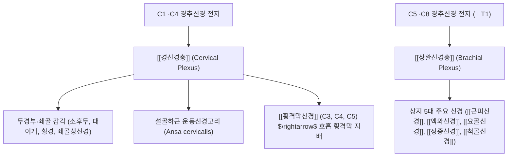

---
aliases:
  - 경추신경
  - 목신경
  - Cervical nerves
  - Cervical spinal nerves
tags:
  - 신경
  - 경추
  - 척수신경
  - 경신경총
  - 상완신경총
  - 신경근병증
---
# ⚡ [[경추신경]] (Cervical Nerves, 목신경 C1~C8)

> **핵심 요약 (Key Summary)**:
> 7개의 경추골 사이 추간공을 통해 분지하는 8쌍의 척수신경으로 전지와 후지로 나뉘어 두경부와 상지 전체를 지배합니다.
> 전지는 경신경총(C1~C4)과 상완신경총(C5~T1)을 형성하고 후지는 후두부 감각과 척추주위 심부근 및 후관절을 지배합니다.
> 경추 디스크(추간판 탈출증) 및 후관절 비후로 인한 경추 신경근병증의 핵심 구조물이며 스펄링 검사와 경추 견인 추나의 표적입니다.

---

## 📌 목차
1. [해부학적 개요 & 주행 경로 (Anatomy)](#1-해부학적-개요--주행-경로-anatomy)
2. [전지(Ventral Rami)의 신경총 형성 네트워크](#2-전diventral-rami의-신경총-형성-네트워크)
3. [후지(Dorsal Rami)의 분포 및 후관절 지배](#3-후지dorsal-rami의-분포-및-후관절-지배)
4. [분절별 근육분절(Myotome) & 피부분절(Dermatome)](#4-분절별-근육분절myotome--피부분절dermatome)
5. [경추 신경근병증 병태생리 및 이학적 검사](#5-경추-신경근병증-병태생리-및-이학적-검사)
6. [한의학적 치료 프로토콜 (추나·약침·침도)](#6-한의학적-치료-프로토콜-추나약침침도)
7. [출처 및 학술 참고 문헌 (References)](#7-출처-및-학술-참고-문헌-references)

---

## 1. 해부학적 개요 & 주행 경로 (Anatomy)

* **8쌍의 경추신경(C1~C8)과 7개의 경추골(C1~C7) 관계**:
  * C1 신경: 후두골(C0)과 제1경추(C1, 환추) 사이에서 분지.
  * C2~C7 신경: **해당 번호 경추골의 "위쪽" 추간공**을 통해 주행 (예: C5 신경은 C4-C5 추간공으로 나옴).
  * C8 신경: 제7경추(C7)와 제1흉추(T1) 사이 추간공으로 분지.
* **전근(Ventral root)과 후근(Dorsal root)의 합류**:
  * 척수에서 나온 전근(운동신경)과 후근(후근신경절 DRG, 감각신경)이 추간공 내에서 합쳐져 짧은 척수신경 본간(Spinal nerve trunk)을 이룬 뒤, 즉시 **전지(Ventral ramus)**와 **후지(Dorsal ramus)**로 양분.

---

## 2. 전지(Ventral Rami)의 신경총 형성 네트워크

---

## 3. 후지(Dorsal Rami)의 분포 및 후관절 지배

* **상부 후지 (C1~C3)**:
  * **C1 후지**: [[후두하신경]](순수 운동신경) $\rightarrow$ 4개 [[후두하근]] 지배.
  * **C2 후지**: 내측지가 [[대후두신경]]이 되어 후두부~정수리 두피 감각 담당.
  * **C3 후지**: 내측지가 [[셋째후두신경]](TON)이 되어 C2-C3 후관절 및 후두하부 감각 지배.
* **중·하부 후지 (C4~C8)**:
  * **내측지(Medial branch)**: 경추 후관절(Facet joint)과 심부 기립근([[다열근]], [[회선근]], 경반극근) 지배 $\rightarrow$ 경추 관절증 만성 목 통증의 주요 병소.
  * **외측지(Lateral branch)C1~C2** | 경부 굴곡/회전 | 두정부, 후두부 | - |
| **C3** | 경부 측굴 | 목 외측, 하악각 하방 | - |
| **C4C5C6C7C8** | 손가락 굴곡 ([[심지굴근]]), 파악력 | 전완 내측, 약지 및 소지(4-5지) | - |

---

## 5. 경추 신경근병증 병태생리 및 이학적 검사

* **발생 원인**:
  * 연성 디스크(Soft disc): 경추 추간판 탈출증(HIVD)으로 인한 신경근 압박 및 염증.
  * 경성 디스크(Hard disc): 구추관절(Luschka joint) 또는 후관절 골극(Osteophyte) 형성에 의한 추간공 협착.
* **핵심 이학적 검사**:
  * **스펄링 검사 (Spurling's test)**: 경추를 신전하고 이환측으로 회전·측굴시킨 후 축성 압박 $\rightarrow$ 상지로 방사통 재현 시 양성.
  * **어깨 외전 완화 징후 (Bakody's sign)**: 환자가 아픈 팔을 머리 위로 올렸을 때 신경근 장력이 완화되어 방사통 감소.
  * **경추 견인 검사 (Cervical distraction test)**: 의사가 머리를 위로 가볍게 견인할 때 통증 감소.

---

## 6. 한의학적 치료 프로토콜 (추나·약침·침도)

* **추나요법 (Chuna)**:
  * **경추 감압 견인 추나**: 추간공의 높이를 물리적으로 넓혀 신경근의 기계적 압박 해소.
  * **후관절 가동화 및 교정 추나**: 회전 및 측굴 변위를 바로잡아 신경 출구 공간 확보.
* **약침 및 신경주위 침도 시술**:
  * **협척혈(夾脊穴) 신경근 약침**: 이환 분절 C4~C7 추간공 외측 1.5~2cm 협척혈에 [[신바로약침]] 또는 [[황련해독탕]] 약침 0.5~1.0ml를 주입하여 신경근 부종 및 염증성 사이토카인([[TNF-α]], [[IL-6]]) 분비 차단.
  * **원위부 신경 포착 박리**: 사각근간 간격, 소흉근 하부 등 다발성 압박(Double crush) 부위 병행 이완.

---

## 7. 출처 및 학술 참고 문헌 (References)
* Standring S. *Gray's Anatomy: The Anatomical Basis of Clinical Practice*. 42nd ed. Elsevier, 2020: 745-752.
  * `[연구 요약]`: 경추신경 C1~C8의 전·후지 분지 양상, 신경총 형성 및 분절성 신경 지배 총괄 해부학.
* Radhakrishnan K, et al. Epidemiology of cervical radiculopathy. A population-based study from Rochester, Minnesota, 1976 through 1990. *Brain*. 1994;117(2):325-335.
  * `[연구 요약]`: 경추 신경근병증의 역학 분석(C7 및 C6 신경근 호발 빈도 및 임상 예후 규명).
