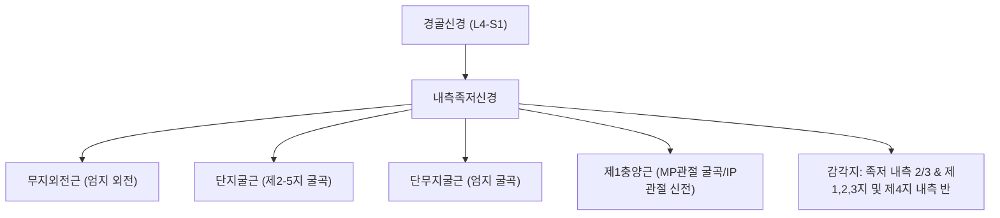

# ⚡ [[내측족저신경]] (Medial Plantar Nerve)

> **핵심 요약 (Key Summary)**:
> 경골신경이 내과 후하방 족근관을 통과한 후 갈라지는 최대 말초 종말지로 상지의 정중신경에 상응하는 신경.
> 무지외전근, 단지굴근, 단무지굴근 및 제1충양근을 운동 지배하고 족저부 내측 2/3와 내측 세 발가락 반의 감각을 담당.
> 무지외전근 심부 통과부에서 포착 시 조깅선수 발(Jogger's foot) 및 내측 족저 통증을 유발하여 족근관 감압 추나와 연곡혈 약침의 핵심 표적.

---
## 📌 목차
1. [해부학적 기원 및 주행 경로](#1-해부학적-기원-및-주행-경로)
2. [운동 및 감각 신경 지배 영역](#2-운동-및-감각-신경-지배-영역)
3. [상동 기관(정중신경) 대비 및 생체역학적 의의](#3-상동-기관정중신경-대비-및-생체역학적-의의)
4. [신경 포착 병태생리: 조깅선수 발 & 족근관 증후군](#4-신경-포착-병태생리-조깅선수-발--족근관-증후군)
5. [초음파 해부학(Sonoanatomy) 및 중재 시술 랜드마크](#5-초음파-해부학sonoanatomy-및-중재-시술-랜드마크)
6. [추나·도수치료(족부 관절 가동술) & 침구·약침 프로토콜](#6-추나도수치료족부-관절-가동술--침구약침-프로토콜)
7. [출처 및 학술 참고 문헌 (References)](#7-출처-및-학술-참고-문헌-references)

---
## 1. 해부학적 기원 및 주행 경로

| 항목 | 상세 내용 |
| :--- | :--- |
| **신경근 기원** | [[경골신경]](Tibial nerve, L4-S1 신경근 유래) |
| **분기점** | 족근관(Tarsal tunnel) 내부 또는 굴근지대(Flexor retinaculum) 원위부 |
| **주행 경로** | [[무지외전근]](Abductor hallucis) 심층 건궁 하부를 지나 주상골 결절 하방을 경유하여 족저 중심부로 전진 |
| **동행 혈관** | 내측족저동맥(Medial plantar artery) |
| **말초 분지** | 고유족저지신경(Proper plantar digital nerves)으로 갈라져 발가락 끝으로 주행 |

---
## 2. 운동 및 감각 신경 지배 영역

* **운동 지배 근육군 (Motor Innervation)**:
  * [[무지외전근]]: 내측 종아치 지지 및 엄지발가락 외전.
  * 단지굴근(Flexor digitorum brevis): 외인성 굴근 보조 및 발바닥 중간 아치 유지.
  * **단무지굴근(Flexor hallucis brevis)**: 추진기(Push-off) 엄지발가락 지지.
  * **제1충양근(First lumbrical)**: 보행 시 발가락의 정밀한 위치 조정.
* **피부 감각 영역 (Cutaneous Sensation)**:
  * 족저부 내측 절반 이상과 모지구, 제1·2·3발가락 바닥면 전체 및 제4발가락 내측 절반의 족저면 감각을 담당합니다.

---
## 3. 상동 기관(정중신경) 대비 및 생체역학적 의의

* **상지의 정중신경(Median Nerve)과의 상동성**:
  * 해부발생학적으로 수부의 정중신경과 족부의 내측족저신경은 동일한 신경 축에서 분화되었습니다.
  * 정중신경이 수장부 외측 3.5개 손가락과 모지구근(Thenar)을 지배하듯, 내측족저신경은 족저부 내측 3.5개 발가락과 모지구 내재근을 전담합니다.
* **내측 종아치(Medial Longitudinal Arch) 동적 유지**:
  * 보행 주기 중 디딤기(Stance phase)와 말기 추진기(Push-off)에 내측족저신경이 지배하는 내재근들이 강하게 수축하여 족궁이 무너지지 않도록 윈드라스 메커니즘(Windlass mechanism)을 완성합니다.

---
## 4. 신경 포착 병태생리: 조깅선수 발 & 족근관 증후군

* **조깅선수 발 (Jogger's Foot / Medial Plantar Neuropathy)**:
  * 장거리 육상선수, 축구선수, 과도한 평발 보행자에서 무지외전근의 섬유성 가장자리나 주상골 결절 부근에서 내측족저신경이 마찰·압박되는 질환.
  * 발바닥 내측 아치와 엄지발가락 바닥의 작열통(Burning pain), 저림 및 보행 말기 찌릿한 통증 호소.
* **족근관 증후군 (Tarsal Tunnel Syndrome)**:
  * 내과 후하방 굴근지대 내부에서 경골신경 본간 또는 내측족저신경 분지부가 건초염, 결절종, 정맥류 등에 의해 압박받는 증후군.
* **족저근막염과의 감별 포인트**:
  * **족저근막염**: 종골 결절 내측 돌기의 아침 첫 발 기상통, 신경학적 결손 없음.
  * **내측족저신경병증**: 주상골 하방 압통, 무지외전근 수축 시 통증 재현, 내측 발가락 바닥 감각 둔화 또는 이상감각 동반.

---
## 5. 초음파 해부학(Sonoanatomy) 및 중재 시술 랜드마크

* **초음파 단축 스캔 (Short-Axis View)**:
  * 종골과 주상골 사이 족저 내측면에 탐촉자를 대면, 표재성의 두터운 무지외전근 근복 아래로 내측족저동맥과 함께 주행하는 벌집 모양(Fascicular)의 고-저에코 내측족저신경 단면 관찰.
* **초음파 유도하 수압박리술 및 약침 시술**:
  * 무지외전근과 장지굴근건 사이의 신경혈관 다발막 주변으로 In-plane 접근.
  * 신경 주위 유착을 박리하고 미세 혈류를 개선하기 위해 중성어혈 약침 또는 황련해독탕 약침을 0.3~0.5cc 정밀 투여.

---
## 6. 추나·도수치료(족부 관절 가동술) & 침구·약침 프로토콜

### 1) 추나 및 근막이완술
* **무지외전근 허혈성 압압 및 스트레칭**:
  * 종골 내측에서 주상골 결절을 지나 제1중족골 기저부로 이어지는 무지외전근 근복을 엄지손가락으로 접촉하여 횡방향 연부조직 이완술(STR) 적용.
* **주상골 및 거골하관절 가동술**:
  * 과회내(Over-pronation)된 거골하관절을 외반 교정하고 하강된 주상골을 배측으로 거상 가동하여 신경의 주행 터널 내 압력 완화.

### 2) 침구 치료
* **주요 혈위**:
  * 연곡(然谷, KI2): 주상골 조면 하방 함요처로 내측족저신경이 무지외전근 심부를 관통하는 직상방 핵심 혈위.
  * 태계(太谿, KI3), 조해(照海, KI6): 족근관 상하부 신경 포착 해소.
  * 공손(公孫, SP4): 제1중족골 기저부 전하방 함요처, 족저 내측 신경 주행로 정밀 자침.
* **전침 요법**:
  * 태계-연곡 또는 연곡-공손 간 2~4Hz 저주파 전침을 15분간 적용하여 신경성 부종 경감 및 내재근 연축 완화.

---
## 7. 출처 및 학술 참고 문헌 (References)

* Standring S. *Gray's Anatomy: The Anatomical Basis of Clinical Practice*. 42nd ed. Elsevier; 2020.
  * `[연구 요약]` 내측족저신경의 분기 해부학, 무지외전근 건궁 하부 통과 양상 및 수부 정중신경과의 비교 분석.
* Schon LC. Nerve entrapment, neuropathy, and nerve dysfunction in athletes. *Orthop Clin North Am*. 1994;25(1):47-59.
  * `[연구 요약]` 육상 운동선수에서 발생하는 내측족저신경 포착(조깅선수 발)의 병태역학, 진단 및 비수술적 보존 치료법.
* 대한침구의학회 교재편찬위원회. *침구의학*. 집문당; 2020.
  * `[연구 요약]` 연곡(KI2) 및 족소음신기 경혈의 족저부 신경병증, 족하통 치료 기전과 침구 임상 응용.
