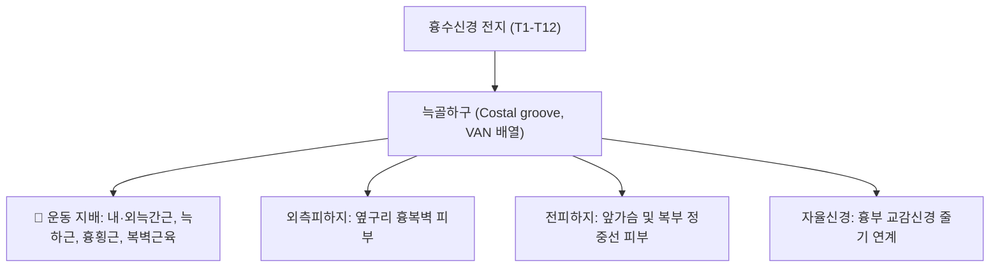

# ⚡ [[늑간신경총]] (Intercostal Nerves / 肋間神經叢, T1-T11 & T12)

> **핵심 3줄 요약 (Key Summary)**:
> - 🗺️ 신경 기원 & 해부학적 주행: 흉수신경(T1-T11) 전지 및 제12흉신경 전지(늑하신경 T12) 기원, 늑골하구(Costal groove)의 **VAN 구조(정맥-동맥-신경)** 맨 아래를 타고 늑간강을 따라 전방으로 주행.
> - 🎯 운동 지배(근육군) & 감각 지배 영역: 내·외늑간근, 늑하근, 흉횡근 운동 지배(호흡 운동), 흉벽 및 복벽 피부의 분절형 띠 모양 감각 지배.
> - ⚠️ 호발 포착 부위 & 관련 임상 질환: 늑골하구 및 복직근 관통부, [[늑간신경통]](기침·심호흡 시 악화되는 늑골 통증), [[대상포진]](피부분절 수포 및 신경통), 전복피신경 포착 증후군([[ACNES]]).
> - 🔍 주요 이학적 검사 & 신경학적 징후: 셰펠만 검사(Schepelmann's sign, 측굴 시 오목면 늑간신경통 악화), 늑간극 압진 시 방사통.

---

## 📌 목차
1. [신경 기원 & 해부학적 분지 경로 (Anatomy & Course)](#1-신경-기원--해부학적-분지-경로-anatomy--course)
2. [신경 지배 맵 & 기능 네트워크 (Innervation Map)](#2-신경-지배-맵--기능-네트워크-innervation-map)
3. [호발 포착 부위 & 터널 증후군 병태생리](#3-호발-포착-부위--터널-증후군-병태생리)
4. [손상 레벨별 임상 증상 & 신경학적 결손](#4-손상-레벨별-임상-증상--신경학적-결손)
5. [관련 이학적 검사 & 신경 감별 매트릭스](#5-관련-이학적-검사--신경-감별-매트릭스)
6. [한의 신경 치료 프로토콜 (약침·침도·신경수기)](#6-한의-신경-치료-프로토콜-약침침도신경수기)
7. [💡 사용자 진료실 핵심 필기 & 임상 팁 (원문 보존)](#7--사용자-진료실-핵심-필기--임상-팁-원문-보존)
8. [출처 및 학술 참고 문헌 (References)](#8-출처-및-학술-참고-문헌-references)

---

## 1. 신경 기원 & 해부학적 분지 경로 (Anatomy & Course)

![[셰펠만검사_1단계_체간좌측굴_오목면늑간통_실사.png|420]]
> [그림 1] 늑간신경의 주행로를 따라 흉벽 측굴 시 늑간 신경통을 평가하는 셰펠만 검사 모식도

* **신경 기원 (Origin & Spinal Segments)**:
  * 제1~11 흉수신경(T1-T11)의 전지인 **늑간신경(Intercostal nerves)**과 제12 흉신경 전지인 **늑하신경(Subcostal nerve, T12)**으로 구성됩니다.
* **상세 주행 경로 (VAN 원칙)**:
  1. 추간공을 나온 흉신경 전지는 교감신경절과 백색·회색교통지로 연결됩니다.
  2. 늑골각(Angle of rib) 부근에서 늑골 하연의 **늑골하구(Costal groove)** 내부로 들어갑니다.
  3. 위에서부터 **정맥(Vein) - 동맥(Artery) - 신경(Nerve)**의 순서(VAN)로 배열되어, 신경이 가장 아래쪽에 노출됩니다.
  4. 내늑간근(Internal intercostal)과 최내늑간근(Innermost intercostal) 사이의 신경혈관 평면을 따라 전방으로 주행합니다.
  5. 액와중간선에서 **외측피하지(Lateral cutaneous branch)**를 내고, 흉골/복직근 부근에서 **전피하지(Anterior cutaneous branch)**로 종말합니다.

---

## 2. 신경 지배 맵 & 기능 네트워크 (Innervation Map)

![[흉곽확장검사_1단계_제4늑간_줄자거치_실사.png|420]]
> [그림 2] 흉곽의 확장과 늑간근 수축을 담당하는 늑간신경망 평가 도해

---

## 3. 호발 포착 부위 & 터널 증후군 병태생리

* **늑골하구 하연 노출부**: 늑골 하연을 따라 주행하므로 늑골 골절, 타박상, 흉추 후만 변형 시 늑골 사이가 좁아지며 신경이 쉽게 압박됩니다.
* **복직근초 관통 부위**: T7-T12 전피하지가 복직근을 직각으로 관통하는 터널([[ACNES]]).

---

## 4. 손상 레벨별 임상 증상 & 신경학적 결손

* 갈비뼈를 따라 띠 모양으로 찌르고 결리는 발작성 신경통, 숨을 깊이 들이마시거나 기침할 때 악화.
* [[대상포진]](Herpes Zoster) 바이러스가 후근신경절에서 재활성화될 때 특정 늑간 분절을 따라 극심한 통증과 수포 형성.

---

## 5. 관련 이학적 검사 & 신경 감별 매트릭스

* **셰펠만 검사 (Schepelmann's Sign)**:
  * 환자가 상체를 아픈 쪽으로 기울일 때(오목면) 통증이 심해지면 **[[늑간신경통]]**, 반대쪽으로 기울여 아픈 쪽이 늘어날 때(볼록면) 아프면 **늑막염 또는 늑간근 좌상**.

---

## 6. 한의 신경 치료 프로토콜 (약침·침도·신경수기)

* **늑간 신경 연피평자 침법 (기흉 절대 예방)**:
  * 늑골 상면을 타고 15도 이하로 눕혀 연피평자(沿皮平刺)하여 늑간근 유착을 풀고 흉막 천자를 원천 방지합니다.
* **협척혈(Hua Tuo Jia Ji) 약침 치료**:
  * 해당 분절 흉추 극돌기 외방 0.5촌 협척혈에 신바로 약침 0.5cc를 주입합니다.

---

## 7. 💡 사용자 진료실 핵심 필기 & 임상 팁 (원문 보존)

* **늑골 하연 직하방 자침 절대 금기 (기흉 예방 원칙)**:
  * 늑간신경은 늑골 아래 홈(VAN)에 숨어 있으므로, 늑골 바로 밑을 깊게 찌르면 늑간동맥 출혈이나 기흉(Pneumothorax)이 발생합니다.
  * 침 치료 시에는 반드시 아래쪽 늑골의 **'상연(윗모서리)'에 침을 대고 뼈를 가이드 삼아 눕혀서 자침**해야 100% 안전합니다.

---

## 8. 출처 및 학술 참고 문헌 (References)

* Mo, J., et al. (2026). "Clinical predictors of pain 24 Months after intraoperative intercostal nerve Cryoanalgesia for anatomical lung resection." *Surgical Oncology*, 54, 102045. [PMID: 42546533](https://pubmed.ncbi.nlm.nih.gov/42546533/)
  - [연구 요약]: 개흉술 후 늑간신경 냉동감압술의 장기적 신경통 제어 성적과 흉벽 신경 손상 예측 인자 분석.
* Alshami, A. M., et al. (2026). "Path of Least Resistance: Multilevel Epidural Spread Following Large Volume Intertransverse Process Injection." *Journal of Cardiothoracic and Vascular Anesthesia*, 40(10), 2890-2898. [PMID: 41876319](https://pubmed.ncbi.nlm.nih.gov/41876319/)
  - [연구 요약]: 흉추 횡돌기간 및 늑간 공간에서의 신경 차단 확산 경로 해부학적 규명.
* Otero, P. E., et al. (2026). "Ultrasound-guided thoracic erector spinae plane injections." *Veterinary Anaesthesia and Analgesia*, 53(5), 410-418. [PMID: 42759185](https://pubmed.ncbi.nlm.nih.gov/42759185/)
  - [연구 요약]: 척추기립근면 차단술(ESP) 시 약액이 늑간신경으로 유입되는 해부학적 전달 메커니즘 검증.
