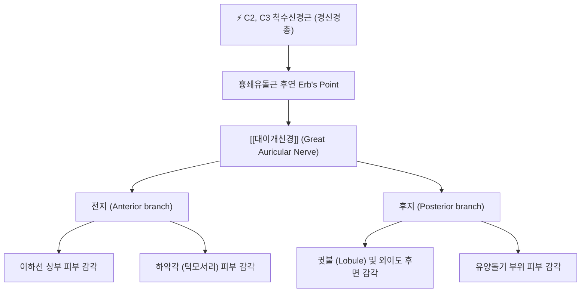

---
aliases:
  - Great auricular nerve
  - 대이개신경
tags:
  - 신경
  - 경신경총
  - 이개
  - 턱관절
  - 해부학
---

# ⚡ [[대이개신경]] (Great Auricular Nerve / 大耳介神經, C2~C3)

> **핵심 3줄 요약 (Key Summary)**:
> - 🗺️ 신경 기원 & 해부학적 주행: C2~C3 척수신경 전지(경신경총)에서 기원하여, [[흉쇄유돌근]] 후연 중점(Erb's point)에서 출현한 뒤 흉쇄유돌근 외측 표면을 비스듬히 상방으로 가로질러 귓바퀴와 이하선 방향으로 주행.
> - 🎯 운동 지배(근육군) & 감각 지배 영역: 순수 감각 신경으로 귓바퀴(이개) 하부, 귓불, 외이도 후면, 이하선 부위 및 하악각(턱모서리) 주위 피부 감각 관할.
> - ⚠️ 호발 포착 부위 & 관련 임상 질환: 흉쇄유돌근 과긴장에 의한 Erb's point 포착, 안면거상술·경부 림프절 수술 합병증, 대이개신경통, 귓불 주변 감각 둔마.
> - 🔍 주요 이학적 검사 & 신경학적 징후: 흉쇄유돌근 중간 부위 틴넬 징후(Tinel's sign), 귓불 및 하악각 부위의 감각 저하 또는 이질통.

---

## 📌 목차
1. [신경 기원 & 해부학적 분지 경로 (Anatomy & Course)](#1-신경-기원--해부학적-분지-경로-anatomy--course)
2. [신경 지배 맵 & 기능 네트워크 (Innervation Map)](#2-신경-지배-맵--기능-네트워크-innervation-map)
3. [호발 포착 부위 & 터널 증후군 병태생리](#3-호발-포착-부위--터널-증후군-병태생리)
4. [손상 레벨별 임상 증상 & 신경학적 결손](#4-손상-레벨별-임상-증상--신경학적-결손)
5. [관련 이학적 검사 & 신경 감별 매트릭스](#5-관련-이학적-검사--신경-감별-매트릭스)
6. [한의 신경 치료 프로토콜 (약침·침도·신경수기)](#6-한의-신경-치료-프로토콜-약침침도신경수기)
7. [💡 사용자 진료실 핵심 필기 & 임상 팁 (원문 보존)](#7--사용자-진료실-핵심-필기--임상-팁-원문-보존)
8. [출처 및 학술 참고 문헌 (References)](#8-출처-및-학술-참고-문헌-references)

---

## 1. 신경 기원 & 해부학적 분지 경로 (Anatomy & Course)

![[7. 얼굴신경-20240915222603541.png|400]]
> [그림 1] 경부 및 측두부 신경 주행과 [[대이개신경]]의 흉쇄유돌근 표면 통과 경로

![[경추 추나-20240920061855744.png|400]]
> [그림 2] 상부 경추 및 [[흉쇄유돌근]]의 해부학적 구조와 경신경총 피하지각신경의 출구

* **신경 기원 (Origin)**:
  * 제2 및 제3 경신경(C2, C3) 척수신경 전지(Anterior rami)의 복합 기원입니다.
  * 경신경총(Cervical plexus)의 표재 피하지각신경 가지 중 **가장 굵은 구경(Largest ascending branch)**을 가집니다.
* **경부 주행 경로 (Cervical Course)**:
  * [[흉쇄유돌근]](Sternocleidomastoid, SCM)의 후연 중앙부(Erb's point)에서 천경막을 뚫고 표층으로 나옵니다.
  * 출현 후 흉쇄유돌근의 외측 표면을 타고 상외측에서 상내측으로 비스듬히 수직 상방으로 주행합니다.
  * 이때 **외경정맥(External jugular vein)의 바로 뒤쪽(후방 약 1cm)**에서 나란히 주행하는 중요한 해부학적 랜드마크를 형성합니다.
* **종말 분지 (Terminal Branches)**:
  * 이하선(Parotid gland) 하극 근처에서 전지와 후지로 나뉩니다:
    1. **전지 (Anterior branch)**: 얼굴 앞쪽으로 주행하여 이하선 표면 피부 및 하악각(턱모서리) 부위 피부로 분지.
    2. **후지 (Posterior branch)**: 귓바퀴 뒤쪽으로 주행하여 귓불(Lobule), 유양돌기 표면 및 귓바퀴 내면 피부로 분포.

---

## 2. 신경 지배 맵 & 기능 네트워크 (Innervation Map)

### 1) 감각 신경 지배 영역 (Sensory Distribution)
* **이개 및 귓불**: 귓바퀴 하부 양면, 귓불(Lobule), 외이도 입구 하후방 피부.
* **이하선 및 안면 하부**: 이하선(귀밑샘) 표면 피부, 볼 뒤쪽 피부.
* **하악각**: 아래턱 모서리(Angle of mandible) 주위 피부 감각.

---

## 3. 호발 포착 부위 & 터널 증후군 병태생리

* **제1 포착 터널: 흉쇄유돌근 후연 Erb's Point 근막 출구부**:
  * 턱을 괴거나 한쪽으로 목을 기울이는 자세 습관으로 흉쇄유돌근이 단축되면, 신경이 근막을 뚫고 나오는 구멍에서 신경이 팽팽하게 당겨지며 허혈성 압박이 유발됩니다.
* **제2 손상 요인: 수술적 의인성 손상 (Iatrogenic Injury)**:
  * 안면거상술(Rhytidectomy / Face-lift), 경부 림프절 곽청술, 이하선 절제술 시 흉쇄유돌근 표면을 지나는 대이개신경 줄기가 절단되거나 견인되어 수술 후 귀 주변의 영구적 무감각이나 통증성 신경종이 호발합니다.

---

## 4. 손상 레벨별 임상 증상 & 신경학적 결손

| 질환 / 장애 유형 | 주요 임상 증상 | 신경학적 소견 | 호발 원인 |
| :--- | :--- | :--- | :--- |
| **대이개신경통 (Neuralgia)** | 귓불, 귀 뒤쪽, 턱모서리가 화끈거리고 찌릿하며 칼로 에는 듯한 통증, 귀를 만질 때 쓰라림 | 흉쇄유돌근 중간 틴넬 징후 양성, 귓불 피부 이질통 | 흉쇄유돌근 긴장, 바이러스성 신경염 |
| **수술 후 이개 감각 소실** | 귓불에 감각이 전혀 없어 귀걸이를 낄 때 아프지 않음, 면도할 때 턱모서리 감각 없음 | 귓불 및 하악각 촉각/통각 결손 | 성형 수술, 이하선 수술 후 손상 |
| **외경정맥 울혈 동반 신경 자극** | 고개를 돌릴 때 귀 주변이 묵직하고 쿵쾅거리는 박동성 불쾌감 | 외경정맥 팽대와 동반된 대이개신경 압박 | 흉곽출구 증후군, 혈관 울혈 |

---

## 5. 관련 이학적 검사 & 신경 감별 매트릭스

| 이학적 검사명 | 검사 방법 및 유발 기전 | 양성 반응 | 관련 감별 질환 |
| :--- | :--- | :--- | :--- |
| **흉쇄유돌근 중간 틴넬 징후** | 흉쇄유돌근 후연 중간 지점을 손가락 끝으로 가볍게 타진 | 귓불과 하악각으로 전기가 찌릿하게 전달됨 | [[대이개신경]] 포착증 |
| **Erb's Point 압박 검사** | SCM 후연을 5초간 압박 | 귓바퀴 하부의 통증 재현 | 경신경총 피하지각신경 병변 |
| **이비인후과 귀 내시경 검사** | 고막 및 외이도 내부 관찰 | 외이도염이나 중이염 소견 정상 | 이비인후과 질환과 감별 |

---

## 6. 한의 신경 치료 프로토콜 (약침·침도·신경수기)

### 6.1 Erb's Point 및 예풍혈 약침술 (Hydrodissection)
* **자침 타겟 및 랜드마크**:
  * 1차 포인트: 흉쇄유돌근 후연 중점(천정혈 인근).
  * 2차 포인트: 귓불 뒤쪽 유양돌기 함요처인 **예풍(TE17)** 및 하관(ST7).
* **약침 제제 및 주입 기법**:
  * 중성어혈약침 또는 신바로약침 0.5~1.0cc 사용.
  * 흉쇄유돌근 표면의 외경정맥 주행을 눈으로 확인하고 혈관을 피해 피하층에 얕게 평자 주입하여 신경 주위 근막을 이완.

### 6.2 흉쇄유돌근 이완 추나 요법
* 흉쇄유돌근의 긴장도를 낮추기 위해 환자의 경추를 환측으로 약간 측굴하고 반대측으로 회전시킨 상태에서, 시술자가 흉쇄유돌근을 엄지와 검지로 가볍게 쥐어 롤링 마사지 이완을 시행합니다.

---

## 7. 💡 사용자 진료실 핵심 필기 & 임상 팁 (원문 보존)

### 7.1 진료실 3대 핵심 문진 및 감별 포인트
1. **귀 질환으로 오인되는 신경통**:
   * 환자가 "귀 밑과 귓불이 쑤시고 아파서 이비인후과에 갔는데 귀 안에는 아무 이상이 없다고 한다"고 호소하면 100% 대이개신경 포착을 의심.
2. **턱관절 장애(TMJ)와의 감별**:
   * 턱을 벌릴 때 하악각 주변이 아프다고 호소하지만 턱관절 자체의 관절잡음(Clicking)이나 개구 제한이 없다면 턱관절증이 아닌 대이개신경 전지 포착증입니다.
3. **자침 시 외경정맥 주의**:
   * 흉쇄유돌근 중간 부위는 외경정맥이 대이개신경 바로 앞을 교차하므로, 멍이나 혈종(Hematoma)이 생기지 않도록 혈관을 손가락으로 누르고 피해 자침할 것.

---

## 8. 출처 및 학술 참고 문헌 (References)

* Sonographic anatomy and imaging of the great auricular nerve. *Surg Radiol Anat*. 2025 Nov 13;47(1):e03765. [PMID: 41233613](https://pubmed.ncbi.nlm.nih.gov/41233613/) | [DOI: 10.1007/s00276-025-03765-y](https://doi.org/10.1007/s00276-025-03765-y)
  * `[연구 요약]` 고해상도 초음파를 통해 흉쇄유돌근 표면을 주행하는 대이개신경의 직경, 깊이 및 분지 양상을 맵핑하여 외과적 손상 예방과 표적 신경 차단술의 정밀도를 확립한 2025년 최신 연구.

* Anatomy, Head and Neck, Great Auricular Nerve. *StatPearls*. 2026 Jan. [NCBI Bookshelf](https://www.ncbi.nlm.nih.gov/books/NBK539828/)
  * `[연구 요약]` 대이개신경의 척수 분절 기원(C2-C3), 피하 감각 분포, 흉쇄유돌근 Erb's point 출현 랜드마크 및 임상 질환을 총망라한 미국 국립보건원 표준 의학 종설.
