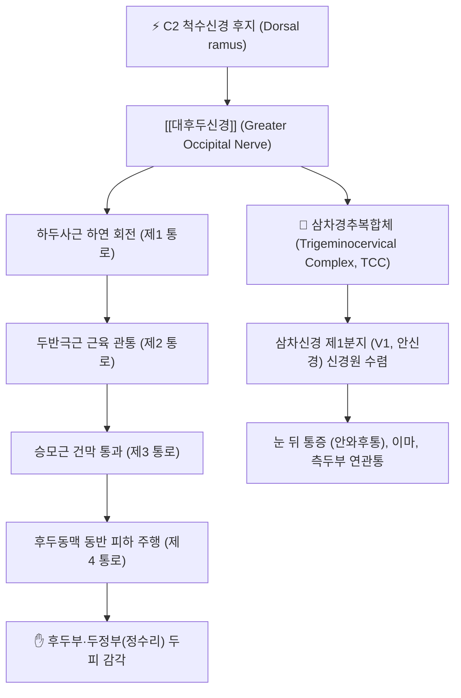
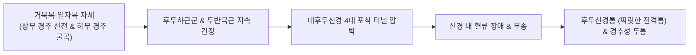

---
aliases:
  - GON
  - Greater occipital nerve
  - 대후두신경
tags:
  - 신경
  - 경추
  - 후두부
  - 경추성두통
  - 후두신경통
  - 해부학
---

# ⚡ [[대후두신경]] (Greater Occipital Nerve / 大後頭神經, C2 후지)

> **핵심 3줄 요약 (Key Summary)**:
> - 🗺️ 신경 기원 & 해부학적 주행: 제2 경신경(C2) 후지(Dorsal ramus)의 굵은 내측가지(Medial branch)에서 기원하여, [[하두사근]] 하연을 감아 돌고 [[두반극근]]과 [[승모근]] 건막을 차례로 관통하여 후두동맥과 함께 상항선 피하로 상행.
> - 🎯 운동 지배(근육군) & 감각 지배 영역: 순수 감각 신경으로 후두부 전체 두피에서 두정부(정수리, Vertex)까지 감각을 관할하며, 삼차경추복합체(TCC) 수렴을 통해 전두부 및 안와 후방(눈 뒤 통증)으로 연관통 방사.
> - ⚠️ 호발 포착 부위 & 관련 임상 질환: 두반극근 관통부 및 승모근 상항선 부착 건막의 포착으로 인한 [[후두신경통]], 일자목·거북목 자세에 따른 [[경추성 두통]], [[근막통증증후군]].
> - 🔍 주요 이학적 검사 & 신경학적 징후: 상항선 외측 2cm 대후두신경 출구부 틴넬 징후(Tinel's sign), 경추 굴곡-회전 검사(Flexion-Rotation Test), 후두부 감각과민 및 이질통(Allodynia).

---

## 📌 목차
1. [신경 기원 & 해부학적 분지 경로 (Anatomy & Course)](#1-신경-기원--해부학적-분지-경로-anatomy--course)
2. [신경 지배 맵 & 기능 네트워크 (Innervation Map)](#2-신경-지배-맵--기능-네트워크-innervation-map)
3. [호발 포착 부위 & 터널 증후군 병태생리](#3-호발-포착-부위--터널-증후군-병태생리)
4. [손상 레벨별 임상 증상 & 신경학적 결손](#4-손상-레벨별-임상-증상--신경학적-결손)
5. [관련 이학적 검사 & 신경 감별 매트릭스](#5-관련-이학적-검사--신경-감별-매트릭스)
6. [한의 신경 치료 프로토콜 (약침·침도·신경수기)](#6-한의-신경-치료-프로토콜-약침침도신경수기)
7. [💡 사용자 진료실 핵심 필기 & 임상 팁 (원문 보존)](#7--사용자-진료실-핵심-필기--임상-팁-원문-보존)
8. [출처 및 학술 참고 문헌 (References)](#8-출처-및-학술-참고-문헌-references)

---

## 1. 신경 기원 & 해부학적 분지 경로 (Anatomy & Course)

![[후두하근-1753860579504.png|400]]
> [그림 1] 후두하 삼각(Suboccipital Triangle) 및 [[대후두신경]]의 심부 주행과 [[두반극근]] 관통 경로

![[Suboccipital_TriggerPoints.jpg|400]]
> [그림 2] 후두하근군 발통점과 [[대후두신경]] 주행 경로를 따라 정수리와 안와로 방사되는 두통 패턴

![[청강의감26_06_두통_편두통_두풍_미릉골통.jpg|400]]
> [그림 3] 청강의감 임상 필기 도해: 후두부 두풍(頭風), 편두통, 미릉골통(눈썹 주위 통증)과 대후두신경 연관 병태

* **신경 기원 (Spinal Origin)**:
  * 제2 경신경(C2) 척수 신경근의 후지(Dorsal ramus)에서 갈라져 나오는 가장 굵은 내측가지(Medial branch)입니다.
  * 대부분의 말초신경이 척수신경의 전지(Ventral ramus)에서 기원하는 것과 달리, 대후두신경은 **척수신경 후지(Dorsal ramus)에서 기원**하는 독특한 해부학적 특징을 갖습니다.
* **심부 주행 경로 (Deep Suboccipital Course)**:
  * C1(환추)과 C2(축추) 척추궁 사이에서 나와 외측으로 주행하여, [[하두사근]](Inferior oblique capitis)의 하연을 감아 돌며 상내측으로 방향을 바꿉니다.
  * 이때 후두하 신경총(Suboccipital plexus)과 교통하며 C1 및 C3 신경 가지와 미세 신경망을 형성합니다.
* **근육 및 건막 관통 경로 (Intermediate & Superficial Course)**:
  * 경추 심부 근육인 [[두반극근]](Semispinalis capitis)의 건성 섬유를 깊은 곳에서 얕은 곳으로 비스듬히 관통합니다.
  * 이후 [[승모근]](Trapezius)의 건막(Aponeurosis) 및 상항선(Superior nuchal line) 골막 부착부를 뚫고 피하층으로 진입합니다.
* **천층 주행 및 동맥 동반 (Superficial Course)**:
  * 외후두융기(Inion) 외측 약 2.0~2.5cm 지점(천주혈~풍지혈 라인)에서 피하로 노출되어, 후두동맥(Occipital artery)의 내측을 따라 나란히 박동성으로 주행하면서 후두부 두피 전체로 방사상 분지합니다.

---

## 2. 신경 지배 맵 & 기능 네트워크 (Innervation Map)

### 1) 감각 신경 지배 영역 (Sensory Innervation)
* **후두부 및 두정부(정수리)**: 외후두융기 상부에서부터 정수리(Vertex)의 관상봉합(Coronal suture) 직전까지의 두피 전반.
* **이개 후부 및 유양돌기 후방**: [[소후두신경]](Lesser occipital nerve) 지배 영역과 일부 중첩되는 후두외측 두피.
* **경추 후관절낭(Facet Joint)**: C1-C2(외측 환축관절), C2-C3 후관절낭의 고유수용성 감각 신경 분지 공급.

### 2) 삼차경추복합체(TCC) 연관통 메커니즘 (Trigeminocervical Convergence)
* 대후두신경(C2)의 유해 감각 구심성 신경섬유는 상부 경수(C1~C3) 후각에 위치한 **삼차경추핵(Trigeminocervical Complex, TCC)**으로 들어갑니다.
* 이곳에서 뇌신경인 삼차신경 제1분지(V1, 안신경)에서 들어오는 감각 신경세포와 동일한 2차 신경원에 시냅스를 형성(수렴)합니다.
* 뇌는 후두부 대후두신경의 포착·염증 신호를 안구 및 전두부의 신호로 착각하여, **"목 뒤가 뻐근하면서 눈알이 빠질 듯이 아프고 이마가 지끈거리는 통증(Cervicogenic Ocular Pain)"**을 유발합니다.

---

## 3. 호발 포착 부위 & 터널 증후군 병태생리

* **제1 포착 터널: [[하두사근]] 하연과 C2 척추궁 사이**:
  * 턱을 앞으로 빼는 거북목(Forward Head Posture) 자세에서는 후두골이 신전되고 C1-C2 분절이 과도하게 압박되어, 하두사근이 단축되면서 신경을 직접 짓누릅니다.
* **제2 포착 터널: [[두반극근]](Semispinalis capitis) 관통부 (가장 호발)**:
  * 대후두신경은 두반극근의 두꺼운 근육 덩어리를 직각에 가깝게 관통하여 나옵니다.
  * 만성 스트레스, 목의 과도한 긴장, 교통사고 편타 손상(Whiplash)으로 두반극근이 경련·섬유화되면 근육 수축 시마다 신경이 가위처럼 죄여집니다.
* **제3 포착 터널: [[승모근]] 건막 및 상항선 골막 부착부**:
  * 상항선 뼈에 승모근이 붙는 단단한 섬유성 건막 밴드가 대후두신경을 누릅니다. 고개를 숙이고 스마트폰을 장시간 볼 때 건막이 팽팽해지면서 신경을 압박합니다.
* **제4 포착 터널: 후두동맥(Occipital Artery)과의 혈관 교차부**:
  * 상항선을 넘어설 때 후두동맥이 대후두신경을 감싸며 주행하므로, 동맥의 박동이 만성 염증으로 과민해진 신경을 지속적으로 자극하여 '쿵쾅거리는 박동성 후두통'을 유발합니다.

---

## 4. 손상 레벨별 임상 증상 & 신경학적 결손

| 질환 / 손상 레벨 | 주요 임상 증상 | 신경학적 소견 | 호발 원인 |
| :--- | :--- | :--- | :--- |
| **[[후두신경통]] (Occipital Neuralgia)** | 후두부에서 정수리로 전기가 튀는 듯한 찌릿한 발작성 방사통, 칼로 찌르는 듯한 날카로운 통증 | 대후두신경 출구부 틴넬 징후 양성, 두피 스치기만 해도 아픈 이질통(Allodynia) | 두반극근 급성 연축, 외상성 신경 손상, 국소 신경염 |
| **[[경추성 두통]] (Cervicogenic Headache)** | 목 뒤에서 시작하여 관자놀이, 눈 뒤로 번지는 조이는 듯한 둔통, 한쪽으로 치우친 두통, 어지럼증 동반 | C1-C2 굴곡-회전 제한(FRT 양성), 후두하근 압통, 경추 관절 가동성 감소 | 일자목, 상부교차증후군, C1-C2 후관절 기능부전 |
| **후두부 신경 포착성 무감각** | 뒤통수 두피의 감각 저하, 남의 살 같은 둔마감, 멍한 느낌 | 두피 촉각 및 통각 감소, 저림(Numbness) | 만성 섬유화 건막에 의한 신경 허혈성 압박 |

---

## 5. 관련 이학적 검사 & 신경 감별 매트릭스

| 이학적 검사명 | 검사 방법 및 유발 기전 | 양성 반응 | 관련 감별 질환 |
| :--- | :--- | :--- | :--- |
| **상항선 신경 출구부 압통 및 틴넬 징후** | 외후두융기 외측 2cm 지점을 손가락이나 타진기로 압박 또는 가볍게 두드림 | 정수리나 눈 뒤쪽으로 찌릿한 방사통 재현 | [[대후두신경]] 포착, [[후두신경통]] |
| **경추 굴곡-회전 검사 (FRT)** | 경추를 최대로 수동 굴곡시킨 상태에서 좌우 회전 각도 측정 (정상 40~44°) | 환측 회전 각도가 30° 이하로 제한되고 후두통 유발 | C1-C2 기능 장애 및 [[경추성 두통]] |
| **후두하근 신장 검사** | 환자 바로 누운 상태에서 턱을 당기고 후두부를 견인 굴곡 | 후두하 심부의 묵직한 통증 및 안와 방사통 유발 | 후두하근 단축 및 대후두신경 근위부 압박 |
| **[[스펄링 검사]] (Spurling's test)** | 경추 신전, 환측 측굴, 축성 압박 가함 | 상지(팔, 손)로 뻗치는 방사통 발생 여부 | 경추 디스크(신경근증)와 감별 (음성이면 대후두신경 병변) |

---

## 6. 한의 신경 치료 프로토콜 (약침·침도·신경수기)

### 6.1 대후두신경 약침 수압박리술 (Hydrodissection)
* **자침 타겟 및 랜드마크**:
  * 외후두융기(Inion)와 유양돌기(Mastoid process)를 잇는 상항선 상에서, 외후두융기 외측 약 2.0~2.5cm 지점(천주혈과 풍지혈 중간 부위).
* **약침 제제 및 주입 기법**:
  * 신경 염증 및 유착 해소에 탁월한 중성어혈약침, 황련해독탕 약침 또는 저농도 봉약침 1.0~2.0cc 사용.
  * 30G 13mm 주사기를 상항선 골막 방향으로 45~60도 각도로 진입하여 피하 및 두반극근 근막층에 도달한 후, 저항이 소실되는 공간에 약침액을 부드럽게 주입하여 **신경과 주위 건막 사이를 수압으로 박리(Hydrodissection)**합니다.

### 6.2 침도 치료 (Acupotomy)를 통한 건막 터널 유리술
* **적응증**: 만성 난치성 후두신경통 및 두껍게 섬유화된 상항선 건막 결절.
* **시술 방법**:
  * 소침도(0.5 x 40mm)를 신경 주행 방향과 평행(종축)하게 진입시켜 승모근 건막 및 두반극근 표층의 비후된 섬유대를 절개 박리(대후두신경 횡단 절단 절대 금지, 반드시 종방향 절개).

### 6.3 후두하근 이완 수기 추나 (Suboccipital Release)
* 환자를 앙와위로 눕히고 시술자의 양손 손가락 3, 4지를 환자의 상항선 하방 후두하근군에 접촉한 후, 머리의 무게를 이용하여 부드럽게 상방 견인 및 5~10분간 지속 압박하여 C0-C1-C2 분절의 관절 간격을 넓히고 신경 포착을 해제합니다.

---

## 7. 💡 사용자 진료실 핵심 필기 & 임상 팁 (원문 보존)

### 7.1 진료실 3대 핵심 문진 및 감별 포인트
1. **편두통 vs 경추성 두통 감별**:
   * "머리가 아플 때 메스껍거나 빛·소리가 괴롭습니까, 아니면 목을 돌리거나 숙일 때 두통이 심해집니까?" (전자=편두통, 후자=대후두신경 매개 경추성 두통).
2. **안와 후방 통증(눈 뒤 통증) 문진**:
   * 환자가 "눈알이 빠질 것처럼 아프다"며 안과를 전전한 경우, 반드시 뒷목의 천주혈(대후두신경 출구)을 강하게 압박해 볼 것. 압박 시 눈 뒤 통증이 즉각 재현되면 100% 대후두신경 연관통.
3. **베개 높이 및 수면 자세 점검**:
   * 높은 베개 사용 시 밤새 C1-C2가 과굴곡/신전되어 두반극근이 신경을 밤새 압박하므로, 낮은 경추 베개로의 교체가 필수적입니다.

### 7.2 안전 자침 가이드라인
* 상항선 하방 자침 시 두개강 내로 침이 진입하지 않도록 절대 상방으로 깊숙이 자침하지 않으며, **약간 하방이나 골막을 향해 얕게 평자(10~15mm)**하여 추골동맥 손상 및 뇌간 침습을 완벽히 방지합니다.

---

## 8. 출처 및 학술 참고 문헌 (References)

* Saglam L, Coskun O, Gunver MG, Ertas M. An anatomical analysis of the occipital nerve complex: an essential tool for the application of occipital nerve blocks. *BMC Neurol*. 2024 Aug 31;24(1):310. [PMID: 39217283](https://pubmed.ncbi.nlm.nih.gov/39217283/) | [DOI: 10.1186/s12883-024-03814-w](https://doi.org/10.1186/s12883-024-03814-w)
  * `[연구 요약]` 후두신경 복합체(대후두신경, 소후두신경, 제3후두신경)의 사체 해부학적 미세 구조와 외후두융기 기준 출구 랜드마크를 정밀 계측하여 신경 차단술 및 약침 수압박리술의 임상적 안전 기준을 확립.

* Blake P, Burstein R. Emerging evidence of occipital nerve compression in unremitting head and neck pain. *J Headache Pain*. 2019 Jul 2;20(1):76. [PMID: 31266456](https://pubmed.ncbi.nlm.nih.gov/31266456/) | [DOI: 10.1186/s10194-019-1023-y](https://doi.org/10.1186/s10194-019-1023-y)
  * `[연구 요약]` 난치성 만성 두경부 통증 환자에서 승모근 건막 및 두반극근에 의한 대후두신경의 기계적 압박이 삼차경추복합체(TCC) 감작을 일으켜 만성 두통을 유지시키는 병태생리적 메커니즘을 규명.

* Cesmebasi A, Muhleman MA, Hulsberg P, Gielecki J, Matusz P, Tubbs RS, Loukas M. Occipital neuralgia: anatomic considerations. *Clin Anat*. 2015 Jan;28(1):101-8. [PMID: 25244129](https://pubmed.ncbi.nlm.nih.gov/25244129/) | [DOI: 10.1002/ca.22468](https://doi.org/10.1002/ca.22468)
  * `[연구 요약]` 후두신경통을 유발하는 해부학적 6대 포착 포인트(C2 척추궁간극, 하두사근, 두반극근 관통부, 승모근 건막, 상항선 골막, 후두동맥 교차부)를 체계적으로 정리한 임상 해부학 종설.

* Tuina Combined with Acupuncture and Other Therapies for Treating Cervicogenic Headache: A Network Meta-Analysis Based on Randomized Controlled Trials. *J Pain Res*. 2026;19:e582414. [PMID: 42183040](https://pubmed.ncbi.nlm.nih.gov/42183040/) | [DOI: 10.2147/JPR.S582414](https://doi.org/10.2147/JPR.S582414)
  * `[연구 요약]` 경추성 두통 환자를 대상으로 추나 요법과 침 치료를 병용한 복합 한의 치료가 양방 진통소염제나 단독 치료 대비 두통 빈도, VAS 통증 강도 및 경추 관절 가동역 개선에서 가장 우수한 치료적 순위를 나타냄을 검증한 2026년 최신 네트워크 메타분석.

* Meta-Analysis of Acupuncture Treatment for Cervicogenic Headache. *World Neurosurg*. 2024 Sep;189:e450-e461. [PMID: 38768751](https://pubmed.ncbi.nlm.nih.gov/38768751/) | [DOI: 10.1016/j.wneu.2024.05.084](https://doi.org/10.1016/j.wneu.2024.05.084)
  * `[연구 요약]` 경추성 두통 환자 대상 침 치료 RCT 메타분석으로 후두하근군 및 대후두신경 출구부(풍지, 천주) 자침이 진통제 복용량을 60% 이상 감소시키고 삶의 질을 유의하게 개선함을 통계적으로 입증.
