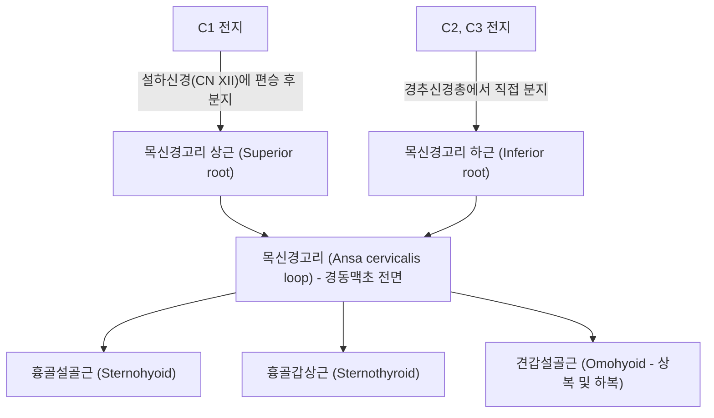

---
aliases:
  - Ansa cervicalis
  - 목신경고리
  - 경신경계
  - 경신경고리
tags:
  - 신경
  - 경추신경총
  - 설골하근
  - 연하장애
  - 경부해부학
---

# 목신경고리 (Ansa Cervicalis / 경신경계)

> 핵심 요약 (Key Summary):
> 경추신경총(C1~C3 전지)에서 기원하여 경동맥초(Carotid sheath) 표면에서 U자형 루프(Loop)를 형성하는 순수 운동신경 고리.
> 상근(Superior root, C1)과 하근(Inferior root, C2~C3)이 결합하여 형성되며, 설골하근군([[흉골설골근]], [[흉골갑상근]], [[견갑설골근]])을 운동 지배.
> 연하(음식물 삼킴) 및 발성 시 후두와 설골을 아래로 끌어내리는 생체역학적 핵심 구조물이며, 갑상선 절제술 및 경추 전방 수술 시 손상 위험 신경.

---

## 1. 해부학적 기원 및 주행 (Anatomy & Course)

목신경고리는 두 개의 뿌리(Root)가 목의 전외측에서 만나 고리 모양을 이룹니다:

1. **상근 (Superior root / 이전 명칭: Radix descendens hypoglossi)**:
   * C1 척수신경 전지에서 나와 뇌신경인 [[설하신경]](Hypoglossal nerve, CN XII)에 일시적으로 합류(편승)합니다.
   * 경동맥 삼각(Carotid triangle) 부위에서 설하신경을 빠져나와 총경동맥(Common carotid artery)과 내경정맥(Internal jugular vein)을 싸고 있는 경동맥초(Carotid sheath)의 전면을 따라 수직 하행합니다.
2. **하근 (Inferior root / 이전 명칭: Radix descendens cervicalis)**:
   * C2 및 C3 척수신경 전지에서 기원합니다.
   * 내경정맥의 외측을 나선형으로 감아 돌며 하행하여 경동맥초 전면으로 진입합니다.
3. **루프 형성 (Ansa loop)**:
   * 대략 견갑설골근 중간건(Intermediate tendon) 높이, 윤상연골(Cricoid cartilage) 높이 부근에서 상근과 하근이 문합하여 U자형 고리를 완성합니다.

---

## 2. 신경 지배 근육 및 기능 (Innervation & Function)

* **지배 근육 (설골하근군, Infrahyoid muscles)**:
  * [[흉골설골근]](Sternohyoid): 설골을 하강.
  * [[흉골갑상근]](Sternothyroid): 갑상연골과 후두를 하강.
  * [[견갑설골근]](Omohyoid, 상복 및 하복): 설골을 하후방으로 당겨 경부 근막 긴장 유지.
* **예외적 근육 (주의)**:
  * 설골하근 중 [[갑상설골근]](Thyrohyoid)은 목신경고리 루프의 지배를 받지 않고, C1 신경섬유가 설하신경을 타고 직접 주행하여 분지합니다.
* **생체역학적 기능**:
  * **연하 작용 (Swallowing)**: 연하 초기 설골상근에 의해 위로 들려 올려진 후두와 설골을 연하 후기 본래 위치로 신속히 끌어내려 기도를 재개방합니다.
  * **발성 조절 (Phonation)**: 고음에서 저음으로 전환 시 후두를 하강시켜 성대의 장력과 공명강을 조절합니다.

---

## 3. 임상 병리 및 외과적 의의 (Clinical Significance)

* **갑상선 및 경부 외과 수술 시 손상**:
  * 갑상선 절제술, 경동맥 내막절제술(CEA), 전방 경추 유합술(ACDF) 시 경동맥초 전면을 박리하는 과정에서 견인되거나 손상될 수 있습니다.
  * 손상 시 연하 곤란(Dysphagia), 특히 굵은 알약이나 고형식을 삼킬 때 목의 묵직한 불편감 및 고음 발성 피로를 호소합니다.
* **되돌이후두신경(RLN) 재건술의 신경 이식 공여부**:
  * 갑상선암 등으로 후두신경이 절단되었을 때, 목신경고리는 기능적 손실이 적고 직경이 적합하여 성대 운동 회복을 위한 1차적 신경 문합(Nerve transfer) 공여 신경으로 널리 활용됩니다.
* **경부 근막통 증후군 (Myofascial Pain)**:
  * [[견갑설골근]] 및 [[흉골설골근]]의 만성 연축은 인후부 이물감(매핵기, Globus hystericus) 및 연하 시 전경부 찌르는 통증을 유발합니다.

---

## 4. 한의 임상 치료 접근

* **침구 및 경혈 치료**:
  * 인영(ST9): 총경동맥 박동 부위 외측으로 경동맥초 주변 목신경고리 및 미주신경 자극.
  * 수돌(ST10), 기사(ST11): 흉쇄유돌근 전연 설골하근군 자침.
  * 천돌(CV22): 흉골설골근 및 흉골갑상근 부착부 근건 이완.
* **매핵기(梅核氣) 및 연하 장애 추나**:
  * 설골(Hyoid bone) 가동화 기법 및 전경부 심부 근막 이완(Myofascial release)을 통해 목신경고리의 포착을 해소.

---

## 5. 📚 출처 및 학술 연구 요약 (References)

1. Standring, S. (2020). *Gray's Anatomy: The Anatomical Basis of Clinical Practice*. 42nd ed. Elsevier.
   - [연구 요약] 목신경고리의 해부학적 기원, C1-C3 변이 양상 및 설골하근 지배 신경 경로의 표준 기술.
2. Loukas, M., et al. (2007). "Ansa cervicalis: a review of its anatomy, terminology, and clinical significance." *Clinical Anatomy*, 20(8), 883-890.
   - [연구 요약] 목신경고리의 주행 변이와 후두 재신경지배(Laryngeal reinnervation) 수술 시 공여 신경으로서의 임상적 가치를 체계적으로 분석.
