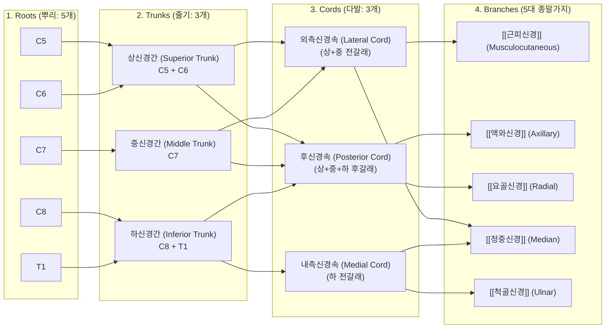
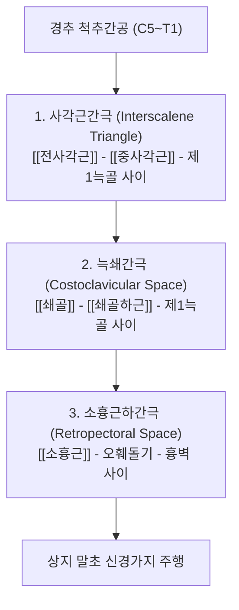

---
aliases:
  - 완신경총
  - Brachial plexus
tags:
  - 신경
  - 상지대
  - 흉곽출구증후군
  - 해부학
---

# ⚡ [[상완신경총]] (Brachial Plexus / 腕神經叢, C5~T1)

> **핵심 3줄 요약 (Key Summary)**:
> - 🗺️ 신경 기원 & 해부학적 주행: C5~T1 척수신경 전지(Anterior rami)에서 기원하여, 뿌리(Roots) $\rightarrow$ 줄기(Trunks) $\rightarrow$ 갈래(Divisions) $\rightarrow$ 다발(Cords) $\rightarrow$ 종말가지(Branches)로 이어지는 상지 최대의 신경 네트워크.
> - 🎯 운동 지배(근육군) & 감각 지배 영역: 견갑대 및 상지 전체 근육군([[견갑하근]], [[극상근]], [[삼각근]], [[상완이두근]], [[상완삼두근]], 손목·손가락 굴근/신근군 등)의 운동 지배 및 상지 전체 피부 감각 관할.
> - ⚠️ 호발 포착 부위 & 관련 임상 질환: 3대 포착 터널([[사각근간극]], [[늑쇄간극]], [[소흉근하간극]])에서의 압박에 의한 [[흉곽출구 증후군]], 분만 손상(Erb 마비, Klumpke 마비), 번너/스팅어(Burner/Stinger) 증후군.
> - 🔍 주요 이학적 검사 & 신경학적 징후: [[애드슨 검사]], [[라이트 검사]], [[루스 검사]], 상지 신경긴장 검사(ULTT), 쇄골 상와 틴넬 징후(Tinel's sign).

---

## 📌 목차
1. [신경 기원 & 해부학적 분지 경로 (Anatomy & Course)](#1-신경-기원--해부학적-분지-경로-anatomy--course)
2. [신경 지배 맵 & 기능 네트워크 (Innervation Map)](#2-신경-지배-맵--기능-네트워크-innervation-map)
3. [호발 포착 부위 & 터널 증후군 병태생리](#3-호발-포착-부위--터널-증후군-병태생리)
4. [손상 레벨별 임상 증상 & 신경학적 결손](#4-손상-레벨별-임상-증상--신경학적-결손)
5. [관련 이학적 검사 & 신경 감별 매트릭스](#5-관련-이학적-검사--신경-감별-매트릭스)
6. [한의 신경 치료 프로토콜 (약침·침도·신경수기)](#6-한의-신경-치료-프로토콜-약침침도신경수기)
7. [💡 사용자 진료실 핵심 필기 & 임상 팁 (원문 보존)](#7--사용자-진료실-핵심-필기--임상-팁-원문-보존)
8. [출처 및 학술 참고 문헌 (References)](#8-출처-및-학술-참고-문헌-references)

---

## 1. 신경 기원 & 해부학적 분지 경로 (Anatomy & Course)

* **5대 단계 구성 (Roots $\rightarrow$ Trunks $\rightarrow$ Divisions $\rightarrow$ Cords $\rightarrow$ Branches)**:
  1. **뿌리 (Roots)**: 경추 C5, C6, C7, C8 및 흉추 T1 척수신경 전지(Anterior rami).
  2. **줄기 (Trunks)**: 사각근간 삼각에서 형성.
     * **상신경간 (Superior Trunk)**: C5 + C6
     * **중신경간 (Middle Trunk)**: C7
     * **하신경간 (Inferior Trunk)**: C8 + T1 (제1늑골 위에 위치)
  3. **갈래 (Divisions)**: 쇄골 후방에서 각각 전갈래(Anterior, 굴근 지배)와 후갈래(Posterior, 신근 지배)로 분지.
  4. **다발 (Cords)**: 액와동맥(Axillary artery)을 기준으로 위치 명명.
     * **외측신경속 (Lateral cord)**: 상·중신경간의 전갈래 결합
     * **내측신경속 (Medial cord)**: 하신경간의 전갈래 단독 지속
     * **후신경속 (Posterior cord)**: 상·중·하신경간의 3개 후갈래 모두 결합
  5. **5대 주 종말가지 (Terminal Branches)**:
     * [[근피신경]] (C5~C7)
     * [[액와신경]] (C5~C6)
     * [[요골신경]] (C5~T1)
     * [[정중신경]] (C5~T1, 외측속 + 내측속 결합)
     * [[척골신경]] (C8~T1)

---

## 2. 신경 지배 맵 & 기능 네트워크 (Innervation Map)

### 1) 주요 근육별 운동 지배 (Motor Innervation)
* **어깨 및 견갑대**:
  * [[견갑배신경]] (C5) $\rightarrow$ [[견갑거근]], [[대능형근]], [[소능형근]]
  * [[장흉신경]] (C5~C7) $\rightarrow$ [[전거근]] (손상 시 익상견갑 발생)
  * [[견갑상신경]] (C5~C6) $\rightarrow$ [[극상근]], [[극하근]]
  * [[쇄골하신경]] (C5~C6) $\rightarrow$ [[쇄골하근]]
  * [[상견갑하신경]] / [[하견갑하신경]] (C5~C6) $\rightarrow$ [[견갑하근]], [[대원근]]
  * [[흉배신경]] (C6~C8) $\rightarrow$ [[광배근]]
  * [[외측흉근신경]] / [[내측흉근신경]] $\rightarrow$ [[대흉근]], [[소흉근]]
* **상완 및 주관절**:
  * [[근피신경]] $\rightarrow$ [[오훼완근]], [[상완이두근]], [[상완근]] (팔꿈치 굴곡)
  * [[액와신경]] $\rightarrow$ [[삼각근]], [[소원근]] (어깨 외전)
  * [[요골신경]] $\rightarrow$ [[상완삼두근]], [[주근]], [[완요골근]] (팔꿈치 신전)
* **전완 및 수부 (손가락)**:
  * [[정중신경]] $\rightarrow$ 전완 굴근군([[원회내근]], [[요측수근굴근]]), 무지구근(Thenar), 1~2지 충양근
  * [[척골신경]] $\rightarrow$ [[척측수근굴근]], 심지굴근 척측부, 소지구근, 모든 골간근, 3~4지 충양근
  * [[요골신경]](후골간신경) $\rightarrow$ 모든 손목 및 손가락 신근군

### 2) 감각 지배 영역 (Sensory Innervation)
* [[액와신경]] $\rightarrow$ 어깨 외측(삼각근 부위, 군장 패치 영역)
* [[근피신경]](외측전완피신경) $\rightarrow$ 전완 외측 피부
* [[내측상완피신경]] & [[내측전완피신경]] $\rightarrow$ 상완 내측 및 전완 내측 피부
* [[요골신경]] $\rightarrow$ 상완 후면, 전완 후면, 손등 요측(1~3.5지 배면)
* [[정중신경]] $\rightarrow$ 손바닥 요측(1~3.5지 장면) 및 손가락 끝 배면
* [[척골신경]] $\rightarrow$ 손바닥 및 손등 척측(4~5지 전체)

---

## 3. 호발 포착 부위 & 터널 증후군 병태생리

1. **사각근간 삼각 (Interscalene Triangle)**:
   * [[전사각근]]과 [[중사각근]]의 단축 및 비후 시 신경간(Trunks)이 압박됨. 사각근이 제1늑골을 상방으로 들어 올려 간극이 협착됨.
2. **늑쇄 간극 (Costoclavicular Space)**:
   * 쇄골과 제1늑골 사이. 처진 어깨(Depressed shoulder) 또는 무거운 짐을 질 때 쇄골이 하강하여 신경속(Cords)을 짓누름.
3. **소흉근하 간극 (Retropectoral Space)**:
   * [[소흉근]] 과긴장 시 오훼돌기 부착부 아래에서 신경속과 종말가지가 꺾이며 압박됨.

---

## 4. 손상 레벨별 임상 증상 & 신경학적 결손

| 손상 유형 / 레벨 | 주요 손상 기전 | 마비 근육군 및 신경 | 전형적 외형 및 징후 |
| :--- | :--- | :--- | :--- |
| **상부 상완신경총 손상 (Erb-Duchenne 마비)** | 목과 어깨가 과도하게 벌어질 때 (C5, C6 손상) | [[삼각근]], [[상완이두근]], 극상근, 극하근, 완요골근 | **웨이터 팁 자세 (Waiter's tip hand)**: 어깨 내전·내회전, 팔꿈치 신전, 전완 회내 |
| **하부 상완신경총 손상 (Klumpke 마비)** | 팔을 위로 과도하게 잡아당길 때 (C8, T1 손상) | 손의 모든 내재근, 수근굴근, 손가락 굴근 | **갈퀴손 변형 (Claw hand)**, 호너 증후군(Horner's syndrome 동반 가능) |
| **번너 / 스팅어 (Burner / Stinger)** | 스포츠 손상 (어깨 충돌 및 경추 측굴 견인) | 일시적인 C5, C6 신경근 견인/압박 | 수초~수분간 상지 전체로 뻗치는 극심한 작열통(Burning pain) |

---

## 5. 관련 이학적 검사 & 신경 감별 매트릭스

| 이학적 검사명 | 주 검사 동작 및 기전 | 타겟 신경총 부위 | 양성 판정 기준 |
| :--- | :--- | :--- | :--- |
| [[애드슨 검사]] (Adson) | 고개 환측 회전 + 경추 신전 + 심호흡 | 사각근간 삼각 (신경간 압박) | 요골동맥 맥박 감쇠 및 상지 방사통 |
| [[에덴 검사]] (Costoclavicular) | 양 어깨를 뒤 아래로 당김 (군인 자세) | 늑쇄 간극 (신경속 압박) | 맥박 소실 및 상지 저림 재현 |
| [[라이트 검사]] (Wright) | 팔을 180도 외전 및 외회전 | 소흉근하 간극 (신경속 압박) | 맥박 소실 및 이상감각 발생 |
| [[상지 신경긴장 검사]](ULTT) | 어깨 하강 + 외전 + 손목 신전 복합 신장 | 정중·요골·척골 신경 장력 평가 | 방사통 및 전격통 재현 |

---

## 6. 한의 신경 치료 프로토콜 (약침·침도·신경수기)

* **신경 포착 해제 약침술 (Ultrasound-guided Hydrodissection)**:
  * **사각근간격**: C5~C7 횡돌기 전결절과 후결절 사이로 접근하여 사각근간 신경 주변에 신바로약침 1.5~2.0cc 주입 $\rightarrow$ 유착 박리 및 신경초 부종 완화.
  * **소흉근하간격**: 오훼돌기 내측하방 1cm 지점에서 소흉근 심부 근막으로 약침 주입.
* **침도 요법 (Acupotomy)**:
  * 제1늑골 부착부의 완고한 전사각근/중사각근 건막 유착 및 소흉근 건막을 미세 침도로 절개하여 신경 압박을 근본적으로 감압.
* **신경 가동술 (Neurodynamics)**:
  * 환자의 상완신경총을 슬라이딩(Slider)시키는 수기 요법으로 신경 섬유의 축삭 수송(Axoplasmic flow)을 정상화하고 기계적 유착을 해소.

---

## 7. 💡 사용자 진료실 핵심 필기 & 임상 팁 (원문 보존)

* **사용자 원문 필기**:
  1. **1번 늑골과 쇄골 사이의 공간**:
     * 전하사각근 과긴장, 단축 $\rightarrow$ 늑골 들어올림 $\rightarrow$ 늑골, 쇄골 사이 공간 압박
  2. [[전사각근]]과 [[중사각근]] 사이 고랑:
     * [[전사각근]]과 [[중사각근]] 사이 고랑은 너무 넓어서 신경 하나를 포착하기는 어려움 (사각근사이고랑 전체 압박 양상)
  3. [[소흉근]]과 갈비뼈 사이 공간:
     * [[소흉근]] 과긴장, 단축 $\rightarrow$ [[내측상완피신경]](내측상완피부신경), [[내측전완피신경]](내측전완피부신경) 포착 (척골신경통 양상, 상완과 전완 내측부 감각신경성 통증)

![[Pasted image 20240113161950.png]]
> [그림 1: 상완신경총의 3대 해부학적 포착 공간 및 인접 근육·신경 주행]

* **진료실 실전 감별 & 자침 팁**:
  1. **사각근 자침 안전 수칙**: 전사각근 바로 앞에는 [[쇄골하정맥]]과 [[횡격막신경]]이 주행하고, 사각근간격에는 [[쇄골하동맥]]이 위치하므로, 경동맥 및 쇄골하동맥 맥박을 반드시 손가락으로 촉진하여 외측으로 밀어 안전을 확보한 후 사각근을 향해 천자한다.
  2. **자율신경 증상 동반 이유**: 상완신경총 T1 신경근 부위에는 성상신경절(Stellate ganglion)에서 유래하는 교감신경 섬유가 합류하므로, 하부 신경총 압박 시 레이노 현상(손 차가움, 땀 분비 이상)이 흔히 동반된다.

---

## 8. 출처 및 학술 참고 문헌 (References)

1. **대한해부학회 (2020)**. 『국소해부학』. 고려의학.
2. **Standring, S. (2020)**. *Gray's Anatomy: The Anatomical Basis of Clinical Practice (42nd ed.)*. Elsevier.
   - **[해부학 원전]**: 상완신경총의 3차원 분지 변이, 신경속 및 말초 신경 지배 해부학의 표준 레퍼런스.
3. **Ferrante, M. A. (2012)**. *Brachial plexopathies: Classification, causes, and consequences*. **Muscle & Nerve**, 45(3), 319-334.
   - **[연구 요약]**: 상완신경총 병증의 원인(외상, 흉곽출구 압박, 염증) 및 신경전도/근전도 검사 진단 알고리즘 체계화.
4. **Shacklock, M. (2005)**. *Clinical Neurodynamics: A new system of musculoskeletal treatment*. Elsevier Health Sciences.
   - **[연구 요약]**: 상완신경총 신경가동술(Neurodynamics)의 생체역학적 원리 및 신경 포착 질환에서의 임상적 치료 프로토콜 정립.