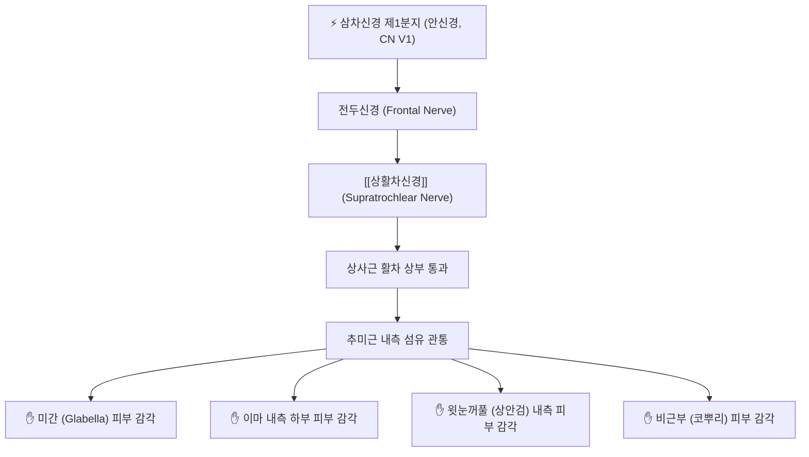

---
aliases:
  - Supratrochlear nerve
  - 상활차신경
tags:
  - 신경
  - 삼차신경
  - 미간
  - 두통
  - 해부학
---

# ⚡ [[상활차신경]] (Supratrochlear Nerve / 上滑車神經, CN V1)

> **핵심 3줄 요약 (Key Summary)**:
> - 🗺️ 신경 기원 & 해부학적 주행: 삼차신경 안신경(CN V1) 전두신경(Frontal nerve)의 내측 종말가지에서 기원하여, 상사근 활차(Trochlea) 상방 안와연을 통과한 뒤 [[추미근]] 내측 섬유를 관통하여 이마 정중부 피하로 상행.
> - 🎯 운동 지배(근육군) & 감각 지배 영역: 순수 감각 신경으로 미간(Glabella), 이마 내측 하부 1/3, 상안검(윗눈꺼풀) 내측 및 비근부(코뿌리) 피부 감각 관할.
> - ⚠️ 호발 포착 부위 & 관련 임상 질환: [[추미근]](눈썹주름근) 내측 부착부의 만성 수축에 의한 신경 압박, 미간 두통(Glabellar headache), 전두부 편두통, 상활차신경통.
> - 🔍 주요 이학적 검사 & 신경학적 징후: 눈썹 안쪽 끝(찬죽혈 부위) 활차 상부 압통 및 틴넬 징후(Tinel's sign), 미간을 찌푸릴 때 코뿌리와 이마 안쪽으로 방사되는 찌릿한 통증.

---

## 📌 목차
1. [신경 기원 & 해부학적 분지 경로 (Anatomy & Course)](#1-신경-기원--해부학적-분지-경로-anatomy--course)
2. [신경 지배 맵 & 기능 네트워크 (Innervation Map)](#2-신경-지배-맵--기능-네트워크-innervation-map)
3. [호발 포착 부위 & 터널 증후군 병태생리](#3-호발-포착-부위--터널-증후군-병태생리)
4. [손상 레벨별 임상 증상 & 신경학적 결손](#4-손상-레벨별-임상-증상--신경학적-결손)
5. [관련 이학적 검사 & 신경 감별 매트릭스](#5-관련-이학적-검사--신경-감별-매트릭스)
6. [한의 신경 치료 프로토콜 (약침·침도·신경수기)](#6-한의-신경-치료-프로토콜-약침침도신경수기)
7. [💡 사용자 진료실 핵심 필기 & 임상 팁 (원문 보존)](#7--사용자-진료실-핵심-필기--임상-팁-원문-보존)
8. [출처 및 학술 참고 문헌 (References)](#8-출처-및-학술-참고-문헌-references)

---

## 1. 신경 기원 & 해부학적 분지 경로 (Anatomy & Course)

![[7. 얼굴신경-20240915222712514.png|400]]
> [그림 1] 안와 내측 상연의 [[상활차신경]]과 [[안와상신경]]의 분지 및 주행 관계

![[청강의감26_06_두통_편두통_두풍_미릉골통.jpg|400]]
> [그림 2] 청강의감 임상 도해: 미간통(眉間痛) 및 전두부 혈관·신경 연계 병태

* **신경 기원 (Origin)**:
  * 제5 뇌신경인 삼차신경(CN V) 제1분지(V1, 안신경)의 주 분지인 **전두신경(Frontal nerve)**의 내측 작은 종말가지입니다.
* **안와 탈출 경로 (Trochlear Exit)**:
  * 안와 상내측벽을 따라 전방으로 주행하여, 상사근 건이 꺾이는 섬유연골성 고리인 **활차(Trochlea)의 바로 위쪽**에서 안와를 빠져나옵니다.
  * [[안와상신경]]보다 안쪽(내측)에 위치하며, 눈썹 안쪽 머리(찬죽혈 부위)에서 골막을 감아 돌며 위로 올라옵니다.
* **피하 주행 및 분지 (Facial Course)**:
  * 출현 직후 [[추미근]](Corrugator supercilii)의 내측 섬유 및 [[전두근]](Frontalis)의 내측 경계를 비스듬히 뚫고 피하층으로 진입합니다.
  * 상활차동맥(Supratrochlear artery)과 나란히 주행하며 이마 정중선 양측 피부로 상행합니다.

---

## 2. 신경 지배 맵 & 기능 네트워크 (Innervation Map)

### 1) 감각 신경 지배 영역 (Sensory Distribution)
* **미간 (Glabella)**: 양 눈썹 사이의 피부 감각.
* **이마 내측 하부**: 이마 중앙선 좌우 약 1~1.5cm 폭의 피부 감각.
* **상안검 내측**: 윗눈꺼풀의 안쪽 1/3 피부 및 결막.
* **비근부 (Root of nose)**: 콧등의 가장 윗부분 피부.

---

## 3. 호발 포착 부위 & 터널 증후군 병태생리

* **제1 포착 터널: [[추미근]] 내측 근막 관통부**:
  * 안와상신경이 추미근 체부를 관통하는 반면, 상활차신경은 추미근의 내측 기시부 건막을 통과합니다.
  * 시력 저하로 찡그려 보거나 인상을 쓰는 표정 습관이 있는 환자에서 추미근 내측 섬유가 두꺼워지면서 신경을 만성적으로 조입니다.
* **제2 포착 부위: 활차 상연의 섬유성 밴드**:
  * 안와 상벽 골막과 활차 인대 사이의 좁은 틈새에서 신경이 압박을 받습니다.

---

## 4. 손상 레벨별 임상 증상 & 신경학적 결손

| 질환 / 장애 유형 | 주요 임상 증상 | 신경학적 소견 | 호발 원인 |
| :--- | :--- | :--- | :--- |
| **미간 두통 (Glabellar Headache)** | 양 눈썹 사이 미간이 묵직하고 뻐근하며, 코뿌리까지 쑤시고 당기는 통증 | 찬죽혈 내측 압통, 눈을 찡그릴 때 통증 심화 | 추미근 과긴장, 시각 피로, VDT 증후군 |
| **상활차신경통 (Neuralgia)** | 눈썹 안쪽 끝에서 이마 중앙으로 치솟는 바늘로 찌르는 듯한 전격통 | 활차 상부 틴넬 징후 양성, 미간 두피 이질통 | 안면 외상, 수술 후 반흔 유착 |
| **전두부 편두통 연관통** | 한쪽 미간에서 시작하여 동측 관자놀이와 안구로 퍼지는 박동성 두통 | 찬죽혈 주위 압박 시 두통 유발 | 삼차신경 혈관 복합체 활성화 |

---

## 5. 관련 이학적 검사 & 신경 감별 매트릭스

| 이학적 검사명 | 검사 방법 및 유발 기전 | 양성 반응 | 관련 감별 질환 |
| :--- | :--- | :--- | :--- |
| **찬죽혈 부위 타진 검사 (Tinel's sign)** | 눈썹 내측단(찬죽혈) 바로 위를 손가락 끝으로 가볍게 두드림 | 미간과 코뿌리로 전기가 찌릿하게 전달됨 | [[상활차신경]] 포착증 |
| **미간 주름 유발 검사** | 환자에게 인상을 강하게 쓰게 하여 추미근을 능동 수축시킴 | 미간 부위의 통증과 작열감 급격히 악화 | 추미근 비후성 신경통 |
| **안와상절흔 압박 검사** | 눈썹 중앙 1/3의 안와상절흔을 압박 | 이마 외측/정수리로 통증 방사 | [[안와상신경]]과 감별 |

---

## 6. 한의 신경 치료 프로토콜 (약침·침도·신경수기)

### 6.1 찬죽혈 및 미간 약침 감압술 (Hydrodissection)
* **자침 타겟 및 랜드마크**:
  * 방광경의 **찬죽(BL2)** 및 기혈인 **인당(EX-HN3)**.
* **약침 제제 및 주입 기법**:
  * 황련해독탕 약침 또는 중성어혈약침 0.2~0.3cc 사용.
  * 30G 미세 주사기를 피부와 15~30도 각도로 안와를 피해 상방(두피 쪽)으로 평자하여 추미근 내측 섬유층에 미세 주입.

### 6.2 침 치료 및 미간 근막 이완술
* 찬죽(BL2)에서 어요(EX-HN4) 방향으로 횡자하여 추미근을 관통 자침하고 저주파 전침(2Hz)을 15분간 적용하여 근육 연축을 해제합니다.
* 시술자의 엄지손가락으로 찬죽혈 부위를 후상방으로 쓸어 올리는 수기 추나를 병행합니다.

---

## 7. 💡 사용자 진료실 핵심 필기 & 임상 팁 (원문 보존)

### 7.1 진료실 3대 핵심 문진 및 감별 포인트
1. **미간 내측 통증 문진**:
   * "이마 전체가 아프기보다 양 눈썹 사이 미간과 콧등 윗부분이 유난히 뻐근하고 조이지 않습니까?" (상활차신경 특이적 증상).
2. **안와상신경과의 위치 감별**:
   * 눈썹 가운데가 아프면 안와상신경, 눈썹 안쪽 끝과 콧등 쪽이 아프면 상활차신경입니다.
3. **안구 안쪽 깊은 곳의 찌르는 통증**:
   * 상사근 활차 주위 염증(Trochleitis)이 동반된 경우 눈을 아래로 내리깔 때 통증이 심해지므로 활차 부위 직접 압통 검사 필수.

---

## 8. 출처 및 학술 참고 문헌 (References)

* Treatment of Frontal Secondary Headache Attributed to Supratrochlear and Supraorbital Nerve Entrapment With Oral Medication or Botulinum Toxin Type A vs Endoscopic Decompression Surgery. *JAMA Facial Plast Surg*. 2018 Sep 1;20(5):372-378. [PMID: 29801115](https://pubmed.ncbi.nlm.nih.gov/29801115/) | [DOI: 10.1001/jamafacial.2018.0268](https://doi.org/10.1001/jamafacial.2018.0268)
  * `[연구 요약]` 상활차신경과 안와상신경의 추미근 내 포착으로 인한 전두부 두통 치료에서 신경 감압 및 차단술의 유효성을 검증한 임상 연구.

* Migraine Surgery at the Frontal Trigger Site: An Analysis of Intraoperative Anatomy. *Plast Reconstr Surg*. 2020 Feb;145(2):503-511. [PMID: 31985652](https://pubmed.ncbi.nlm.nih.gov/31985652/) | [DOI: 10.1097/PRS.0000000000006475](https://doi.org/10.1097/PRS.0000000000006475)
  * `[연구 요약]` 상활차신경이 추미근 내측 섬유를 통과하는 해부학적 3가지 분지 패턴과 두통 유발 메커니즘을 규명.
