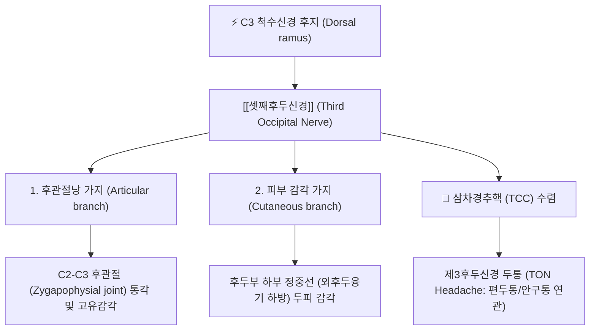
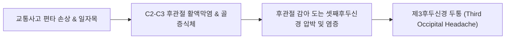

---
aliases:
  - Third occipital nerve
  - 셋째후두신경
  - 제3후두신경
  - TON
tags:
  - 신경
  - 경추
  - 후두부
  - 경추성두통
  - 후관절증후군
  - 해부학
---

# ⚡ [[셋째후두신경]] (Third Occipital Nerve / 第三後頭神經, C3 후지)

> **핵심 3줄 요약 (Key Summary)**:
> - 🗺️ 신경 기원 & 해부학적 주행: C3 척수신경 후지(Dorsal ramus)의 표재성 내측가지(Superficial medial branch)에서 기원하여, C2-C3 후관절(Facet joint) 외측을 감아 돈 뒤 [[두반극근]]과 [[승모근]]을 뚫고 대후두신경 내측 피하로 상행.
> - 🎯 운동 지배(근육군) & 감각 지배 영역: 순수 감각 신경으로 C2-C3 후관절낭(관절지)의 고유 감각 지배 및 후두부 하부 정중선(풍부혈·아문혈 주위) 두피 감각 관할.
> - ⚠️ 호발 포착 부위 & 관련 임상 질환: C2-C3 후관절 관절염 및 편타 손상(Whiplash)에 의한 [[제3후두신경 두통]](Third Occipital Headache - 경추성 두통 환자의 30~50% 차지), 후관절 증후군.
> - 🔍 주요 이학적 검사 & 신경학적 징후: C2-C3 후관절 부위 직접 압통, 경추 신전 및 환측 회전 시 후두통 유발(Kemp test 변형), 경추 굴곡-회전 검사(FRT) 양성.

---

## 📌 목차
1. [신경 기원 & 해부학적 분지 경로 (Anatomy & Course)](#1-신경-기원--해부학적-분지-경로-anatomy--course)
2. [신경 지배 맵 & 기능 네트워크 (Innervation Map)](#2-신경-지배-맵--기능-네트워크-innervation-map)
3. [호발 포착 부위 & 터널 증후군 병태생리](#3-호발-포착-부위--터널-증후군-병태생리)
4. [손상 레벨별 임상 증상 & 신경학적 결손](#4-손상-레벨별-임상-증상--신경학적-결손)
5. [관련 이학적 검사 & 신경 감별 매트릭스](#5-관련-이학적-검사--신경-감별-매트릭스)
6. [한의 신경 치료 프로토콜 (약침·침도·신경수기)](#6-한의-신경-치료-프로토콜-약침침도신경수기)
7. [💡 사용자 진료실 핵심 필기 & 임상 팁 (원문 보존)](#7--사용자-진료실-핵심-필기--임상-팁-원문-보존)
8. [출처 및 학술 참고 문헌 (References)](#8-출처-및-학술-참고-문헌-references)

---

## 1. 신경 기원 & 해부학적 분지 경로 (Anatomy & Course)

![[후두하근-20240914193517231.png|400]]
> [그림 1] 후두하 심부 근육군과 C2-C3 관절돌기를 주행하는 [[셋째후두신경]](TON) 및 [[대후두신경]]의 위치 관계

![[Suboccipital_TriggerPoints.jpg|400]]
> [그림 2] C2-C3 후관절 및 후두하근 발통점에 의한 후두하부 정중선 통증 패턴

* **신경 기원 (Origin)**:
  * 제3 경신경(C3) 척수신경의 후지(Dorsal ramus)에서 갈라져 나오는 굵은 표재성 내측가지(Superficial medial branch)입니다.
  * C1(대후두직근/하두사근 지배 순수 운동), C2(대후두신경 형성)와 함께 상부 경추의 두통 발생 네트워크를 이루는 핵심 신경입니다.
* **후관절 주행 및 관절지 분지 (Facet Joint Course)**:
  * C2-C3 후관절(Zygapophysial joint)의 외측면과 관절돌기 허리(Waist of the articular pillar)를 단단히 감아 돌며 후상방으로 주행합니다.
  * 이때 C2-C3 후관절낭(Joint capsule)으로 풍부한 감각 관절지(Articular branches)를 공급하여 관절염 통증의 주된 전달 경로가 됩니다.
* **근육 관통 및 피하 주행**:
  * 후관절을 지난 후 [[두반극근]](Semispinalis capitis) 및 [[승모근]](Trapezius) 건막을 차례로 관통하여 표층으로 올라옵니다.
  * [[대후두신경]](GON)보다 안쪽(내측)에서 상행하여 외후두융기(Inion) 바로 아래, 정중선 부근(풍부혈, 아문혈 주위) 두피 피하로 분포합니다.

---

## 2. 신경 지배 맵 & 기능 네트워크 (Innervation Map)

### 1) 감각 신경 지배 영역 (Sensory Distribution)
* **C2-C3 후관절낭**: 관절염, 활액막염, 활액낭 낭종에 의한 통증 감각 전달.
* **후두하부 정중선 두피**: 외후두융기 하방에서 상부 경추 정중선 좌우 1cm 내외의 피부 감각.

---

## 3. 호발 포착 부위 & 터널 증후군 병태생리

* **제1 포착 부위: C2-C3 후관절(Facet Joint) 관절돌기 허리 (임상 최다빈도)**:
  * 교통사고 후방 추돌(편타 손상, Whiplash) 시 경추가 과신전-과굴곡되면서 C2-C3 후관절이 강하게 충돌하여 관절낭 염좌 및 골극(Osteophyte)이 형성됩니다.
  * 관절돌기를 바짝 감아 도는 셋째후두신경이 부종성 관절낭과 뼈 돌기 사이에 직접 끼어 만성 신경염이 촉발됩니다.
* **제2 포착 부위: [[두반극근]] 근막 관통부**:
  * 상부 경추 후두하근과 두반극근이 만성 경련을 일으킬 때 신경이 관통하는 건막 부위에서 압박을 받습니다.

---

## 4. 손상 레벨별 임상 증상 & 신경학적 결손

| 질환 / 장애 유형 | 주요 임상 증상 | 신경학적 소견 | 호발 원인 |
| :--- | :--- | :--- | :--- |
| **[[제3후두신경 두통]] (Third Occipital Headache)** | 목덜미 위쪽과 뒤통수 아래 정중부가 뻐근하고 쑤시며, 고개를 젖히거나 돌릴 때 두통이 급격히 악화됨 | C2-C3 관절돌기 압통, 후두부 하부 피부 감각과민, 진단적 신경 차단 시 즉각 소실 | 교통사고 편타 손상, C2-C3 후관절염 |
| **대후두신경통과의 복합 두통** | 뒤통수 전체가 조이고 찌릿하며 정수리와 관자놀이까지 광범위하게 확산되는 두통 | C2(대후두) 및 C3(제3후두) 복합 압통 | 일자목, 상부교차증후군 |
| **후두하부 감각 저하** | 뒷목 정중선 부위가 둔하고 남의 살 같음 | 풍부혈 주위 촉각 둔마 | 만성 후관절 섬유화 유착 |

---

## 5. 관련 이학적 검사 & 신경 감별 매트릭스

| 이학적 검사명 | 검사 방법 및 유발 기전 | 양성 반응 | 관련 감별 질환 |
| :--- | :--- | :--- | :--- |
| **C2-C3 후관절 압박 검사** | 외후두융기 하방 2cm, 정중선 외측 1.5cm의 C2-C3 관절기둥을 후전방으로 강하게 압박 | 후두하부 정중선으로 뻗치는 날카로운 두통 유발 | [[셋째후두신경]] 병변 확진 |
| **경추 신전-회전 검사 (Kemp 변형)** | 경추를 신전하고 환측으로 회전시켜 후관절을 강제로 압박 | 후관절 부위 통증 악화 및 후두통 재현 | C2-C3 후관절 증후군 |
| **대후두신경 틴넬 검사** | 상항선 외측 2.5cm 지점을 타진 | 정수리와 안와로 통증 방사 | [[대후두신경]]과 감별 (정중선=TON, 외측=GON) |

---

## 6. 한의 신경 치료 프로토콜 (약침·침도·신경수기)

### 6.1 C2-C3 후관절 약침 수압박리술 (Hydrodissection)
* **자침 타겟 및 랜드마크**:
  * 유양돌기 하단과 후두골 융기 중간선 상에서, C2 극돌기 상외측 1.5cm 지점의 C2-C3 후관절 관절돌기(천주혈 내측 1cm, 풍부혈 외측 1cm).
* **약침 제제 및 주입 기법**:
  * 신바로약침, 중성어혈약침 또는 황련해독탕 약침 0.5~1.0cc 사용.
  * 30G 25mm 주사기를 관절돌기 뼈에 닿을 때까지 수직 진입한 후, 약간 후퇴하여 관절낭 주변에 약침액을 주입(수압박리).

### 6.2 침도 치료 (Acupotomy)
* C2-C3 후관절 관절낭 주위의 비후된 섬유대를 소침도로 미세 박리하여 관절낭 내압을 낮추고 신경 감압을 유도합니다.

### 6.3 상부 경추 추나 요법 (C2-C3 Chuna)
* C2-C3 분절의 후관절 가동성 회복을 위해 경추 신전-회전 복합 교정 기법 및 후두하 연부조직 이완술을 병행합니다.

---

## 7. 💡 사용자 진료실 핵심 필기 & 임상 팁 (원문 보존)

### 7.1 진료실 3대 핵심 문진 및 감별 포인트
1. **교통사고 편타 손상 병력 확인**:
   * "과거에 교통사고로 목이 앞뒤로 꺾인 적이 있습니까?" (편타 손상 후 지속되는 만성 후두통 환자의 50%가 제3후두신경 두통).
2. **고개 젖힐 때 두통 악화 여부**:
   * 컴퓨터 작업이나 천장을 올려다볼 때 뒷머리 아래가 묵직하게 아프면 C2-C3 후관절과 제3후두신경 문제.
3. **대후두신경통과의 정확한 위치 구별**:
   * 뒤통수 가운데(목덜미 중심)가 아프면 **제3후두신경**, 뒤통수 바깥쪽(귀 뒤와 가운데 사이)이 찌릿하면 **대후두신경**입니다.

---

## 8. 출처 및 학술 참고 문헌 (References)

* Govind J, King W, Bailey B, Bogduk N. Radiofrequency neurotomy for the treatment of third occipital headache. *J Neurol Neurosurg Psychiatry*. 2003 Jan;74(1):88-93. [PMID: 12486273](https://pubmed.ncbi.nlm.nih.gov/12486273/) | [DOI: 10.1136/jnnp.74.1.88](https://doi.org/10.1136/jnnp.74.1.88)
  * `[연구 요약]` 편타 손상 후 만성 경추성 두통 환자에서 제3후두신경(TON)이 주된 병소임을 입증하고, C2-C3 후관절을 감아 도는 신경의 정밀한 해부학적 위치와 신경 차단술의 치료 효과를 증명한 랜드마크 논문.

* Bogduk N. The neck and headaches. *Neurol Clin*. 2004 Feb;22(1):151-71, vii. [PMID: 15062532](https://pubmed.ncbi.nlm.nih.gov/15062532/) | [DOI: 10.1016/S0733-8619(03)00100-2](https://doi.org/10.1016/S0733-8619(03)00100-2)
  * `[연구 요약]` 경추성 두통의 신경 해부학적 기전과 C2-C3 후관절 통증(제3후두신경 두통)이 경추성 두통 전체의 약 40%를 차지함을 밝힌 의학 총설.
