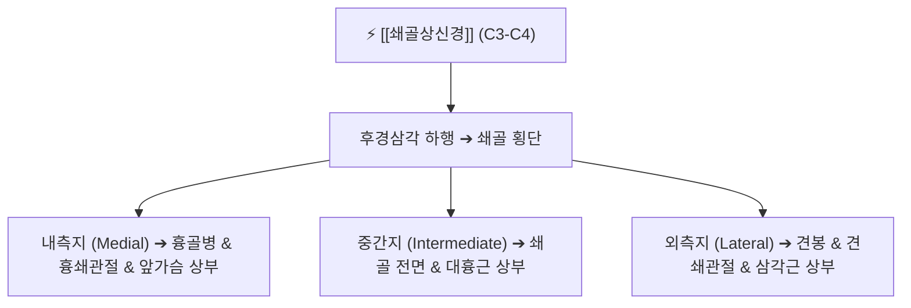

# ⚡ [[쇄골상신경]] (Supraclavicular Nerve / 鎖骨上神經, C3-C4)

> **핵심 3줄 요약 (Key Summary)**:
> - 🗺️ 신경 기원 & 해부학적 주행: 경신경총(C3-C4) 기원, [[에르브 포인트]](Erb's point)에서 하행하여 쇄골 상면을 횡단하며 내측·중간·외측 3개 분지로 갈라져 흉벽 상부 및 어깨 견봉 부위로 주행.
> - 🎯 운동 지배(근육군) & 감각 지배 영역: 순수 감각 신경. 쇄골 상·하부 피부, 흉골병 상부 전흉벽(제2늑골 높이까지), 어깨 견봉 및 삼각근 상부 피부 감각 지배, 흉쇄관절·견쇄관절 감각.
> - ⚠️ 호발 포착 부위 & 관련 임상 질환: 쇄골 골절 및 수술 후 반흔 유착, 쇄골 골관통 터널(Intraosseous canal), 배낭 끈 압박, [[쇄골상신경통]](어깨 앞쪽 작열통).
> - 🔍 주요 이학적 검사 & 신경학적 징후: 쇄골 상연 횡단부 티넬 징후(Tinel sign, 어깨 앞쪽 방사통), 쇄골하부 감각 저하 또는 이질통.

---

## 📌 목차
1. [신경 기원 & 해부학적 분지 경로 (Anatomy & Course)](#1-신경-기원--해부학적-분지-경로-anatomy--course)
2. [신경 지배 맵 & 기능 네트워크 (Innervation Map)](#2-신경-지배-맵--기능-네트워크-innervation-map)
3. [호발 포착 부위 & 터널 증후군 병태생리](#3-호발-포착-부위--터널-증후군-병태생리)
4. [손상 레벨별 임상 증상 & 신경학적 결손](#4-손상-레벨별-임상-증상--신경학적-결손)
5. [관련 이학적 검사 & 신경 감별 매트릭스](#5-관련-이학적-검사--신경-감별-매트릭스)
6. [한의 신경 치료 프로토콜 (약침·침도·신경수기)](#6-한의-신경-치료-프로토콜-약침침도신경수기)
7. [💡 사용자 진료실 핵심 필기 & 임상 팁 (원문 보존)](#7--사용자-진료실-핵심-필기--임상-팁-원문-보존)
8. [출처 및 학술 참고 문헌 (References)](#8-출처-및-학술-참고-문헌-references)

---

## 1. 신경 기원 & 해부학적 분지 경로 (Anatomy & Course)

![[쇄골상신경-주행-Gray804.png|420]]
> [그림 1] 경신경총 C3-C4에서 기원하여 후경삼각을 하행해 쇄골을 넘어가는 [[쇄골상신경]]의 주행도 (출처: Gray's Anatomy)

* **신경 기원 (Origin & Spinal Segments)**:
  * 경신경총(Cervical plexus)의 제3, 4 경신경(C3, C4) 전지에서 기원합니다.
* **상세 주행 경로 및 3대 분지**:
  1. 흉쇄유돌근 후연 Erb's point 아래에서 광경근(Platysma) 심부의 후경삼각을 비스듬히 하행합니다.
  2. 쇄골 상방 1~2cm 부근에서 3개의 주요 분지로 갈라진 후 쇄골의 전면을 타고 넘습니다:
     * **내측 쇄골상신경(Medial branch)**: 쇄골 내측단을 넘어 흉골병 및 흉쇄관절, 제2늑골 상부 피부로 주행.
     * **중간 쇄골상신경(Intermediate branch)**: 쇄골 중앙부를 넘어 대흉근 상부 피부로 주행 (쇄골 뼈 속 골관을 통과하는 해부학적 변이 존재).
     * **외측 쇄골상신경(Lateral branch)**: 쇄골 외측단 및 견봉을 넘어 삼각근 상부와 견쇄관절 피부로 주행.

---

## 2. 신경 지배 맵 & 기능 네트워크 (Innervation Map)

![[쇄골상신경-피부감각-지배영역.png|420]]
> [그림 2] 쇄골 상·하부 및 어깨 견봉 전면부를 덮는 쇄골상신경의 감각 피부분절(Dermatome C3-C4) 영역

---

## 3. 호발 포착 부위 & 터널 증후군 병태생리

* **쇄골 상면 마찰 및 골관(Intraosseous canal) 포착**:
  * 중간 쇄골상신경이 쇄골 뼈를 뚫고 지나가는 선천성 골관 변이가 있는 경우, 가방 끈이나 무거운 짐에 의해 뼈 속에서 신경이 직접 압박됩니다.
* **쇄골 골절 및 금속판 고정술 후 반흔**:
  * 쇄골 간부 골절 시 골절편에 신경이 찢기거나 수술 후 흉터 조직에 말려 유착성 신경종(Neuroma)이 형성됩니다.

---

## 4. 손상 레벨별 임상 증상 & 신경학적 결손

| 상태 | 주요 증상 | 특징 |
| :--- | :--- | :--- |
| **쇄골상신경 포착통** | 쇄골 바로 아래 앞가슴과 어깨 끝이 찌릿하고 화끈거림 | 옷깃이나 브래지어 끈이 닿기만 해도 통증 |
| **신경 마비 (의인성 절단)** | 쇄골 하부 및 견봉 앞쪽 피부의 영구적 무감각 | 쇄골 골절 수술 후 흔한 후유증 |

---

## 5. 관련 이학적 검사 & 신경 감별 매트릭스

* **쇄골 횡단부 티넬 징후**:
  * 쇄골 뼈 위를 손가락으로 가볍게 튕기듯 두드렸을 때 가슴 앞쪽이나 어깨 끝으로 전기가 찌릿 통하면 양성.

---

## 6. 한의 신경 치료 프로토콜 (약침·침도·신경수기)

* **쇄골상연 침도 미세 유착 박리**:
  * 쇄골 바로 윗선의 압통점에 뼈 표면을 가이드 삼아 침도를 사각 자입하여 두터워진 광경근 근막과 쇄골 골막 유착을 안전하게 박리합니다.
* **결분(ST12) 및 견우(LI15) 약침 요법**:
  * 쇄골상와 결분혈 부위에 신바로 약침 0.3cc를 주입하여 쇄골상신경 기저부의 염증을 가라앉힙니다.

---

## 7. 💡 사용자 진료실 핵심 필기 & 임상 팁 (원문 보존)

* **쇄골 골절 수술 후 "가슴 위쪽이 남의 살 같아요"**:
  * 정형외과에서 쇄골 핀 고정술을 받은 환자가 "수술은 잘됐다는데 쇄골 밑이 멍멍하고 만지면 기분 나쁘게 저리다"고 내원합니다.
  * 이는 수술 절개 시 쇄골상신경 분지가 잘리거나 유착된 전형적인 증상으로, 침도와 전침으로 주변 신경망 발아를 유도해야 감각이 회복됩니다.

---

## 8. 출처 및 학술 참고 문헌 (References)

* Nowak, M., et al. (2026). "Variants of the intermediate supraclavicular nerve: a cadaveric case series and clinical implications." *Folia Morphologica*, 85(1), 88-95. [PMID: 42494248](https://pubmed.ncbi.nlm.nih.gov/42494248/)
  - [연구 요약]: 쇄골 골관을 관통하는 중간 쇄골상신경의 해부학적 빈도와 쇄골 수술 시 의인성 신경 손상 예방 전략 규명.
* Duparc, F., et al. (2026). "Canals and grooves for the supraclavicular nerves revisited: Anatomical and radiological study outlining their topography for clinical practice." *Annals of Anatomy*, 263, 152340. [PMID: 41067543](https://pubmed.ncbi.nlm.nih.gov/41067543/)
  - [연구 요약]: 쇄골상신경이 주행하는 쇄골 골홈 및 터널의 방사선학적 지형도와 만성 어깨 전방부 신경통 연계 분석.
* Illig, K. A., et al. (2017). "Clinical presentation and management of arterial thoracic outlet syndrome." *Journal of Vascular Surgery*, 65(5), 1450-1460. [PMID: 28189360](https://pubmed.ncbi.nlm.nih.gov/28189360/)
  - [연구 요약]: 흉곽상구 및 쇄골 주변 신경혈관 다발의 기계적 압박 증후군 진단 가이드라인 제시.
